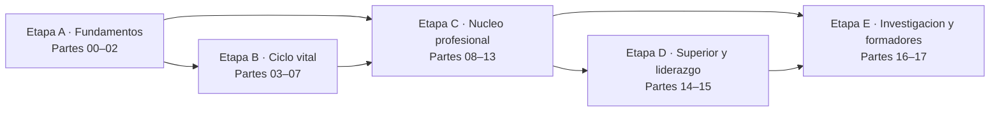

<div align="center">

# 🎓 Programa de Pedagogía, Docencia y Ciencias del Aprendizaje

## **216 clases · 18 partes · 540 horas · de cómo aprende una persona a cómo se forma a quien enseña**

**El programa de formación pedagógica más completo en español — desde fundamentos de la
educación, ciencias del aprendizaje y desarrollo humano hasta inclusión, currículum, didáctica,
evaluación y psicometría, convivencia, IA educativa, docencia universitaria, liderazgo escolar e
investigación doctoral.**

[](https://github.com/vladimiracunadev-create/education-pedagogy-learning-sciences-program/actions/workflows/ci.yml)
[](https://vladimiracunadev-create.github.io/education-pedagogy-learning-sciences-program/)
[](https://github.com/vladimiracunadev-create/education-pedagogy-learning-sciences-program/actions/workflows/security.yml)

[](CHANGELOG.md)
[](CURRICULUM.md)
[](STATUS.md)
[](rutas/README.md)
[](LICENSE-CONTENT.md)

[](scripts/)
[](docs/ARQUITECTURA.md)
[](docs/ESTANDARES_DE_EVIDENCIA.md)
[](docs/MARCO_CHILE.md)
[](docs/MIGRACION_A_CAPACITACION.md)
[](https://vladimiracunadev-create.github.io/education-pedagogy-learning-sciences-program/)

[🌐 Portal](https://vladimiracunadev-create.github.io/education-pedagogy-learning-sciences-program/) ·
[📋 Currículo](CURRICULUM.md) ·
[📖 Programa detallado](SYLLABUS.md) ·
[🧭 Rutas por rol](rutas/README.md) ·
[🎓 Guía del estudiante](docs/GUIA_DEL_ESTUDIANTE.md) ·
[🧑‍🏫 Guía del formador](docs/GUIA_DEL_FORMADOR.md) ·
[📊 Estado verificable](STATUS.md) ·
[🗺️ Roadmap](ROADMAP.md) ·
[🤝 Contribuir](CONTRIBUTING.md)

**Cobertura por ciclo y función:**
[Parvularia](curriculum/part-03-educacion-parvularia/README.md) ·
[Básica](curriculum/part-04-educacion-basica/README.md) ·
[Media](curriculum/part-05-educacion-media-y-adolescencia/README.md) ·
[Técnico-profesional](curriculum/part-06-educacion-tecnico-profesional/README.md) ·
[Adultos](curriculum/part-07-educacion-de-adultos-y-andragogia/README.md) ·
[Inclusión](curriculum/part-08-inclusion-y-educacion-especial/README.md) ·
[Evaluación](curriculum/part-11-evaluacion-y-psicometria/README.md) ·
[IA educativa](curriculum/part-13-tecnologia-e-ia-educativa/README.md) ·
[Universidad](curriculum/part-14-docencia-universitaria/README.md) ·
[Liderazgo](curriculum/part-15-gestion-y-liderazgo-educativo/README.md)

</div>

---

> [!IMPORTANT]
> **Formación profesional, no habilitación.** Este programa entrega el conocimiento, el método y
> la evidencia del oficio docente. **No otorga título, grado ni habilitación legal para ejercer**,
> y no reemplaza una licenciatura, un magíster ni un doctorado de una institución acreditada. En
> Chile, enseñar en el sistema escolar exige un título profesional de pedagogía.

## 🎯 Qué es esto

Un currículo **secuencial, basado en libros y orientado a evidencia**: 216 clases numeradas
(001→216) en 18 partes, desde qué significa educar hasta cómo se forma a quien enseña. Cada
clase es una carpeta con un `README.md` completo que incluye:

- 🎯 **Propósito** y **resultados de aprendizaje verificables**.
- 🧩 **Cuatro conceptos** con definición operacional, no de diccionario.
- 🗺️ **Flujo de razonamiento** en diagrama Mermaid.
- 📖 **Desarrollo en tres capas**: el fondo del asunto · cómo se traduce en decisiones ·
  **qué sostiene la evidencia y qué no**.
- 🧪 **Taller guiado** aplicable en seis contextos distintos, porque nada se traslada intacto.
- 📦 **Evidencia de aprendizaje** con **criterios de logro escritos antes** de producirla.
- 🏆 **Reto verificable** que obliga a salir del material.
- ⚠️ **Errores frecuentes** propios de la clase y característicos de la parte.
- ♿ **Diversidad, accesibilidad y ética** de la decisión que acabas de tomar.
- ❓ **Preguntas de comprobación** y 📕 **lecturas base** con la razón de esa lectura y no de otra.

## ✅ Estado verificable

| Superficie | Cobertura |
|---|---|
| 📚 Currículo | 216/216 clases; numeración continua 001–216 en 18 partes y 5 etapas |
| 🔬 Evidencia | cada clase declara su estado —`ROBUSTA` a `PRACTICA-PROFESIONAL`— y sus límites |
| 🧩 Conceptos | 864 definiciones operacionales · glosario generado de 806 términos enlazados a su clase |
| 📕 Bibliografía | 432 citas en clase sobre ~250 obras y fuentes oficiales explicadas |
| 🗺️ Diagramas | 234 mapas Mermaid: uno por clase y uno por parte |
| 🏆 Evaluación | 216 evidencias de aprendizaje, 648 preguntas de comprobación, rúbrica maestra |
| 🧭 Rutas por rol | 14 guías de carrera con día a día, ruta, credenciales y mitos del oficio |
| 📖 Documentación | 17 documentos transversales, protocolo ético y guías de estudiante y formador |
| 🖥️ Portal | sitio estático con buscador de las 216 clases, tema claro/oscuro y enlaces verificados |
| 🏫 Capacitación | paquete exportable a LMS: HTML por lección, `manifiesto.json` y `programa.csv` |
| 🔁 Reproducibilidad | todo lo publicado se regenera desde `manifests/`; el CI falla si difiere |
| 🔧 Calidad | CI en Python 3.11–3.13, validadores, 25 pruebas, markdownlint, gitleaks y zizmor |
| 🎓 Título profesional | ⚪ no lo otorga y no lo reemplaza |

## 🌟 Qué lo hace distinto

- **Cada clase habilita una decisión**, no cubre un tema. El tema es el medio.
- **Cada clase declara con qué evidencia se sostiene.** Nada se presenta como más sólido de lo
  que es, y la [distribución completa](STATUS.md) está publicada.
- **Cada clase declara sus límites.** Una sección entera dedicada a lo que la evidencia **no**
  respalda, incluidos los efectos que se invierten según el contexto.
- **Desmonta los neuromitos de frente:** estilos de aprendizaje, hemisferio dominante, ventanas
  críticas irreversibles y nativos digitales.
- **La ética va antes que la práctica:** ninguna actividad se aplica con estudiantes reales sin
  pasar por el [protocolo de práctica responsable](docs/ETICA_Y_PRACTICA_RESPONSABLE.md).
- **Se regenera completo:** una sola fuente de verdad, cero dependencias externas, CI que falla
  si lo publicado no coincide con la fuente.

## 🗺️ El recorrido en 5 etapas



| Etapa | Partes | Clases | Competencia que construye |
|---|---:|---:|---|
| 🟢 **A · Fundamentos** | 00–02 | 36 | explicar cómo aprende una persona y qué hace la educación con ese hecho |
| 🔵 **B · Enseñanza por ciclo vital** | 03–07 | 60 | enseñar a una población concreta con decisiones ajustadas a su desarrollo |
| 🟣 **C · Núcleo profesional docente** | 08–13 | 72 | diseñar, enseñar, evaluar y gestionar un curso completo con evidencia |
| 🟠 **D · Superior y liderazgo** | 14–15 | 24 | sostener la calidad del trabajo de otros, no solo del propio |
| 🔴 **E · Investigación y formadores** | 16–17 | 24 | producir conocimiento defendible y formar a quienes enseñan |

## 🗂️ Las 18 partes

Cada parte tiene su **propio README** con narrativa, mapa, marco de referencia, riesgos
característicos, lecturas y enlace a sus 12 clases.

| # | Parte | Clases | Resultado principal | README |
|---:|---|---:|---|---|
| 00 | Fundamentos de la educación | 001–012 | Mapa del sistema educativo con vías de reclamo | [📘 leer](curriculum/part-00-fundamentos-de-la-educacion/README.md) |
| 01 | Ciencias del aprendizaje | 013–024 | Unidad diseñada con mecanismos justificados | [📘 leer](curriculum/part-01-ciencias-del-aprendizaje/README.md) |
| 02 | Desarrollo humano | 025–036 | Trayectoria de desarrollo documentada | [📘 leer](curriculum/part-02-desarrollo-humano/README.md) |
| 03 | Educación parvularia | 037–048 | Experiencia parvularia con documentación pedagógica | [📘 leer](curriculum/part-03-educacion-parvularia/README.md) |
| 04 | Educación básica | 049–060 | Unidad interdisciplinaria con evaluación formativa | [📘 leer](curriculum/part-04-educacion-basica/README.md) |
| 05 | Educación media y adolescencia | 061–072 | Desafío con autoridad pedagógica y evaluación auténtica | [📘 leer](curriculum/part-05-educacion-media-y-adolescencia/README.md) |
| 06 | Educación técnico-profesional | 073–084 | Módulo TP con seguridad integrada y portafolio | [📘 leer](curriculum/part-06-educacion-tecnico-profesional/README.md) |
| 07 | Educación de adultos y andragogía | 085–096 | Programa de capacitación con plan de transferencia | [📘 leer](curriculum/part-07-educacion-de-adultos-y-andragogia/README.md) |
| 08 | Inclusión y educación especial | 097–108 | Aula accesible con barreras eliminadas y apoyos vivos | [📘 leer](curriculum/part-08-inclusion-y-educacion-especial/README.md) |
| 09 | Diseño curricular | 109–120 | Currículo completo con trazabilidad auditada | [📘 leer](curriculum/part-09-diseno-curricular/README.md) |
| 10 | Didáctica avanzada | 121–132 | Secuencia didáctica ejecutada y registrada | [📘 leer](curriculum/part-10-didactica-avanzada/README.md) |
| 11 | Evaluación y psicometría | 133–144 | Sistema de evaluación con argumento de validez | [📘 leer](curriculum/part-11-evaluacion-y-psicometria/README.md) |
| 12 | Gestión del aula y convivencia | 145–156 | Plan de gestión con indicadores de clima | [📘 leer](curriculum/part-12-gestion-del-aula-y-convivencia/README.md) |
| 13 | Tecnología e IA educativa | 157–168 | Tutor con IA verificado, con datos resguardados | [📘 leer](curriculum/part-13-tecnologia-e-ia-educativa/README.md) |
| 14 | Docencia universitaria | 169–180 | Asignatura completa revisada por pares | [📘 leer](curriculum/part-14-docencia-universitaria/README.md) |
| 15 | Gestión y liderazgo educativo | 181–192 | Plan de mejora con indicadores desagregados | [📘 leer](curriculum/part-15-gestion-y-liderazgo-educativo/README.md) |
| 16 | Investigación educativa | 193–204 | Investigación completa con límites declarados | [📘 leer](curriculum/part-16-investigacion-educativa/README.md) |
| 17 | Investigación doctoral y formación de formadores | 205–216 | Propuesta doctoral defendible | [📘 leer](curriculum/part-17-investigacion-doctoral-y-formacion-de-formadores/README.md) |

➡️ **[Ver el programa detallado con las 216 decisiones y evidencias](SYLLABUS.md)**

## 🧭 Rutas por rol

Cada rol tiene su **guía de carrera completa**: qué es y por qué importa, cómo es un día en el
puesto, qué necesitas saber, tu ruta exacta en el programa, credenciales en Chile, progresión,
mitos del oficio y siguientes pasos.

| Rol | Núcleo recomendado | Clases | Guía |
|---|---|---:|---|
| 🍎 **Docente de educación básica** | 00–02 · 04 · 08–13 | 156 | [📖 leer](rutas/docente-educacion-basica.md) |
| 🧭 **Docente de educación media** | 00–02 · 05 · 08–13 | 156 | [📖 leer](rutas/docente-educacion-media.md) |
| 🧸 **Educador/a de párvulos** | 00–03 · 08 · 09 · 11 | 120 | [📖 leer](rutas/educadora-de-parvulos.md) |
| 🔧 **Docente técnico-profesional** | 00–02 · 06 · 08–12 | 144 | [📖 leer](rutas/docente-tecnico-profesional.md) |
| ♿ **Educador/a diferencial** | 00–02 · 08–12 | 96 | [📖 leer](rutas/educador-diferencial.md) |
| 📋 **Jefatura técnico-pedagógica** | 00–02 · 09–11 · 15 | 108 | [📖 leer](rutas/jefe-utp.md) |
| 🏫 **Dirección escolar** | 00–02 · 08 · 11 · 12 · 15 · 16 | 120 | [📖 leer](rutas/director-escolar.md) |
| 👷 **Formador de adultos** | 00–02 · 07 · 09–11 · 13 | 120 | [📖 leer](rutas/formador-de-adultos.md) |
| 🎓 **Docente universitario** | 00–02 · 09–11 · 13 · 14 · 16 | 132 | [📖 leer](rutas/docente-universitario.md) |
| 🧩 **Diseñador instruccional** | 01 · 07–11 · 13 | 108 | [📖 leer](rutas/disenador-instruccional.md) |
| 📊 **Especialista en evaluación** | 00–02 · 09 · 11 · 16 · 17 | 108 | [📖 leer](rutas/especialista-evaluacion.md) |
| 🤖 **Especialista en IA educativa** | 00–02 · 09–11 · 13 · 16 | 120 | [📖 leer](rutas/especialista-ia-educativa.md) |
| 🔬 **Investigador educativo** | 00–02 · 11 · 16 · 17 | 84 | [📖 leer](rutas/investigador-educativo.md) |
| 🧑‍🏫 **Formador de formadores** | el programa completo | 216 | [📖 leer](rutas/formador-de-formadores.md) |

➡️ **[Índice completo de rutas por rol](rutas/README.md)** ·
[Rutas por objetivo de aprendizaje](docs/RUTAS_DE_APRENDIZAJE.md)

## 🔬 Evidencia declarada, clase por clase

Este es el rasgo que ordena el programa: **ninguna clase afirma más de lo que puede sostener.**

| Estado | Qué significa | Clases |
|---|---|---:|
| `ROBUSTA` | evidencia convergente, experimental y replicada | 45 |
| `CONSISTENTE` | evidencia amplia, mayormente observacional | 90 |
| `EMERGENTE` | cuerpo de estudios reciente o poco replicado | 16 |
| `EN-DEBATE` | desacuerdo activo y publicado entre especialistas | 20 |
| `MARCO-NORMATIVO` | lo decide una norma vigente, no la evidencia | 19 |
| `PRACTICA-PROFESIONAL` | saber del oficio, sin diseños que lo prueben | 26 |

[Cómo se asignó cada estado y qué neuromitos rechaza el programa →](docs/ESTANDARES_DE_EVIDENCIA.md)

## 🧪 Material de práctica

| Recurso | Qué produce |
|---|---|
| 🧾 **216 evidencias de aprendizaje** | un producto profesional por clase, con criterios de logro |
| 🏛️ **18 proyectos integradores** | uno por parte, que exige articular todo lo anterior |
| 🎯 **5 proyectos mayores** | portafolio, curso completo, plan de mejora, investigación y propuesta doctoral |
| 🗂️ **8 casos profesionales** | situaciones reales para resolver con el marco del programa |
| 🧰 **10 laboratorios** | simuladores de decisión: aula, currículo, evaluación, inclusión, tesis y tutor con IA |
| 📄 **Plantillas** | ficha de decisión, planificación, rúbrica y protocolo de observación |
| 🏫 **Escuela simulada** | contexto institucional para practicar sin estudiantes reales |

[Casos](cases/README.md) · [Proyectos](projects/README.md) · [Laboratorios](labs/README.md) ·
[Plantillas](templates/README.md) · [Evaluación](assessments/README.md)

## 🖥️ Portal de estudio

El sitio se genera desde el mismo Markdown que el repositorio, así que **nunca se desincroniza**.
Sin cuentas, sin rastreo y sin dependencias: buscador de las 216 clases en el navegador, tema
claro y oscuro, diagramas renderizados y verificación automática de enlaces internos en cada
publicación.

[🌐 Abrir el portal](https://vladimiracunadev-create.github.io/education-pedagogy-learning-sciences-program/) ·
[📋 Currículo](https://vladimiracunadev-create.github.io/education-pedagogy-learning-sciences-program/CURRICULUM.html) ·
[🧭 Rutas por rol](https://vladimiracunadev-create.github.io/education-pedagogy-learning-sciences-program/rutas/) ·
[📊 Estado](https://vladimiracunadev-create.github.io/education-pedagogy-learning-sciences-program/STATUS.html)

## 🏫 Migración a capacitación

El programa se exporta como paquete listo para un LMS, sin duplicar el contenido:

| Archivo | Para qué sirve |
|---|---|
| `paginas/clase-NNN.html` | página autocontenida por lección, con estilos incluidos |
| `contenido/clase-NNN.html` | fragmento HTML para pegar en el editor del LMS |
| `manifiesto.json` | metadatos por módulo y lección para carga automatizada |
| `programa.csv` | tabla plana para carga manual o revisión administrativa |

Cada lección conserva su código **`PED-001` a `PED-216`** para mantener la trazabilidad con la
fuente. La evidencia de aprendizaje se carga como tarea, los criterios de logro como rúbrica y
las preguntas de comprobación como cuestionario de cierre.

```bash
python scripts/exportar_capacitacion.py
```

[Guía completa de migración →](docs/MIGRACION_A_CAPACITACION.md)

## 🔧 Reconstruir el repositorio

Requiere Python 3.11 o superior. **No hay dependencias externas.**

```bash
python scripts/generar_clases.py        # manifiestos → curriculum/
python scripts/generar_indice.py        # STATUS, SYLLABUS, FILE_INDEX, GLOSARIO, catalog
python scripts/validar_estructura.py    # estructura, secciones, rutas por rol y enlaces
python scripts/validar_encoding.py      # UTF-8 sin BOM ni mojibake
python -m unittest discover -s tests -v # pruebas estructurales
python scripts/generar_sitio.py         # sitio estático en site/
python scripts/exportar_capacitacion.py # paquete para LMS en capacitacion/
```

O con los atajos del `Makefile`: `make generar`, `make validar`, `make sitio`, `make todo`.

## 📁 Estructura

```text
manifests/     fuente única de verdad: nada de curriculum/ se edita a mano
curriculum/    18 partes · 216 clases generadas
rutas/         14 guías de carrera por rol
docs/          metodología, guías, bibliografía, glosario, marcos y protocolos
scripts/       generadores y validadores (solo biblioteca estándar de Python)
tests/         pruebas estructurales del repositorio
cases/         casos profesionales · projects/ proyectos mayores · labs/ laboratorios
templates/     plantillas de trabajo · assessments/ rúbricas e instrumentos
chile-education-system/  marco institucional chileno · international-education/ comparada
```

[Arquitectura completa y contrato de datos →](docs/ARQUITECTURA.md)

## ⚖️ Licencia

- **Contenido educativo:** [CC BY-NC-SA 4.0](LICENSE-CONTENT.md) — con atribución, compartiendo
  igual y **sin uso comercial** sin autorización previa.
- **Código de los generadores:** [MIT](LICENSE).

## 📌 Advertencias

- No otorga título, grado ni habilitación legal para ejercer la docencia.
- La capa normativa es **Chile-first** y describe el marco vigente a la fecha de redacción:
  verifica siempre la [fuente oficial](docs/FUENTES.md) antes de fundar una decisión real.
- Los efectos promedio de la investigación educativa **no describen a ningún estudiante concreto**.
- Aplicar cualquier actividad con estudiantes reales exige leer antes el
  [protocolo de práctica responsable](docs/ETICA_Y_PRACTICA_RESPONSABLE.md).

---

<div align="center">

**[Currículo](CURRICULUM.md)** · **[Programa detallado](SYLLABUS.md)** ·
**[Rutas por rol](rutas/README.md)** · **[Estado](STATUS.md)** ·
**[Índice de archivos](FILE_INDEX.md)** · **[Roadmap](ROADMAP.md)** ·
**[Cambios](CHANGELOG.md)** · **[Contribuir](CONTRIBUTING.md)** ·
**[Seguridad](SECURITY.md)** · **[Soporte](SUPPORT.md)**

</div>
