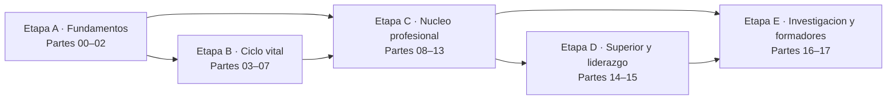

<div align="center">

# 🎓 Programa de Pedagogía, Docencia y Ciencias del Aprendizaje

## **216 clases · 18 partes · 540 horas · de cómo aprende una persona a cómo se forma a quien enseña**

**El programa de formación pedagógica más completo en español — desde fundamentos de la
educación, ciencias del aprendizaje y desarrollo humano hasta inclusión, currículum, didáctica,
evaluación y psicometría, convivencia, IA educativa, docencia universitaria, liderazgo escolar e
investigación doctoral.**

[](https://github.com/vladimiracunadev-create/education-pedagogy-learning-sciences-program/actions/workflows/ci.yml)
[](https://vladimiracunadev-create.github.io/education-pedagogy-learning-sciences-program/)
[](https://github.com/vladimiracunadev-create/education-pedagogy-learning-sciences-program/actions/workflows/security.yml)
[](https://github.com/vladimiracunadev-create/education-pedagogy-learning-sciences-program/actions/workflows/codeql.yml)

[](CHANGELOG.md)
[](CURRICULUM.md)
[](MANIFEST.md)
[](rutas/README.md)
[](LICENSE-CONTENT.md)

[](scripts/)
[](docs/ARQUITECTURA.md)
[](docs/ESTANDARES_DE_EVIDENCIA.md)
[](docs/MARCO_CHILE.md)
[](docs/MIGRACION_A_CAPACITACION.md)
[](https://vladimiracunadev-create.github.io/education-pedagogy-learning-sciences-program/)

[🌐 Portal](https://vladimiracunadev-create.github.io/education-pedagogy-learning-sciences-program/) ·
[📋 Currículo](CURRICULUM.md) ·
[📖 Programa detallado](SYLLABUS.md) ·
[🧭 Rutas por rol](rutas/README.md) ·
[🎓 Guía del estudiante](docs/GUIA_DEL_ESTUDIANTE.md) ·
[🧑‍🏫 Guía del formador](docs/GUIA_DEL_FORMADOR.md) ·
[📖 Glosario (806 términos)](docs/GLOSARIO.md) ·
[📚 Bibliografía (353 obras)](docs/BIBLIOGRAFIA.md) ·
[📊 Estado verificable](STATUS.md) ·
[📦 Manifiesto](MANIFEST.md) ·
[🗺️ Roadmap](ROADMAP.md) ·
[🤝 Contribuir](CONTRIBUTING.md)

**Cobertura por ciclo y función:**
[Parvularia](curriculum/part-03-educacion-parvularia/README.md) ·
[Básica](curriculum/part-04-educacion-basica/README.md) ·
[Media](curriculum/part-05-educacion-media-y-adolescencia/README.md) ·
[Técnico-profesional](curriculum/part-06-educacion-tecnico-profesional/README.md) ·
[Adultos](curriculum/part-07-educacion-de-adultos-y-andragogia/README.md) ·
[Inclusión](curriculum/part-08-inclusion-y-educacion-especial/README.md) ·
[Evaluación](curriculum/part-11-evaluacion-y-psicometria/README.md) ·
[IA educativa](curriculum/part-13-tecnologia-e-ia-educativa/README.md) ·
[Universidad](curriculum/part-14-docencia-universitaria/README.md) ·
[Liderazgo](curriculum/part-15-gestion-y-liderazgo-educativo/README.md)

</div>

---

> [!IMPORTANT]
> **Formación profesional, no habilitación.** Este programa entrega el conocimiento, el método y
> la evidencia del oficio docente. **No otorga título, grado ni habilitación legal para ejercer**,
> y no reemplaza una licenciatura, un magíster ni un doctorado de una institución acreditada. En
> Chile, enseñar en el sistema escolar exige un título profesional de pedagogía.

<!-- Dos avisos distintos: habilitación profesional y resguardo de estudiantes reales. -->

> [!WARNING]
> **Estudiantes reales y datos personales.** Todos los casos son **ficticios** y ninguna actividad
> exige trabajar con estudiantes concretos. Antes de aplicar cualquier contenido en un aula real,
> verifica la norma vigente en su [fuente oficial](docs/FUENTES.md): la Ley General de Educación,
> los decretos 83/2015 y 170/2009, la Ley 21.545 y la normativa de protección de datos imponen
> requisitos de diseño sobre evaluaciones, apoyos, registros y plataformas.

## 🎯 Qué es esto

Un currículo **secuencial, basado en libros y orientado a evidencia**: 216 clases numeradas
(001→216) en 18 partes, desde qué significa educar hasta cómo se forma a quien enseña. Cada clase
es un documento de **3.700 a 4.100 palabras** bajo el estándar `clase-profunda`, con 22 secciones
obligatorias que el CI verifica:

- 🎯 **Propósito** anclado a una decisión profesional concreta, no a una definición.
- 🧭 **Agenda de 90 minutos** para dictarla, con el tiempo de práctica declarado aparte.
- 🧩 **Cuatro conceptos con definición operacional**: dos personas que observan la misma clase
  deben poder clasificar el mismo episodio igual.
- 🧠 **Modelo mental**: el método en cinco pasos, sus tres señales observables y su frontera.
- 📖 **Desarrollo en seis capas**: fondo · frontera conceptual · cómo se observa y se mide ·
  decisiones de enseñanza · **qué sostiene la evidencia y qué no** · integración.
- 📚 **Lectura comparada** de dos a tres obras, con el lente que aporta cada una.
- 🧮 **Ejemplo trabajado** paso a paso sobre el caso persistente de su parte.
- 🔀 **Comparación de caminos** con lo que privilegia y arriesga cada uno.
- 🪜 **El mismo tema según el rol**, del aula a la dirección y a la investigación.
- 🧪 **Taller guiado** en seis contextos y 🏫 **caso profesional** con informe de decisión.
- 📥 **Evidencia de aprendizaje** archivable, con **rúbrica ponderada publicada antes**.
- ⚠️ **Errores frecuentes**, ♿ **diversidad y ética**, 🇨🇱 **contexto normativo chileno**,
  ❓ **preguntas de comprobación** y 📗 **fuentes con su uso declarado**.

## ✅ Estado verificable

| Superficie | Cobertura |
|---|---|
| 📚 Currículo | 216/216 clases · 840.621 palabras · estándar `clase-profunda` de 22 secciones |
| 📏 Profundidad | 3.765–4.133 palabras por clase (mediana 3.875), verificada en CI |
| 🔬 Evidencia | cada clase declara su estado —`ROBUSTA` a `PRACTICA-PROFESIONAL`— y sus límites |
| 🧩 Conceptos | 864 definiciones operacionales · glosario generado de 806 términos enlazados a su clase |
| 📕 Bibliografía | 432 citas en clase sobre 353 obras distintas, con el lente que aporta cada una |
| 🏫 Casos | 18 casos persistentes: cada parte trabaja las 12 clases sobre la misma realidad |
| 🗺️ Diagramas | 234 mapas Mermaid: uno por clase y uno por parte |
| 🏆 Evaluación | 216 evidencias de aprendizaje, 648 preguntas de comprobación, rúbrica maestra |
| 🧭 Rutas por rol | 14 guías de carrera con día a día, ruta, credenciales y mitos del oficio |
| 📖 Documentación | 17 documentos transversales, protocolo ético y guías de estudiante y formador |
| 🖥️ Portal | sitio estático con buscador de las 216 clases, tema claro/oscuro y enlaces verificados |
| 🏫 Capacitación | paquete exportable a LMS: HTML por lección, `manifiesto.json` y `programa.csv` |
| 🔁 Reproducibilidad | todo lo publicado se regenera desde `manifests/`; el CI falla si difiere |
| 🔧 Calidad | CI en Python 3.11–3.13, 4 validadores, 33 pruebas, markdownlint, gitleaks, zizmor y CodeQL |
| 🎓 Título profesional | ⚪ no lo otorga y no lo reemplaza |

## 🌟 Qué lo hace distinto

- **Cada clase habilita una decisión**, no cubre un tema. El tema es el medio.
- **Cada parte trabaja un caso persistente**: las 12 clases deciden sobre la misma realidad, y
  el diagnóstico cambia a medida que avanzas.
- **Cada clase declara con qué evidencia se sostiene.** Nada se presenta como más sólido de lo
  que es, y la [distribución completa](STATUS.md) está publicada.
- **Cada clase declara sus límites.** Una sección entera dedicada a lo que la evidencia **no**
  respalda, incluidos los efectos que se invierten según el contexto.
- **Desmonta los neuromitos de frente:** estilos de aprendizaje, hemisferio dominante, ventanas
  críticas irreversibles y nativos digitales.
- **La ética va antes que la práctica:** ninguna actividad se aplica con estudiantes reales sin
  pasar por el [protocolo de práctica responsable](docs/ETICA_Y_PRACTICA_RESPONSABLE.md).
- **Se regenera completo:** una sola fuente de verdad, cero dependencias externas, CI que falla
  si lo publicado no coincide con la fuente.

## 🗺️ El recorrido en 5 etapas



| Etapa | Partes | Clases | Competencia que construye |
|---|---:|---:|---|
| 🟢 **A · Fundamentos** | 00–02 | 36 | explicar cómo aprende una persona y qué hace la educación con ese hecho |
| 🔵 **B · Enseñanza por ciclo vital** | 03–07 | 60 | enseñar a una población concreta con decisiones ajustadas a su desarrollo |
| 🟣 **C · Núcleo profesional docente** | 08–13 | 72 | diseñar, enseñar, evaluar y gestionar un curso completo con evidencia |
| 🟠 **D · Superior y liderazgo** | 14–15 | 24 | sostener la calidad del trabajo de otros, no solo del propio |
| 🔴 **E · Investigación y formadores** | 16–17 | 24 | producir conocimiento defendible y formar a quienes enseñan |

## 🗂️ Las 18 partes

Cada parte tiene su **propio README** con narrativa, mapa, marco de referencia, riesgos
característicos, lecturas y enlace a sus 12 clases.

| # | Parte | Clases | Resultado principal | README |
|---:|---|---:|---|---|
| 00 | Fundamentos de la educación | 001–012 | Mapa del sistema educativo con vías de reclamo | [📘 leer](curriculum/part-00-fundamentos-de-la-educacion/README.md) |
| 01 | Ciencias del aprendizaje | 013–024 | Unidad diseñada con mecanismos justificados | [📘 leer](curriculum/part-01-ciencias-del-aprendizaje/README.md) |
| 02 | Desarrollo humano | 025–036 | Trayectoria de desarrollo documentada | [📘 leer](curriculum/part-02-desarrollo-humano/README.md) |
| 03 | Educación parvularia | 037–048 | Experiencia parvularia con documentación pedagógica | [📘 leer](curriculum/part-03-educacion-parvularia/README.md) |
| 04 | Educación básica | 049–060 | Unidad interdisciplinaria con evaluación formativa | [📘 leer](curriculum/part-04-educacion-basica/README.md) |
| 05 | Educación media y adolescencia | 061–072 | Desafío con autoridad pedagógica y evaluación auténtica | [📘 leer](curriculum/part-05-educacion-media-y-adolescencia/README.md) |
| 06 | Educación técnico-profesional | 073–084 | Módulo TP con seguridad integrada y portafolio | [📘 leer](curriculum/part-06-educacion-tecnico-profesional/README.md) |
| 07 | Educación de adultos y andragogía | 085–096 | Programa de capacitación con plan de transferencia | [📘 leer](curriculum/part-07-educacion-de-adultos-y-andragogia/README.md) |
| 08 | Inclusión y educación especial | 097–108 | Aula accesible con barreras eliminadas y apoyos vivos | [📘 leer](curriculum/part-08-inclusion-y-educacion-especial/README.md) |
| 09 | Diseño curricular | 109–120 | Currículo completo con trazabilidad auditada | [📘 leer](curriculum/part-09-diseno-curricular/README.md) |
| 10 | Didáctica avanzada | 121–132 | Secuencia didáctica ejecutada y registrada | [📘 leer](curriculum/part-10-didactica-avanzada/README.md) |
| 11 | Evaluación y psicometría | 133–144 | Sistema de evaluación con argumento de validez | [📘 leer](curriculum/part-11-evaluacion-y-psicometria/README.md) |
| 12 | Gestión del aula y convivencia | 145–156 | Plan de gestión con indicadores de clima | [📘 leer](curriculum/part-12-gestion-del-aula-y-convivencia/README.md) |
| 13 | Tecnología e IA educativa | 157–168 | Tutor con IA verificado, con datos resguardados | [📘 leer](curriculum/part-13-tecnologia-e-ia-educativa/README.md) |
| 14 | Docencia universitaria | 169–180 | Asignatura completa revisada por pares | [📘 leer](curriculum/part-14-docencia-universitaria/README.md) |
| 15 | Gestión y liderazgo educativo | 181–192 | Plan de mejora con indicadores desagregados | [📘 leer](curriculum/part-15-gestion-y-liderazgo-educativo/README.md) |
| 16 | Investigación educativa | 193–204 | Investigación completa con límites declarados | [📘 leer](curriculum/part-16-investigacion-educativa/README.md) |
| 17 | Investigación doctoral y formación de formadores | 205–216 | Propuesta doctoral defendible | [📘 leer](curriculum/part-17-investigacion-doctoral-y-formacion-de-formadores/README.md) |

➡️ **[Ver el programa detallado con las 216 decisiones y evidencias](SYLLABUS.md)**

## 🏢 El caso persistente

Todo el programa trabaja sobre el **Liceo Municipal Los Aromos y su red**: un establecimiento
urbano ficticio de 620 estudiantes con enseñanza básica y media, un jardín VTF asociado, una
especialidad técnico-profesional y un convenio con la universidad que forma a sus practicantes.
Esa variedad permite recorrer parvularia, básica, media, TP, educación de adultos, dirección y
formación docente **sin cambiar de contexto**.

Su estado inicial deja el problema a la vista:

| Indicador | Valor | Por qué importa |
|---|---:|---|
| Estudiantes | 620 | Establecimiento mediano: cada curso pesa en el resultado |
| Fluidez lectora insuficiente en 3.º básico | 1 de cada 3 | **Bloquea el aprendizaje en todas las demás asignaturas** |
| Rotación docente anual | 21 % | El conocimiento institucional se pierde cada año |
| Tiempo directivo dedicado a lo pedagógico | 12 % | Lo urgente desplaza a lo que mejora el aprendizaje |
| Planes de apoyo que cambian algo en el aula | 3 de 14 | El resto se completa, se firma y se archiva |
| Prioridades del plan de mejora sin línea base | 8 de 8 | Nada es verificable: no se puede saber si algo mejoró |

Cada parte retoma este caso con un problema propio —los 18 declarados en
[`manifests/pedagogia/casos.json`](manifests/pedagogia/casos.json)— y lo usa en su **ejemplo
trabajado** y en su **caso profesional**, para que veas cómo cambia tu diagnóstico a medida que
avanzas. Cada parte cierra con un **artefacto** que se acumula en tu portafolio.

## 🔬 Evidencia declarada, clase por clase

Este es el rasgo que ordena el programa: **ninguna clase afirma más de lo que puede sostener.**

| Estado | Qué significa | Clases |
|---|---|---:|
| `ROBUSTA` | evidencia convergente, experimental y replicada | 45 |
| `CONSISTENTE` | evidencia amplia, mayormente observacional | 90 |
| `EMERGENTE` | cuerpo de estudios reciente o poco replicado | 16 |
| `EN-DEBATE` | desacuerdo activo y publicado entre especialistas | 20 |
| `MARCO-NORMATIVO` | lo decide una norma vigente, no la evidencia | 19 |
| `PRACTICA-PROFESIONAL` | saber del oficio, sin diseños que lo prueben | 26 |

[Cómo se asignó cada estado y qué neuromitos rechaza el programa →](docs/ESTANDARES_DE_EVIDENCIA.md)

## 🧪 Práctica, evidencia y proyectos

| 🧭 Recorrido práctico | Qué produce |
|---|---|
| 📥 **216 evidencias de aprendizaje** | Un producto profesional por clase, con rúbrica ponderada publicada antes |
| 🏛️ **18 proyectos integradores** | Uno por parte: exige articular las 12 clases en un artefacto defendible |
| 🎯 **5 proyectos mayores** | Portafolio, curso completo, plan de mejora, investigación y propuesta doctoral |
| 🗂️ **8 casos profesionales** | Situaciones reales para resolver con el marco del programa |
| 🧰 **10 laboratorios** | Decisión bajo presión: aula, currículo, evaluación, inclusión, tesis y tutor con IA |
| 📄 **4 plantillas de trabajo** | Ficha de decisión, planificación, rúbrica y protocolo de observación |
| 🏫 **Escuela simulada** | Contexto institucional para practicar sin experimentar con estudiantes |

[Evidencia](evidence/README.md) · [Proyectos](projects/README.md) · [Casos](cases/README.md) ·
[Laboratorios](labs/README.md) · [Plantillas](templates/README.md) ·
[Evaluación](assessments/README.md)

## 🖥️ Portal de estudio

El portal se genera desde el mismo Markdown del repositorio, así que **no puede desincronizarse**.
Es autocontenido: sin cuentas, sin rastreadores y sin dependencias externas.

- 🔎 **Buscador** de las 216 clases por título, parte y concepto, operable desde el navegador.
- 🌗 **Tema claro, oscuro y según el sistema**, con la preferencia guardada localmente.
- 🗺️ **Diagramas Mermaid** que degradan a texto legible si no cargan.
- 🔗 **Enlaces internos verificados** en cada publicación: el build falla si uno se rompe.
- 🖨️ **Markdown legible en papel**: toda página del portal existe también como documento fuente.

[🌐 Abrir el portal](https://vladimiracunadev-create.github.io/education-pedagogy-learning-sciences-program/) ·
[📋 Currículo](https://vladimiracunadev-create.github.io/education-pedagogy-learning-sciences-program/CURRICULUM.html) ·
[🧭 Rutas por rol](https://vladimiracunadev-create.github.io/education-pedagogy-learning-sciences-program/rutas/) ·
[📊 Estado](https://vladimiracunadev-create.github.io/education-pedagogy-learning-sciences-program/STATUS.html)

## 🧭 Rutas por rol

**14 guías de carrera completas.** Cada una explica qué es el puesto y por qué importa, cómo es un
día real, qué hay que saber, qué partes del programa lo preparan, qué credencial exige Chile, cómo
progresa y qué mitos lo rodean.

| Rol | Núcleo recomendado | Clases | Artefacto faro |
|---|---|---:|---|
| 🍎 **[Docente de educación básica](rutas/docente-educacion-basica.md)** | 00–02 · 04 · 08–13 | 156 | Unidad con diagnóstico por componente |
| 🧭 **[Docente de educación media](rutas/docente-educacion-media.md)** | 00–02 · 05 · 08–13 | 156 | Protocolo de autoridad y evaluación auténtica |
| 🧸 **[Educador/a de párvulos](rutas/educadora-de-parvulos.md)** | 00–03 · 08 · 09 · 11 | 120 | Experiencia con documentación pedagógica |
| 🔧 **[Docente técnico-profesional](rutas/docente-tecnico-profesional.md)** | 00–02 · 06 · 08–12 | 144 | Módulo TP con rúbricas calibradas |
| ♿ **[Educador/a diferencial](rutas/educador-diferencial.md)** | 00–02 · 08–12 | 96 | Mapa de barreras y plan de apoyo vivo |
| 📋 **[Jefatura técnico-pedagógica](rutas/jefe-utp.md)** | 00–02 · 09–11 · 15 | 108 | Mapa curricular auditado y observación acordada |
| 🏫 **[Dirección escolar](rutas/director-escolar.md)** | 00–02 · 08 · 11 · 12 · 15 · 16 | 120 | Plan de mejora con indicadores desagregados |
| 👷 **[Formador de adultos](rutas/formador-de-adultos.md)** | 00–02 · 07 · 09–11 · 13 | 120 | Programa ejecutable por otro formador |
| 🎓 **[Docente universitario](rutas/docente-universitario.md)** | 00–02 · 09–11 · 13 · 14 · 16 | 132 | Syllabus con carga calculada y cátedra activa |
| 🧩 **[Diseñador instruccional](rutas/disenador-instruccional.md)** | 01 · 07–11 · 13 | 108 | Matriz de alineamiento y paquete para LMS |
| 📊 **[Especialista en evaluación](rutas/especialista-evaluacion.md)** | 00–02 · 09 · 11 · 16 · 17 | 108 | Argumento de validez con análisis de ítems |
| 🤖 **[Especialista en IA educativa](rutas/especialista-ia-educativa.md)** | 00–02 · 09–11 · 13 · 16 | 120 | Tutor documentado con resguardo de datos |
| 🔬 **[Investigador educativo](rutas/investigador-educativo.md)** | 00–02 · 11 · 16 · 17 | 84 | Investigación con ética y límites declarados |
| 🧑‍🏫 **[Formador de formadores](rutas/formador-de-formadores.md)** | el programa completo | 216 | Formación docente con cambio de práctica medido |

➡️ **[Ver todas las rutas con su guía completa](rutas/README.md)** ·
[Rutas por objetivo de aprendizaje](docs/RUTAS_DE_APRENDIZAJE.md)

## 🏆 Evaluación verificable

La evaluación se apoya en **evidencia y defensa**, no en marcar clases como leídas.

| Dimensión | Evidencia mínima |
|---|---|
| 🔍 Diagnóstico | Conocimiento previo comprobado —no supuesto— y problema formulado antes que la técnica |
| 👁️ Observación | Las tres señales definidas **antes** de recogerlas, con fecha, contexto y responsable |
| ⚖️ Decisión | Dos alternativas defendibles, con plan de respaldo y condición explícita de revisión |
| 📗 Fuentes | Dos lecturas realmente usadas, con la tensión entre ellas explicitada |
| ♿ Responsabilidad | Qué cambia para quien enfrenta más barreras, y qué resguardo ético se aplicó |
| 🇨🇱 Cumplimiento | Obligación normativa traducida a requisito de diseño, no a advertencia final |

**Regla de aprobación:** 80 de 100 en la rúbrica de la clase y ningún criterio bajo 60 %. Una
respuesta que podría copiarse a otro curso u otro establecimiento sin cambiar una palabra se
considera insuficiente, aunque sea correcta.

[Sistema de evaluación y rúbricas](docs/SISTEMA_DE_EVALUACION.md) ·
[Estándares de evidencia](docs/ESTANDARES_DE_EVIDENCIA.md) ·
[Metodología](docs/METODOLOGIA.md)

## 🚀 Cómo usar el programa

1. **Elige tu recorrido.** Empieza por una [ruta profesional](rutas/README.md) si ya sabes a qué
   puesto apuntas, o por las [rutas por objetivo](docs/RUTAS_DE_APRENDIZAJE.md) si aún no.
2. **Responde antes de leer.** Cada clase abre con una pregunta de foco: contéstala por escrito
   antes de seguir. Recuperar de memoria retiene más que cualquier resumen.
3. **No saltes la sección de límites.** «Qué sostiene la evidencia y qué no» es lo que separa
   aplicar con criterio de aplicar una receta.
4. **Produce siempre la alternativa.** Una decisión sin plan B no cumple el estándar, aunque la
   decisión sea correcta.
5. **Conserva la evidencia** en [`evidence/`](evidence/README.md), anonimizada y fechada según el
   [protocolo de práctica responsable](docs/ETICA_Y_PRACTICA_RESPONSABLE.md).
6. **Aprueba antes de avanzar:** 80/100 en la evidencia de la clase y el proyecto integrador de
   la parte antes de pasar a la siguiente.
7. **Defiende cada artefacto con un par.** Lo que no resiste una pregunta incómoda todavía no
   está terminado.

**Inicio local** — requiere Python 3.11 o superior y **no tiene dependencias externas**:

```bash
git clone https://github.com/vladimiracunadev-create/education-pedagogy-learning-sciences-program.git
cd education-pedagogy-learning-sciences-program

python scripts/validar_estructura.py     # estructura, profundidad, rutas y enlaces
python scripts/generar_sitio.py          # genera el portal en site/
python -m http.server 8000 --directory site
```

**Regenerar el contenido desde los manifiestos:**

```bash
python scripts/generar_clases.py         # 216 clases + 18 páginas de parte
python scripts/generar_indice.py         # STATUS, SYLLABUS, MANIFEST, FILE_INDEX, glosario y catálogo
python scripts/generar_sitio.py          # portal estático en site/
python scripts/exportar_capacitacion.py  # paquete para LMS en capacitacion/
```

Los generadores usan **solo la biblioteca estándar de Python**: construir y validar el material no
exige instalar nada. Con `make todo` se ejecuta la cadena completa.

## ✅ Calidad y CI

El repositorio no se publica a ciegas. Cada `push` y cada pull request pasan por integración
continua que valida estructura, profundidad, codificación, enlaces y reproducibilidad. **Nada
llega a `main` en rojo**, y el portal se verifica después de construirse.

| ⚙️ Workflow | Qué cubre |
|---|---|
| 🧪 [ci.yml](.github/workflows/ci.yml) | Validadores y 33 pruebas estructurales en Python 3.11, 3.12 y 3.13 |
| 🔁 [ci.yml · reproducibilidad](.github/workflows/ci.yml) | Regenera todo desde `manifests/` y falla si difiere de lo confirmado |
| 🚀 [pages.yml](.github/workflows/pages.yml) | Construye, verifica enlaces y publica el portal y el paquete de capacitación |
| 🔒 [security.yml](.github/workflows/security.yml) | Secretos con gitleaks, workflows con zizmor y ausencia de datos personales |
| 🔎 [codeql.yml](.github/workflows/codeql.yml) | Análisis estático de seguridad sobre los generadores |

Los mismos validadores corren en local antes de subir:

```bash
python scripts/generar_clases.py --check   # lo publicado coincide con los manifiestos
python scripts/generar_indice.py --check   # documentos generados al día
python scripts/validar_estructura.py       # 22 secciones por clase, mínimo de palabras y enlaces
python scripts/validar_encoding.py         # UTF-8 sin BOM ni mojibake
python -m unittest discover -s tests -v    # 33 pruebas estructurales
```

## 👩‍🏫 Para instructores

El programa está listo para migrar a capacitación **sin reescribir contenido**: cada clase trae
agenda de 90 minutos por tramos, rúbrica publicada antes del trabajo y caso profesional con
complicación. De ahí salen cuatro formatos:

| Formato | Duración | Qué cubre |
|---|---|---|
| 🎯 **Sesión única** | 90 min | Una clase completa con su taller y su evidencia |
| 📦 **Módulo focalizado** | 6–10 semanas | Una parte completa con acompañamiento en el aula |
| 🏛️ **Comunidad profesional** | permanente | Una clase por reunión, con evidencia real del establecimiento |
| 🎓 **Programa completo** | 12–18 meses | Las cinco etapas con proyectos integradores y portafolio |

El paquete exportable no duplica el contenido: lo deriva de la misma fuente.

| Archivo | Para qué sirve |
|---|---|
| `paginas/clase-NNN.html` | Página autocontenida por lección, con estilos incluidos |
| `contenido/clase-NNN.html` | Fragmento HTML para pegar en el editor del LMS |
| `manifiesto.json` | Metadatos por módulo y lección para carga automatizada |
| `programa.csv` | Tabla plana para carga manual o revisión administrativa |

Cada lección conserva su código **`PED-001` a `PED-216`** para mantener la trazabilidad con la
fuente: la evidencia de aprendizaje se carga como tarea, los criterios de logro como rúbrica y las
preguntas de comprobación como cuestionario de cierre.

[📐 Metodología](docs/METODOLOGIA.md) ·
[🧑‍🏫 Guía del formador](docs/GUIA_DEL_FORMADOR.md) ·
[🎓 Migración a capacitación y LMS](docs/MIGRACION_A_CAPACITACION.md) ·
[♿ Accesibilidad](docs/ACCESIBILIDAD.md)

<details>
<summary><b>📚 Base bibliográfica — las 353 obras que ordenan cada parte</b></summary>

<br>

El programa usa libros y artículos para ordenar conceptos y profundidad; **toda la redacción es
original y no reproduce sus textos**. Cada obra declara el *lente* que aporta, y cada clase cita de
dos a tres.

| Área | Obras guía |
|---|---|
| Ciencias del aprendizaje | *How People Learn II* · *Cognitive Load Theory* · *Multimedia Learning* · *Why Don't Students Like School?* |
| Desarrollo humano | *From Neurons to Neighborhoods* · *Mind in Society* · *The Ecology of Human Development* · *Age of Opportunity* |
| Educación parvularia | *Bases Curriculares de la Educación Parvularia* · *A Secure Base* · *In Dialogue with Reggio Emilia* |
| Lectura, escritura y matemática | *Ending the Reading Wars* · *Language at the Speed of Sight* · *Writing Next* · *Developing Early Literacy* |
| Didáctica y enseñanza | *Principles of Instruction* · *Those Who Understand* · *Cognitive Apprenticeship* · *A Dialogic Teaching Companion* |
| Currículum y diseño | *Understanding by Design* · *Basic Principles of Curriculum and Instruction* · *A Taxonomy for Learning* |
| Evaluación y psicometría | *Standards for Educational and Psychological Testing* · *The Power of Feedback* · *Embedded Formative Assessment* |
| Inclusión y educación especial | *Universal Design for Learning* · *Index for Inclusion* · *ADHD in the Schools* · *CIF (OMS)* |
| Gestión de aula y convivencia | *Discipline and Group Management in Classrooms* · *Classroom Management That Works* · *Trust in Schools* |
| Adultos y formación técnica | *The Adult Learner* · *Experiential Learning* · *Learning in the Workplace* · *Transfer of Training* |
| Educación superior | *Teaching for Quality Learning at University* · *Scholarship Reconsidered* · *How Learning Works* |
| Liderazgo y mejora escolar | *Student-Centered Leadership* · *Learning to Improve* · *Seven Strong Claims* |
| Tecnología e IA | *Guidance for Generative AI in Education* (UNESCO) · *Technological Pedagogical Content Knowledge* |
| Investigación educativa | *Experimental and Quasi-Experimental Designs* · *Research Design* · *Using Thematic Analysis* |
| Fundamentos y filosofía | *Democracy and Education* · *Pedagogía del oprimido* · *Good Education in an Age of Measurement* |
| Fuentes institucionales | Ley General de Educación · Decretos 83/2015 y 170/2009 · Bases Curriculares · Estándares de la profesión docente |

[Bibliografía completa con el lente de cada obra](docs/BIBLIOGRAFIA.md) ·
[Fuentes oficiales y cómo leerlas](docs/FUENTES.md)

</details>

## 🎯 Qué es y qué no es este programa

<table>
<tr>
<td valign="top" width="50%">

### ✅ Lo que sí es

- 📚 un currículo **secuencial y completo** de 216 clases con 18 proyectos integradores;
- 📐 un método donde **toda afirmación declara con qué evidencia se sostiene** y qué no sostiene;
- 🧪 práctica **sin riesgo para nadie**: casos ficticios, datos sintéticos, escuela simulada;
- 🇨🇱 normativa chilena tratada como **restricción de diseño**, no como advertencia final;
- 🌐 material **abierto, verificable y offline-friendly**, en español y regenerable con un comando.

</td>
<td valign="top" width="50%">

### ❌ Lo que no es

- 🚫 una colección de técnicas, plantillas sueltas o recursos descargables;
- 🚫 un curso de una sola función: cubre aula, inclusión, evaluación, dirección e investigación;
- 🚫 una promesa de resultados de aprendizaje a partir de casos simulados;
- 🚫 asesoría legal ni sustituto del juicio de un equipo que conoce a sus estudiantes;
- 🚫 una certificación oficial, una habilitación para ejercer ni una garantía laboral.

</td>
</tr>
</table>

## ⚖️ Límites honestos

- El programa construye **criterio y portafolio**; no concede título, grado ni habilitación legal.
- Los casos son **ficticios**: enseñan a razonar, no acreditan resultados reales de aprendizaje.
- La normativa **cambia**: el material tiene fecha de redacción y la
  [fuente oficial](docs/FUENTES.md) siempre manda.
- Los **efectos promedio** de la investigación educativa no describen a ningún estudiante concreto.
- Casi la mitad del programa se apoya en evidencia `CONSISTENTE` y no `ROBUSTA`: así es este campo,
  y **decirlo es parte del método**.
- Ninguna actividad se aplica con estudiantes reales sin pasar antes por el
  [protocolo de práctica responsable](docs/ETICA_Y_PRACTICA_RESPONSABLE.md).
- La profundidad real exige producir evidencia, equivocarse, medir y **defender** cada decisión
  ante alguien que conoce a esos estudiantes.

## 💡 Idea fuerza

> Enseñar no se domina acumulando técnicas. Se domina conectando **decisiones con evidencia**,
> evidencia con **lo que efectivamente se puede observar**, y observación con **consecuencias**
> que alguien está dispuesto a defender ante un equipo que conoce a esos estudiantes.

## 📁 Estructura

```text
manifests/     fuente única de verdad: nada de curriculum/ se edita a mano
curriculum/    18 partes · 216 clases generadas
rutas/         14 guías de carrera por rol
docs/          metodología, guías, bibliografía, glosario, marcos y protocolos
scripts/       generadores y validadores (solo biblioteca estándar de Python)
tests/         pruebas estructurales del repositorio
evidence/      tu portafolio: contenido local, no versionado
cases/         casos profesionales · projects/ proyectos mayores · labs/ laboratorios
templates/     plantillas de trabajo · assessments/ rúbricas e instrumentos
chile-education-system/  marco institucional chileno · international-education/ comparada
```

[Arquitectura completa y contrato de datos →](docs/ARQUITECTURA.md)

## 🔍 Programas hermanos

[☁️ Multi-Cloud Engineering](https://github.com/vladimiracunadev-create/multi-cloud-engineering-program) ·
[🛡️ Ciberseguridad Moderna](https://github.com/vladimiracunadev-create/modern-cybersecurity-program) ·
[📈 Marketing, Ventas y Growth](https://github.com/vladimiracunadev-create/marketing-sales-growth-evolution-program) ·
[🧮 Matemática Computacional](https://github.com/vladimiracunadev-create/computational-mathematics-program) ·
[🏛️ Creación de Empresas](https://github.com/vladimiracunadev-create/modern-business-creation-program) ·
[🧠 AI Evolution](https://github.com/vladimiracunadev-create/artificial-intelligence-evolution-program)

## 📄 Licencia

[CC BY-NC-SA 4.0](LICENSE-CONTENT.md) para el contenido educativo —con atribución, compartiendo
igual y **sin uso comercial** sin autorización previa— y [MIT](LICENSE) para el código de los
generadores. Las obras citadas, normas y marcos pertenecen a sus titulares: el programa los cita y
**no los redistribuye**.

---

<div align="center">

**Diagnostica · decide · observa · defiende · corrige**

[⬆️ Empezar por el índice de las 216 clases](SYLLABUS.md)

**[Currículo](CURRICULUM.md)** · **[Rutas por rol](rutas/README.md)** ·
**[Estado](STATUS.md)** · **[Índice de archivos](FILE_INDEX.md)** ·
**[Roadmap](ROADMAP.md)** · **[Cambios](CHANGELOG.md)** ·
**[Contribuir](CONTRIBUTING.md)** · **[Seguridad](SECURITY.md)** ·
**[Soporte](SUPPORT.md)**

<br>

**¿Te resulta útil? ⭐ Dale una estrella al repo.**

[](https://github.com/vladimiracunadev-create/education-pedagogy-learning-sciences-program/stargazers)
[](https://github.com/vladimiracunadev-create/education-pedagogy-learning-sciences-program/network/members)
[](https://github.com/vladimiracunadev-create)

Hecho con 🧠 y ☕ por [Vladimir Acuña](https://github.com/vladimiracunadev-create)

</div>
