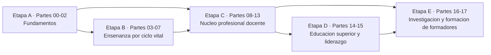

<div align="center">

# 🎓 Programa Integral de Pedagogía, Docencia y Ciencias del Aprendizaje

## **18 partes · 216 clases · de cómo aprende una persona a cómo se forma a quien enseña**

**Programa completo de formación pedagógica en español: fundamentos de la educación, ciencias
del aprendizaje, desarrollo humano, enseñanza en cada ciclo vital, inclusión, currículum,
didáctica, evaluación y psicometría, convivencia, tecnología e IA educativa, docencia
universitaria, liderazgo escolar e investigación educativa y doctoral.**

[](https://github.com/vladimiracunadev-create/education-pedagogy-learning-sciences-program/actions/workflows/ci.yml)
[](https://github.com/vladimiracunadev-create/education-pedagogy-learning-sciences-program/actions/workflows/pages.yml)
[](https://github.com/vladimiracunadev-create/education-pedagogy-learning-sciences-program/actions/workflows/security.yml)

[](CHANGELOG.md)
[](CURRICULUM.md)
[](STATUS.md)
[](LICENSE-CONTENT.md)

[](scripts/)
[](docs/ARQUITECTURA.md)
[](docs/MARCO_CHILE.md)
[](https://vladimiracunadev-create.github.io/education-pedagogy-learning-sciences-program/)

[🌐 **Sitio de estudio**](https://vladimiracunadev-create.github.io/education-pedagogy-learning-sciences-program/) ·
[📋 Currículo](CURRICULUM.md) ·
[📖 Programa detallado](SYLLABUS.md) ·
[🧭 Rutas de aprendizaje](docs/RUTAS_DE_APRENDIZAJE.md) ·
[🎓 Guía del estudiante](docs/GUIA_DEL_ESTUDIANTE.md) ·
[🧑‍🏫 Guía del formador](docs/GUIA_DEL_FORMADOR.md) ·
[📊 Estado verificable](STATUS.md)

</div>

---

> [!IMPORTANT]
> Este es un programa de **formación profesional y autoformación**. No otorga título, grado ni
> habilitación legal para ejercer la docencia, y no reemplaza una licenciatura, un magíster ni un
> doctorado de una institución acreditada.

## ✅ Estado verificable

| Superficie | Estado |
|---|---|
| Currículo | ✅ 18 partes y 216 clases declaradas en `manifests/` |
| Contrato pedagógico | ✅ 13 secciones obligatorias por clase, verificadas en CI |
| Profundidad | ✅ 1.302–1.577 palabras por clase (mediana 1.384) |
| Conceptos | ✅ 864 definiciones operacionales y un glosario de 806 términos |
| Evidencia | ✅ cada clase declara su estado de evidencia y sus límites |
| Bibliografía | ✅ 432 citas en clase, sobre ~250 obras y fuentes oficiales catalogadas |
| Diagramas | ✅ 234 mapas mermaid: uno por clase y uno por parte |
| Evaluación | ✅ 216 evidencias de aprendizaje con criterios de logro escritos |
| Sitio | ✅ portal estático con buscador, tema claro/oscuro y las 216 clases |
| Capacitación | ✅ paquete exportable a LMS con HTML, manifiesto y CSV |
| Reproducibilidad | ✅ todo el contenido publicado se regenera desde los manifiestos |
| CI | ✅ estructura, enlaces, codificación, Markdown, sitio y paquete en cada push |
| Título profesional | ⚪ no lo otorga y no lo reemplaza |

## 🎯 Qué se aprende aquí

Que una persona pueda **enseñar, evaluar, incluir, diseñar y dirigir con criterio**, sabiendo
distinguir lo que la evidencia sostiene de lo que es costumbre. Al terminar el programa completo
puedes:

- explicar cómo aprende una persona con un modelo que soporte decisiones de aula;
- planificar una unidad y una asignatura completas con alineamiento verificable;
- enseñar con técnicas que tienen respaldo, y saber cuándo no aplicarlas;
- construir evaluaciones defendibles y leer un informe técnico sin comprar el titular;
- rediseñar una clase para que participen todos, sin bajar el objetivo;
- gestionar un curso por prevención en lugar de por reacción;
- decidir el uso de tecnología e IA desde el objetivo de aprendizaje y con resguardo de datos;
- conducir mejora institucional con ciclos de indagación e indicadores desagregados;
- investigar tu propia práctica y defender una propuesta doctoral.

## 🌟 Qué hace distinto a este programa

- **Cada clase habilita una decisión.** No cubre un tema: te deja en condiciones de decidir algo
  concreto y de justificarlo.
- **Cada clase declara su estado de evidencia.** `ROBUSTA`, `CONSISTENTE`, `EMERGENTE`,
  `EN-DEBATE`, `MARCO-NORMATIVO` o `PRACTICA-PROFESIONAL`. Nada se presenta como más sólido de lo
  que es.
- **Cada clase declara sus límites.** Una sección completa dedicada a qué **no** sostiene la
  evidencia, incluidos los efectos que se invierten según el contexto.
- **Desmonta los neuromitos.** Estilos de aprendizaje, hemisferio dominante, ventanas críticas
  irreversibles y nativos digitales se tratan de frente, con la evidencia que los refuta.
- **Todo termina en evidencia.** 216 productos con criterios de logro escritos antes de
  producirlos.
- **La ética va primero.** Ninguna actividad se aplica con estudiantes reales sin pasar por el
  [protocolo de práctica responsable](docs/ETICA_Y_PRACTICA_RESPONSABLE.md).
- **Se regenera completo.** Una sola fuente de verdad, cero dependencias externas, CI que falla
  si lo publicado no coincide con la fuente.

## 🧠 El contrato de cada clase

Las 216 clases tienen exactamente la misma estructura, y el CI lo comprueba:

```text
Propósito · Resultados de aprendizaje · Conceptos centrales (4 definiciones operacionales)
Flujo de razonamiento (diagrama) · Desarrollo en tres capas:
    1. el fondo del asunto
    2. cómo se traduce en decisiones de enseñanza
    3. qué sostiene la evidencia y qué no
Taller guiado con contextos alternativos · Evidencia de aprendizaje · Reto verificable
Criterio de logro · Errores frecuentes · Diversidad, accesibilidad y ética
Preguntas de comprobación · Lecturas base · Conexión con el resto del programa
```

## 🗺️ El mapa del programa



## 📚 Las 18 partes

### 🟢 Etapa A — Fundamentos

Qué es educar, cómo aprende el ser humano y cómo cambia el aprendizaje a lo largo del desarrollo.
Sin esta etapa, todo lo demás es repetición de técnicas sin criterio.

| # | Parte | Clases | Contenido central | Leer |
|---:|---|---:|---|---|
| 00 | Fundamentos de la educación | 12 (001–012) | Educación y pedagogía, historia, filosofía, ética, derecho a la educación, calidad y equidad | [📘](curriculum/part-00-fundamentos-de-la-educacion/README.md) |
| 01 | Ciencias del aprendizaje | 12 (013–024) | Memoria, atención, carga cognitiva, recuperación, espaciado, metacognición, motivación, transferencia | [📘](curriculum/part-01-ciencias-del-aprendizaje/README.md) |
| 02 | Desarrollo humano | 12 (025–036) | Primera infancia, lenguaje, cognición, apego, niñez media, adolescencia, adultez y envejecimiento | [📘](curriculum/part-02-desarrollo-humano/README.md) |

### 🔵 Etapa B — Enseñanza por ciclo vital

La misma teoría del aprendizaje produce decisiones distintas en sala cuna, en séptimo básico, en
un taller técnico y en una capacitación de adultos.

| # | Parte | Clases | Contenido central | Leer |
|---:|---|---:|---|---|
| 03 | Educación parvularia | 12 (037–048) | Juego, ambientes, alfabetización y matemática emergentes, documentación pedagógica | [📘](curriculum/part-03-educacion-parvularia/README.md) |
| 04 | Educación básica | 12 (049–060) | Didáctica de lectura, escritura, matemática y ciencias; planificación y evaluación formativa | [📘](curriculum/part-04-educacion-basica/README.md) |
| 05 | Educación media y adolescencia | 12 (061–072) | Autoridad pedagógica, proyectos, problemas, debate, orientación y evaluación auténtica | [📘](curriculum/part-05-educacion-media-y-adolescencia/README.md) |
| 06 | Educación técnico-profesional | 12 (073–084) | Competencias, talleres, seguridad, rúbricas, portafolio, dual y práctica profesional | [📘](curriculum/part-06-educacion-tecnico-profesional/README.md) |
| 07 | Educación de adultos y andragogía | 12 (085–096) | Andragogía, autodirección, capacitación laboral, transferencia, mentoría y coaching | [📘](curriculum/part-07-educacion-de-adultos-y-andragogia/README.md) |

### 🟣 Etapa C — Núcleo profesional docente

Lo transversal a cualquier nivel. Es el corazón del oficio y la etapa más larga del programa.

| # | Parte | Clases | Contenido central | Leer |
|---:|---|---:|---|---|
| 08 | Inclusión y educación especial | 12 (097–108) | Barreras, DUA, diversificación, autismo, TDAH, discapacidad y altas capacidades | [📘](curriculum/part-08-inclusion-y-educacion-especial/README.md) |
| 09 | Diseño curricular | 12 (109–120) | Perfil de egreso, resultados de aprendizaje, secuenciación, diseño inverso y alineamiento | [📘](curriculum/part-09-diseno-curricular/README.md) |
| 10 | Didáctica avanzada | 12 (121–132) | Conocimiento pedagógico del contenido, explicación, modelamiento, andamiaje y práctica | [📘](curriculum/part-10-didactica-avanzada/README.md) |
| 11 | Evaluación y psicometría | 12 (133–144) | Validez, confiabilidad, ítems, rúbricas, retroalimentación, análisis de ítems e IRT | [📘](curriculum/part-11-evaluacion-y-psicometria/README.md) |
| 12 | Gestión del aula y convivencia | 12 (145–156) | Clima, rutinas, prevención, conflictos, integridad, apoderados y crisis | [📘](curriculum/part-12-gestion-del-aula-y-convivencia/README.md) |
| 13 | Tecnología e IA educativa | 12 (157–168) | Competencia digital, diseño de recursos, analítica, IA generativa, RAG, agentes y ética | [📘](curriculum/part-13-tecnologia-e-ia-educativa/README.md) |

### 🟠 Etapa D — Educación superior y liderazgo

Cambia la unidad de análisis: de la clase a la asignatura, y de la asignatura a la organización.

| # | Parte | Clases | Contenido central | Leer |
|---:|---|---:|---|---|
| 14 | Docencia universitaria | 12 (169–180) | Enfoques de aprendizaje, syllabus, cátedra activa, seminarios, laboratorios y tesis | [📘](curriculum/part-14-docencia-universitaria/README.md) |
| 15 | Gestión y liderazgo educativo | 12 (181–192) | Liderazgo pedagógico, observación, retroalimentación, indicadores y mejora escolar | [📘](curriculum/part-15-gestion-y-liderazgo-educativo/README.md) |

### 🔴 Etapa E — Investigación avanzada y formación de formadores

Producir conocimiento educativo defendible y formar a quienes enseñan.

| # | Parte | Clases | Contenido central | Leer |
|---:|---|---:|---|---|
| 16 | Investigación educativa | 12 (193–204) | Pregunta, literatura, diseños, muestreo, estadística, análisis temático y ética | [📘](curriculum/part-16-investigacion-educativa/README.md) |
| 17 | Investigación doctoral y formación de formadores | 12 (205–216) | Originalidad, multinivel, metaanálisis, escritura, publicación y desarrollo profesional docente | [📘](curriculum/part-17-investigacion-doctoral-y-formacion-de-formadores/README.md) |

## 🧭 Por dónde empezar

| Si eres… | Ruta | Clases |
|---|---|---:|
| docente escolar | 00 → 01 → 02 → nivel → 08 → 09 → 10 → 11 → 12 → 13 | 156 |
| docente técnico-profesional | 00 → 01 → 02 → 06 → 08 → 09 → 10 → 11 → 12 → 13 | 144 |
| educadora o educador de párvulos | 00 → 01 → 02 → 03 → 08 → 09 → 11 → 12 → 13 | 120 |
| formador de adultos o capacitador | 00 → 01 → 02 → 07 → 09 → 10 → 11 → 13 → 15 | 108 |
| docente universitario | 00 → 01 → 02 → 09 → 10 → 11 → 14 → 13 → 16 | 108 |
| directivo o jefatura técnica | 00 → 01 → 02 → 08 → 09 → 11 → 12 → 15 → 16 | 108 |
| investigador o tesista | 00 → 01 → 02 → 09 → 11 → 16 → 17 | 84 |
| formador de formadores | el programa completo | 216 |

Rutas completas con su salida esperada: [docs/RUTAS_DE_APRENDIZAJE.md](docs/RUTAS_DE_APRENDIZAJE.md).

## 📁 Estructura del repositorio

```text
manifests/     fuente única de verdad: nada de curriculum/ se edita a mano
curriculum/    18 partes · 216 clases generadas
docs/          metodología, guías, bibliografía, glosario, marcos y protocolos
scripts/       generadores y validadores (solo biblioteca estándar de Python)
tests/         pruebas estructurales del repositorio
cases/         casos profesionales para resolver con el marco del programa
projects/      proyectos integradores mayores
assessments/   rúbricas e instrumentos de autoevaluación
labs/          laboratorios y simuladores de práctica
templates/     plantillas de trabajo reutilizables
chile-education-system/  marco institucional y normativo chileno
international-education/ comparación internacional
```

## 🔧 Reconstruir el repositorio

Requiere Python 3.11 o superior. **No hay dependencias externas.**

```bash
python scripts/generar_clases.py        # manifiestos → curriculum/
python scripts/generar_indice.py        # STATUS, SYLLABUS, FILE_INDEX, GLOSARIO, catalog
python scripts/validar_estructura.py    # estructura, secciones y enlaces
python scripts/validar_encoding.py      # UTF-8 sin BOM ni mojibake
python -m unittest discover -s tests -v # pruebas estructurales
python scripts/generar_sitio.py         # sitio estático en site/
python scripts/exportar_capacitacion.py # paquete para LMS en capacitacion/
```

O con los atajos del `Makefile`: `make generar`, `make validar`, `make sitio`, `make todo`.

## 🏫 Migración a capacitación

El programa se exporta como paquete listo para un LMS: página autocontenida y fragmento HTML por
lección, `manifiesto.json` con metadatos, y `programa.csv` para carga administrativa. Cada
lección conserva su código `PED-001` a `PED-216` para mantener la trazabilidad con la fuente.

Instrucciones completas: [docs/MIGRACION_A_CAPACITACION.md](docs/MIGRACION_A_CAPACITACION.md).

## ⚖️ Licencia

- **Contenido educativo:** [CC BY-NC-SA 4.0](LICENSE-CONTENT.md) — con atribución, compartiendo
  igual y sin uso comercial sin autorización previa.
- **Código de los generadores:** [MIT](LICENSE).

## 📌 Advertencias

- No otorga título, grado ni habilitación legal para ejercer la docencia.
- La capa normativa es **Chile-first** y describe el marco vigente a la fecha de redacción:
  verifica siempre la fuente oficial antes de fundar una decisión real.
- Los efectos promedio de la investigación educativa no describen a ningún estudiante concreto.
- Aplicar cualquier actividad con estudiantes reales exige leer antes el
  [protocolo de práctica responsable](docs/ETICA_Y_PRACTICA_RESPONSABLE.md).

---

<div align="center">

**[Currículo](CURRICULUM.md)** · **[Programa detallado](SYLLABUS.md)** ·
**[Estado](STATUS.md)** · **[Índice de archivos](FILE_INDEX.md)** ·
**[Roadmap](ROADMAP.md)** · **[Cambios](CHANGELOG.md)** ·
**[Contribuir](CONTRIBUTING.md)**

</div>
