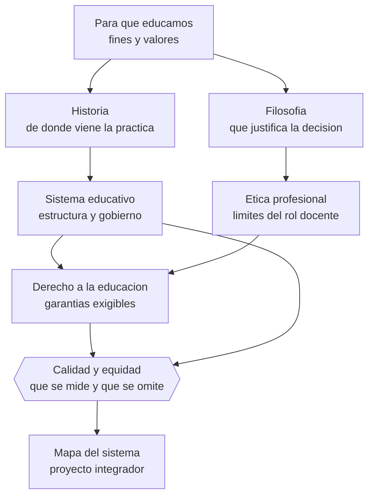

# Parte 00 — Fundamentos de la educación

> *Antes de preguntar cómo enseñar, saber qué se hace cuando se educa*

🟢 **Etapa A — Fundamentos** · salida de la etapa: explicar cómo aprende una persona y qué hace la educación con ese hecho

**Clases:** 12 (001–012) · **Población de referencia:** transversal a todo el sistema educativo · **Conceptos operacionales:** 48 · **Señales observables:** 36 
**Contenido central:** Educación y pedagogía, historia, filosofía, ética profesional, derecho a la educación, sistemas comparados, calidad y equidad

## 🎯 De qué trata esta parte

Casi todos los conflictos pedagógicos que parecen técnicos son, en el fondo, desacuerdos sobre para qué sirve la escuela. Dos docentes que discuten sobre si conviene poner nota a un trabajo grupal rara vez discrepan sobre psicometría: discrepan sobre si la evaluación existe para certificar, para enseñar o para ordenar socialmente a las personas. Esta parte pone ese desacuerdo sobre la mesa antes de que aparezca disfrazado de discusión de reglamento.

La segunda razón para empezar aquí es defensiva. La educación es un campo saturado de modas: cada década trae un método que promete resolverlo todo y que desaparece sin dejar evidencia. Quien conoce la historia del campo reconoce el patrón —la escuela nueva, la enseñanza programada, las inteligencias múltiples, la gamificación total— y deja de comprar la promesa sin pedir el dato. Conocer la historia no es erudición: es una vacuna contra el entusiasmo sin evidencia.

La tercera razón es jurídica y ética. Enseñar es ejercer poder sobre personas que muchas veces no eligieron estar ahí, y ese poder está regulado por un derecho —el derecho a la educación— y por una ética profesional que no es opcional. Un docente que no distingue entre lo que puede decidir, lo que debe consultar y lo que le está prohibido, tarde o temprano toma una decisión que perjudica a un estudiante creyendo que lo ayuda.

## 🏫 Caso de la parte

Las doce clases trabajan sobre la misma realidad, para que puedas ver cómo cambia tu diagnóstico
a medida que avanzas:

> El equipo de Los Aromos discute si el problema de resultados es de enseñanza, de gestión o de contexto. Cada uno usa las palabras «calidad», «aprendizaje» y «pedagogía» con un significado distinto, y la reunión termina sin acuerdo por tercera vez.

**Artefacto que produces al terminar:** mapa del sistema educativo con actores, competencias, instrumentos y vías de reclamo, aplicado a tres situaciones reales del establecimiento.

## 📚 Resultados de la parte

Al terminar esta parte podrás:

1. **Distinguir educación, pedagogía, enseñanza y aprendizaje, y usar cada término donde corresponde**.
2. **Situar una práctica pedagógica actual en la tradición histórica y filosófica de la que proviene**.
3. **Identificar el marco de derechos y deberes que enmarca cualquier decisión docente en Chile**.
4. **Argumentar qué entiende por calidad y por equidad un sistema educativo concreto, y con qué indicadores lo mide**.

## 🗺️ Mapa de la parte

## 🧠 Marco de referencia

- tradición pedagógica occidental y latinoamericana: de Comenio a Freire
- filosofía de la educación: fines, autoridad, autonomía y formación del juicio
- derecho a la educación: instrumentos internacionales y ordenamiento chileno
- análisis comparado de sistemas educativos y de sus indicadores de calidad

**Autoras y autores que conviene conocer:** Juan Amós Comenio, John Dewey, Paulo Freire, Émile Durkheim, Pierre Bourdieu y Jean-Claude Passeron, Gert Biesta, Amartya Sen, Martha Nussbaum

## 📋 Las 12 clases

| # | Clase | Decisión que habilita | Evidencia |
|---:|---|---|---|
| 001 | [Educación, pedagogía, enseñanza y aprendizaje](class-01-educacion-pedagogia-ensenanza-y-aprendizaje/README.md) | decidir qué se va a observar para afirmar que hubo aprendizaje y no solo actividad | `PRACTICA-PROFESIONAL` |
| 002 | [Historia de la educación](class-02-historia-de-la-educacion/README.md) | decidir qué práctica heredada de tu institución conviene conservar, cuál revisar y con qué argumento | `MARCO-NORMATIVO` |
| 003 | [Filosofía de la educación](class-03-filosofia-de-la-educacion/README.md) | decidir qué fines educativos vas a priorizar cuando entren en conflicto entre sí | `EN-DEBATE` |
| 004 | [Ética profesional docente](class-04-etica-profesional-docente/README.md) | decidir, ante una situación concreta, si corresponde actuar, consultar al equipo, informar formalmente o denunciar | `MARCO-NORMATIVO` |
| 005 | [Sistemas educativos comparados](class-05-sistemas-educativos-comparados/README.md) | decidir qué elemento de un sistema extranjero es transferible a tu contexto y bajo qué condiciones | `CONSISTENTE` |
| 006 | [Educación formal, no formal e informal](class-06-educacion-formal-no-formal-e-informal/README.md) | decidir qué parte de un aprendizaje conviene formalizar y qué parte se sostiene mejor fuera del aula | `CONSISTENTE` |
| 007 | [Derecho a la educación](class-07-derecho-a-la-educacion/README.md) | decidir si una práctica institucional cotidiana vulnera o resguarda un derecho exigible | `MARCO-NORMATIVO` |
| 008 | [Rol social de la escuela](class-08-rol-social-de-la-escuela/README.md) | decidir qué parte de un resultado educativo es responsabilidad de la práctica pedagógica y cuál exige acción fuera del aula | `EN-DEBATE` |
| 009 | [Profesiones y roles educativos](class-09-profesiones-y-roles-educativos/README.md) | decidir a quién corresponde una decisión y con quién debe tomarse de forma conjunta | `PRACTICA-PROFESIONAL` |
| 010 | [Cultura escolar y comunidad](class-10-cultura-escolar-y-comunidad/README.md) | decidir qué cambio pedagógico es viable en la cultura actual de tu institución y cuál requiere trabajar primero la cultura | `CONSISTENTE` |
| 011 | [Calidad y equidad educativa](class-11-calidad-y-equidad-educativa/README.md) | decidir con qué indicadores vas a afirmar que tu curso, programa o institución mejoró | `EN-DEBATE` |
| 012 | [Proyecto integrador: mapa del sistema educativo](class-12-proyecto-integrador-mapa-del-sistema-educativo/README.md) | decidir a qué nivel del sistema corresponde resolver un problema y con qué instrumento | `MARCO-NORMATIVO` |

## ⚠️ Riesgos característicos

- Tomar decisiones técnicas sin explicitar el fin educativo que las justifica.
- Confundir una tradición pedagógica con una moda reciente por desconocer su historia.
- Tratar la calidad como sinónimo de resultado en pruebas estandarizadas.
- Ejercer autoridad docente sin conocer los límites legales y éticos del rol.

## 📕 Lecturas de referencia de la parte

- **Dewey, J. (1916). *Democracy and Education*.** — el texto que instala la pregunta por el fin de la educación en la democracia; léelo por su argumento, no por sus recetas.
- **Freire, P. (1970). *Pedagogía del oprimido*.** — la crítica más influyente en América Latina a la enseñanza como depósito de contenidos; contrástalo con la evidencia sobre instrucción explícita.
- **Biesta, G. (2010). *Good Education in an Age of Measurement*.** — distingue calificación, socialización y subjetivación como tres funciones distintas de la educación; ordena la discusión sobre calidad.
- **UNESCO (2015). *Replantear la educación: ¿hacia un bien común mundial?*** — marco internacional vigente sobre educación como bien común; útil para fundamentar políticas y proyectos.

## ✅ Evidencia mínima para dar la parte por cerrada

- [ ] una ficha por clase con concepto, ejemplo, contraejemplo y aplicación;
- [ ] un ensayo breve que defienda una posición sobre el fin de la educación y anticipe la objeción más fuerte;
- [ ] el mapa del sistema educativo chileno con actores, competencias y vías de reclamo;
- [ ] la autoevaluación del módulo con la rúbrica maestra.

## 🧭 Práctica y evaluación de la parte

- [Rúbrica maestra e instrumentos de autoevaluación](../../assessments/README.md)
- [Casos profesionales para resolver con este marco](../../cases/README.md)
- [Laboratorios de decisión](../../labs/README.md)
- [Dónde se archiva la evidencia](../../evidence/README.md)

---

| Anterior | Índice | Siguiente |
|---|---|---|
| [← Inicio del programa](../../README.md) | [Programa](../../README.md) · [Currículo](../../CURRICULUM.md) | [Parte 01 · Ciencias del aprendizaje →](../part-01-ciencias-del-aprendizaje/README.md) |
