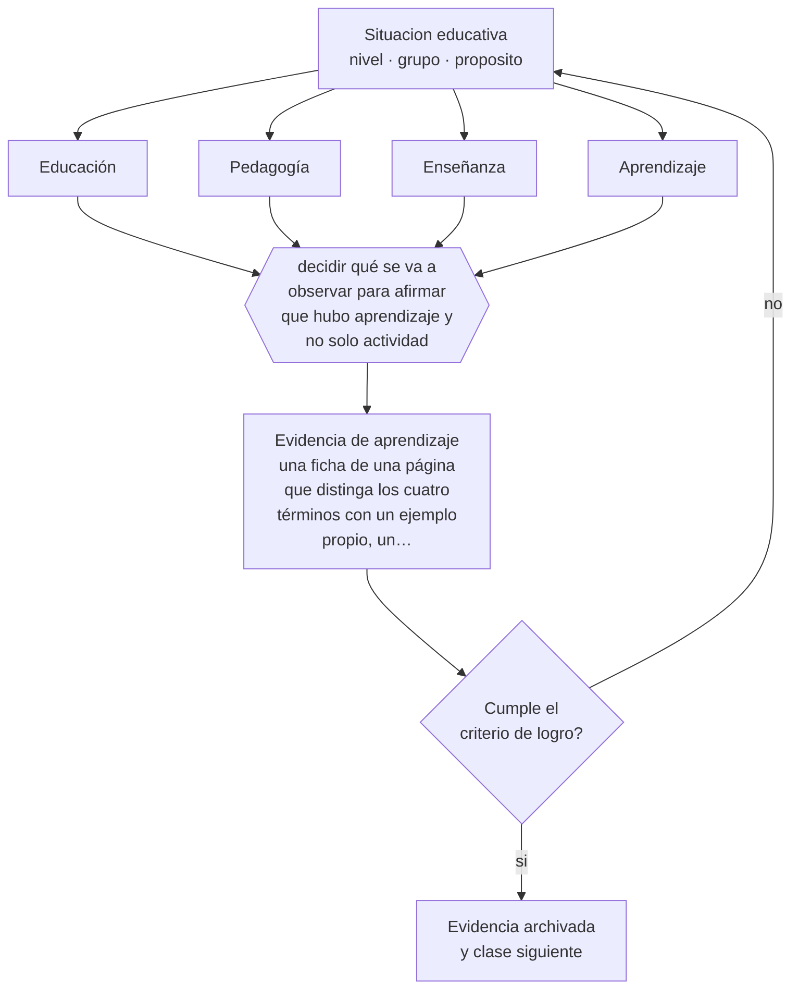

# Clase 001 — Educación, pedagogía, enseñanza y aprendizaje

> **Parte 00 · Fundamentos de la educación** — clase 1 de 12

**Estado de evidencia:** `PRACTICA-PROFESIONAL` · **Etapa:** 🟢 Etapa A — Fundamentos · **Población de referencia:** transversal a todo el sistema educativo 
**Decisión que habilita:** decidir qué se va a observar para afirmar que hubo aprendizaje y no solo actividad 
**Evidencia de aprendizaje:** una ficha de una página que distinga los cuatro términos con un ejemplo propio, un contraejemplo y el indicador observable que usarías

## 🎯 Propósito

Separar cuatro términos que el habla cotidiana confunde y que, mal usados, hacen imposible saber si una clase funcionó. Enseñar y aprender no son la misma acción, no las ejecuta la misma persona y no se comprueban con la misma evidencia.

## 📚 Resultados de aprendizaje

Al finalizar esta clase podrás:

1. **Definir** con precisión los cuatro conceptos centrales de la clase y reconocerlos en una situación educativa real, no solo en su enunciado.
2. **Explicar** por qué usar «enseñanza» y «aprendizaje» como sinónimos produce planificaciones que después no se pueden evaluar.
3. **Decidir** —qué se va a observar para afirmar que hubo aprendizaje y no solo actividad— y sostener la decisión con un fundamento escrito.
4. **Producir** la evidencia de la clase —una ficha de una página que distinga los cuatro términos con un ejemplo propio, un contraejemplo y el indicador observable que usarías— y contrastarla contra el criterio de logro.
5. **Distinguir** lo que la evidencia sostiene de lo que es práctica instalada, preferencia personal o costumbre de la institución.

## 🧩 Conceptos centrales

| Concepto | Comprensión verificable |
|---|---|
| **Educación** | proceso social e intencionado de formación de personas; incluye mucho más que la escuela |
| **Pedagogía** | disciplina que estudia y fundamenta la acción educativa; produce criterios, no recetas |
| **Enseñanza** | acción deliberada de un tercero para que alguien aprenda algo determinado |
| **Aprendizaje** | cambio relativamente duradero en lo que una persona sabe o puede hacer, inferible desde su desempeño |

## 🗺️ Flujo de razonamiento

## 📖 Desarrollo

### 1. El fondo del asunto

La distinción no es académica: es operativa. Enseñar es una acción del docente; aprender es un cambio en el estudiante. Que ocurra la primera no garantiza la segunda, y por eso una clase «bien hecha» puede terminar sin aprendizaje. La pedagogía es el cuerpo de conocimiento que permite decidir entre acciones de enseñanza alternativas, y la educación es el marco social que define para qué se enseña. Cuando estos cuatro niveles se colapsan en uno, las conversaciones profesionales derivan en preferencias personales, porque nadie está discutiendo lo mismo.

### 2. Cómo se traduce en decisiones de enseñanza

La consecuencia práctica aparece en la planificación. Un objetivo escrito en términos de enseñanza —«presentar el sistema circulatorio»— no admite verificación; escrito en términos de aprendizaje —«explicar el recorrido de la sangre señalando dónde se oxigena»— determina qué evidencia hay que recoger. Adoptar esta disciplina de escritura cambia también la conversación con colegas y directivos: se deja de discutir si la clase estuvo buena y se empieza a discutir qué mostró el trabajo de los estudiantes.

### 3. Qué sostiene la evidencia y qué no

Ninguna definición resuelve por sí sola los casos de frontera. Hay aprendizaje sin enseñanza —el más frecuente en la vida— y hay enseñanza que produce aprendizajes no buscados, incluidos los indeseables. Tampoco todo aprendizaje es observable en el momento: parte de lo que se aprende se manifiesta meses después o en un contexto distinto. Por eso el indicador observable es una decisión profesional acotada, no una definición de lo que la persona sabe.

> **Cómo leer el estado de evidencia `PRACTICA-PROFESIONAL`.** Es conocimiento práctico acumulado del oficio, útil y transferible, pero no probado con diseños de investigación. Trátalo como un buen punto de partida sujeto a comprobación en tu contexto.

## 🧪 Taller guiado

Aplica la clase a **uno** de los contextos siguientes y repite después el ejercicio en un
contexto de exigencia distinta. Cambiar de contexto es parte del aprendizaje: lo que funciona
con un grupo no se traslada intacto a otro.

| Contexto | Rasgo que cambia la decisión |
|---|---|
| Educación parvularia | el aprendizaje se juega en el ambiente y la interacción, no en la instrucción |
| Educación básica | alfabetización inicial y construcción de hábitos de estudio |
| Educación media | identidad, sentido y proyección hacia el egreso |
| Educación técnico-profesional | el desempeño se demuestra en tareas del oficio |
| Educación de adultos | experiencia previa, tiempo escaso y motivación instrumental |
| Educación superior | autonomía exigida y contenido disciplinar denso |

**Secuencia de trabajo:**

1. Delimita el contexto: nivel, edad, tamaño del grupo, asignatura o experiencia y tiempo real disponible.
2. Declara qué saben ya los estudiantes y **cómo lo comprobaste**, no cómo lo supones.
3. Formula la decisión pedagógica que esta clase habilita y escribe su fundamento.
4. Anticipa qué observarías si la decisión funciona y qué observarías si no funciona.
5. Diseña de antemano la alternativa que aplicarás si la primera estrategia falla.
6. Ejecuta o simula, y registra lo observado con fecha, contexto y evidencia concreta.
7. Produce la evidencia de aprendizaje de la clase.
8. Contrástala contra el criterio de logro, corrige y recién entonces avanza.

### 📦 Evidencia de aprendizaje

Una ficha de una página que distinga los cuatro términos con un ejemplo propio, un contraejemplo y el indicador observable que usarías.

Debe incluir contexto, decisión, fundamento, fuentes consultadas con su fecha, indicador de
logro observable, riesgos previstos y qué harías distinto en la siguiente iteración.

## 🏆 Reto verificable

Toma una planificación real —tuya o publicada— y reescribe sus objetivos desde el estudiante. Después responde por escrito qué evidencia recogerías para cada uno y qué harías si esa evidencia no aparece.

## ✅ Criterio de logro

- [ ] los cuatro términos se distinguen con un ejemplo y un contraejemplo propios, no con definiciones copiadas;
- [ ] el indicador observable declarado permitiría a otra persona decidir si hubo aprendizaje o no;
- [ ] cada afirmación sobre «lo que funciona» está atribuida a una fuente identificable, con autor y fecha;
- [ ] la decisión es ejecutable con el tiempo, el espacio, el número de estudiantes y los recursos que realmente tienes;
- [ ] la evidencia queda archivada de forma reproducible: otra persona podría revisarla sin que tú se la expliques.

## ⚠️ Errores frecuentes

**Propios de esta clase:**

- Escribir objetivos que describen lo que hará el docente y evaluarlos como si describieran al estudiante.
- Tratar la pedagogía como conjunto de técnicas y no como el marco que permite elegir entre ellas.

**Característicos de la parte 00:**

- Tomar decisiones técnicas sin explicitar el fin educativo que las justifica.
- Confundir una tradición pedagógica con una moda reciente por desconocer su historia.

## ♿ Diversidad, accesibilidad y ética

Definir el aprendizaje por su evidencia observable tiene un riesgo de exclusión: quien no puede demostrarlo por la vía habitual queda registrado como si no hubiera aprendido. La regla profesional es separar el aprendizaje de su vía de demostración, y ofrecer más de una forma de mostrar lo mismo antes de concluir que algo no se logró.

Antes de aplicar cualquier decisión de esta clase con estudiantes reales, revisa el
[protocolo de práctica responsable](../../../docs/ETICA_Y_PRACTICA_RESPONSABLE.md):
consentimiento, resguardo de datos personales, proporcionalidad de la intervención y derecho
de cada estudiante a no ser objeto de un ensayo que no le reporta beneficio.

## ❓ Preguntas de comprobación

1. ¿Qué observarías mañana para afirmar que tus estudiantes aprendieron algo y no solo estuvieron ocupados?
2. ¿Puedes nombrar un aprendizaje reciente tuyo que no haya sido producto de enseñanza alguna?
3. ¿Qué cambia en tu planificación si escribes el objetivo desde el estudiante y no desde ti?

## 📕 Lecturas base

**Dewey, J. (1916). *Democracy and Education*, cap. 1–2.**  
*Qué aporta a esta clase:* establece la diferencia entre educación como proceso vital y escolarización como institución; base del resto de la parte.

**Biesta, G. (2010). *Good Education in an Age of Measurement*.**  
*Qué aporta a esta clase:* muestra que la pregunta «¿qué es buena educación?» no se responde midiendo mejor, sino decidiendo qué se persigue.

Catálogo completo: [bibliografía del programa](../../../docs/BIBLIOGRAFIA.md) ·
[glosario](../../../docs/GLOSARIO.md) ·
[fuentes oficiales y cómo leerlas](../../../docs/FUENTES.md).

## 🔗 Conexión con el resto del programa

Esta clase fija el vocabulario que usan las 215 restantes. La distinción entre enseñanza y aprendizaje reaparece con toda su fuerza en la parte 09 (alineamiento constructivo) y en la parte 11 (validez de la inferencia evaluativa).

> [!IMPORTANT]
> Material de formación profesional. No reemplaza un título de pedagogía, una habilitación
> legal para ejercer, ni el juicio de un equipo educativo que conoce a sus estudiantes.

---

| Anterior | Índice | Siguiente |
|---|---|---|
| [← Parte 00](../README.md) | [Parte 00](../README.md) · [Programa](../../../README.md) | [002 · Historia de la educación →](../class-02-historia-de-la-educacion/README.md) |
