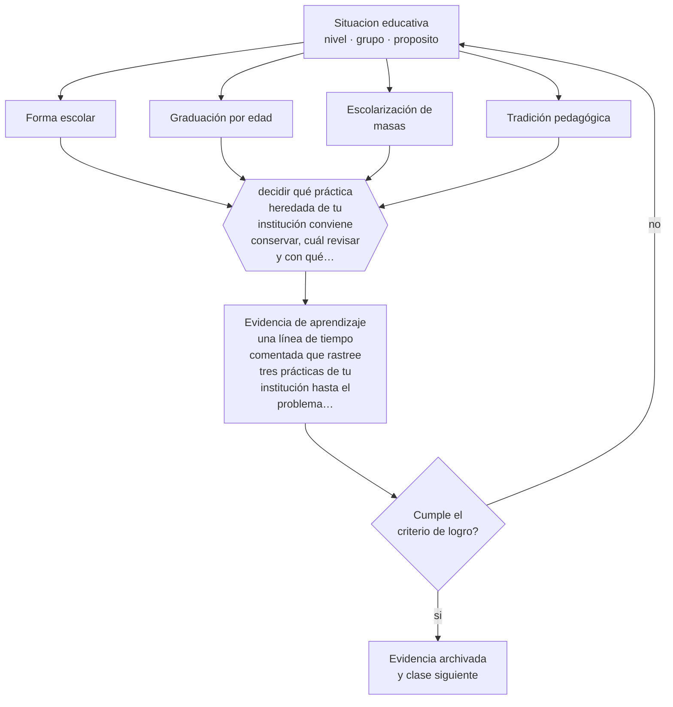

# Clase 002 — Historia de la educación

> **Parte 00 · Fundamentos de la educación** — clase 2 de 12

**Estado de evidencia:** `MARCO-NORMATIVO` · **Etapa:** 🟢 Etapa A — Fundamentos · **Población de referencia:** transversal a todo el sistema educativo 
**Decisión que habilita:** decidir qué práctica heredada de tu institución conviene conservar, cuál revisar y con qué argumento 
**Evidencia de aprendizaje:** una línea de tiempo comentada que rastree tres prácticas de tu institución hasta el problema histórico que las originó

## 🎯 Propósito

Reconocer que la escuela que conocemos —cursos por edad, horario fragmentado, asignaturas, calificaciones— es una construcción histórica reciente y contingente, diseñada para problemas específicos. Saber de dónde viene una práctica es el primer paso para evaluar si sigue sirviendo.

## 📚 Resultados de aprendizaje

Al finalizar esta clase podrás:

1. **Definir** con precisión los cuatro conceptos centrales de la clase y reconocerlos en una situación educativa real, no solo en su enunciado.
2. **Explicar** por qué casi ninguna práctica escolar actual es obvia, y de qué problema histórico concreto vino cada una.
3. **Decidir** —qué práctica heredada de tu institución conviene conservar, cuál revisar y con qué argumento— y sostener la decisión con un fundamento escrito.
4. **Producir** la evidencia de la clase —una línea de tiempo comentada que rastree tres prácticas de tu institución hasta el problema histórico que las originó— y contrastarla contra el criterio de logro.
5. **Distinguir** lo que la evidencia sostiene de lo que es práctica instalada, preferencia personal o costumbre de la institución.

## 🧩 Conceptos centrales

| Concepto | Comprensión verificable |
|---|---|
| **Forma escolar** | conjunto de rasgos —aula, grupo por edad, horario, currículo— que hacen reconocible a una escuela |
| **Graduación por edad** | organización de estudiantes en cursos según año de nacimiento, no según dominio |
| **Escolarización de masas** | proceso de extensión de la escuela a toda la población, ligado a la formación de los Estados nacionales |
| **Tradición pedagógica** | corriente con supuestos propios sobre fines, método y autoridad, que sigue operando en prácticas actuales |

## 🗺️ Flujo de razonamiento

## 📖 Desarrollo

### 1. El fondo del asunto

La escuela graduada, con un docente por grupo de edad y un currículo secuenciado, se generaliza en el siglo XIX junto con la construcción de los Estados nacionales y la necesidad de escolarizar a poblaciones enteras con recursos limitados. No fue una conclusión pedagógica: fue una solución organizacional eficiente. Muchas discusiones actuales —agrupar por nivel de dominio, flexibilizar el tiempo, evaluar por competencias— chocan con esa forma escolar, y entender su origen explica por qué las reformas que la ignoran fracasan.

### 2. Cómo se traduce en decisiones de enseñanza

En Chile, la historia del sistema explica su estructura actual: la expansión estatal del siglo XIX y XX, la reforma de 1965, la municipalización de 1981 con su lógica de subvención por asistencia, y el ciclo de reformas posterior a 1990 hasta la creación del Sistema de Educación Pública. Cada capa dejó instituciones que siguen operando. Un docente que conoce esa secuencia entiende por qué su establecimiento tiene los incentivos que tiene y cuáles puede modificar desde el aula.

### 3. Qué sostiene la evidencia y qué no

La historia explica el origen, no justifica la permanencia ni condena la práctica. Que la graduación por edad tenga origen administrativo no la vuelve indefendible: agrupar por edad tiene razones sociales y de desarrollo. El error simétrico es igual de común: rechazar una práctica solo por antigua o defenderla solo por tradicional. En ambos casos falta el paso que importa, que es preguntar qué evidencia hay hoy sobre su efecto.

> **Cómo leer el estado de evidencia `MARCO-NORMATIVO`.** El contenido no se decide por evidencia empírica sino por norma, política pública o marco institucional vigente. Verifica siempre la versión vigente a la fecha en que vas a aplicarlo: la norma cambia y la clase no se actualiza sola.

## 🧪 Taller guiado

Aplica la clase a **uno** de los contextos siguientes y repite después el ejercicio en un
contexto de exigencia distinta. Cambiar de contexto es parte del aprendizaje: lo que funciona
con un grupo no se traslada intacto a otro.

| Contexto | Rasgo que cambia la decisión |
|---|---|
| Educación parvularia | el aprendizaje se juega en el ambiente y la interacción, no en la instrucción |
| Educación básica | alfabetización inicial y construcción de hábitos de estudio |
| Educación media | identidad, sentido y proyección hacia el egreso |
| Educación técnico-profesional | el desempeño se demuestra en tareas del oficio |
| Educación de adultos | experiencia previa, tiempo escaso y motivación instrumental |
| Educación superior | autonomía exigida y contenido disciplinar denso |

**Secuencia de trabajo:**

1. Delimita el contexto: nivel, edad, tamaño del grupo, asignatura o experiencia y tiempo real disponible.
2. Declara qué saben ya los estudiantes y **cómo lo comprobaste**, no cómo lo supones.
3. Formula la decisión pedagógica que esta clase habilita y escribe su fundamento.
4. Anticipa qué observarías si la decisión funciona y qué observarías si no funciona.
5. Diseña de antemano la alternativa que aplicarás si la primera estrategia falla.
6. Ejecuta o simula, y registra lo observado con fecha, contexto y evidencia concreta.
7. Produce la evidencia de aprendizaje de la clase.
8. Contrástala contra el criterio de logro, corrige y recién entonces avanza.

### 📦 Evidencia de aprendizaje

Una línea de tiempo comentada que rastree tres prácticas de tu institución hasta el problema histórico que las originó.

Debe incluir contexto, decisión, fundamento, fuentes consultadas con su fecha, indicador de
logro observable, riesgos previstos y qué harías distinto en la siguiente iteración.

## 🏆 Reto verificable

Escoge una práctica que te incomode de tu institución. Reconstruye su origen con al menos una fuente histórica y decide, por escrito, si la conservarías, la modificarías o la eliminarías, y qué evidencia sostiene tu decisión.

## ✅ Criterio de logro

- [ ] cada práctica rastreada queda conectada con el problema concreto que intentó resolver;
- [ ] se distingue el origen histórico de una práctica de su justificación actual;
- [ ] cada afirmación sobre «lo que funciona» está atribuida a una fuente identificable, con autor y fecha;
- [ ] la decisión es ejecutable con el tiempo, el espacio, el número de estudiantes y los recursos que realmente tienes;
- [ ] la evidencia queda archivada de forma reproducible: otra persona podría revisarla sin que tú se la expliques.

## ⚠️ Errores frecuentes

**Propios de esta clase:**

- Presentar la historia de la educación como galería de personajes en vez de como historia de problemas y soluciones.
- Suponer que la forma escolar actual es la única posible o la más natural.

**Característicos de la parte 00:**

- Tomar decisiones técnicas sin explicitar el fin educativo que las justifica.
- Confundir una tradición pedagógica con una moda reciente por desconocer su historia.

## ♿ Diversidad, accesibilidad y ética

La historia de la escolarización es también la historia de quiénes quedaron fuera: mujeres, pueblos originarios, población rural, personas con discapacidad. Rastrear una práctica incluye preguntar a quién dejó afuera cuando se instaló, porque muchos mecanismos de exclusión sobreviven sin que nadie los haya vuelto a decidir.

Antes de aplicar cualquier decisión de esta clase con estudiantes reales, revisa el
[protocolo de práctica responsable](../../../docs/ETICA_Y_PRACTICA_RESPONSABLE.md):
consentimiento, resguardo de datos personales, proporcionalidad de la intervención y derecho
de cada estudiante a no ser objeto de un ensayo que no le reporta beneficio.

## ❓ Preguntas de comprobación

1. ¿Qué problema resolvía el horario de bloques de 45 minutos cuando se instaló, y sigue resolviéndolo?
2. ¿Qué práctica de tu establecimiento nadie sabe explicar por qué existe?
3. ¿Qué reforma reciente chocó con la forma escolar y por eso no prendió?

## 📕 Lecturas base

**Tyack, D. & Cuban, L. (1995). *Tinkering toward Utopia: A Century of Public School Reform*.**  
*Qué aporta a esta clase:* explica por qué la «gramática de la escuela» sobrevive a casi todas las reformas; imprescindible antes de proponer un cambio grande.

**Serrano, S., Ponce de León, M. & Rengifo, F. (eds.). *Historia de la Educación en Chile*.**  
*Qué aporta a esta clase:* reconstruye la formación del sistema escolar chileno con fuentes primarias; base para situar la normativa actual.

Catálogo completo: [bibliografía del programa](../../../docs/BIBLIOGRAFIA.md) ·
[glosario](../../../docs/GLOSARIO.md) ·
[fuentes oficiales y cómo leerlas](../../../docs/FUENTES.md).

## 🔗 Conexión con el resto del programa

Prepara la parte 15 (liderazgo y mejora escolar): quien no conoce la forma escolar propone cambios que la organización devuelve intactos. Se apoya en la clase 001 y anticipa la clase 005, sobre sistemas comparados.

> [!IMPORTANT]
> Material de formación profesional. No reemplaza un título de pedagogía, una habilitación
> legal para ejercer, ni el juicio de un equipo educativo que conoce a sus estudiantes.

---

| Anterior | Índice | Siguiente |
|---|---|---|
| [← 001 · Educación, pedagogía, enseñanza y aprendizaje](../class-01-educacion-pedagogia-ensenanza-y-aprendizaje/README.md) | [Parte 00](../README.md) · [Programa](../../../README.md) | [003 · Filosofía de la educación →](../class-03-filosofia-de-la-educacion/README.md) |
