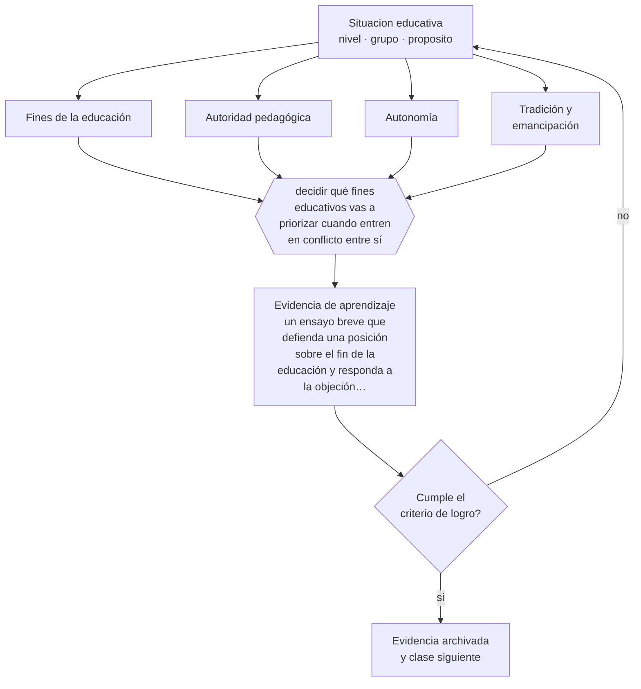

# Clase 003 — Filosofía de la educación

> **Parte 00 · Fundamentos de la educación** — clase 3 de 12

**Estado de evidencia:** `EN-DEBATE` · **Etapa:** 🟢 Etapa A — Fundamentos · **Población de referencia:** transversal a todo el sistema educativo 
**Decisión que habilita:** decidir qué fines educativos vas a priorizar cuando entren en conflicto entre sí 
**Evidencia de aprendizaje:** un ensayo breve que defienda una posición sobre el fin de la educación y responda a la objeción más fuerte en contra

## 🎯 Propósito

Explicitar los supuestos filosóficos que operan bajo las decisiones cotidianas: qué es conocer, qué vale la pena enseñar, qué autoridad tiene el docente y cuánta autonomía corresponde al estudiante. No se trata de adherir a una escuela filosófica sino de saber cuál estás usando.

## 📚 Resultados de aprendizaje

Al finalizar esta clase podrás:

1. **Definir** con precisión los cuatro conceptos centrales de la clase y reconocerlos en una situación educativa real, no solo en su enunciado.
2. **Explicar** por qué toda decisión pedagógica supone una respuesta a preguntas filosóficas que rara vez se hacen explícitas.
3. **Decidir** —qué fines educativos vas a priorizar cuando entren en conflicto entre sí— y sostener la decisión con un fundamento escrito.
4. **Producir** la evidencia de la clase —un ensayo breve que defienda una posición sobre el fin de la educación y responda a la objeción más fuerte en contra— y contrastarla contra el criterio de logro.
5. **Distinguir** lo que la evidencia sostiene de lo que es práctica instalada, preferencia personal o costumbre de la institución.

## 🧭 Agenda sugerida (90 minutos)

| Minutos | Bloque | Qué ocurre |
|---:|---|---|
| 0–10 | Activación | Recuperar sin mirar la clase anterior y responder la pregunta de foco. |
| 10–25 | Conceptos | Definir los cuatro conceptos y reconocerlos en un caso real. |
| 25–45 | Modelo mental | Recorrer el método: delimitar el contexto y comprobar —no suponer— qué saben ya los estudiantes. |
| 45–70 | Ejemplo trabajado | Aplicar el método al caso de la parte, paso a paso y con evidencia. |
| 70–85 | Taller | Trasladar la decisión al contexto propio y anticipar su alternativa. |
| 85–90 | Cierre | Fijar responsable, plazo e indicador de la evidencia de aprendizaje. |

Fuera de la sesión, la clase exige aproximadamente **una hora y media** de práctica y de
producción de la evidencia. Si el tiempo se recorta, se recorta el ejemplo trabajado, nunca la
producción de evidencia: es la única parte que prueba el aprendizaje.

## 🧩 Conceptos centrales

| Concepto | Comprensión verificable |
|---|---|
| **Fines de la educación** | aquello que se persigue formar; determina qué cuenta como éxito y qué como fracaso |
| **Autoridad pedagógica** | legitimidad del docente para dirigir el aprendizaje, distinta del poder institucional |
| **Autonomía** | capacidad de la persona de darse sus propias razones; fin educativo y a la vez condición del aprendizaje |
| **Tradición y emancipación** | dos justificaciones en tensión: transmitir lo valioso heredado o habilitar para transformarlo |

## 🧠 Modelo mental

El método de esta clase, en cinco pasos que se ejecutan en orden:

1. Delimitar el contexto y comprobar —no suponer— qué saben ya los estudiantes.
2. Clasificar la situación distinguiendo **Fines de la educación** de **Autoridad pedagógica**.
3. Decidir con fundamento, usando **Autonomía** como criterio y declarando la fuente.
4. Anticipar qué evidencia confirmaría la decisión y cuál la refutaría, con **Tradición y emancipación** a la vista.
5. Registrar lo ocurrido y contrastarlo contra el criterio de logro antes de avanzar.

Lo que hace profesional a este método no son los pasos sino la evidencia que exige en cada uno.
Estas son las señales observables con las que se comprueba, y que deben quedar definidas **antes**
de recogerlas:

| Señal observable | Cómo se recoge y qué significa |
|---|---|
| **Evidencia de partida** | qué sabían o podían hacer los estudiantes antes de la decisión, comprobado y no supuesto |
| **Evidencia de proceso** | qué se observó mientras la decisión se aplicaba, con fecha, contexto y responsable del registro |
| **Evidencia de logro** | qué muestra un ensayo breve que defienda una posición sobre el fin de la educación y responda a la objeción más fuerte en contra frente al criterio declarado de antemano |

**Frontera de aplicación.** El método vale mientras las condiciones que lo sostienen se cumplan.
Aquí no hay evidencia empírica que zanje. Cuando esa condición falla, el paso siguiente no es forzar el método:
es declarar el límite y decidir con menos certeza, dejándolo por escrito.

## 🗺️ Flujo de razonamiento

## 📖 Desarrollo

### 1. El fondo del asunto

Tres funciones distintas conviven en cualquier sistema educativo: calificar a las personas para desempeñarse, socializarlas en una cultura y formar sujetos capaces de decidir por sí mismos. La mayoría de los conflictos escolares surge cuando estas funciones se contradicen: exigir autonomía y a la vez obediencia estricta, promover pensamiento crítico y castigar el desacuerdo, declarar formación integral y medir solo resultados en pruebas. Hacer explícito el conflicto no lo elimina, pero permite decidirlo con criterio en vez de resolverlo por inercia institucional.

### 2. Frontera conceptual: qué es y qué no es

Los cuatro conceptos de esta clase se confunden entre sí con facilidad, y esa confusión no es
inocua: produce decisiones que atacan el problema equivocado. **Fines de la educación** no es lo
mismo que **Autoridad pedagógica** —legitimidad del docente para dirigir el aprendizaje, distinta del poder institucional—, y tratarlos como sinónimos hace
que la intervención se dirija al lugar incorrecto. Del mismo modo, **Autonomía** y
**Tradición y emancipación** describen aspectos distintos de la misma situación: el primero
capacidad de la persona de darse sus propias razones;, mientras el segundo dos justificaciones en tensión:.

La prueba de que la distinción está entendida es operacional, no verbal: dos personas que
observan la misma clase deben poder clasificar el mismo episodio de la misma manera. Si no
coinciden, el problema está en la definición y no en el observador. El error de clasificación más
frecuente en esta materia es el primero de los que se listan más abajo, y conviene anticiparlo
antes de aplicar nada.

### 3. Cómo se observa y se mide

Nada de lo anterior sirve si no se puede observar. Estas son las señales que esta clase usa y
cómo se recogen:

- **Evidencia de partida.** Qué sabían o podían hacer los estudiantes antes de la decisión, comprobado y no supuesto. Se registra con fecha y contexto; sin eso, la señal no distingue una tendencia de una casualidad.
- **Evidencia de proceso.** Qué se observó mientras la decisión se aplicaba, con fecha, contexto y responsable del registro. Se registra con fecha y contexto; sin eso, la señal no distingue una tendencia de una casualidad.
- **Evidencia de logro.** Qué muestra un ensayo breve que defienda una posición sobre el fin de la educación y responda a la objeción más fuerte en contra frente al criterio declarado de antemano. Se registra con fecha y contexto; sin eso, la señal no distingue una tendencia de una casualidad.

Ninguna de estas señales es el aprendizaje: son indicios de él. Confundir el indicio con el
fenómeno es el error clásico de la medición educativa, y por eso cada señal se interpreta junto
con el contexto, el punto de partida del grupo y lo que el propio estudiante puede explicar sobre
su trabajo.

### 4. Cómo se traduce en decisiones de enseñanza

El ejercicio profesional consiste en detectar la pregunta filosófica escondida en una discusión aparentemente técnica. ¿Debe permitirse repetir una evaluación? Debajo hay una posición sobre si la nota certifica un momento o un aprendizaje. ¿Corresponde exigir uniforme? Debajo hay una posición sobre socialización e identidad. Nombrar el supuesto convierte una discusión de reglamento en una discusión decidible.

### 5. Qué sostiene la evidencia y qué no

Aquí no hay evidencia empírica que zanje. La investigación puede decir qué efecto tiene una práctica, no si ese efecto es deseable. Esta clase está en debate por naturaleza y su exigencia es otra: consistencia. Una posición vale por la calidad de sus razones y por su capacidad de sostener la objeción más fuerte, no por su popularidad ni por el prestigio de quien la enuncia.

> **Cómo leer el estado de evidencia `EN-DEBATE`.** Hay desacuerdo activo y publicado entre especialistas competentes. La clase presenta las posiciones y sus argumentos; tu tarea no es escoger un bando, sino saber qué evidencia te haría cambiar de posición.

### 6. Integración: de los conceptos a una decisión defendible

Una decisión es defendible cuando puede explicarse a alguien que no estuvo presente. Esta clase
te deja en condiciones de qué fines educativos vas a priorizar cuando entren en conflicto entre sí, y esa decisión se sostiene solo si
declara cuatro cosas: la evidencia que la funda, el supuesto que asume, el indicador que la
comprobaría y la condición que la haría cambiar.

Ese es también el criterio con el que se evalúa la evidencia de aprendizaje de la clase. Un
análisis que podría copiarse a otra clase, a otro curso o a otro establecimiento sin cambiar una
palabra no es una decisión: es una declaración general, y el oficio empieza justo donde las
declaraciones generales terminan.

## 📚 Lectura comparada

Las obras no cumplen el mismo papel. Esta tabla indica qué lente aporta cada una;
después de leer, escribe una discrepancia real entre al menos dos fuentes.

| Fuente | Lente que aporta | Pregunta crítica |
|---|---|---|
| Biesta, G. (2010). *Good Education in an Age of Measurement*. | distingue calificación, socialización y subjetivación; el instrumento más útil para ordenar la discusión de fines. | ¿Qué supuesto de esta clase ayuda a poner a prueba? |
| Nussbaum, M. (2010). *Sin fines de lucro: por qué la democracia necesita de las humanidades*. | defiende una posición fuerte y discutible sobre el fin de la educación; buen material para practicar la objeción. | ¿Qué supuesto de esta clase ayuda a poner a prueba? |

La lectura se evalúa por **uso**, no por cantidad de páginas. Tu nota de lectura debe indicar qué
tesis modifica tu diagnóstico, qué evidencia del caso la tensiona y qué decisión concreta
cambiarías después del contraste. Una nota que solo resume el texto no cumple el criterio.

## 🧮 Ejemplo trabajado

**Situación.** El equipo de Los Aromos discute si el problema de resultados es de enseñanza, de gestión o de contexto. Cada uno usa las palabras «calidad», «aprendizaje» y «pedagogía» con un significado distinto, y la reunión termina sin acuerdo por tercera vez.

**Paso 1 — Delimitar el contexto y comprobar —no suponer— qué saben ya los estudiantes.** El equipo escribe primero el supuesto asociado a **Fines de la educación** y se prohíbe tratarlo como hecho. Contrasta ese supuesto con **Evidencia de partida** y anota qué parte del dato todavía no existe. Del paso sale un registro fechado y una frase explícita: «cambiaríamos de decisión si…».

**Paso 2 — Clasificar la situación distinguiendo Fines de la educación de Autoridad pedagógica.** El trabajo aquí es separar lo observado de lo interpretado sobre **Autoridad pedagógica**. La evidencia que ordena la conversación es **Evidencia de proceso**; si su definición no está escrita, escribirla es parte del paso. Nada avanza mientras el equipo no acuerde qué contaría como refutación.

**Paso 3 — Decidir con fundamento, usando Autonomía como criterio y declarando la fuente.** El riesgo de este paso es cerrar demasiado rápido alrededor de **Autonomía**. Antes de concluir, se enumeran dos explicaciones alternativas del mismo patrón y se revisa si **Evidencia de logro** logra distinguirlas. Si no lo logra, hace falta otra evidencia y así debe quedar registrado.

**Paso 4 — Anticipar qué evidencia confirmaría la decisión y cuál la refutaría, con Tradición y emancipación a la vista.** Con **Tradición y emancipación** ya delimitado, la pregunta pasa a ser de consecuencia: qué cambia para los estudiantes, para el tiempo de clase y para la carga del equipo. **Evidencia de partida** entrega la lectura observable; el juicio profesional sigue siendo humano y debe quedar firmado por quien lo hace.

**Paso 5 — Registrar lo ocurrido y contrastarlo contra el criterio de logro antes de avanzar.** El cierre exige compromiso: responsable, fecha, indicador de logro y condición de detención. **Evidencia de proceso** se convierte en la señal de seguimiento, y se acuerda con qué frecuencia se revisa y quién puede declarar que no funcionó sin costo político.

**Síntesis.** La recomendación termina con responsable, fecha, evidencia de logro y señal de
detención. Omitir cualquiera de esas cuatro piezas convierte el análisis en una opinión que nadie
podrá auditar dentro de tres meses, y que por lo tanto nadie corregirá.

## 🔀 Comparación de caminos y límites

Ante la misma situación caben varios cursos de acción. La decisión profesional no es
elegir el «correcto», sino saber qué privilegia cada uno y qué arriesga.

| Camino | Qué privilegia | Cuándo elegirlo | Riesgo principal |
|---|---|---|---|
| Intervenir sobre **Fines de la educación** | Aquello que se persigue formar; determina qué cuenta como éxito y qué como fracaso | Cuando **Evidencia de partida** es observable y accionable dentro del plazo de la decisión. | Sobrerreaccionar a una señal parcial. |
| Intervenir sobre **Autoridad pedagógica** | Legitimidad del docente para dirigir el aprendizaje, distinta del poder institucional | Cuando la primera explicación no distingue mecanismo ni responsable. | Convertir el concepto en etiqueta y no en intervención. |
| Observar antes de decidir | Reducir la incertidumbre antes de comprometer tiempo y credibilidad | Cuando la decisión es reversible y la evidencia disponible no distingue causas. | Observar indefinidamente y no decidir nunca. |
| Derivar o escalar | Poner la decisión donde están la competencia y la responsabilidad | Cuando hay normativa, resguardo de datos, salud o vulneración de derechos en juego. | Delegar hacia arriba lo que sí correspondía decidir en el aula. |

**Frontera de aplicación.** Aquí no hay evidencia empírica que zanje. Fuera de esa frontera, la comparación
anterior deja de ser válida y la decisión debe tomarse con evidencia distinta.

## 🪜 El mismo tema según el rol

La misma materia cambia de forma según quién decida. Al subir de nivel aumentan las
personas, el tiempo y las consecuencias que quedan dentro de la decisión.

| Nivel | Responsabilidad sobre filosofía de la educación |
|---|---|
| **Docente de aula** | Aplica, observa y registra la evidencia; declara qué no puede resolver desde su rol. |
| **Equipo de apoyo o educación diferencial** | Verifica que la decisión no deje fuera a quien más barreras enfrenta y aporta los apoyos. |
| **Jefatura técnico-pedagógica** | Convierte la decisión en criterio compartido, tiempo protegido y acompañamiento. |
| **Dirección** | Decide si esto cambia condiciones institucionales, recursos o el plan de mejora. |
| **Formación e investigación** | Pregunta si la decisión es generalizable, con qué evidencia y qué haría falta para probarlo. |

Si trabajas en uno de esos niveles, la [guía de carrera de tu rol](../../../rutas/README.md)
indica en qué orden conviene recorrer el programa y qué artefactos acreditan tu competencia.

## 🧪 Taller guiado

Aplica la clase a **uno** de los contextos siguientes y repite después el ejercicio en un
contexto de exigencia distinta. Cambiar de contexto es parte del aprendizaje: lo que funciona
con un grupo no se traslada intacto a otro.

| Contexto | Rasgo que cambia la decisión |
|---|---|
| Educación parvularia | el aprendizaje se juega en el ambiente y la interacción, no en la instrucción |
| Educación básica | alfabetización inicial y construcción de hábitos de estudio |
| Educación media | identidad, sentido y proyección hacia el egreso |
| Educación técnico-profesional | el desempeño se demuestra en tareas del oficio |
| Educación de adultos | experiencia previa, tiempo escaso y motivación instrumental |
| Educación superior | autonomía exigida y contenido disciplinar denso |

**Secuencia de trabajo:**

1. Delimita el contexto: nivel, edad, tamaño del grupo, asignatura o experiencia y tiempo real disponible.
2. Declara qué saben ya los estudiantes y **cómo lo comprobaste**, no cómo lo supones.
3. Formula la decisión pedagógica que esta clase habilita y escribe su fundamento.
4. Anticipa qué observarías si la decisión funciona y qué observarías si no funciona.
5. Diseña de antemano la alternativa que aplicarás si la primera estrategia falla.
6. Ejecuta o simula, y registra lo observado con fecha, contexto y evidencia concreta.
7. Produce la evidencia de aprendizaje de la clase.
8. Contrástala contra el criterio de logro, corrige y recién entonces avanza.

## 🏫 Caso profesional

**Situación.** El equipo de Los Aromos discute si el problema de resultados es de enseñanza, de gestión o de contexto. Cada uno usa las palabras «calidad», «aprendizaje» y «pedagogía» con un significado distinto, y la reunión termina sin acuerdo por tercera vez.

Entrega un **informe de decisión** de una página que contenga:

1. **Hechos y fuentes** — qué está documentado y con qué evidencia, separado de lo que se supone.
2. **Hipótesis** — la explicación más probable y una alternativa que también encajaría.
3. **Dos opciones defendibles** — no una recomendación y un espantapájaros.
4. **Efecto esperado** — sobre los estudiantes, el tiempo de clase, el equipo y los apoyos.
5. **Recomendación** — con su fundamento y la fuente que la respalda.
6. **Condición de revisión** — qué resultado te haría cambiar de decisión.
7. **Responsable y fecha** — quién ejecuta y cuándo se revisa.

Usa al menos **dos** fuentes de la lectura comparada para desafiar tu primera respuesta. Una
recomendación que ninguna fuente pone en duda casi siempre está poco examinada.

## 📥 Evidencia de aprendizaje

Un ensayo breve que defienda una posición sobre el fin de la educación y responda a la objeción más fuerte en contra.

Guárdala en `evidence/P00-C003-filosofia-de-la-educacion/` con estos archivos:

| Archivo | Qué contiene |
|---|---|
| `decision.md` | contexto, decisión, fundamento, fuentes con fecha, indicador de logro y riesgos |
| `senales.md` | definición operacional de las tres señales, cómo se recogieron y qué no distinguen |
| `nota-de-lectura.md` | dos fuentes contrastadas, con edición y páginas consultadas |
| `revision-critica.md` | la objeción más fuerte a tu decisión y qué evidencia la invalidaría |

Esta evidencia alimenta el artefacto de la parte: **mapa del sistema educativo con actores, competencias, instrumentos y vías de reclamo, aplicado a tres situaciones reales del establecimiento**.

## 🏆 Reto verificable

Escribe tu posición sobre el fin principal de la educación en no más de 400 palabras. Pide a un colega que redacte la objeción más fuerte y responde a esa objeción sin cambiar tu tesis original.

## ✅ Evaluación de la clase

| Criterio | Peso | Evidencia esperada |
|---|---:|---|
| Precisión conceptual | 25 % | Distinciones correctas y observables entre los cuatro conceptos, aplicadas a un caso real. |
| Diagnóstico y evidencia | 30 % | Conocimiento previo comprobado, evidencia recogida con fecha y contexto, y límites del dato declarados. |
| Decisión y alternativas | 30 % | Decisión fundada, alternativa prevista si falla, y condición explícita que la haría cambiar. |
| Responsabilidad y comunicación | 15 % | Diversidad y resguardos considerados, fuentes citadas y evidencia archivada de forma reproducible. |

**Aprobación:** 80 de 100 y ningún criterio bajo el 60 %. Una respuesta que podría copiarse sin
cambios a otra clase, a otro curso o a otro establecimiento se considera insuficiente, aunque
esté bien escrita.

**Criterio de logro de la evidencia:**

- [ ] la posición defendida enfrenta explícitamente la objeción más fuerte en su contra;
- [ ] se distingue lo que la evidencia puede zanjar de lo que corresponde a una decisión valórica;
- [ ] cada afirmación sobre «lo que funciona» está atribuida a una fuente identificable, con autor y fecha;
- [ ] la decisión es ejecutable con el tiempo, el espacio, el número de estudiantes y los recursos que realmente tienes;
- [ ] la evidencia queda archivada de forma reproducible: otra persona podría revisarla sin que tú se la expliques.

## ⚠️ Errores frecuentes

**Propios de esta clase:**

- Presentar preferencias personales como conclusiones de la investigación educativa.
- Evitar la discusión de fines y quedarse solo en el «cómo», que es donde el conflicto reaparece disfrazado.

**Característicos de la parte 00:**

- Tomar decisiones técnicas sin explicitar el fin educativo que las justifica.
- Confundir una tradición pedagógica con una moda reciente por desconocer su historia.

Los cuatro comparten estructura: un síntoma visible, una causa que no se ve y una corrección que
casi siempre es de diseño y no de esfuerzo. Antes de atribuir el problema a los estudiantes o a
ti, comprueba cuál de ellos está operando y qué evidencia lo distinguiría de los otros tres.

## ♿ Diversidad, accesibilidad y ética

La discusión sobre fines define quién cuenta como educable. Históricamente, negar capacidad de autonomía a un grupo —por discapacidad, género u origen— fue el argumento para ofrecerle una educación empobrecida. Toda posición sobre fines debe poder responder qué implica para el estudiante con mayores necesidades de apoyo del curso.

Antes de aplicar cualquier decisión de esta clase con estudiantes reales, revisa el
[protocolo de práctica responsable](../../../docs/ETICA_Y_PRACTICA_RESPONSABLE.md):
consentimiento, resguardo de datos personales, proporcionalidad de la intervención y derecho
de cada estudiante a no ser objeto de un ensayo que no le reporta beneficio.

## 🇨🇱 Contexto chileno y cumplimiento

Riesgo característico de esta parte: **Tomar decisiones técnicas sin explicitar el fin educativo que las justifica.** Antes de aplicar
cualquier decisión de esta clase en un establecimiento real, verifica el marco vigente:

- Marco institucional y normativo: [`docs/MARCO_CHILE.md`](../../../docs/MARCO_CHILE.md).
- Inclusión y apoyos: [`docs/INCLUSION_Y_DUA.md`](../../../docs/INCLUSION_Y_DUA.md).
- Datos personales, IA y resguardos: [`docs/IA_EN_EDUCACION.md`](../../../docs/IA_EN_EDUCACION.md).
- Fuentes oficiales con cómo leerlas: [`docs/FUENTES.md`](../../../docs/FUENTES.md).

La regla del programa es simple: **la fuente oficial manda sobre el material pedagógico**. Si la
norma cambió después de la fecha de esta clase, gana la norma.

## ❓ Preguntas de comprobación

1. ¿Qué fin educativo estás priorizando cuando decides no repetir una evaluación a un estudiante que faltó?
2. ¿Qué harías si formar personas autónomas te obligara a tolerar decisiones que consideras erróneas?
3. ¿Qué argumento te haría cambiar de posición sobre el fin principal de la escuela?

## 📗 Fuentes y verificación

- Biesta, G. (2010). *Good Education in an Age of Measurement*. **Uso en esta clase:** distingue calificación, socialización y subjetivación; el instrumento más útil para ordenar la discusión de fines. Lectura selectiva: índice y capítulos pertinentes; registra edición y páginas consultadas.
- Nussbaum, M. (2010). *Sin fines de lucro: por qué la democracia necesita de las humanidades*. **Uso en esta clase:** defiende una posición fuerte y discutible sobre el fin de la educación; buen material para practicar la objeción. Lectura selectiva: índice y capítulos pertinentes; registra edición y páginas consultadas.

Catálogo completo: [bibliografía del programa](../../../docs/BIBLIOGRAFIA.md) ·
[glosario](../../../docs/GLOSARIO.md) ·
[fuentes oficiales y cómo leerlas](../../../docs/FUENTES.md).

> **Regla de fuentes.** Las obras anteriores estructuran las perspectivas de esta materia.
> Cualquier norma, decreto, orientación ministerial o política institucional mencionada debe
> comprobarse en su fuente primaria vigente antes de usarse con estudiantes reales. El desarrollo
> de esta clase es original y no reproduce capítulos protegidos por derechos de autor.

## 🔗 Conexión con el resto del programa

Sostiene la clase 004 sobre ética profesional y la 011 sobre calidad y equidad, donde la discusión de fines se vuelve discusión de indicadores. Reaparece en la parte 13, al decidir el uso aceptable de la IA.

> [!IMPORTANT]
> Material de formación profesional. No reemplaza un título de pedagogía, una habilitación
> legal para ejercer, ni el juicio de un equipo educativo que conoce a sus estudiantes.

---

| Anterior | Índice | Siguiente |
|---|---|---|
| [← 002 · Historia de la educación](../class-02-historia-de-la-educacion/README.md) | [Parte 00](../README.md) · [Programa](../../../README.md) | [004 · Ética profesional docente →](../class-04-etica-profesional-docente/README.md) |
