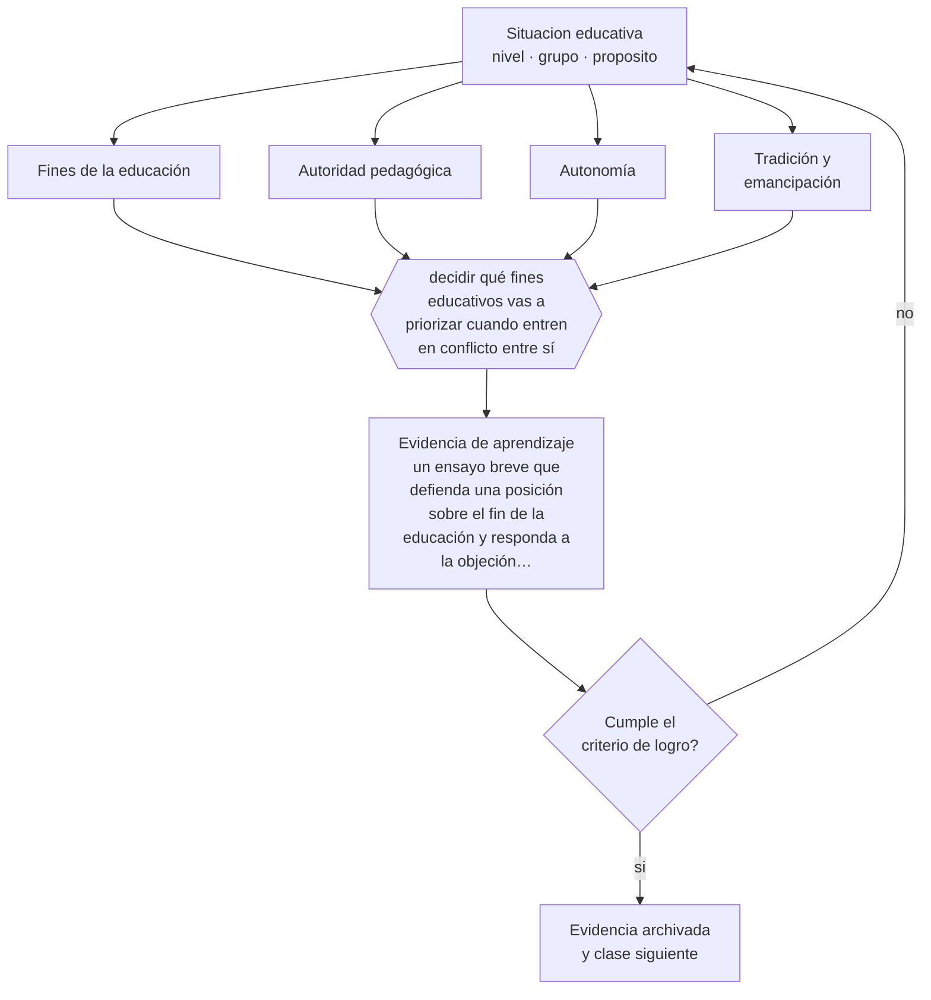

# Clase 003 — Filosofía de la educación

> **Parte 00 · Fundamentos de la educación** — clase 3 de 12

**Estado de evidencia:** `EN-DEBATE` · **Etapa:** 🟢 Etapa A — Fundamentos · **Población de referencia:** transversal a todo el sistema educativo 
**Decisión que habilita:** decidir qué fines educativos vas a priorizar cuando entren en conflicto entre sí 
**Evidencia de aprendizaje:** un ensayo breve que defienda una posición sobre el fin de la educación y responda a la objeción más fuerte en contra

## 🎯 Propósito

Explicitar los supuestos filosóficos que operan bajo las decisiones cotidianas: qué es conocer, qué vale la pena enseñar, qué autoridad tiene el docente y cuánta autonomía corresponde al estudiante. No se trata de adherir a una escuela filosófica sino de saber cuál estás usando.

## 📚 Resultados de aprendizaje

Al finalizar esta clase podrás:

1. **Definir** con precisión los cuatro conceptos centrales de la clase y reconocerlos en una situación educativa real, no solo en su enunciado.
2. **Explicar** por qué toda decisión pedagógica supone una respuesta a preguntas filosóficas que rara vez se hacen explícitas.
3. **Decidir** —qué fines educativos vas a priorizar cuando entren en conflicto entre sí— y sostener la decisión con un fundamento escrito.
4. **Producir** la evidencia de la clase —un ensayo breve que defienda una posición sobre el fin de la educación y responda a la objeción más fuerte en contra— y contrastarla contra el criterio de logro.
5. **Distinguir** lo que la evidencia sostiene de lo que es práctica instalada, preferencia personal o costumbre de la institución.

## 🧩 Conceptos centrales

| Concepto | Comprensión verificable |
|---|---|
| **Fines de la educación** | aquello que se persigue formar; determina qué cuenta como éxito y qué como fracaso |
| **Autoridad pedagógica** | legitimidad del docente para dirigir el aprendizaje, distinta del poder institucional |
| **Autonomía** | capacidad de la persona de darse sus propias razones; fin educativo y a la vez condición del aprendizaje |
| **Tradición y emancipación** | dos justificaciones en tensión: transmitir lo valioso heredado o habilitar para transformarlo |

## 🗺️ Flujo de razonamiento

## 📖 Desarrollo

### 1. El fondo del asunto

Tres funciones distintas conviven en cualquier sistema educativo: calificar a las personas para desempeñarse, socializarlas en una cultura y formar sujetos capaces de decidir por sí mismos. La mayoría de los conflictos escolares surge cuando estas funciones se contradicen: exigir autonomía y a la vez obediencia estricta, promover pensamiento crítico y castigar el desacuerdo, declarar formación integral y medir solo resultados en pruebas. Hacer explícito el conflicto no lo elimina, pero permite decidirlo con criterio en vez de resolverlo por inercia institucional.

### 2. Cómo se traduce en decisiones de enseñanza

El ejercicio profesional consiste en detectar la pregunta filosófica escondida en una discusión aparentemente técnica. ¿Debe permitirse repetir una evaluación? Debajo hay una posición sobre si la nota certifica un momento o un aprendizaje. ¿Corresponde exigir uniforme? Debajo hay una posición sobre socialización e identidad. Nombrar el supuesto convierte una discusión de reglamento en una discusión decidible.

### 3. Qué sostiene la evidencia y qué no

Aquí no hay evidencia empírica que zanje. La investigación puede decir qué efecto tiene una práctica, no si ese efecto es deseable. Esta clase está en debate por naturaleza y su exigencia es otra: consistencia. Una posición vale por la calidad de sus razones y por su capacidad de sostener la objeción más fuerte, no por su popularidad ni por el prestigio de quien la enuncia.

> **Cómo leer el estado de evidencia `EN-DEBATE`.** Hay desacuerdo activo y publicado entre especialistas competentes. La clase presenta las posiciones y sus argumentos; tu tarea no es escoger un bando, sino saber qué evidencia te haría cambiar de posición.

## 🧪 Taller guiado

Aplica la clase a **uno** de los contextos siguientes y repite después el ejercicio en un
contexto de exigencia distinta. Cambiar de contexto es parte del aprendizaje: lo que funciona
con un grupo no se traslada intacto a otro.

| Contexto | Rasgo que cambia la decisión |
|---|---|
| Educación parvularia | el aprendizaje se juega en el ambiente y la interacción, no en la instrucción |
| Educación básica | alfabetización inicial y construcción de hábitos de estudio |
| Educación media | identidad, sentido y proyección hacia el egreso |
| Educación técnico-profesional | el desempeño se demuestra en tareas del oficio |
| Educación de adultos | experiencia previa, tiempo escaso y motivación instrumental |
| Educación superior | autonomía exigida y contenido disciplinar denso |

**Secuencia de trabajo:**

1. Delimita el contexto: nivel, edad, tamaño del grupo, asignatura o experiencia y tiempo real disponible.
2. Declara qué saben ya los estudiantes y **cómo lo comprobaste**, no cómo lo supones.
3. Formula la decisión pedagógica que esta clase habilita y escribe su fundamento.
4. Anticipa qué observarías si la decisión funciona y qué observarías si no funciona.
5. Diseña de antemano la alternativa que aplicarás si la primera estrategia falla.
6. Ejecuta o simula, y registra lo observado con fecha, contexto y evidencia concreta.
7. Produce la evidencia de aprendizaje de la clase.
8. Contrástala contra el criterio de logro, corrige y recién entonces avanza.

### 📦 Evidencia de aprendizaje

Un ensayo breve que defienda una posición sobre el fin de la educación y responda a la objeción más fuerte en contra.

Debe incluir contexto, decisión, fundamento, fuentes consultadas con su fecha, indicador de
logro observable, riesgos previstos y qué harías distinto en la siguiente iteración.

## 🏆 Reto verificable

Escribe tu posición sobre el fin principal de la educación en no más de 400 palabras. Pide a un colega que redacte la objeción más fuerte y responde a esa objeción sin cambiar tu tesis original.

## ✅ Criterio de logro

- [ ] la posición defendida enfrenta explícitamente la objeción más fuerte en su contra;
- [ ] se distingue lo que la evidencia puede zanjar de lo que corresponde a una decisión valórica;
- [ ] cada afirmación sobre «lo que funciona» está atribuida a una fuente identificable, con autor y fecha;
- [ ] la decisión es ejecutable con el tiempo, el espacio, el número de estudiantes y los recursos que realmente tienes;
- [ ] la evidencia queda archivada de forma reproducible: otra persona podría revisarla sin que tú se la expliques.

## ⚠️ Errores frecuentes

**Propios de esta clase:**

- Presentar preferencias personales como conclusiones de la investigación educativa.
- Evitar la discusión de fines y quedarse solo en el «cómo», que es donde el conflicto reaparece disfrazado.

**Característicos de la parte 00:**

- Tomar decisiones técnicas sin explicitar el fin educativo que las justifica.
- Confundir una tradición pedagógica con una moda reciente por desconocer su historia.

## ♿ Diversidad, accesibilidad y ética

La discusión sobre fines define quién cuenta como educable. Históricamente, negar capacidad de autonomía a un grupo —por discapacidad, género u origen— fue el argumento para ofrecerle una educación empobrecida. Toda posición sobre fines debe poder responder qué implica para el estudiante con mayores necesidades de apoyo del curso.

Antes de aplicar cualquier decisión de esta clase con estudiantes reales, revisa el
[protocolo de práctica responsable](../../../docs/ETICA_Y_PRACTICA_RESPONSABLE.md):
consentimiento, resguardo de datos personales, proporcionalidad de la intervención y derecho
de cada estudiante a no ser objeto de un ensayo que no le reporta beneficio.

## ❓ Preguntas de comprobación

1. ¿Qué fin educativo estás priorizando cuando decides no repetir una evaluación a un estudiante que faltó?
2. ¿Qué harías si formar personas autónomas te obligara a tolerar decisiones que consideras erróneas?
3. ¿Qué argumento te haría cambiar de posición sobre el fin principal de la escuela?

## 📕 Lecturas base

**Biesta, G. (2010). *Good Education in an Age of Measurement*.**  
*Qué aporta a esta clase:* distingue calificación, socialización y subjetivación; el instrumento más útil para ordenar la discusión de fines.

**Nussbaum, M. (2010). *Sin fines de lucro: por qué la democracia necesita de las humanidades*.**  
*Qué aporta a esta clase:* defiende una posición fuerte y discutible sobre el fin de la educación; buen material para practicar la objeción.

Catálogo completo: [bibliografía del programa](../../../docs/BIBLIOGRAFIA.md) ·
[glosario](../../../docs/GLOSARIO.md) ·
[fuentes oficiales y cómo leerlas](../../../docs/FUENTES.md).

## 🔗 Conexión con el resto del programa

Sostiene la clase 004 sobre ética profesional y la 011 sobre calidad y equidad, donde la discusión de fines se vuelve discusión de indicadores. Reaparece en la parte 13, al decidir el uso aceptable de la IA.

> [!IMPORTANT]
> Material de formación profesional. No reemplaza un título de pedagogía, una habilitación
> legal para ejercer, ni el juicio de un equipo educativo que conoce a sus estudiantes.

---

| Anterior | Índice | Siguiente |
|---|---|---|
| [← 002 · Historia de la educación](../class-02-historia-de-la-educacion/README.md) | [Parte 00](../README.md) · [Programa](../../../README.md) | [004 · Ética profesional docente →](../class-04-etica-profesional-docente/README.md) |
