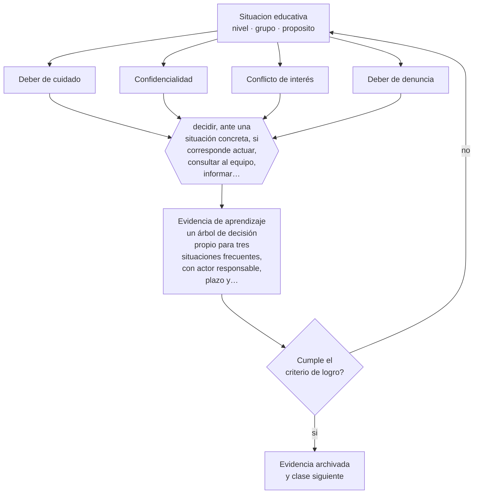

# Clase 004 — Ética profesional docente

> **Parte 00 · Fundamentos de la educación** — clase 4 de 12

**Estado de evidencia:** `MARCO-NORMATIVO` · **Etapa:** 🟢 Etapa A — Fundamentos · **Población de referencia:** transversal a todo el sistema educativo 
**Decisión que habilita:** decidir, ante una situación concreta, si corresponde actuar, consultar al equipo, informar formalmente o denunciar 
**Evidencia de aprendizaje:** un árbol de decisión propio para tres situaciones frecuentes, con actor responsable, plazo y registro en cada rama

## 🎯 Propósito

Delimitar el ejercicio ético del rol docente: qué se puede decidir, qué se debe consultar, qué se debe informar y qué está prohibido. La ética profesional no es una lista de buenas intenciones, sino un conjunto de deberes exigibles con consecuencias reales.

## 📚 Resultados de aprendizaje

Al finalizar esta clase podrás:

1. **Definir** con precisión los cuatro conceptos centrales de la clase y reconocerlos en una situación educativa real, no solo en su enunciado.
2. **Explicar** dónde termina el criterio profesional del docente y dónde empieza una obligación que no admite interpretación.
3. **Decidir** —decidir, ante una situación concreta, si corresponde actuar, consultar al equipo, informar formalmente o denunciar— y sostener la decisión con un fundamento escrito.
4. **Producir** la evidencia de la clase —un árbol de decisión propio para tres situaciones frecuentes, con actor responsable, plazo y registro en cada rama— y contrastarla contra el criterio de logro.
5. **Distinguir** lo que la evidencia sostiene de lo que es práctica instalada, preferencia personal o costumbre de la institución.

## 🧩 Conceptos centrales

| Concepto | Comprensión verificable |
|---|---|
| **Deber de cuidado** | obligación de proteger la integridad física y psicológica de los estudiantes a cargo |
| **Confidencialidad** | resguardo de la información sensible del estudiante, con sus excepciones legales explícitas |
| **Conflicto de interés** | situación en que un interés personal puede afectar la imparcialidad de una decisión profesional |
| **Deber de denuncia** | obligación legal de poner en conocimiento de la autoridad hechos que puedan constituir delito |

## 🗺️ Flujo de razonamiento

## 📖 Desarrollo

### 1. El fondo del asunto

La docencia es una profesión con asimetría de poder sobre personas que en muchos casos son menores de edad. Esa asimetría genera deberes que no dependen de la voluntad ni del estilo personal: proteger, no dañar, no aprovechar la posición, resguardar información y denunciar cuando corresponde. En Chile, además, existen plazos legales para denunciar hechos que pueden constituir delito contra un menor, y el incumplimiento tiene consecuencias para el funcionario y para el establecimiento.

### 2. Cómo se traduce en decisiones de enseñanza

La competencia que esta clase entrena es de clasificación rápida: distinguir un problema pedagógico, un conflicto de convivencia, una falta reglamentaria y una posible vulneración de derechos. Cada categoría activa una respuesta distinta y con distinto plazo. Un docente que trata una posible vulneración como conflicto entre pares comete un error grave; y quien activa protocolos de vulneración ante cualquier conflicto desgasta el sistema y expone innecesariamente al estudiante.

### 3. Qué sostiene la evidencia y qué no

El marco legal define pisos, no techos, y cambia. Lo que aquí se enseña es el razonamiento; la norma específica —plazos, formularios, autoridad competente— debe verificarse en su versión vigente antes de aplicarse. Existe además una zona genuinamente gris, donde profesionales competentes discrepan de buena fe: para esa zona el resguardo es el registro escrito, la consulta al equipo y la decisión documentada.

> **Cómo leer el estado de evidencia `MARCO-NORMATIVO`.** El contenido no se decide por evidencia empírica sino por norma, política pública o marco institucional vigente. Verifica siempre la versión vigente a la fecha en que vas a aplicarlo: la norma cambia y la clase no se actualiza sola.

## 🧪 Taller guiado

Aplica la clase a **uno** de los contextos siguientes y repite después el ejercicio en un
contexto de exigencia distinta. Cambiar de contexto es parte del aprendizaje: lo que funciona
con un grupo no se traslada intacto a otro.

| Contexto | Rasgo que cambia la decisión |
|---|---|
| Educación parvularia | el aprendizaje se juega en el ambiente y la interacción, no en la instrucción |
| Educación básica | alfabetización inicial y construcción de hábitos de estudio |
| Educación media | identidad, sentido y proyección hacia el egreso |
| Educación técnico-profesional | el desempeño se demuestra en tareas del oficio |
| Educación de adultos | experiencia previa, tiempo escaso y motivación instrumental |
| Educación superior | autonomía exigida y contenido disciplinar denso |

**Secuencia de trabajo:**

1. Delimita el contexto: nivel, edad, tamaño del grupo, asignatura o experiencia y tiempo real disponible.
2. Declara qué saben ya los estudiantes y **cómo lo comprobaste**, no cómo lo supones.
3. Formula la decisión pedagógica que esta clase habilita y escribe su fundamento.
4. Anticipa qué observarías si la decisión funciona y qué observarías si no funciona.
5. Diseña de antemano la alternativa que aplicarás si la primera estrategia falla.
6. Ejecuta o simula, y registra lo observado con fecha, contexto y evidencia concreta.
7. Produce la evidencia de aprendizaje de la clase.
8. Contrástala contra el criterio de logro, corrige y recién entonces avanza.

### 📦 Evidencia de aprendizaje

Un árbol de decisión propio para tres situaciones frecuentes, con actor responsable, plazo y registro en cada rama.

Debe incluir contexto, decisión, fundamento, fuentes consultadas con su fecha, indicador de
logro observable, riesgos previstos y qué harías distinto en la siguiente iteración.

## 🏆 Reto verificable

Construye tu árbol de decisión y somételo a un colega con más años de ejercicio. Registra en qué punto discrepan y verifica cuál de las dos versiones se ajusta a la norma vigente.

## ✅ Criterio de logro

- [ ] cada rama del árbol identifica actor, plazo y registro, no solo la acción;
- [ ] se distingue con claridad lo que es obligación legal de lo que es buena práctica profesional;
- [ ] cada afirmación sobre «lo que funciona» está atribuida a una fuente identificable, con autor y fecha;
- [ ] la decisión es ejecutable con el tiempo, el espacio, el número de estudiantes y los recursos que realmente tienes;
- [ ] la evidencia queda archivada de forma reproducible: otra persona podría revisarla sin que tú se la expliques.

## ⚠️ Errores frecuentes

**Propios de esta clase:**

- Prometer confidencialidad absoluta a un estudiante antes de saber qué va a contar.
- Resolver en solitario una situación que la norma exige derivar, por temor a exponer al estudiante.

**Característicos de la parte 00:**

- Tomar decisiones técnicas sin explicitar el fin educativo que las justifica.
- Confundir una tradición pedagógica con una moda reciente por desconocer su historia.

## ♿ Diversidad, accesibilidad y ética

Las situaciones éticas más difíciles suelen involucrar a estudiantes en mayor vulnerabilidad: migrantes sin red de apoyo, estudiantes con discapacidad que dependen de terceros para comunicar, jóvenes cuya identidad no es aceptada en su casa. La regla es que el resguardo aumenta cuando aumenta la dependencia, y que nunca se comunica información sensible sin evaluar el riesgo para la persona.

Antes de aplicar cualquier decisión de esta clase con estudiantes reales, revisa el
[protocolo de práctica responsable](../../../docs/ETICA_Y_PRACTICA_RESPONSABLE.md):
consentimiento, resguardo de datos personales, proporcionalidad de la intervención y derecho
de cada estudiante a no ser objeto de un ensayo que no le reporta beneficio.

## ❓ Preguntas de comprobación

1. ¿Qué harías si un estudiante te pide que no cuentes algo antes de contártelo?
2. ¿Cuál es el plazo legal para denunciar en tu jurisdicción, y dónde lo verificaste?
3. ¿Qué registro dejarías hoy que te permitiría explicar tu decisión dentro de un año?

## 📕 Lecturas base

**Campbell, E. (2003). *The Ethical Teacher*.**  
*Qué aporta a esta clase:* documenta la ética docente como práctica cotidiana y no como código abstracto; útil para reconocer dilemas reales.

**Mineduc. *Marco para la Buena Enseñanza* (versión vigente) y normativa de convivencia escolar.**  
*Qué aporta a esta clase:* define los estándares profesionales exigibles en Chile y sus obligaciones asociadas.

Catálogo completo: [bibliografía del programa](../../../docs/BIBLIOGRAFIA.md) ·
[glosario](../../../docs/GLOSARIO.md) ·
[fuentes oficiales y cómo leerlas](../../../docs/FUENTES.md).

## 🔗 Conexión con el resto del programa

Es el piso ético del programa completo y se aplica en cada clase mediante el protocolo de práctica responsable. Se profundiza en la parte 12 (protocolos y crisis) y en la parte 16 (ética de la investigación con personas).

> [!IMPORTANT]
> Material de formación profesional. No reemplaza un título de pedagogía, una habilitación
> legal para ejercer, ni el juicio de un equipo educativo que conoce a sus estudiantes.

---

| Anterior | Índice | Siguiente |
|---|---|---|
| [← 003 · Filosofía de la educación](../class-03-filosofia-de-la-educacion/README.md) | [Parte 00](../README.md) · [Programa](../../../README.md) | [005 · Sistemas educativos comparados →](../class-05-sistemas-educativos-comparados/README.md) |
