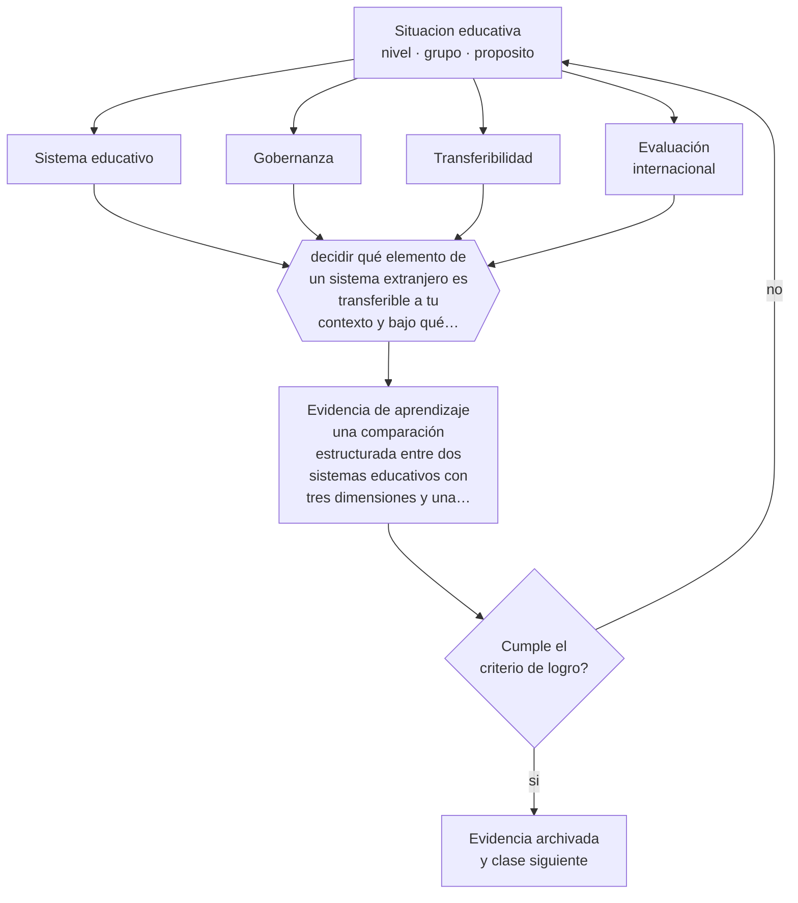

# Clase 005 — Sistemas educativos comparados

> **Parte 00 · Fundamentos de la educación** — clase 5 de 12

**Estado de evidencia:** `CONSISTENTE` · **Etapa:** 🟢 Etapa A — Fundamentos · **Población de referencia:** transversal a todo el sistema educativo 
**Decisión que habilita:** decidir qué elemento de un sistema extranjero es transferible a tu contexto y bajo qué condiciones 
**Evidencia de aprendizaje:** una comparación estructurada entre dos sistemas educativos con tres dimensiones y una conclusión sobre transferibilidad

## 🎯 Propósito

Leer comparaciones internacionales sin caer en el uso más frecuente que se les da: importar la política de un país exitoso ignorando las condiciones que la hicieron funcionar allí. Comparar sirve para entender mecanismos, no para copiar recetas.

## 📚 Resultados de aprendizaje

Al finalizar esta clase podrás:

1. **Definir** con precisión los cuatro conceptos centrales de la clase y reconocerlos en una situación educativa real, no solo en su enunciado.
2. **Explicar** qué se puede y qué no se puede concluir al comparar sistemas educativos de países distintos.
3. **Decidir** —qué elemento de un sistema extranjero es transferible a tu contexto y bajo qué condiciones— y sostener la decisión con un fundamento escrito.
4. **Producir** la evidencia de la clase —una comparación estructurada entre dos sistemas educativos con tres dimensiones y una conclusión sobre transferibilidad— y contrastarla contra el criterio de logro.
5. **Distinguir** lo que la evidencia sostiene de lo que es práctica instalada, preferencia personal o costumbre de la institución.

## 🧩 Conceptos centrales

| Concepto | Comprensión verificable |
|---|---|
| **Sistema educativo** | conjunto articulado de niveles, instituciones, financiamiento, currículo y regulación de un país |
| **Gobernanza** | distribución de la autoridad para decidir sobre currículo, financiamiento, personal y evaluación |
| **Transferibilidad** | grado en que una política funciona fuera de las condiciones en que fue diseñada |
| **Evaluación internacional** | estudio comparado que mide desempeños con instrumentos comunes entre países |

## 🗺️ Flujo de razonamiento

## 📖 Desarrollo

### 1. El fondo del asunto

Los sistemas educativos se diferencian en pocas dimensiones que explican mucho: quién financia y cómo, quién decide el currículo, cómo se selecciona y forma a los docentes, cuándo se separa a los estudiantes por trayectorias y cómo se rinde cuenta de los resultados. Comparar bien significa comparar esas dimensiones, no anécdotas. Y significa incorporar el contexto: la política finlandesa de confianza en el docente descansa en una selección universitaria altamente competitiva y en una profesión de alto estatus social, condiciones que no se importan con un decreto.

### 2. Cómo se traduce en decisiones de enseñanza

En Chile, la comparación tiene un uso profesional concreto: entender que el sistema combina provisión pública y privada con financiamiento por subvención, evaluación externa nacional y un marco curricular común. Cada uno de esos rasgos tiene análogos y contrastes internacionales que ayudan a discutir reformas con argumentos y no con impresiones. La regla de trabajo es explicitar siempre qué condición local haría que el mecanismo importado funcione o fracase.

### 3. Qué sostiene la evidencia y qué no

Las evaluaciones internacionales miden un subconjunto acotado de aprendizajes y su comparabilidad depende de supuestos técnicos fuertes —traducción, equivalencia de ítems, muestreo, exclusiones—. Los rankings amplifican diferencias que muchas veces no son estadísticamente significativas. Sirven para detectar tendencias y desigualdades internas de un país; no sirven para afirmar que un sistema es mejor que otro en sentido global.

> **Cómo leer el estado de evidencia `CONSISTENTE`.** La evidencia es amplia y coherente, pero proviene sobre todo de estudios correlacionales, de síntesis con heterogeneidad alta o de contextos distintos al tuyo. Sirve para orientar la decisión y exige que compruebes el efecto en tu propio grupo.

## 🧪 Taller guiado

Aplica la clase a **uno** de los contextos siguientes y repite después el ejercicio en un
contexto de exigencia distinta. Cambiar de contexto es parte del aprendizaje: lo que funciona
con un grupo no se traslada intacto a otro.

| Contexto | Rasgo que cambia la decisión |
|---|---|
| Educación parvularia | el aprendizaje se juega en el ambiente y la interacción, no en la instrucción |
| Educación básica | alfabetización inicial y construcción de hábitos de estudio |
| Educación media | identidad, sentido y proyección hacia el egreso |
| Educación técnico-profesional | el desempeño se demuestra en tareas del oficio |
| Educación de adultos | experiencia previa, tiempo escaso y motivación instrumental |
| Educación superior | autonomía exigida y contenido disciplinar denso |

**Secuencia de trabajo:**

1. Delimita el contexto: nivel, edad, tamaño del grupo, asignatura o experiencia y tiempo real disponible.
2. Declara qué saben ya los estudiantes y **cómo lo comprobaste**, no cómo lo supones.
3. Formula la decisión pedagógica que esta clase habilita y escribe su fundamento.
4. Anticipa qué observarías si la decisión funciona y qué observarías si no funciona.
5. Diseña de antemano la alternativa que aplicarás si la primera estrategia falla.
6. Ejecuta o simula, y registra lo observado con fecha, contexto y evidencia concreta.
7. Produce la evidencia de aprendizaje de la clase.
8. Contrástala contra el criterio de logro, corrige y recién entonces avanza.

### 📦 Evidencia de aprendizaje

Una comparación estructurada entre dos sistemas educativos con tres dimensiones y una conclusión sobre transferibilidad.

Debe incluir contexto, decisión, fundamento, fuentes consultadas con su fecha, indicador de
logro observable, riesgos previstos y qué harías distinto en la siguiente iteración.

## 🏆 Reto verificable

Elige una política educativa extranjera que te parezca atractiva. Identifica las tres condiciones que la sostienen en su origen y evalúa, con evidencia local, cuáles existen en tu contexto y cuáles no.

## ✅ Criterio de logro

- [ ] la comparación usa dimensiones estructurales y no anécdotas de aula;
- [ ] la conclusión sobre transferibilidad declara qué condición local sería indispensable;
- [ ] cada afirmación sobre «lo que funciona» está atribuida a una fuente identificable, con autor y fecha;
- [ ] la decisión es ejecutable con el tiempo, el espacio, el número de estudiantes y los recursos que realmente tienes;
- [ ] la evidencia queda archivada de forma reproducible: otra persona podría revisarla sin que tú se la expliques.

## ⚠️ Errores frecuentes

**Propios de esta clase:**

- Importar una política sin las condiciones institucionales que la sostienen en su país de origen.
- Leer el ranking y no la diferencia estadística ni el intervalo de confianza.

**Característicos de la parte 00:**

- Tomar decisiones técnicas sin explicitar el fin educativo que las justifica.
- Confundir una tradición pedagógica con una moda reciente por desconocer su historia.

## ♿ Diversidad, accesibilidad y ética

Los promedios nacionales esconden las brechas que más importan. Un sistema con buen promedio puede tener resultados muy desiguales por origen socioeconómico, ruralidad, género o condición de discapacidad. Toda comparación seria reporta dispersión y brechas, no solo posición en la tabla.

Antes de aplicar cualquier decisión de esta clase con estudiantes reales, revisa el
[protocolo de práctica responsable](../../../docs/ETICA_Y_PRACTICA_RESPONSABLE.md):
consentimiento, resguardo de datos personales, proporcionalidad de la intervención y derecho
de cada estudiante a no ser objeto de un ensayo que no le reporta beneficio.

## ❓ Preguntas de comprobación

1. ¿Qué condición institucional hace funcionar en su país la política que te gustaría importar?
2. ¿Qué mide y qué no mide la evaluación internacional que estás citando?
3. ¿Qué diferencia de puntaje entre dos países es realmente distinguible del error de medición?

## 📕 Lecturas base

**OCDE. *Education at a Glance* (edición vigente).**  
*Qué aporta a esta clase:* compendio anual comparado de indicadores; úsalo por sus definiciones y notas metodológicas, no solo por sus tablas.

**Sahlberg, P. (2011). *Finnish Lessons*.**  
*Qué aporta a esta clase:* caso paradigmático de sistema admirado; léelo prestando atención a las condiciones históricas que el propio autor describe.

Catálogo completo: [bibliografía del programa](../../../docs/BIBLIOGRAFIA.md) ·
[glosario](../../../docs/GLOSARIO.md) ·
[fuentes oficiales y cómo leerlas](../../../docs/FUENTES.md).

## 🔗 Conexión con el resto del programa

Da contexto a la clase 011 sobre calidad y equidad, y al material de `international-education/`. Se usa de nuevo en la parte 15, cuando una institución quiere adoptar un modelo de gestión de otro país.

> [!IMPORTANT]
> Material de formación profesional. No reemplaza un título de pedagogía, una habilitación
> legal para ejercer, ni el juicio de un equipo educativo que conoce a sus estudiantes.

---

| Anterior | Índice | Siguiente |
|---|---|---|
| [← 004 · Ética profesional docente](../class-04-etica-profesional-docente/README.md) | [Parte 00](../README.md) · [Programa](../../../README.md) | [006 · Educación formal, no formal e informal →](../class-06-educacion-formal-no-formal-e-informal/README.md) |
