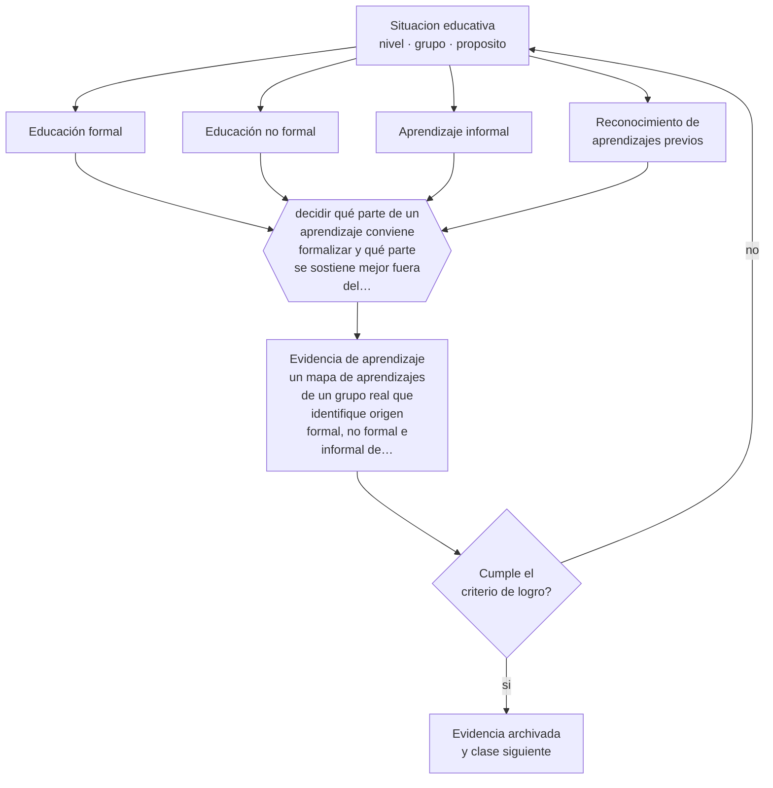

# Clase 006 — Educación formal, no formal e informal

> **Parte 00 · Fundamentos de la educación** — clase 6 de 12

**Estado de evidencia:** `CONSISTENTE` · **Etapa:** 🟢 Etapa A — Fundamentos · **Población de referencia:** transversal a todo el sistema educativo 
**Decisión que habilita:** decidir qué parte de un aprendizaje conviene formalizar y qué parte se sostiene mejor fuera del aula 
**Evidencia de aprendizaje:** un mapa de aprendizajes de un grupo real que identifique origen formal, no formal e informal de sus competencias actuales

## 🎯 Propósito

Reconocer los tres ámbitos donde ocurre el aprendizaje —formal, no formal e informal— y usar esa distinción para diseñar mejor: la escuela no compite con ellos, se apoya en ellos o los ignora en su perjuicio.

## 📚 Resultados de aprendizaje

Al finalizar esta clase podrás:

1. **Definir** con precisión los cuatro conceptos centrales de la clase y reconocerlos en una situación educativa real, no solo en su enunciado.
2. **Explicar** por qué buena parte de lo que la gente sabe hacer no lo aprendió en una sala de clases.
3. **Decidir** —qué parte de un aprendizaje conviene formalizar y qué parte se sostiene mejor fuera del aula— y sostener la decisión con un fundamento escrito.
4. **Producir** la evidencia de la clase —un mapa de aprendizajes de un grupo real que identifique origen formal, no formal e informal de sus competencias actuales— y contrastarla contra el criterio de logro.
5. **Distinguir** lo que la evidencia sostiene de lo que es práctica instalada, preferencia personal o costumbre de la institución.

## 🧩 Conceptos centrales

| Concepto | Comprensión verificable |
|---|---|
| **Educación formal** | la que conduce a certificación reconocida dentro del sistema escolar o superior |
| **Educación no formal** | actividad educativa organizada e intencionada fuera del sistema reglado; suele certificar sin conducir a grado |
| **Aprendizaje informal** | el que ocurre en la vida cotidiana sin intención educativa explícita ni estructura |
| **Reconocimiento de aprendizajes previos** | procedimiento que valida competencias adquiridas fuera del sistema formal |

## 🗺️ Flujo de razonamiento

## 📖 Desarrollo

### 1. El fondo del asunto

La distinción importa porque cambia el diseño. En lo formal se controla secuencia, tiempo y evaluación; en lo no formal se controla el propósito pero no la trayectoria previa; en lo informal no se controla nada, y sin embargo allí se aprende el idioma materno, buena parte del oficio y casi todas las competencias sociales. Un docente que desconoce lo que sus estudiantes ya aprendieron fuera enseña sobre un vacío inexistente, y suele confundir falta de escolarización con falta de conocimiento.

### 2. Cómo se traduce en decisiones de enseñanza

La aplicación más rentable es diagnóstica: preguntar deliberadamente qué sabe hacer el grupo por fuera del currículo y usarlo como anclaje. En educación técnica y de adultos esto es determinante, porque muchos estudiantes llegan con competencias reales sin certificación; ahí los procedimientos de reconocimiento de aprendizajes previos evitan repetir lo que ya se domina y liberan tiempo para lo que falta.

### 3. Qué sostiene la evidencia y qué no

El aprendizaje informal es potente pero desigual y a veces erróneo: quien aprendió una técnica mal la sostiene con mucha convicción, y las oportunidades de aprendizaje informal están distribuidas de forma injusta. Apoyarse en él sin verificarlo puede consolidar errores y ampliar brechas. La regla es reconocerlo, comprobarlo y corregirlo, en ese orden.

> **Cómo leer el estado de evidencia `CONSISTENTE`.** La evidencia es amplia y coherente, pero proviene sobre todo de estudios correlacionales, de síntesis con heterogeneidad alta o de contextos distintos al tuyo. Sirve para orientar la decisión y exige que compruebes el efecto en tu propio grupo.

## 🧪 Taller guiado

Aplica la clase a **uno** de los contextos siguientes y repite después el ejercicio en un
contexto de exigencia distinta. Cambiar de contexto es parte del aprendizaje: lo que funciona
con un grupo no se traslada intacto a otro.

| Contexto | Rasgo que cambia la decisión |
|---|---|
| Educación parvularia | el aprendizaje se juega en el ambiente y la interacción, no en la instrucción |
| Educación básica | alfabetización inicial y construcción de hábitos de estudio |
| Educación media | identidad, sentido y proyección hacia el egreso |
| Educación técnico-profesional | el desempeño se demuestra en tareas del oficio |
| Educación de adultos | experiencia previa, tiempo escaso y motivación instrumental |
| Educación superior | autonomía exigida y contenido disciplinar denso |

**Secuencia de trabajo:**

1. Delimita el contexto: nivel, edad, tamaño del grupo, asignatura o experiencia y tiempo real disponible.
2. Declara qué saben ya los estudiantes y **cómo lo comprobaste**, no cómo lo supones.
3. Formula la decisión pedagógica que esta clase habilita y escribe su fundamento.
4. Anticipa qué observarías si la decisión funciona y qué observarías si no funciona.
5. Diseña de antemano la alternativa que aplicarás si la primera estrategia falla.
6. Ejecuta o simula, y registra lo observado con fecha, contexto y evidencia concreta.
7. Produce la evidencia de aprendizaje de la clase.
8. Contrástala contra el criterio de logro, corrige y recién entonces avanza.

### 📦 Evidencia de aprendizaje

Un mapa de aprendizajes de un grupo real que identifique origen formal, no formal e informal de sus competencias actuales.

Debe incluir contexto, decisión, fundamento, fuentes consultadas con su fecha, indicador de
logro observable, riesgos previstos y qué harías distinto en la siguiente iteración.

## 🏆 Reto verificable

Diseña una actividad de diagnóstico de diez minutos que revele aprendizajes previos no escolares relevantes para tu asignatura, y define qué harás con esa información en la clase siguiente.

## ✅ Criterio de logro

- [ ] el mapa identifica al menos un aprendizaje relevante de cada uno de los tres ámbitos;
- [ ] se declara cómo se comprobó el aprendizaje previo y no solo cómo se supuso;
- [ ] cada afirmación sobre «lo que funciona» está atribuida a una fuente identificable, con autor y fecha;
- [ ] la decisión es ejecutable con el tiempo, el espacio, el número de estudiantes y los recursos que realmente tienes;
- [ ] la evidencia queda archivada de forma reproducible: otra persona podría revisarla sin que tú se la expliques.

## ⚠️ Errores frecuentes

**Propios de esta clase:**

- Suponer que lo que no fue enseñado formalmente no fue aprendido.
- Dar por válido un aprendizaje previo sin comprobar su calidad ni su alcance real.

**Característicos de la parte 00:**

- Tomar decisiones técnicas sin explicitar el fin educativo que las justifica.
- Confundir una tradición pedagógica con una moda reciente por desconocer su historia.

## ♿ Diversidad, accesibilidad y ética

Los estudiantes con trayectorias interrumpidas, migrantes y adultos que retoman estudios suelen traer aprendizajes valiosos y desconocidos por la institución. Ignorarlos produce desmotivación inmediata; reconocerlos formalmente es una de las medidas de inclusión más efectivas y menos costosas que existen.

Antes de aplicar cualquier decisión de esta clase con estudiantes reales, revisa el
[protocolo de práctica responsable](../../../docs/ETICA_Y_PRACTICA_RESPONSABLE.md):
consentimiento, resguardo de datos personales, proporcionalidad de la intervención y derecho
de cada estudiante a no ser objeto de un ensayo que no le reporta beneficio.

## ❓ Preguntas de comprobación

1. ¿Qué sabe hacer tu grupo que nunca le enseñó la escuela?
2. ¿Qué contenido estás enseñando desde cero que parte del curso ya domina por otra vía?
3. ¿Cómo verificarías un aprendizaje adquirido fuera del sistema sin humillar a quien lo trae?

## 📕 Lecturas base

**Coombs, P. & Ahmed, M. (1974). *Attacking Rural Poverty: How Nonformal Education Can Help*.**  
*Qué aporta a esta clase:* origen de la distinción formal / no formal / informal y de su utilidad para políticas educativas.

**UNESCO. *Directrices para el reconocimiento, validación y acreditación de los resultados del aprendizaje no formal e informal*.**  
*Qué aporta a esta clase:* marco internacional de referencia para validar competencias adquiridas fuera del sistema reglado.

Catálogo completo: [bibliografía del programa](../../../docs/BIBLIOGRAFIA.md) ·
[glosario](../../../docs/GLOSARIO.md) ·
[fuentes oficiales y cómo leerlas](../../../docs/FUENTES.md).

## 🔗 Conexión con el resto del programa

Es la base de la parte 07 (educación de adultos) y de la parte 06 (reconocimiento de aprendizajes previos en formación técnica). Complementa la clase 001 al mostrar que el aprendizaje excede a la enseñanza.

> [!IMPORTANT]
> Material de formación profesional. No reemplaza un título de pedagogía, una habilitación
> legal para ejercer, ni el juicio de un equipo educativo que conoce a sus estudiantes.

---

| Anterior | Índice | Siguiente |
|---|---|---|
| [← 005 · Sistemas educativos comparados](../class-05-sistemas-educativos-comparados/README.md) | [Parte 00](../README.md) · [Programa](../../../README.md) | [007 · Derecho a la educación →](../class-07-derecho-a-la-educacion/README.md) |
