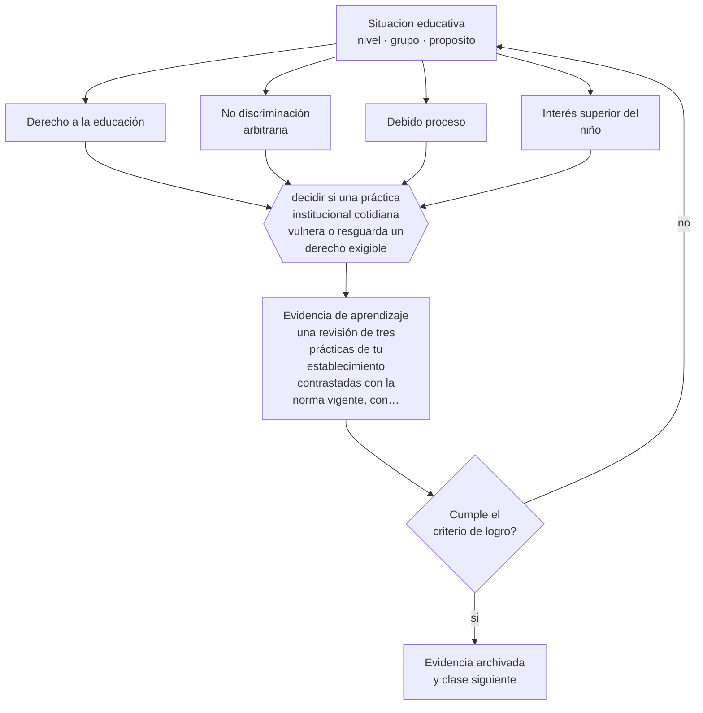

# Clase 007 — Derecho a la educación

> **Parte 00 · Fundamentos de la educación** — clase 7 de 12

**Estado de evidencia:** `MARCO-NORMATIVO` · **Etapa:** 🟢 Etapa A — Fundamentos · **Población de referencia:** transversal a todo el sistema educativo 
**Decisión que habilita:** decidir si una práctica institucional cotidiana vulnera o resguarda un derecho exigible 
**Evidencia de aprendizaje:** una revisión de tres prácticas de tu establecimiento contrastadas con la norma vigente, con brechas y plan de corrección

## 🎯 Propósito

Traducir el derecho a la educación desde el enunciado general a las obligaciones exigibles que rigen tu práctica: acceso, permanencia, no discriminación, participación y debido proceso.

## 📚 Resultados de aprendizaje

Al finalizar esta clase podrás:

1. **Definir** con precisión los cuatro conceptos centrales de la clase y reconocerlos en una situación educativa real, no solo en su enunciado.
2. **Explicar** qué obligaciones concretas genera para tu institución el hecho de que la educación sea un derecho y no un servicio.
3. **Decidir** —si una práctica institucional cotidiana vulnera o resguarda un derecho exigible— y sostener la decisión con un fundamento escrito.
4. **Producir** la evidencia de la clase —una revisión de tres prácticas de tu establecimiento contrastadas con la norma vigente, con brechas y plan de corrección— y contrastarla contra el criterio de logro.
5. **Distinguir** lo que la evidencia sostiene de lo que es práctica instalada, preferencia personal o costumbre de la institución.

## 🧩 Conceptos centrales

| Concepto | Comprensión verificable |
|---|---|
| **Derecho a la educación** | garantía exigible de acceso, permanencia y calidad, con obligaciones para el Estado y los sostenedores |
| **No discriminación arbitraria** | prohibición de tratar de forma desigual sin justificación razonable y proporcional |
| **Debido proceso** | conjunto de garantías —información, defensa, plazos, proporcionalidad— antes de una sanción |
| **Interés superior del niño** | criterio que obliga a considerar primero el bienestar del estudiante en toda decisión que lo afecte |

## 🗺️ Flujo de razonamiento

## 📖 Desarrollo

### 1. El fondo del asunto

Que la educación sea un derecho cambia la naturaleza de las decisiones escolares: dejan de ser potestades discrecionales del establecimiento y pasan a ser actos que deben poder justificarse. Cancelar una matrícula, aplicar una suspensión, negar la participación en una actividad o condicionar el acceso a un apoyo son decisiones revisables. En Chile, la Ley General de Educación, la Ley de Inclusión y la normativa de la Superintendencia de Educación fijan obligaciones concretas y vías de reclamo para las familias.

### 2. Cómo se traduce en decisiones de enseñanza

El uso profesional de esta clase es preventivo. Antes de aplicar una medida, se comprueban cuatro cosas: si está contemplada en el reglamento interno, si se informó previamente, si es proporcional a la falta y si el estudiante tuvo oportunidad de ser oído. Una medida que falla en cualquiera de esas cuatro es revocable, y su revocación posterior daña más la autoridad del establecimiento que no haberla aplicado.

### 3. Qué sostiene la evidencia y qué no

El derecho fija el marco, no resuelve los conflictos entre derechos: el derecho de un estudiante a permanecer puede tensionarse con el derecho de sus compañeros a un ambiente seguro. Esos casos exigen ponderación fundada, no aplicación automática de una regla. Además, la normativa cambia: cualquier afirmación normativa de esta clase debe verificarse en su versión vigente antes de usarse en una decisión real.

> **Cómo leer el estado de evidencia `MARCO-NORMATIVO`.** El contenido no se decide por evidencia empírica sino por norma, política pública o marco institucional vigente. Verifica siempre la versión vigente a la fecha en que vas a aplicarlo: la norma cambia y la clase no se actualiza sola.

## 🧪 Taller guiado

Aplica la clase a **uno** de los contextos siguientes y repite después el ejercicio en un
contexto de exigencia distinta. Cambiar de contexto es parte del aprendizaje: lo que funciona
con un grupo no se traslada intacto a otro.

| Contexto | Rasgo que cambia la decisión |
|---|---|
| Educación parvularia | el aprendizaje se juega en el ambiente y la interacción, no en la instrucción |
| Educación básica | alfabetización inicial y construcción de hábitos de estudio |
| Educación media | identidad, sentido y proyección hacia el egreso |
| Educación técnico-profesional | el desempeño se demuestra en tareas del oficio |
| Educación de adultos | experiencia previa, tiempo escaso y motivación instrumental |
| Educación superior | autonomía exigida y contenido disciplinar denso |

**Secuencia de trabajo:**

1. Delimita el contexto: nivel, edad, tamaño del grupo, asignatura o experiencia y tiempo real disponible.
2. Declara qué saben ya los estudiantes y **cómo lo comprobaste**, no cómo lo supones.
3. Formula la decisión pedagógica que esta clase habilita y escribe su fundamento.
4. Anticipa qué observarías si la decisión funciona y qué observarías si no funciona.
5. Diseña de antemano la alternativa que aplicarás si la primera estrategia falla.
6. Ejecuta o simula, y registra lo observado con fecha, contexto y evidencia concreta.
7. Produce la evidencia de aprendizaje de la clase.
8. Contrástala contra el criterio de logro, corrige y recién entonces avanza.

### 📦 Evidencia de aprendizaje

Una revisión de tres prácticas de tu establecimiento contrastadas con la norma vigente, con brechas y plan de corrección.

Debe incluir contexto, decisión, fundamento, fuentes consultadas con su fecha, indicador de
logro observable, riesgos previstos y qué harías distinto en la siguiente iteración.

## 🏆 Reto verificable

Toma el reglamento interno de un establecimiento real y localiza una disposición que sea incompatible con la normativa vigente. Redacta la propuesta de modificación con su fundamento legal.

## ✅ Criterio de logro

- [ ] cada brecha detectada cita la norma o el instrumento institucional que la define;
- [ ] el plan de corrección tiene responsable, plazo y forma de verificación;
- [ ] cada afirmación sobre «lo que funciona» está atribuida a una fuente identificable, con autor y fecha;
- [ ] la decisión es ejecutable con el tiempo, el espacio, el número de estudiantes y los recursos que realmente tienes;
- [ ] la evidencia queda archivada de forma reproducible: otra persona podría revisarla sin que tú se la expliques.

## ⚠️ Errores frecuentes

**Propios de esta clase:**

- Aplicar sanciones no contempladas en el reglamento interno vigente.
- Tratar la exclusión de una actividad como medida pedagógica sin evaluar su proporcionalidad.

**Característicos de la parte 00:**

- Tomar decisiones técnicas sin explicitar el fin educativo que las justifica.
- Confundir una tradición pedagógica con una moda reciente por desconocer su historia.

## ♿ Diversidad, accesibilidad y ética

El derecho a la educación se vulnera con más frecuencia respecto de estudiantes migrantes, con discapacidad, embarazadas o en situación de vulneración. Revisar prácticas institucionales con este foco suele revelar barreras administrativas —documentación exigida, cupos, condiciones de permanencia— que operan como discriminación indirecta.

Antes de aplicar cualquier decisión de esta clase con estudiantes reales, revisa el
[protocolo de práctica responsable](../../../docs/ETICA_Y_PRACTICA_RESPONSABLE.md):
consentimiento, resguardo de datos personales, proporcionalidad de la intervención y derecho
de cada estudiante a no ser objeto de un ensayo que no le reporta beneficio.

## ❓ Preguntas de comprobación

1. ¿Qué medida frecuente en tu establecimiento no resistiría una revisión de proporcionalidad?
2. ¿Dónde puede reclamar formalmente una familia y qué plazo tiene la institución para responder?
3. ¿Cómo se documenta que un estudiante fue oído antes de una sanción?

## 📕 Lecturas base

**Naciones Unidas (1989). *Convención sobre los Derechos del Niño*, arts. 28 y 29.**  
*Qué aporta a esta clase:* fija el contenido del derecho a la educación y el criterio de interés superior; es derecho vigente en Chile.

**Biblioteca del Congreso Nacional de Chile. *Ley General de Educación* y *Ley de Inclusión Escolar*.**  
*Qué aporta a esta clase:* texto consolidado y vigente; consulta siempre la versión a la fecha en que aplicarás la medida.

Catálogo completo: [bibliografía del programa](../../../docs/BIBLIOGRAFIA.md) ·
[glosario](../../../docs/GLOSARIO.md) ·
[fuentes oficiales y cómo leerlas](../../../docs/FUENTES.md).

## 🔗 Conexión con el resto del programa

Sostiene la parte 08 (inclusión) y la parte 12 (convivencia y debido proceso). Vuelve en la parte 15, donde la responsabilidad por estas prácticas es del equipo directivo.

> [!IMPORTANT]
> Material de formación profesional. No reemplaza un título de pedagogía, una habilitación
> legal para ejercer, ni el juicio de un equipo educativo que conoce a sus estudiantes.

---

| Anterior | Índice | Siguiente |
|---|---|---|
| [← 006 · Educación formal, no formal e informal](../class-06-educacion-formal-no-formal-e-informal/README.md) | [Parte 00](../README.md) · [Programa](../../../README.md) | [008 · Rol social de la escuela →](../class-08-rol-social-de-la-escuela/README.md) |
