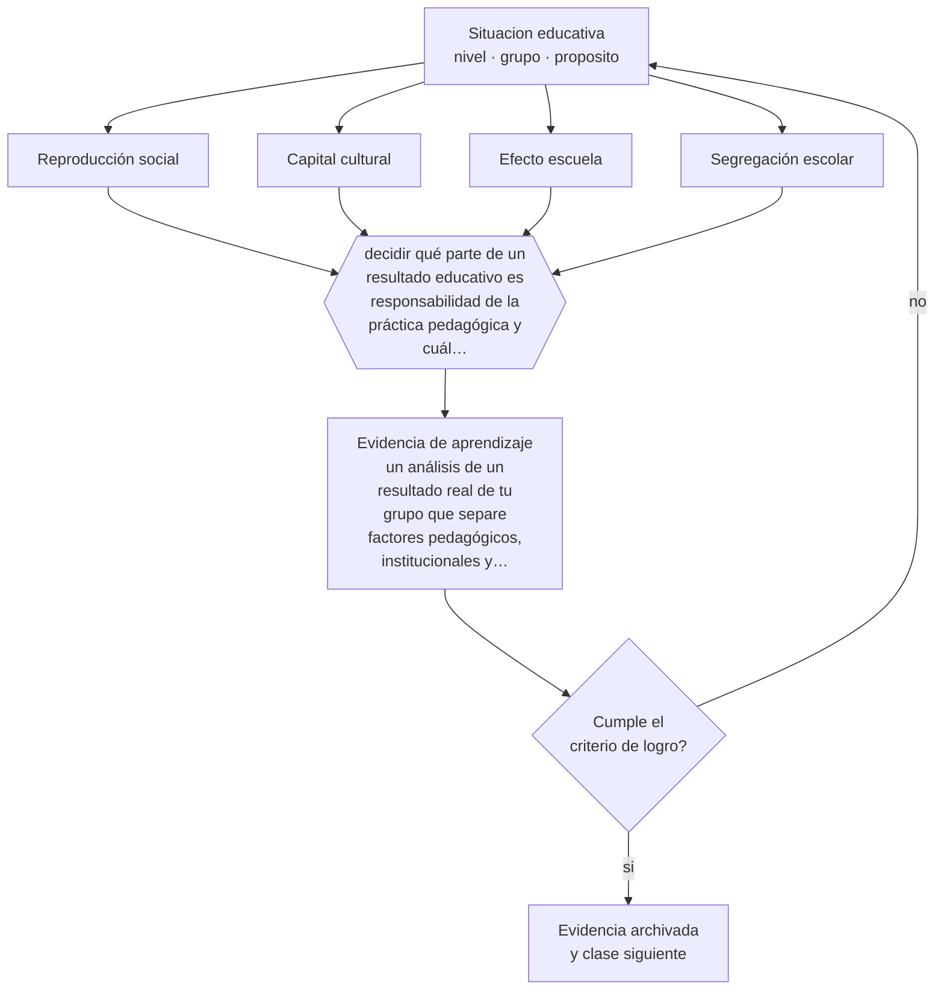

# Clase 008 — Rol social de la escuela

> **Parte 00 · Fundamentos de la educación** — clase 8 de 12

**Estado de evidencia:** `EN-DEBATE` · **Etapa:** 🟢 Etapa A — Fundamentos · **Población de referencia:** transversal a todo el sistema educativo 
**Decisión que habilita:** decidir qué parte de un resultado educativo es responsabilidad de la práctica pedagógica y cuál exige acción fuera del aula 
**Evidencia de aprendizaje:** un análisis de un resultado real de tu grupo que separe factores pedagógicos, institucionales y externos, con acciones para cada uno

## 🎯 Propósito

Situar el papel real de la escuela entre dos posiciones extremas: la que le atribuye poder para compensar cualquier desigualdad y la que la considera mera reproductora del orden social. Ambas fallan, y la diferencia importa para saber qué exigirle a un docente.

## 📚 Resultados de aprendizaje

Al finalizar esta clase podrás:

1. **Definir** con precisión los cuatro conceptos centrales de la clase y reconocerlos en una situación educativa real, no solo en su enunciado.
2. **Explicar** qué parte de los resultados escolares se explica por lo que hace la escuela y qué parte por lo que la escuela recibe.
3. **Decidir** —qué parte de un resultado educativo es responsabilidad de la práctica pedagógica y cuál exige acción fuera del aula— y sostener la decisión con un fundamento escrito.
4. **Producir** la evidencia de la clase —un análisis de un resultado real de tu grupo que separe factores pedagógicos, institucionales y externos, con acciones para cada uno— y contrastarla contra el criterio de logro.
5. **Distinguir** lo que la evidencia sostiene de lo que es práctica instalada, preferencia personal o costumbre de la institución.

## 🧩 Conceptos centrales

| Concepto | Comprensión verificable |
|---|---|
| **Reproducción social** | mecanismo por el cual la escuela transmite y legitima desigualdades de origen |
| **Capital cultural** | conjunto de disposiciones, códigos y saberes valorados por la escuela que no todos los hogares proveen |
| **Efecto escuela** | porción de la variación de resultados atribuible a lo que hace el establecimiento |
| **Segregación escolar** | concentración de estudiantes de origen socioeconómico similar en los mismos establecimientos |

## 🗺️ Flujo de razonamiento

## 📖 Desarrollo

### 1. El fondo del asunto

La investigación sobre efecto escuela muestra un resultado incómodo y estable: la mayor parte de la variación en resultados se asocia a características de los estudiantes y sus familias, y una porción menor pero real —y modificable— al establecimiento y al docente. Esa porción menor es exactamente el campo de acción profesional, y es suficiente para cambiar trayectorias individuales. Negarla lleva al fatalismo; exagerarla lleva a culpar al docente por desigualdades que se producen fuera de la escuela.

### 2. Cómo se traduce en decisiones de enseñanza

Aplicado a la práctica, esto obliga a distinguir tres planos ante un mal resultado: lo que depende de la enseñanza —claridad, secuencia, retroalimentación, tiempo efectivo—, lo que depende de la institución —asistencia, clima, recursos, estabilidad docente— y lo que depende del contexto —pobreza, salud, cuidado, migración—. Solo el primero se corrige mañana; el segundo se negocia; el tercero se articula con otros servicios. Confundirlos produce planes de mejora que fracasan por diseño.

### 3. Qué sostiene la evidencia y qué no

El tamaño del efecto escuela varía según sistema, nivel y forma de medirlo, y su estimación depende de supuestos discutidos. En sistemas altamente segregados, como el chileno, separar el efecto de la escuela del efecto de su composición social es técnicamente difícil. Por eso la clase se declara en debate: la existencia del efecto está bien establecida, su magnitud exacta no.

> **Cómo leer el estado de evidencia `EN-DEBATE`.** Hay desacuerdo activo y publicado entre especialistas competentes. La clase presenta las posiciones y sus argumentos; tu tarea no es escoger un bando, sino saber qué evidencia te haría cambiar de posición.

## 🧪 Taller guiado

Aplica la clase a **uno** de los contextos siguientes y repite después el ejercicio en un
contexto de exigencia distinta. Cambiar de contexto es parte del aprendizaje: lo que funciona
con un grupo no se traslada intacto a otro.

| Contexto | Rasgo que cambia la decisión |
|---|---|
| Educación parvularia | el aprendizaje se juega en el ambiente y la interacción, no en la instrucción |
| Educación básica | alfabetización inicial y construcción de hábitos de estudio |
| Educación media | identidad, sentido y proyección hacia el egreso |
| Educación técnico-profesional | el desempeño se demuestra en tareas del oficio |
| Educación de adultos | experiencia previa, tiempo escaso y motivación instrumental |
| Educación superior | autonomía exigida y contenido disciplinar denso |

**Secuencia de trabajo:**

1. Delimita el contexto: nivel, edad, tamaño del grupo, asignatura o experiencia y tiempo real disponible.
2. Declara qué saben ya los estudiantes y **cómo lo comprobaste**, no cómo lo supones.
3. Formula la decisión pedagógica que esta clase habilita y escribe su fundamento.
4. Anticipa qué observarías si la decisión funciona y qué observarías si no funciona.
5. Diseña de antemano la alternativa que aplicarás si la primera estrategia falla.
6. Ejecuta o simula, y registra lo observado con fecha, contexto y evidencia concreta.
7. Produce la evidencia de aprendizaje de la clase.
8. Contrástala contra el criterio de logro, corrige y recién entonces avanza.

### 📦 Evidencia de aprendizaje

Un análisis de un resultado real de tu grupo que separe factores pedagógicos, institucionales y externos, con acciones para cada uno.

Debe incluir contexto, decisión, fundamento, fuentes consultadas con su fecha, indicador de
logro observable, riesgos previstos y qué harías distinto en la siguiente iteración.

## 🏆 Reto verificable

Toma un resultado bajo de tu grupo. Escribe una explicación pedagógica, una institucional y una contextual, y define para cada una qué evidencia la confirmaría o la descartaría.

## ✅ Criterio de logro

- [ ] el análisis separa los tres planos con evidencia y no con impresiones;
- [ ] cada plano tiene una acción distinta y proporcional a quien puede ejecutarla;
- [ ] cada afirmación sobre «lo que funciona» está atribuida a una fuente identificable, con autor y fecha;
- [ ] la decisión es ejecutable con el tiempo, el espacio, el número de estudiantes y los recursos que realmente tienes;
- [ ] la evidencia queda archivada de forma reproducible: otra persona podría revisarla sin que tú se la expliques.

## ⚠️ Errores frecuentes

**Propios de esta clase:**

- Atribuir todo resultado al esfuerzo individual del estudiante o del docente.
- Usar el peso del contexto como argumento para no revisar la práctica de enseñanza.

**Característicos de la parte 00:**

- Tomar decisiones técnicas sin explicitar el fin educativo que las justifica.
- Confundir una tradición pedagógica con una moda reciente por desconocer su historia.

## ♿ Diversidad, accesibilidad y ética

El riesgo específico de esta discusión es el determinismo: usar el origen social como pronóstico y bajar la exigencia en consecuencia. La evidencia sobre expectativas docentes muestra que ese pronóstico se cumple solo, y que es una de las formas más difíciles de detectar de exclusión.

Antes de aplicar cualquier decisión de esta clase con estudiantes reales, revisa el
[protocolo de práctica responsable](../../../docs/ETICA_Y_PRACTICA_RESPONSABLE.md):
consentimiento, resguardo de datos personales, proporcionalidad de la intervención y derecho
de cada estudiante a no ser objeto de un ensayo que no le reporta beneficio.

## ❓ Preguntas de comprobación

1. ¿Qué parte del resultado de tu curso podrías cambiar solo con decisiones de enseñanza?
2. ¿Qué acción de tu institución sostiene o corrige la desigualdad de partida?
3. ¿Qué necesitarías saber para distinguir efecto de la escuela de efecto de su composición?

## 📕 Lecturas base

**Bourdieu, P. & Passeron, J.-C. (1970). *La reproducción*.**  
*Qué aporta a esta clase:* la formulación clásica de la escuela como reproductora; léelo como hipótesis potente y discutida, no como conclusión.

**Bellei, C. (2013). *El estudio de la segregación socioeconómica y académica de la educación chilena*.**  
*Qué aporta a esta clase:* documenta con datos la segregación del sistema chileno y sus consecuencias sobre los resultados.

Catálogo completo: [bibliografía del programa](../../../docs/BIBLIOGRAFIA.md) ·
[glosario](../../../docs/GLOSARIO.md) ·
[fuentes oficiales y cómo leerlas](../../../docs/FUENTES.md).

## 🔗 Conexión con el resto del programa

Anticipa la clase 011 sobre calidad y equidad y la parte 15 sobre mejora escolar. Se apoya en la clase 005, donde los sistemas comparados muestran cuánto varía este equilibrio entre países.

> [!IMPORTANT]
> Material de formación profesional. No reemplaza un título de pedagogía, una habilitación
> legal para ejercer, ni el juicio de un equipo educativo que conoce a sus estudiantes.

---

| Anterior | Índice | Siguiente |
|---|---|---|
| [← 007 · Derecho a la educación](../class-07-derecho-a-la-educacion/README.md) | [Parte 00](../README.md) · [Programa](../../../README.md) | [009 · Profesiones y roles educativos →](../class-09-profesiones-y-roles-educativos/README.md) |
