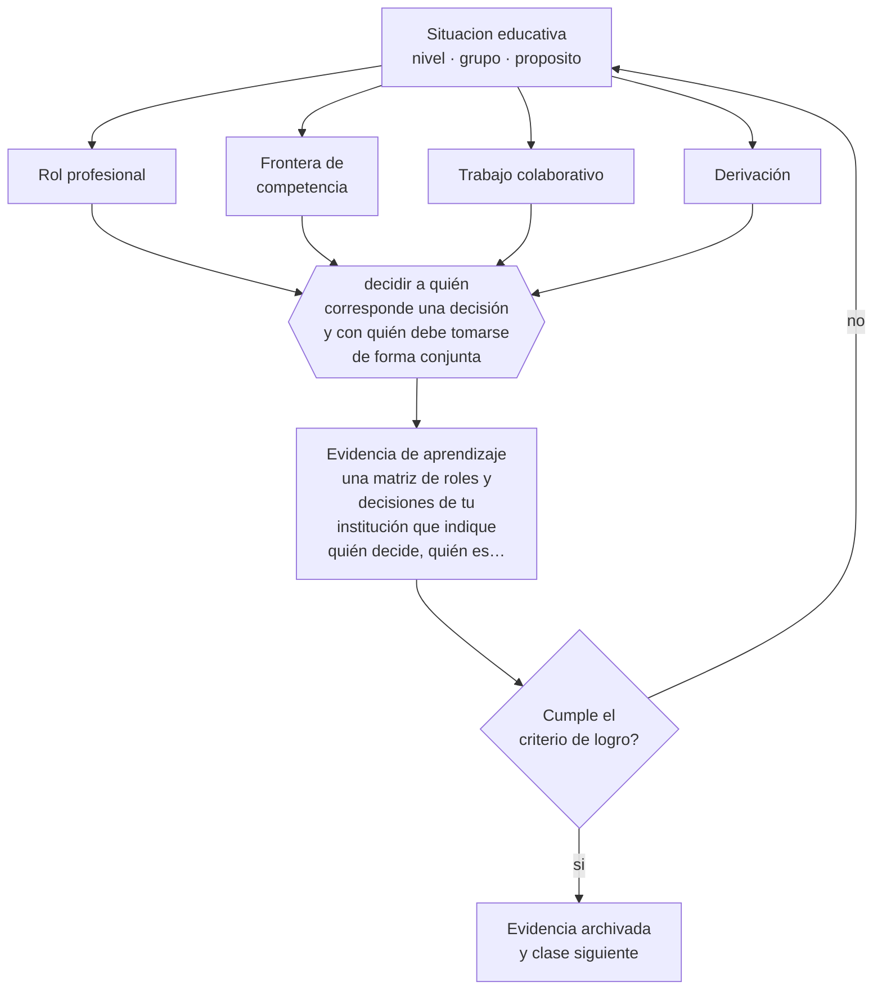

# Clase 009 — Profesiones y roles educativos

> **Parte 00 · Fundamentos de la educación** — clase 9 de 12

**Estado de evidencia:** `PRACTICA-PROFESIONAL` · **Etapa:** 🟢 Etapa A — Fundamentos · **Población de referencia:** transversal a todo el sistema educativo 
**Decisión que habilita:** decidir a quién corresponde una decisión y con quién debe tomarse de forma conjunta 
**Evidencia de aprendizaje:** una matriz de roles y decisiones de tu institución que indique quién decide, quién es consultado y quién debe ser informado

## 🎯 Propósito

Mapear los roles profesionales del ecosistema educativo —docentes, educadoras diferenciales, psicólogos, orientadores, directivos, asistentes de la educación— y las fronteras de competencia entre ellos, para trabajar en equipo sin invadir ni delegar mal.

## 📚 Resultados de aprendizaje

Al finalizar esta clase podrás:

1. **Definir** con precisión los cuatro conceptos centrales de la clase y reconocerlos en una situación educativa real, no solo en su enunciado.
2. **Explicar** quién hace qué en una institución educativa, y qué decisiones no te corresponde tomar en solitario.
3. **Decidir** —a quién corresponde una decisión y con quién debe tomarse de forma conjunta— y sostener la decisión con un fundamento escrito.
4. **Producir** la evidencia de la clase —una matriz de roles y decisiones de tu institución que indique quién decide, quién es consultado y quién debe ser informado— y contrastarla contra el criterio de logro.
5. **Distinguir** lo que la evidencia sostiene de lo que es práctica instalada, preferencia personal o costumbre de la institución.

## 🧩 Conceptos centrales

| Concepto | Comprensión verificable |
|---|---|
| **Rol profesional** | conjunto de funciones, competencias y responsabilidades asignadas formalmente a un cargo |
| **Frontera de competencia** | límite de lo que un profesional puede afirmar o decidir según su formación y su rol |
| **Trabajo colaborativo** | forma de coordinación en que dos o más profesionales comparten diseño, ejecución y evaluación |
| **Derivación** | traspaso formal de una situación a otro profesional o servicio, con información suficiente y seguimiento |

## 🗺️ Flujo de razonamiento

## 📖 Desarrollo

### 1. El fondo del asunto

Buena parte de los errores institucionales no provienen de mala voluntad sino de fronteras difusas: un docente que diagnostica sin competencia para hacerlo, un especialista que decide didáctica sin conocer el curso, un directivo que interviene en una relación pedagógica sin información. La solución no es rigidez sino explicitación: acordar quién decide qué, quién debe ser consultado antes y quién debe quedar informado después. Escrito, ese acuerdo dura; hablado, se disuelve en la primera urgencia.

### 2. Cómo se traduce en decisiones de enseñanza

La matriz de decisiones es el instrumento. Se construye listando decisiones reales y frecuentes —adecuación curricular, derivación a especialista, cambio de evaluación, sanción, contacto con la familia— y asignando roles a cada una. El valor aparece cuando surge la primera discrepancia: el conflicto se resuelve consultando el acuerdo, no negociando poder en medio de una situación tensa.

### 3. Qué sostiene la evidencia y qué no

Las descripciones formales de cargo rara vez coinciden con la práctica real, y en instituciones pequeñas una persona cumple varios roles. La matriz debe describir lo que efectivamente ocurre y no lo que dice el organigrama, y debe revisarse cuando cambia el equipo. También hay que reconocer una tensión real: aumentar la formalización mejora la claridad y puede reducir la agilidad.

> **Cómo leer el estado de evidencia `PRACTICA-PROFESIONAL`.** Es conocimiento práctico acumulado del oficio, útil y transferible, pero no probado con diseños de investigación. Trátalo como un buen punto de partida sujeto a comprobación en tu contexto.

## 🧪 Taller guiado

Aplica la clase a **uno** de los contextos siguientes y repite después el ejercicio en un
contexto de exigencia distinta. Cambiar de contexto es parte del aprendizaje: lo que funciona
con un grupo no se traslada intacto a otro.

| Contexto | Rasgo que cambia la decisión |
|---|---|
| Educación parvularia | el aprendizaje se juega en el ambiente y la interacción, no en la instrucción |
| Educación básica | alfabetización inicial y construcción de hábitos de estudio |
| Educación media | identidad, sentido y proyección hacia el egreso |
| Educación técnico-profesional | el desempeño se demuestra en tareas del oficio |
| Educación de adultos | experiencia previa, tiempo escaso y motivación instrumental |
| Educación superior | autonomía exigida y contenido disciplinar denso |

**Secuencia de trabajo:**

1. Delimita el contexto: nivel, edad, tamaño del grupo, asignatura o experiencia y tiempo real disponible.
2. Declara qué saben ya los estudiantes y **cómo lo comprobaste**, no cómo lo supones.
3. Formula la decisión pedagógica que esta clase habilita y escribe su fundamento.
4. Anticipa qué observarías si la decisión funciona y qué observarías si no funciona.
5. Diseña de antemano la alternativa que aplicarás si la primera estrategia falla.
6. Ejecuta o simula, y registra lo observado con fecha, contexto y evidencia concreta.
7. Produce la evidencia de aprendizaje de la clase.
8. Contrástala contra el criterio de logro, corrige y recién entonces avanza.

### 📦 Evidencia de aprendizaje

Una matriz de roles y decisiones de tu institución que indique quién decide, quién es consultado y quién debe ser informado.

Debe incluir contexto, decisión, fundamento, fuentes consultadas con su fecha, indicador de
logro observable, riesgos previstos y qué harías distinto en la siguiente iteración.

## 🏆 Reto verificable

Levanta la matriz real de tu institución entrevistando a dos personas de roles distintos. Identifica una decisión donde ambas creen que decide la otra, y propón el acuerdo que cierra ese vacío.

## ✅ Criterio de logro

- [ ] la matriz distingue decidir, consultar e informar para cada decisión listada;
- [ ] incluye al menos una decisión que hoy se toma sin claridad sobre quién es responsable;
- [ ] cada afirmación sobre «lo que funciona» está atribuida a una fuente identificable, con autor y fecha;
- [ ] la decisión es ejecutable con el tiempo, el espacio, el número de estudiantes y los recursos que realmente tienes;
- [ ] la evidencia queda archivada de forma reproducible: otra persona podría revisarla sin que tú se la expliques.

## ⚠️ Errores frecuentes

**Propios de esta clase:**

- Emitir juicios diagnósticos sobre un estudiante sin la formación ni el rol para hacerlo.
- Derivar sin información suficiente y dar por cerrada la responsabilidad propia.

**Característicos de la parte 00:**

- Tomar decisiones técnicas sin explicitar el fin educativo que las justifica.
- Confundir una tradición pedagógica con una moda reciente por desconocer su historia.

## ♿ Diversidad, accesibilidad y ética

El estudiante con mayores necesidades de apoyo es quien más pierde cuando los roles están difusos: recibe intervenciones descoordinadas, evaluaciones contradictorias o ninguna. La coordinación explícita entre aula y equipo de apoyo es, en la práctica, una medida de inclusión.

Antes de aplicar cualquier decisión de esta clase con estudiantes reales, revisa el
[protocolo de práctica responsable](../../../docs/ETICA_Y_PRACTICA_RESPONSABLE.md):
consentimiento, resguardo de datos personales, proporcionalidad de la intervención y derecho
de cada estudiante a no ser objeto de un ensayo que no le reporta beneficio.

## ❓ Preguntas de comprobación

1. ¿Qué decisión tomas habitualmente que en rigor no te corresponde tomar solo?
2. ¿Qué información mínima debería contener una derivación para ser útil?
3. ¿Qué ocurre en tu institución cuando dos profesionales discrepan sobre un mismo estudiante?

## 📕 Lecturas base

**Mineduc. *Orientaciones para el trabajo colaborativo y la codocencia* (Programa de Integración Escolar).**  
*Qué aporta a esta clase:* define en Chile cómo se articulan docente de aula y profesionales de apoyo, con tiempos y funciones.

**Hargreaves, A. & O'Connor, M. (2018). *Collaborative Professionalism*.**  
*Qué aporta a esta clase:* distingue colaboración real de reuniones frecuentes; útil para diseñar el trabajo conjunto y no solo declararlo.

Catálogo completo: [bibliografía del programa](../../../docs/BIBLIOGRAFIA.md) ·
[glosario](../../../docs/GLOSARIO.md) ·
[fuentes oficiales y cómo leerlas](../../../docs/FUENTES.md).

## 🔗 Conexión con el resto del programa

Prepara la parte 08 (equipo de aula y coordinación de apoyos) y la parte 15 (gestión de equipos). Se apoya en la clase 004: muchas fronteras de rol son, en el fondo, obligaciones éticas.

> [!IMPORTANT]
> Material de formación profesional. No reemplaza un título de pedagogía, una habilitación
> legal para ejercer, ni el juicio de un equipo educativo que conoce a sus estudiantes.

---

| Anterior | Índice | Siguiente |
|---|---|---|
| [← 008 · Rol social de la escuela](../class-08-rol-social-de-la-escuela/README.md) | [Parte 00](../README.md) · [Programa](../../../README.md) | [010 · Cultura escolar y comunidad →](../class-10-cultura-escolar-y-comunidad/README.md) |
