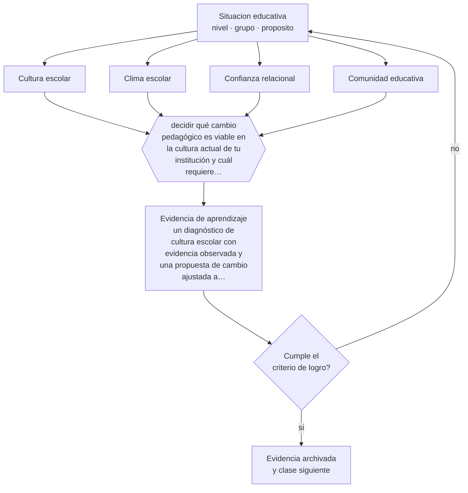

# Clase 010 — Cultura escolar y comunidad

> **Parte 00 · Fundamentos de la educación** — clase 10 de 12

**Estado de evidencia:** `CONSISTENTE` · **Etapa:** 🟢 Etapa A — Fundamentos · **Población de referencia:** transversal a todo el sistema educativo 
**Decisión que habilita:** decidir qué cambio pedagógico es viable en la cultura actual de tu institución y cuál requiere trabajar primero la cultura 
**Evidencia de aprendizaje:** un diagnóstico de cultura escolar con evidencia observada y una propuesta de cambio ajustada a lo que la cultura permite

## 🎯 Propósito

Leer la cultura escolar —supuestos compartidos, rutinas, lenguaje, lo que se celebra y lo que se castiga— como variable que condiciona cualquier innovación pedagógica que intentes introducir.

## 📚 Resultados de aprendizaje

Al finalizar esta clase podrás:

1. **Definir** con precisión los cuatro conceptos centrales de la clase y reconocerlos en una situación educativa real, no solo en su enunciado.
2. **Explicar** por qué dos escuelas con los mismos recursos y el mismo currículo funcionan de forma completamente distinta.
3. **Decidir** —qué cambio pedagógico es viable en la cultura actual de tu institución y cuál requiere trabajar primero la cultura— y sostener la decisión con un fundamento escrito.
4. **Producir** la evidencia de la clase —un diagnóstico de cultura escolar con evidencia observada y una propuesta de cambio ajustada a lo que la cultura permite— y contrastarla contra el criterio de logro.
5. **Distinguir** lo que la evidencia sostiene de lo que es práctica instalada, preferencia personal o costumbre de la institución.

## 🧩 Conceptos centrales

| Concepto | Comprensión verificable |
|---|---|
| **Cultura escolar** | supuestos compartidos, normalmente implícitos, sobre cómo se hacen las cosas en esta institución |
| **Clima escolar** | percepción de las personas sobre la convivencia, la seguridad y las relaciones; se mide, la cultura se interpreta |
| **Confianza relacional** | calidad de las expectativas mutuas entre docentes, directivos, estudiantes y familias |
| **Comunidad educativa** | conjunto de actores con interés legítimo en el proyecto del establecimiento |

## 🗺️ Flujo de razonamiento

## 📖 Desarrollo

### 1. El fondo del asunto

La cultura escolar es lo que responde por defecto cuando nadie decide nada: cómo se recibe a un estudiante nuevo, qué se hace con un colega que innova, si el error se trata como información o como falta. Es invisible desde dentro y decisiva para cualquier cambio: una innovación que contradice la cultura se abandona en semanas, aunque tenga evidencia a favor y financiamiento. Por eso, antes de proponer un cambio, conviene diagnosticar qué permite la cultura y qué rechaza.

### 2. Cómo se traduce en decisiones de enseñanza

El diagnóstico se hace con evidencia observable, no con encuestas de percepción únicamente: qué se conversa en la sala de profesores, qué se expone en los muros, a quién se pide ayuda, qué ocurre cuando alguien pide tiempo para probar algo. A partir de ahí, la estrategia realista es empezar por cambios que la cultura tolere, mostrar resultado y usarlo para ampliar el margen. La confianza es el recurso que se gasta y se acumula en cada uno de esos intentos.

### 3. Qué sostiene la evidencia y qué no

La cultura no es una variable manipulable a voluntad ni tiene una relación causal simple con los aprendizajes. Los estudios que la vinculan con resultados suelen ser correlacionales, y el clima medido por encuestas y la cultura profunda no son lo mismo. Sirve como marco de decisión estratégica; no sirve como explicación única de por qué una escuela obtiene ciertos resultados.

> **Cómo leer el estado de evidencia `CONSISTENTE`.** La evidencia es amplia y coherente, pero proviene sobre todo de estudios correlacionales, de síntesis con heterogeneidad alta o de contextos distintos al tuyo. Sirve para orientar la decisión y exige que compruebes el efecto en tu propio grupo.

## 🧪 Taller guiado

Aplica la clase a **uno** de los contextos siguientes y repite después el ejercicio en un
contexto de exigencia distinta. Cambiar de contexto es parte del aprendizaje: lo que funciona
con un grupo no se traslada intacto a otro.

| Contexto | Rasgo que cambia la decisión |
|---|---|
| Educación parvularia | el aprendizaje se juega en el ambiente y la interacción, no en la instrucción |
| Educación básica | alfabetización inicial y construcción de hábitos de estudio |
| Educación media | identidad, sentido y proyección hacia el egreso |
| Educación técnico-profesional | el desempeño se demuestra en tareas del oficio |
| Educación de adultos | experiencia previa, tiempo escaso y motivación instrumental |
| Educación superior | autonomía exigida y contenido disciplinar denso |

**Secuencia de trabajo:**

1. Delimita el contexto: nivel, edad, tamaño del grupo, asignatura o experiencia y tiempo real disponible.
2. Declara qué saben ya los estudiantes y **cómo lo comprobaste**, no cómo lo supones.
3. Formula la decisión pedagógica que esta clase habilita y escribe su fundamento.
4. Anticipa qué observarías si la decisión funciona y qué observarías si no funciona.
5. Diseña de antemano la alternativa que aplicarás si la primera estrategia falla.
6. Ejecuta o simula, y registra lo observado con fecha, contexto y evidencia concreta.
7. Produce la evidencia de aprendizaje de la clase.
8. Contrástala contra el criterio de logro, corrige y recién entonces avanza.

### 📦 Evidencia de aprendizaje

Un diagnóstico de cultura escolar con evidencia observada y una propuesta de cambio ajustada a lo que la cultura permite.

Debe incluir contexto, decisión, fundamento, fuentes consultadas con su fecha, indicador de
logro observable, riesgos previstos y qué harías distinto en la siguiente iteración.

## 🏆 Reto verificable

Documenta durante una semana tres situaciones en que la cultura de tu institución decidió por sobre la norma escrita. Explica qué supuesto operó en cada una.

## ✅ Criterio de logro

- [ ] el diagnóstico se apoya en al menos tres evidencias observadas, no solo en percepciones;
- [ ] la propuesta de cambio declara qué supuesto cultural debe moverse para que funcione;
- [ ] cada afirmación sobre «lo que funciona» está atribuida a una fuente identificable, con autor y fecha;
- [ ] la decisión es ejecutable con el tiempo, el espacio, el número de estudiantes y los recursos que realmente tienes;
- [ ] la evidencia queda archivada de forma reproducible: otra persona podría revisarla sin que tú se la expliques.

## ⚠️ Errores frecuentes

**Propios de esta clase:**

- Introducir una innovación sin evaluar si la cultura institucional la va a rechazar.
- Confundir el clima medido por una encuesta con la cultura real de la organización.

**Característicos de la parte 00:**

- Tomar decisiones técnicas sin explicitar el fin educativo que las justifica.
- Confundir una tradición pedagógica con una moda reciente por desconocer su historia.

## ♿ Diversidad, accesibilidad y ética

Las culturas escolares también definen a quién se considera «de aquí». Estudiantes migrantes, con discapacidad o de trayectorias irregulares suelen chocar con supuestos no escritos sobre el estudiante esperado. Detectar esos supuestos es condición para que cualquier política de inclusión pase del papel a la práctica.

Antes de aplicar cualquier decisión de esta clase con estudiantes reales, revisa el
[protocolo de práctica responsable](../../../docs/ETICA_Y_PRACTICA_RESPONSABLE.md):
consentimiento, resguardo de datos personales, proporcionalidad de la intervención y derecho
de cada estudiante a no ser objeto de un ensayo que no le reporta beneficio.

## ❓ Preguntas de comprobación

1. ¿Qué pasa en tu institución cuando alguien reconoce que una clase le salió mal?
2. ¿Qué comportamiento se premia informalmente aunque no esté en ningún documento?
3. ¿Qué innovación fracasó ahí y qué supuesto cultural la derrotó?

## 📕 Lecturas base

**Bryk, A. & Schneider, B. (2002). *Trust in Schools*.**  
*Qué aporta a esta clase:* muestra con datos longitudinales que la confianza relacional predice capacidad de mejora.

**Schein, E. (2010). *Organizational Culture and Leadership*.**  
*Qué aporta a esta clase:* el modelo de tres niveles —artefactos, valores declarados, supuestos básicos— aplicado aquí a la escuela.

Catálogo completo: [bibliografía del programa](../../../docs/BIBLIOGRAFIA.md) ·
[glosario](../../../docs/GLOSARIO.md) ·
[fuentes oficiales y cómo leerlas](../../../docs/FUENTES.md).

## 🔗 Conexión con el resto del programa

Es antecedente directo de la parte 12 (clima y convivencia) y de la parte 15 (liderazgo y mejora). Se apoya en la clase 002: mucha cultura escolar es historia sedimentada.

> [!IMPORTANT]
> Material de formación profesional. No reemplaza un título de pedagogía, una habilitación
> legal para ejercer, ni el juicio de un equipo educativo que conoce a sus estudiantes.

---

| Anterior | Índice | Siguiente |
|---|---|---|
| [← 009 · Profesiones y roles educativos](../class-09-profesiones-y-roles-educativos/README.md) | [Parte 00](../README.md) · [Programa](../../../README.md) | [011 · Calidad y equidad educativa →](../class-11-calidad-y-equidad-educativa/README.md) |
