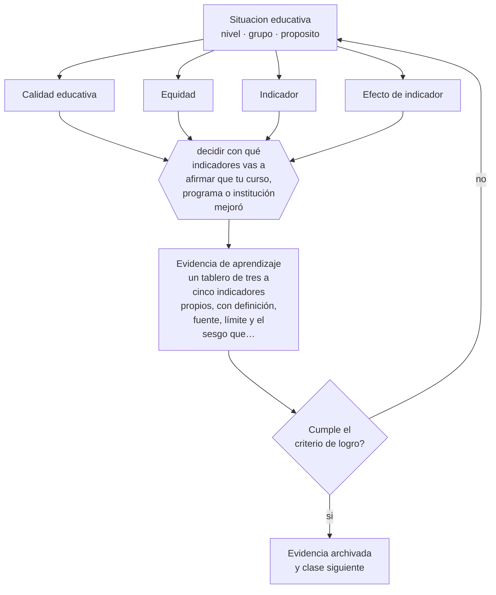

# Clase 011 — Calidad y equidad educativa

> **Parte 00 · Fundamentos de la educación** — clase 11 de 12

**Estado de evidencia:** `EN-DEBATE` · **Etapa:** 🟢 Etapa A — Fundamentos · **Población de referencia:** transversal a todo el sistema educativo 
**Decisión que habilita:** decidir con qué indicadores vas a afirmar que tu curso, programa o institución mejoró 
**Evidencia de aprendizaje:** un tablero de tres a cinco indicadores propios, con definición, fuente, límite y el sesgo que cada uno introduce

## 🎯 Propósito

Someter a examen dos palabras que se usan como si fueran obvias. Calidad y equidad admiten definiciones distintas y en tensión, y cada definición conduce a políticas, indicadores y prácticas de aula diferentes.

## 📚 Resultados de aprendizaje

Al finalizar esta clase podrás:

1. **Definir** con precisión los cuatro conceptos centrales de la clase y reconocerlos en una situación educativa real, no solo en su enunciado.
2. **Explicar** qué se está midiendo realmente cuando se afirma que un sistema educativo tiene calidad.
3. **Decidir** —con qué indicadores vas a afirmar que tu curso, programa o institución mejoró— y sostener la decisión con un fundamento escrito.
4. **Producir** la evidencia de la clase —un tablero de tres a cinco indicadores propios, con definición, fuente, límite y el sesgo que cada uno introduce— y contrastarla contra el criterio de logro.
5. **Distinguir** lo que la evidencia sostiene de lo que es práctica instalada, preferencia personal o costumbre de la institución.

## 🧩 Conceptos centrales

| Concepto | Comprensión verificable |
|---|---|
| **Calidad educativa** | juicio sobre el valor de los procesos y resultados educativos; depende de los fines que se declaren |
| **Equidad** | distribución justa de oportunidades y resultados; no es lo mismo que igualdad de trato |
| **Indicador** | medida observable que se usa como aproximación de algo que no se puede medir directamente |
| **Efecto de indicador** | distorsión que produce medir: lo que se mide se prioriza y lo que no se mide se abandona |

## 🗺️ Flujo de razonamiento

## 📖 Desarrollo

### 1. El fondo del asunto

Definir calidad solo por resultados en pruebas estandarizadas es defendible, pero tiene consecuencias conocidas: estrecha el currículo hacia lo evaluado, incentiva la selección de estudiantes y castiga a las instituciones que atienden a los más desaventajados. Definirla por procesos evita esos efectos pero pierde comparabilidad. No hay solución técnica a este dilema: hay decisiones que deben hacerse explícitas y compensarse con más de un indicador y con lecturas que consideren el punto de partida.

### 2. Cómo se traduce en decisiones de enseñanza

En el aula, la traducción es directa: si tu único indicador es el promedio del curso, estás midiendo también quién entró sabiendo. Un tablero razonable combina resultado, progreso individual, cobertura efectiva del currículo, participación y algo que capture al grupo más rezagado. La regla profesional es declarar el límite de cada indicador junto al indicador mismo, para que nadie lo lea como si midiera más de lo que mide.

### 3. Qué sostiene la evidencia y qué no

Ninguna definición de calidad es neutra, y esta clase no zanja el debate: lo hace explícito. Además, todos los indicadores educativos tienen error de medición, y las comparaciones de corto plazo entre grupos pequeños suelen estar dentro del ruido. Afirmar mejora con una diferencia de dos puntos en un curso de treinta estudiantes es, casi siempre, un error de lectura.

> **Cómo leer el estado de evidencia `EN-DEBATE`.** Hay desacuerdo activo y publicado entre especialistas competentes. La clase presenta las posiciones y sus argumentos; tu tarea no es escoger un bando, sino saber qué evidencia te haría cambiar de posición.

## 🧪 Taller guiado

Aplica la clase a **uno** de los contextos siguientes y repite después el ejercicio en un
contexto de exigencia distinta. Cambiar de contexto es parte del aprendizaje: lo que funciona
con un grupo no se traslada intacto a otro.

| Contexto | Rasgo que cambia la decisión |
|---|---|
| Educación parvularia | el aprendizaje se juega en el ambiente y la interacción, no en la instrucción |
| Educación básica | alfabetización inicial y construcción de hábitos de estudio |
| Educación media | identidad, sentido y proyección hacia el egreso |
| Educación técnico-profesional | el desempeño se demuestra en tareas del oficio |
| Educación de adultos | experiencia previa, tiempo escaso y motivación instrumental |
| Educación superior | autonomía exigida y contenido disciplinar denso |

**Secuencia de trabajo:**

1. Delimita el contexto: nivel, edad, tamaño del grupo, asignatura o experiencia y tiempo real disponible.
2. Declara qué saben ya los estudiantes y **cómo lo comprobaste**, no cómo lo supones.
3. Formula la decisión pedagógica que esta clase habilita y escribe su fundamento.
4. Anticipa qué observarías si la decisión funciona y qué observarías si no funciona.
5. Diseña de antemano la alternativa que aplicarás si la primera estrategia falla.
6. Ejecuta o simula, y registra lo observado con fecha, contexto y evidencia concreta.
7. Produce la evidencia de aprendizaje de la clase.
8. Contrástala contra el criterio de logro, corrige y recién entonces avanza.

### 📦 Evidencia de aprendizaje

Un tablero de tres a cinco indicadores propios, con definición, fuente, límite y el sesgo que cada uno introduce.

Debe incluir contexto, decisión, fundamento, fuentes consultadas con su fecha, indicador de
logro observable, riesgos previstos y qué harías distinto en la siguiente iteración.

## 🏆 Reto verificable

Construye tu tablero y aplícalo a datos reales de tu grupo. Identifica un caso donde el indicador te habría llevado a una conclusión equivocada y explica qué información faltaba.

## ✅ Criterio de logro

- [ ] cada indicador declara qué mide, qué no mide y qué conducta induce;
- [ ] el tablero incluye al menos un indicador sensible a la situación del grupo más rezagado;
- [ ] cada afirmación sobre «lo que funciona» está atribuida a una fuente identificable, con autor y fecha;
- [ ] la decisión es ejecutable con el tiempo, el espacio, el número de estudiantes y los recursos que realmente tienes;
- [ ] la evidencia queda archivada de forma reproducible: otra persona podría revisarla sin que tú se la expliques.

## ⚠️ Errores frecuentes

**Propios de esta clase:**

- Usar un único indicador y tratarlo como definición de calidad.
- Comparar resultados entre grupos sin considerar el punto de partida ni el error de medición.

**Característicos de la parte 00:**

- Tomar decisiones técnicas sin explicitar el fin educativo que las justifica.
- Confundir una tradición pedagógica con una moda reciente por desconocer su historia.

## ♿ Diversidad, accesibilidad y ética

Los indicadores promedio ocultan sistemáticamente a los estudiantes con mayores dificultades: una mejora del promedio puede coexistir con un deterioro en el grupo más rezagado. Todo tablero con pretensión de equidad debe poder mostrar qué pasó con quienes estaban más abajo.

Antes de aplicar cualquier decisión de esta clase con estudiantes reales, revisa el
[protocolo de práctica responsable](../../../docs/ETICA_Y_PRACTICA_RESPONSABLE.md):
consentimiento, resguardo de datos personales, proporcionalidad de la intervención y derecho
de cada estudiante a no ser objeto de un ensayo que no le reporta beneficio.

## ❓ Preguntas de comprobación

1. ¿Qué comportamiento induce en ti y en tus estudiantes el indicador que hoy usas?
2. ¿Con qué indicador se vería mal una práctica que consideras valiosa?
3. ¿Cómo distinguirías una mejora real de una fluctuación aleatoria en tu curso?

## 📕 Lecturas base

**Biesta, G. (2010). *Good Education in an Age of Measurement*.**  
*Qué aporta a esta clase:* argumenta que medir bien no responde qué es buena educación; el contrapeso necesario a los tableros.

**Agencia de Calidad de la Educación (Chile). *Informes técnicos y Otros Indicadores de Calidad*.**  
*Qué aporta a esta clase:* muestra un intento institucional de ampliar la definición de calidad más allá del puntaje; léelo con sus notas técnicas.

Catálogo completo: [bibliografía del programa](../../../docs/BIBLIOGRAFIA.md) ·
[glosario](../../../docs/GLOSARIO.md) ·
[fuentes oficiales y cómo leerlas](../../../docs/FUENTES.md).

## 🔗 Conexión con el resto del programa

Cierra la discusión abierta en las clases 003 y 008, y prepara la parte 11 (validez y uso de los resultados) y la parte 15 (indicadores institucionales).

> [!IMPORTANT]
> Material de formación profesional. No reemplaza un título de pedagogía, una habilitación
> legal para ejercer, ni el juicio de un equipo educativo que conoce a sus estudiantes.

---

| Anterior | Índice | Siguiente |
|---|---|---|
| [← 010 · Cultura escolar y comunidad](../class-10-cultura-escolar-y-comunidad/README.md) | [Parte 00](../README.md) · [Programa](../../../README.md) | [012 · Proyecto integrador: mapa del sistema educativo →](../class-12-proyecto-integrador-mapa-del-sistema-educativo/README.md) |
