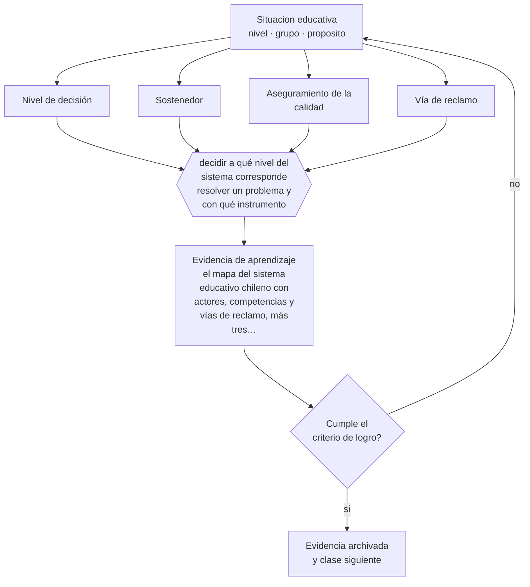

# Clase 012 — Proyecto integrador: mapa del sistema educativo

> **Parte 00 · Fundamentos de la educación** — clase 12 de 12

**Estado de evidencia:** `MARCO-NORMATIVO` · **Etapa:** 🟢 Etapa A — Fundamentos · **Población de referencia:** transversal a todo el sistema educativo 
**Decisión que habilita:** decidir a qué nivel del sistema corresponde resolver un problema y con qué instrumento 
**Evidencia de aprendizaje:** el mapa del sistema educativo chileno con actores, competencias y vías de reclamo, más tres casos ubicados en él

## 🎯 Propósito

Integrar la parte en un producto profesional: un mapa del sistema educativo que muestre actores, competencias, flujos de decisión y vías de reclamo, y que permita ubicar cualquier problema concreto en el nivel donde efectivamente se resuelve.

## 📚 Resultados de aprendizaje

Al finalizar esta clase podrás:

1. **Definir** con precisión los cuatro conceptos centrales de la clase y reconocerlos en una situación educativa real, no solo en su enunciado.
2. **Explicar** cómo se conecta cada decisión de tu aula con la estructura, el financiamiento y la regulación del sistema en que trabajas.
3. **Decidir** —a qué nivel del sistema corresponde resolver un problema y con qué instrumento— y sostener la decisión con un fundamento escrito.
4. **Producir** la evidencia de la clase —el mapa del sistema educativo chileno con actores, competencias y vías de reclamo, más tres casos ubicados en él— y contrastarla contra el criterio de logro.
5. **Distinguir** lo que la evidencia sostiene de lo que es práctica instalada, preferencia personal o costumbre de la institución.

## 🧩 Conceptos centrales

| Concepto | Comprensión verificable |
|---|---|
| **Nivel de decisión** | instancia —aula, establecimiento, sostenedor, autoridad nacional— con competencia sobre un asunto |
| **Sostenedor** | persona jurídica responsable del establecimiento ante la autoridad, con obligaciones legales propias |
| **Aseguramiento de la calidad** | conjunto de instituciones que evalúan, fiscalizan y apoyan a los establecimientos |
| **Vía de reclamo** | procedimiento formal por el que un miembro de la comunidad exige el cumplimiento de un derecho |

## 🗺️ Flujo de razonamiento

## 📖 Desarrollo

### 1. El fondo del asunto

El proyecto integrador exige poner junto lo que la parte trató por separado. Un problema de aula —un estudiante sin apoyos, una sanción desproporcionada, un currículo imposible de cubrir— casi nunca se resuelve en un solo nivel. Saber quién tiene la competencia, qué instrumento la ejerce y qué plazo corre es lo que separa un reclamo eficaz de una queja. El mapa que construyas aquí es una herramienta de trabajo, no un ejercicio académico.

### 2. Cómo se traduce en decisiones de enseñanza

Construye el mapa con cuatro capas: actores e instituciones con sus competencias; instrumentos que cada uno maneja; flujos de decisión entre ellos; y vías de reclamo disponibles para estudiantes y familias. Después ubica tres casos reales y sigue su recorrido completo. Si un caso no encuentra su vía, es una señal de que el mapa está incompleto, no de que el caso sea irresoluble.

### 3. Qué sostiene la evidencia y qué no

El mapa refleja la institucionalidad vigente a una fecha y envejece: las competencias se redistribuyen, los servicios cambian de nombre y las vías de reclamo se modifican. Debe llevar fecha de elaboración y fuente, y revisarse antes de usarlo para una decisión con consecuencias. Un mapa desactualizado orienta con seguridad hacia el lugar equivocado.

> **Cómo leer el estado de evidencia `MARCO-NORMATIVO`.** El contenido no se decide por evidencia empírica sino por norma, política pública o marco institucional vigente. Verifica siempre la versión vigente a la fecha en que vas a aplicarlo: la norma cambia y la clase no se actualiza sola.

## 🧪 Taller guiado

Aplica la clase a **uno** de los contextos siguientes y repite después el ejercicio en un
contexto de exigencia distinta. Cambiar de contexto es parte del aprendizaje: lo que funciona
con un grupo no se traslada intacto a otro.

| Contexto | Rasgo que cambia la decisión |
|---|---|
| Educación parvularia | el aprendizaje se juega en el ambiente y la interacción, no en la instrucción |
| Educación básica | alfabetización inicial y construcción de hábitos de estudio |
| Educación media | identidad, sentido y proyección hacia el egreso |
| Educación técnico-profesional | el desempeño se demuestra en tareas del oficio |
| Educación de adultos | experiencia previa, tiempo escaso y motivación instrumental |
| Educación superior | autonomía exigida y contenido disciplinar denso |

**Secuencia de trabajo:**

1. Delimita el contexto: nivel, edad, tamaño del grupo, asignatura o experiencia y tiempo real disponible.
2. Declara qué saben ya los estudiantes y **cómo lo comprobaste**, no cómo lo supones.
3. Formula la decisión pedagógica que esta clase habilita y escribe su fundamento.
4. Anticipa qué observarías si la decisión funciona y qué observarías si no funciona.
5. Diseña de antemano la alternativa que aplicarás si la primera estrategia falla.
6. Ejecuta o simula, y registra lo observado con fecha, contexto y evidencia concreta.
7. Produce la evidencia de aprendizaje de la clase.
8. Contrástala contra el criterio de logro, corrige y recién entonces avanza.

### 📦 Evidencia de aprendizaje

El mapa del sistema educativo chileno con actores, competencias y vías de reclamo, más tres casos ubicados en él.

Debe incluir contexto, decisión, fundamento, fuentes consultadas con su fecha, indicador de
logro observable, riesgos previstos y qué harías distinto en la siguiente iteración.

## 🏆 Reto verificable

Presenta tu mapa a alguien ajeno al sistema educativo y pídele que ubique un problema propio. Corrige el mapa en todo punto donde esa persona se pierda: si no se entiende, no sirve.

## ✅ Criterio de logro

- [ ] el mapa incluye actores, competencias, instrumentos y vías de reclamo, con fuente y fecha;
- [ ] los tres casos recorren el mapa completo hasta una instancia que efectivamente puede resolver;
- [ ] cada afirmación sobre «lo que funciona» está atribuida a una fuente identificable, con autor y fecha;
- [ ] la decisión es ejecutable con el tiempo, el espacio, el número de estudiantes y los recursos que realmente tienes;
- [ ] la evidencia queda archivada de forma reproducible: otra persona podría revisarla sin que tú se la expliques.

## ⚠️ Errores frecuentes

**Propios de esta clase:**

- Dibujar el organigrama y llamarlo mapa del sistema, sin instrumentos ni vías de reclamo.
- Omitir la fecha y la fuente, con lo que el mapa deja de ser verificable.

**Característicos de la parte 00:**

- Tomar decisiones técnicas sin explicitar el fin educativo que las justifica.
- Confundir una tradición pedagógica con una moda reciente por desconocer su historia.

## ♿ Diversidad, accesibilidad y ética

Las familias con menos capital cultural y las que no hablan español con fluidez son las que menos usan las vías de reclamo existentes. Un mapa útil incluye cómo se comunica esa información a quienes más la necesitan, no solo dónde está publicada.

Antes de aplicar cualquier decisión de esta clase con estudiantes reales, revisa el
[protocolo de práctica responsable](../../../docs/ETICA_Y_PRACTICA_RESPONSABLE.md):
consentimiento, resguardo de datos personales, proporcionalidad de la intervención y derecho
de cada estudiante a no ser objeto de un ensayo que no le reporta beneficio.

## ❓ Preguntas de comprobación

1. ¿Dónde se decide realmente el problema que más te afecta en tu práctica?
2. ¿Qué instrumento concreto usarías para exigir el cumplimiento de un derecho vulnerado?
3. ¿Qué parte de tu mapa quedará obsoleta primero y cómo lo verificarás?

## 📕 Lecturas base

**Biblioteca del Congreso Nacional de Chile. *LeyChile*.**  
*Qué aporta a esta clase:* fuente oficial de normativa consolidada; usa siempre la versión vigente a la fecha en que aplicarás la norma.

**Mineduc, Agencia de Calidad y Superintendencia de Educación. *Sitios institucionales*.**  
*Qué aporta a esta clase:* definen competencias, procedimientos y vías de reclamo del sistema de aseguramiento de la calidad.

Catálogo completo: [bibliografía del programa](../../../docs/BIBLIOGRAFIA.md) ·
[glosario](../../../docs/GLOSARIO.md) ·
[fuentes oficiales y cómo leerlas](../../../docs/FUENTES.md).

## 🔗 Conexión con el resto del programa

Cierra la parte 00 integrando las clases 005, 007, 009 y 011. Es la base institucional sobre la que trabajan la parte 12 (protocolos), la parte 15 (gestión) y todo el material de `chile-education-system/`.

> [!IMPORTANT]
> Material de formación profesional. No reemplaza un título de pedagogía, una habilitación
> legal para ejercer, ni el juicio de un equipo educativo que conoce a sus estudiantes.

---

| Anterior | Índice | Siguiente |
|---|---|---|
| [← 011 · Calidad y equidad educativa](../class-11-calidad-y-equidad-educativa/README.md) | [Parte 00](../README.md) · [Programa](../../../README.md) | [Programa completo →](../../../README.md) |
