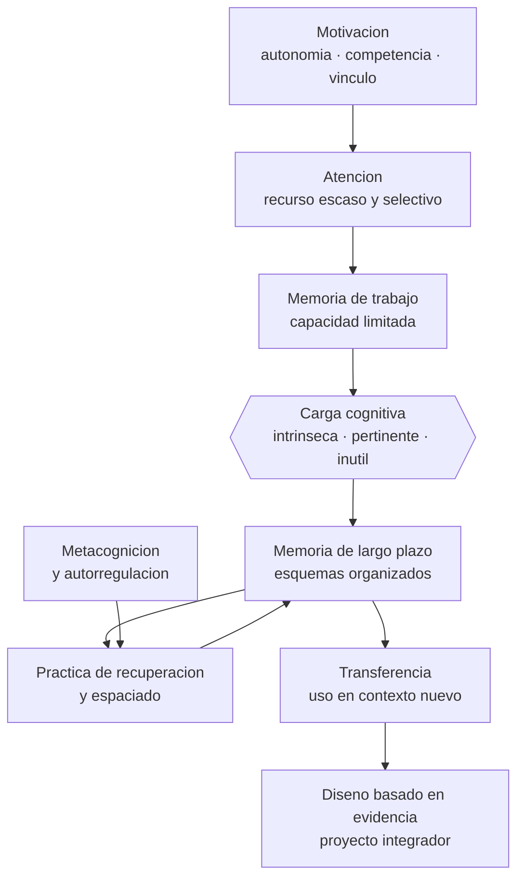

# Parte 01 — Ciencias del aprendizaje

> *Enseñar sin saber cómo se aprende es apostar con el tiempo de otros*

🟢 **Etapa A — Fundamentos** · salida de la etapa: explicar cómo aprende una persona y qué hace la educación con ese hecho

**Clases:** 12 (013–024) · **Población de referencia:** transversal: los mecanismos son generales, su aplicación no · **Conceptos con definición operacional:** 48 
**Contenido central:** Conductismo, cognitivismo, constructivismo, memoria, atención, carga cognitiva, práctica de recuperación, espaciado, metacognición, motivación y transferencia

## 🎯 De qué trata esta parte

Esta es la parte con más evidencia acumulada de todo el programa y también la más traicionada por su divulgación. Los mecanismos básicos —memoria de trabajo limitada, memoria de largo plazo prácticamente ilimitada, olvido que se combate recuperando y no releyendo— están replicados desde hace décadas y en muchos idiomas. Lo que falla no es la evidencia: es el salto apresurado desde el laboratorio al aula sin considerar contenido, edad ni contexto.

El programa toma partido en un punto: los mecanismos cognitivos son generales, pero las decisiones didácticas son locales. Que la práctica de recuperación funcione no significa que aplicar un cuestionario cada lunes mejore el aprendizaje de cualquier curso; significa que recuperar activamente lo aprendido, en el momento adecuado y con retroalimentación, funciona mejor que releer. Traducir un mecanismo en una rutina exige criterio profesional, y ese criterio es lo que esta parte entrena.

También es la parte donde se desmontan los neuromitos. Estilos de aprendizaje, hemisferio dominante, uso del diez por ciento del cerebro y aprendizaje inconsciente durante el sueño siguen circulando en formaciones docentes pese a estar refutados. No se trata de ridiculizar a quien los cree, sino de mostrar por qué son verosímiles y qué evidencia los desmonta: reconocer el mecanismo del error protege mejor que memorizar la lista de mitos.

## 📚 Resultados de la parte

Al terminar esta parte podrás:

1. **Explicar el aprendizaje con un modelo de memoria y atención que soporte decisiones didácticas**.
2. **Diseñar una secuencia que gestione la carga cognitiva de forma deliberada**.
3. **Programar práctica de recuperación y espaciado en un plan real de asignatura**.
4. **Refutar con evidencia los neuromitos más extendidos, incluidos los que usan tus colegas**.

## 🗺️ Mapa de la parte

## 🧠 Marco de referencia

- arquitectura cognitiva: memoria de trabajo, memoria de largo plazo y esquemas
- teoría de la carga cognitiva y sus efectos instruccionales
- ciencia del aprendizaje duradero: recuperación, espaciado, intercalado y variabilidad
- teoría de la autodeterminación y modelos de expectativa y valor para la motivación

**Autoras y autores que conviene conocer:** John Sweller, Richard E. Mayer, Robert y Elizabeth Bjork, Henry Roediger y Jeffrey Karpicke, John Dunlosky, Michelene Chi, Lev Vygotsky, Edward Deci y Richard Ryan

## 📋 Las 12 clases

| # | Clase | Decisión que habilita | Evidencia |
|---:|---|---|---|
| 013 | [Conductismo y aprendizaje observable](class-01-conductismo-y-aprendizaje-observable/README.md) | determinar si el problema que enfrentas se resuelve modificando consecuencias o si exige intervenir en la comprensión | `ROBUSTA` |
| 014 | [Cognitivismo y procesamiento de información](class-02-cognitivismo-y-procesamiento-de-informacion/README.md) | determinar en qué punto del procesamiento se está perdiendo el aprendizaje de tu grupo | `ROBUSTA` |
| 015 | [Constructivismo](class-03-constructivismo/README.md) | determinar qué concepción previa de tus estudiantes debes hacer explícita antes de enseñar el contenido nuevo | `CONSISTENTE` |
| 016 | [Socioconstructivismo y aprendizaje mediado](class-04-socioconstructivismo-y-aprendizaje-mediado/README.md) | determinar qué apoyo dar, cuánto y en qué momento retirarlo para que el estudiante quede autónomo | `CONSISTENTE` |
| 017 | [Memoria de trabajo y memoria de largo plazo](class-05-memoria-de-trabajo-y-memoria-de-largo-plazo/README.md) | determinar cuántos elementos nuevos puede sostener tu grupo en una sesión y qué hay que automatizar antes | `ROBUSTA` |
| 018 | [Atención y control ejecutivo](class-06-atencion-y-control-ejecutivo/README.md) | determinar qué elementos de tu clase están compitiendo por la atención y cuáles hay que eliminar | `ROBUSTA` |
| 019 | [Carga cognitiva](class-07-carga-cognitiva/README.md) | determinar qué dificultad de tu clase es inherente al contenido y cuál es un defecto de diseño | `ROBUSTA` |
| 020 | [Práctica de recuperación y espaciado](class-08-practica-de-recuperacion-y-espaciado/README.md) | determinar cuándo y cómo se recuperará cada contenido a lo largo de tu asignatura | `ROBUSTA` |
| 021 | [Metacognición](class-09-metacognicion/README.md) | determinar qué componente de la autorregulación —planificar, monitorear o evaluar— vas a enseñar de forma explícita | `CONSISTENTE` |
| 022 | [Motivación y autodeterminación](class-10-motivacion-y-autodeterminacion/README.md) | determinar qué condición de la tarea vas a modificar para que esforzarse sea razonable para tus estudiantes | `CONSISTENTE` |
| 023 | [Transferencia y aprendizaje profundo](class-11-transferencia-y-aprendizaje-profundo/README.md) | determinar a qué situaciones concretas debe transferir lo que enseñas, y practicar en esa variedad desde el comienzo | `EN-DEBATE` |
| 024 | [Proyecto integrador: diseño basado en evidencia](class-12-proyecto-integrador-diseno-basado-en-evidencia/README.md) | determinar la secuencia completa de una unidad y justificar cada decisión con el mecanismo que la sostiene | `ROBUSTA` |

## ⚠️ Riesgos característicos

- Aplicar un hallazgo de laboratorio como receta de aula sin ajustarlo al contenido ni a la edad.
- Sostener neuromitos —estilos de aprendizaje, hemisferio dominante— por costumbre institucional.
- Confundir la sensación de fluidez al releer con aprendizaje efectivo.
- Tratar la motivación como rasgo del estudiante y no como resultado de las condiciones de la tarea.

## 📕 Lecturas de referencia de la parte

- **National Research Council (2000). *How People Learn: Brain, Mind, Experience, and School*.** — síntesis fundacional y todavía vigente sobre conocimiento previo, comprensión profunda y metacognición.
- **Sweller, J., Ayres, P. & Kalyuga, S. (2011). *Cognitive Load Theory*.** — el tratamiento sistemático de la carga cognitiva y de sus efectos instruccionales, con sus condiciones de validez.
- **Dunlosky, J. et al. (2013). *Improving Students' Learning With Effective Learning Techniques*. Psychological Science in the Public Interest, 14(1).** — clasifica diez técnicas de estudio por utilidad demostrada; la práctica distribuida y la de recuperación quedan arriba, subrayar y releer abajo.
- **Kirschner, P. & Hendrick, C. (2020). *How Learning Happens*.** — veintiocho estudios clásicos explicados y traducidos a decisiones de aula; excelente puente entre investigación y práctica.

## ✅ Evidencia mínima para dar la parte por cerrada

- [ ] un modelo propio de memoria y atención explicado en una página, sin jerga prestada;
- [ ] una secuencia didáctica con la carga cognitiva justificada decisión por decisión;
- [ ] un calendario de recuperación y espaciado para una unidad completa;
- [ ] un desmontaje escrito de un neuromito con la evidencia que lo refuta.

---

| Anterior | Índice | Siguiente |
|---|---|---|
| [← Parte 00 · Fundamentos de la educación](../part-00-fundamentos-de-la-educacion/README.md) | [Programa](../../README.md) · [Currículo](../../CURRICULUM.md) | [Parte 02 · Desarrollo humano →](../part-02-desarrollo-humano/README.md) |
