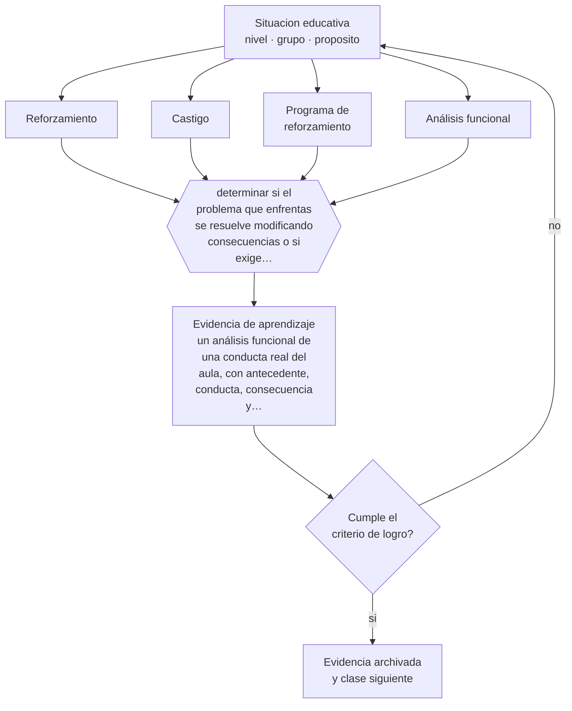

# Clase 013 — Conductismo y aprendizaje observable

> **Parte 01 · Ciencias del aprendizaje** — clase 1 de 12

**Estado de evidencia:** `ROBUSTA` · **Etapa:** 🟢 Etapa A — Fundamentos · **Población de referencia:** transversal: los mecanismos son generales, su aplicación no 
**Decisión que habilita:** determinar si el problema que enfrentas se resuelve modificando consecuencias o si exige intervenir en la comprensión 
**Evidencia de aprendizaje:** un análisis funcional de una conducta real del aula, con antecedente, conducta, consecuencia y una intervención propuesta

## 🎯 Propósito

Recuperar el aporte real del conductismo —la conducta observable, el reforzamiento, la práctica— separándolo de su caricatura. Buena parte de la gestión de aula, del entrenamiento de habilidades y de los sistemas de incentivos escolares funciona con esta lógica, se admita o no.

## 📚 Resultados de aprendizaje

Al finalizar esta clase podrás:

1. **Definir** con precisión los cuatro conceptos centrales de la clase y reconocerlos en una situación educativa real, no solo en su enunciado.
2. **Explicar** qué explica bien el conductismo, qué no explica, y por qué sigue operando en casi todas las aulas sin que se lo nombre.
3. **Decidir** —si el problema que enfrentas se resuelve modificando consecuencias o si exige intervenir en la comprensión— y sostener la decisión con un fundamento escrito.
4. **Producir** la evidencia de la clase —un análisis funcional de una conducta real del aula, con antecedente, conducta, consecuencia y una intervención propuesta— y contrastarla contra el criterio de logro.
5. **Distinguir** lo que la evidencia sostiene de lo que es práctica instalada, preferencia personal o costumbre de la institución.

## 🧩 Conceptos centrales

| Concepto | Comprensión verificable |
|---|---|
| **Reforzamiento** | consecuencia que aumenta la probabilidad de que una conducta se repita |
| **Castigo** | consecuencia que disminuye la probabilidad de una conducta; con efectos secundarios documentados |
| **Programa de reforzamiento** | regla que define cuándo se entrega la consecuencia; determina la persistencia de la conducta |
| **Análisis funcional** | procedimiento que identifica antecedente, conducta y consecuencia para explicar por qué ocurre algo |

## 🗺️ Flujo de razonamiento

## 📖 Desarrollo

### 1. El fondo del asunto

El conductismo aportó algo que ninguna teoría posterior invalidó: las conductas se sostienen por sus consecuencias, y esas consecuencias son observables y manipulables. Un estudiante que interrumpe y obtiene atención está siendo reforzado, aunque el docente crea estar sancionando. El análisis funcional —qué ocurre antes, qué hace la persona, qué obtiene después— sigue siendo la herramienta más eficaz para explicar conductas persistentes que parecen irracionales.

### 2. Cómo se traduce en decisiones de enseñanza

La aplicación útil no es un sistema de premios y castigos, sino la lectura funcional de lo que ya está ocurriendo. Antes de diseñar una intervención conviene preguntarse qué está reforzando la conducta indeseada y qué consecuencia recibe la conducta deseada, que muchas veces es ninguna. Cambiar eso suele bastar. En aprendizaje de destrezas —lectura fluida, cálculo, procedimientos técnicos— la práctica distribuida con corrección inmediata proviene de esta tradición y funciona.

### 3. Qué sostiene la evidencia y qué no

El conductismo describe bien la conducta y mal la comprensión: no explica cómo alguien entiende una idea nueva, transfiere a un contexto distinto o cambia una concepción errónea. Además, la evidencia sobre recompensas externas muestra un riesgo real: en tareas que la persona ya hacía por interés propio, premiar puede reducir la motivación posterior. Por eso el reforzamiento externo se usa con criterio y con plan de retirada, no como sistema permanente.

> **Cómo leer el estado de evidencia `ROBUSTA`.** Hay evidencia convergente de varios equipos, países y diseños de investigación, incluidos estudios experimentales o cuasiexperimentales, y el efecto se sostiene al replicarlo. Puedes apoyar una decisión profesional en ella, sin olvidar que ningún efecto promedio describe a un estudiante concreto.

## 🧪 Taller guiado

Aplica la clase a **uno** de los contextos siguientes y repite después el ejercicio en un
contexto de exigencia distinta. Cambiar de contexto es parte del aprendizaje: lo que funciona
con un grupo no se traslada intacto a otro.

| Contexto | Rasgo que cambia la decisión |
|---|---|
| Contenido nuevo y difícil | la carga intrínseca es alta: el apoyo debe ser mayor |
| Contenido conocido en profundización | el andamiaje excesivo estorba en vez de ayudar |
| Grupo con conocimiento previo heterogéneo | lo que ayuda al novato perjudica al avanzado |
| Aprendizaje procedimental | la práctica y la corrección inmediata dominan la decisión |
| Aprendizaje conceptual | los ejemplos, contraejemplos y la comparación dominan |
| Estudio autónomo fuera del aula | sin autorregulación entrenada, la técnica no se sostiene |

**Secuencia de trabajo:**

1. Delimita el contexto: nivel, edad, tamaño del grupo, asignatura o experiencia y tiempo real disponible.
2. Declara qué saben ya los estudiantes y **cómo lo comprobaste**, no cómo lo supones.
3. Formula la decisión pedagógica que esta clase habilita y escribe su fundamento.
4. Anticipa qué observarías si la decisión funciona y qué observarías si no funciona.
5. Diseña de antemano la alternativa que aplicarás si la primera estrategia falla.
6. Ejecuta o simula, y registra lo observado con fecha, contexto y evidencia concreta.
7. Produce la evidencia de aprendizaje de la clase.
8. Contrástala contra el criterio de logro, corrige y recién entonces avanza.

### 📦 Evidencia de aprendizaje

Un análisis funcional de una conducta real del aula, con antecedente, conducta, consecuencia y una intervención propuesta.

Debe incluir contexto, decisión, fundamento, fuentes consultadas con su fecha, indicador de
logro observable, riesgos previstos y qué harías distinto en la siguiente iteración.

## 🏆 Reto verificable

Observa durante tres clases una conducta que te preocupe y registra antecedentes y consecuencias reales. Diseña una intervención que cambie la consecuencia y define cómo comprobarás su efecto en dos semanas.

## ✅ Criterio de logro

- [ ] el análisis funcional identifica antecedente, conducta y consecuencia con evidencia observada;
- [ ] la intervención propuesta modifica consecuencias reales y define cómo se retirará;
- [ ] cada afirmación sobre «lo que funciona» está atribuida a una fuente identificable, con autor y fecha;
- [ ] la decisión es ejecutable con el tiempo, el espacio, el número de estudiantes y los recursos que realmente tienes;
- [ ] la evidencia queda archivada de forma reproducible: otra persona podría revisarla sin que tú se la expliques.

## ⚠️ Errores frecuentes

**Propios de esta clase:**

- Reforzar sin advertirlo la conducta que se quiere eliminar, prestándole atención inmediata.
- Instalar sistemas de premios permanentes en tareas que el estudiante ya realizaba por interés.

**Característicos de la parte 01:**

- Aplicar un hallazgo de laboratorio como receta de aula sin ajustarlo al contenido ni a la edad.
- Sostener neuromitos —estilos de aprendizaje, hemisferio dominante— por costumbre institucional.

## ♿ Diversidad, accesibilidad y ética

Los sistemas conductuales aplicados sin análisis previo castigan con más frecuencia a estudiantes con TDAH, autismo o dificultades de regulación, cuya conducta no responde a falta de voluntad. Antes de intervenir consecuencias hay que descartar barreras de acceso, de comprensión de la tarea o de regulación sensorial.

Antes de aplicar cualquier decisión de esta clase con estudiantes reales, revisa el
[protocolo de práctica responsable](../../../docs/ETICA_Y_PRACTICA_RESPONSABLE.md):
consentimiento, resguardo de datos personales, proporcionalidad de la intervención y derecho
de cada estudiante a no ser objeto de un ensayo que no le reporta beneficio.

## ❓ Preguntas de comprobación

1. ¿Qué obtiene el estudiante cuando emite la conducta que quieres reducir?
2. ¿Qué consecuencia recibe hoy la conducta que quieres aumentar?
3. ¿En qué caso un premio podría empeorar la motivación de tu grupo?

## 📕 Lecturas base

**Skinner, B. F. (1968). *The Technology of Teaching*.**  
*Qué aporta a esta clase:* la formulación original aplicada a la enseñanza; léelo por su precisión conceptual, no por su programa educativo completo.

**Deci, E., Koestner, R. & Ryan, R. (1999). *A Meta-Analytic Review of Experiments Examining the Effects of Extrinsic Rewards on Intrinsic Motivation*.**  
*Qué aporta a esta clase:* documenta cuándo la recompensa externa deteriora la motivación interna; el matiz que evita el mal uso del reforzamiento.

Catálogo completo: [bibliografía del programa](../../../docs/BIBLIOGRAFIA.md) ·
[glosario](../../../docs/GLOSARIO.md) ·
[fuentes oficiales y cómo leerlas](../../../docs/FUENTES.md).

## 🔗 Conexión con el resto del programa

Es la base técnica de la parte 12 (gestión del aula) y complementa la clase 022 sobre motivación, que explica los límites del reforzamiento externo.

> [!IMPORTANT]
> Material de formación profesional. No reemplaza un título de pedagogía, una habilitación
> legal para ejercer, ni el juicio de un equipo educativo que conoce a sus estudiantes.

---

| Anterior | Índice | Siguiente |
|---|---|---|
| [← Parte 01](../README.md) | [Parte 01](../README.md) · [Programa](../../../README.md) | [014 · Cognitivismo y procesamiento de información →](../class-02-cognitivismo-y-procesamiento-de-informacion/README.md) |
