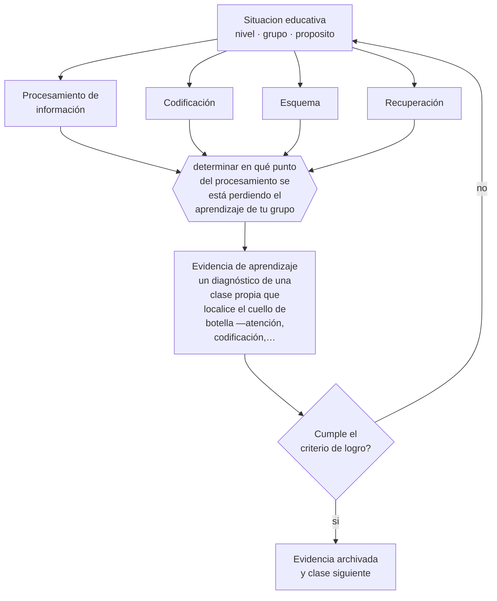

# Clase 014 — Cognitivismo y procesamiento de información

> **Parte 01 · Ciencias del aprendizaje** — clase 2 de 12

**Estado de evidencia:** `ROBUSTA` · **Etapa:** 🟢 Etapa A — Fundamentos · **Población de referencia:** transversal: los mecanismos son generales, su aplicación no 
**Decisión que habilita:** determinar en qué punto del procesamiento se está perdiendo el aprendizaje de tu grupo 
**Evidencia de aprendizaje:** un diagnóstico de una clase propia que localice el cuello de botella —atención, codificación, almacenamiento o recuperación— con evidencia

## 🎯 Propósito

Adoptar el modelo de procesamiento de información —entrada, atención, memoria de trabajo, memoria de largo plazo, recuperación— como marco para explicar por qué una explicación clara puede resultar incomprensible.

## 📚 Resultados de aprendizaje

Al finalizar esta clase podrás:

1. **Definir** con precisión los cuatro conceptos centrales de la clase y reconocerlos en una situación educativa real, no solo en su enunciado.
2. **Explicar** por qué pensar la mente como un sistema que procesa información con recursos limitados cambia cómo se diseña una clase.
3. **Decidir** —en qué punto del procesamiento se está perdiendo el aprendizaje de tu grupo— y sostener la decisión con un fundamento escrito.
4. **Producir** la evidencia de la clase —un diagnóstico de una clase propia que localice el cuello de botella —atención, codificación, almacenamiento o recuperación— con evidencia— y contrastarla contra el criterio de logro.
5. **Distinguir** lo que la evidencia sostiene de lo que es práctica instalada, preferencia personal o costumbre de la institución.

## 🧩 Conceptos centrales

| Concepto | Comprensión verificable |
|---|---|
| **Procesamiento de información** | modelo que describe el aprendizaje como flujo entre registros de memoria con capacidad limitada |
| **Codificación** | proceso por el que la información se transforma en representación almacenable |
| **Esquema** | estructura de conocimiento organizado que permite tratar muchos elementos como uno solo |
| **Recuperación** | acceso a la información almacenada; es el proceso que fortalece la memoria al ejercerse |

## 🗺️ Flujo de razonamiento

## 📖 Desarrollo

### 1. El fondo del asunto

El modelo cognitivo sustituyó la caja negra conductista por una arquitectura: la información entra si hay atención, se procesa en una memoria de trabajo muy limitada, se almacena en una memoria de largo plazo prácticamente ilimitada y solo sirve si se puede recuperar. Cada uno de esos pasos puede fallar, y fallan de manera distinta. Un estudiante que no atiende, uno que atiende pero se satura, uno que entendió y olvidó y uno que sabe pero no puede recuperar en la prueba tienen problemas diferentes y soluciones diferentes.

### 2. Cómo se traduce en decisiones de enseñanza

El uso profesional es diagnóstico. Ante un mal resultado, en vez de repetir la clase más lento, conviene preguntarse dónde se cortó el flujo: si el problema fue atencional, cambian las condiciones de inicio; si fue saturación, se segmenta y se apoya; si fue almacenamiento, se agrega práctica distribuida; si fue recuperación, se entrena recuperar en condiciones parecidas a las de la evaluación.

### 3. Qué sostiene la evidencia y qué no

El modelo es una metáfora útil, no una descripción neurológica literal. Las capacidades no son fijas ni idénticas entre personas, y el conocimiento previo modifica radicalmente los límites: lo que satura a un novato es un solo elemento para un experto. Además, el modelo explica mejor el aprendizaje de contenidos que la construcción de significado en contextos sociales, que exige los marcos de las clases siguientes.

> **Cómo leer el estado de evidencia `ROBUSTA`.** Hay evidencia convergente de varios equipos, países y diseños de investigación, incluidos estudios experimentales o cuasiexperimentales, y el efecto se sostiene al replicarlo. Puedes apoyar una decisión profesional en ella, sin olvidar que ningún efecto promedio describe a un estudiante concreto.

## 🧪 Taller guiado

Aplica la clase a **uno** de los contextos siguientes y repite después el ejercicio en un
contexto de exigencia distinta. Cambiar de contexto es parte del aprendizaje: lo que funciona
con un grupo no se traslada intacto a otro.

| Contexto | Rasgo que cambia la decisión |
|---|---|
| Contenido nuevo y difícil | la carga intrínseca es alta: el apoyo debe ser mayor |
| Contenido conocido en profundización | el andamiaje excesivo estorba en vez de ayudar |
| Grupo con conocimiento previo heterogéneo | lo que ayuda al novato perjudica al avanzado |
| Aprendizaje procedimental | la práctica y la corrección inmediata dominan la decisión |
| Aprendizaje conceptual | los ejemplos, contraejemplos y la comparación dominan |
| Estudio autónomo fuera del aula | sin autorregulación entrenada, la técnica no se sostiene |

**Secuencia de trabajo:**

1. Delimita el contexto: nivel, edad, tamaño del grupo, asignatura o experiencia y tiempo real disponible.
2. Declara qué saben ya los estudiantes y **cómo lo comprobaste**, no cómo lo supones.
3. Formula la decisión pedagógica que esta clase habilita y escribe su fundamento.
4. Anticipa qué observarías si la decisión funciona y qué observarías si no funciona.
5. Diseña de antemano la alternativa que aplicarás si la primera estrategia falla.
6. Ejecuta o simula, y registra lo observado con fecha, contexto y evidencia concreta.
7. Produce la evidencia de aprendizaje de la clase.
8. Contrástala contra el criterio de logro, corrige y recién entonces avanza.

### 📦 Evidencia de aprendizaje

Un diagnóstico de una clase propia que localice el cuello de botella —atención, codificación, almacenamiento o recuperación— con evidencia.

Debe incluir contexto, decisión, fundamento, fuentes consultadas con su fecha, indicador de
logro observable, riesgos previstos y qué harías distinto en la siguiente iteración.

## 🏆 Reto verificable

Toma una evaluación con malos resultados y clasifica los errores de diez estudiantes según el punto de falla. Diseña una acción distinta para cada grupo y compara sus efectos.

## ✅ Criterio de logro

- [ ] el diagnóstico localiza el punto de falla con evidencia y no con suposición;
- [ ] la acción propuesta corresponde específicamente al punto identificado;
- [ ] cada afirmación sobre «lo que funciona» está atribuida a una fuente identificable, con autor y fecha;
- [ ] la decisión es ejecutable con el tiempo, el espacio, el número de estudiantes y los recursos que realmente tienes;
- [ ] la evidencia queda archivada de forma reproducible: otra persona podría revisarla sin que tú se la expliques.

## ⚠️ Errores frecuentes

**Propios de esta clase:**

- Explicar más despacio y más veces cuando el problema no está en la explicación.
- Tratar la capacidad de la memoria de trabajo como rasgo fijo del estudiante y no como algo que el conocimiento previo modifica.

**Característicos de la parte 01:**

- Aplicar un hallazgo de laboratorio como receta de aula sin ajustarlo al contenido ni a la edad.
- Sostener neuromitos —estilos de aprendizaje, hemisferio dominante— por costumbre institucional.

## ♿ Diversidad, accesibilidad y ética

Localizar el punto de falla evita atribuir a desmotivación lo que es una barrera cognitiva concreta. Un estudiante con dificultad de acceso al texto puede fallar en codificación aunque comprenda perfectamente el contenido oral: el diagnóstico correcto evita una intervención que humilla y no sirve.

Antes de aplicar cualquier decisión de esta clase con estudiantes reales, revisa el
[protocolo de práctica responsable](../../../docs/ETICA_Y_PRACTICA_RESPONSABLE.md):
consentimiento, resguardo de datos personales, proporcionalidad de la intervención y derecho
de cada estudiante a no ser objeto de un ensayo que no le reporta beneficio.

## ❓ Preguntas de comprobación

1. ¿Tus estudiantes no entendieron, no retuvieron o no pudieron recuperar?
2. ¿Qué evidencia distinguiría esos tres casos en tu asignatura?
3. ¿Qué parte de tu clase exige procesar más elementos simultáneos de los que un novato puede sostener?

## 📕 Lecturas base

**Atkinson, R. & Shiffrin, R. (1968). *Human Memory: A Proposed System and Its Control Processes*.**  
*Qué aporta a esta clase:* el modelo estructural clásico; sigue siendo el andamio conceptual del que derivan las clases 017 a 020.

**Willingham, D. (2009). *Why Don't Students Like School?***  
*Qué aporta a esta clase:* traduce la arquitectura cognitiva a decisiones de aula con ejemplos concretos; excelente puente para equipos docentes.

Catálogo completo: [bibliografía del programa](../../../docs/BIBLIOGRAFIA.md) ·
[glosario](../../../docs/GLOSARIO.md) ·
[fuentes oficiales y cómo leerlas](../../../docs/FUENTES.md).

## 🔗 Conexión con el resto del programa

Es el marco que sostiene las clases 017 a 020 y la parte 11, donde la recuperación en condiciones de evaluación explica buena parte de la varianza de resultados.

> [!IMPORTANT]
> Material de formación profesional. No reemplaza un título de pedagogía, una habilitación
> legal para ejercer, ni el juicio de un equipo educativo que conoce a sus estudiantes.

---

| Anterior | Índice | Siguiente |
|---|---|---|
| [← 013 · Conductismo y aprendizaje observable](../class-01-conductismo-y-aprendizaje-observable/README.md) | [Parte 01](../README.md) · [Programa](../../../README.md) | [015 · Constructivismo →](../class-03-constructivismo/README.md) |
