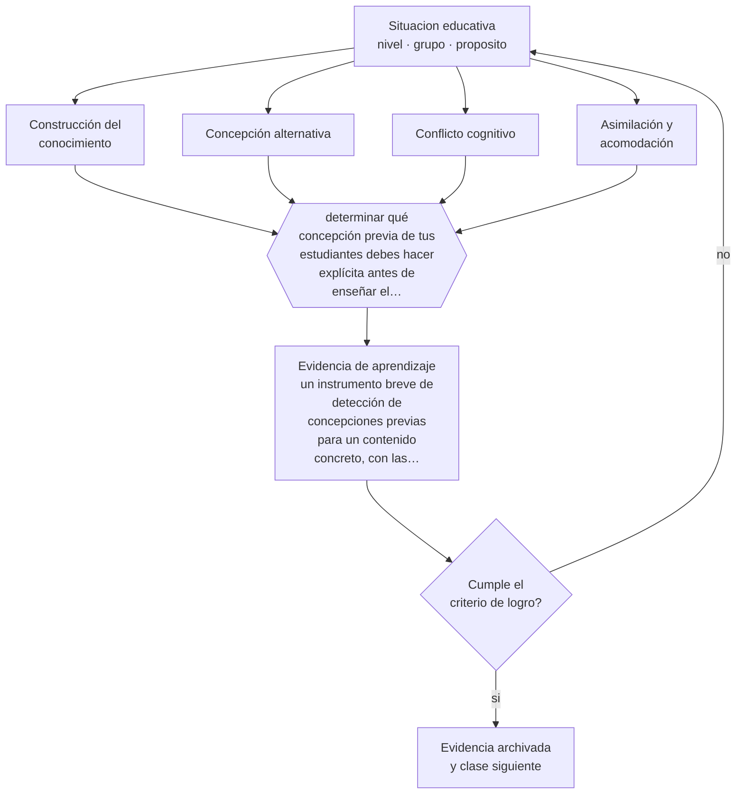

# Clase 015 — Constructivismo

> **Parte 01 · Ciencias del aprendizaje** — clase 3 de 12

**Estado de evidencia:** `CONSISTENTE` · **Etapa:** 🟢 Etapa A — Fundamentos · **Población de referencia:** transversal: los mecanismos son generales, su aplicación no 
**Decisión que habilita:** determinar qué concepción previa de tus estudiantes debes hacer explícita antes de enseñar el contenido nuevo 
**Evidencia de aprendizaje:** un instrumento breve de detección de concepciones previas para un contenido concreto, con las respuestas erróneas esperadas

## 🎯 Propósito

Comprender el aprendizaje como construcción sobre lo que ya se sabe, y usar esa idea para diseñar enseñanza que active, use y corrija las concepciones previas en vez de ignorarlas.

## 📚 Resultados de aprendizaje

Al finalizar esta clase podrás:

1. **Definir** con precisión los cuatro conceptos centrales de la clase y reconocerlos en una situación educativa real, no solo en su enunciado.
2. **Explicar** por qué el conocimiento previo es a la vez el mejor recurso y el principal obstáculo para aprender algo nuevo.
3. **Decidir** —qué concepción previa de tus estudiantes debes hacer explícita antes de enseñar el contenido nuevo— y sostener la decisión con un fundamento escrito.
4. **Producir** la evidencia de la clase —un instrumento breve de detección de concepciones previas para un contenido concreto, con las respuestas erróneas esperadas— y contrastarla contra el criterio de logro.
5. **Distinguir** lo que la evidencia sostiene de lo que es práctica instalada, preferencia personal o costumbre de la institución.

## 🧩 Conceptos centrales

| Concepto | Comprensión verificable |
|---|---|
| **Construcción del conocimiento** | proceso por el que el sujeto integra información nueva reorganizando lo que ya sabe |
| **Concepción alternativa** | idea previa coherente y estable que contradice el conocimiento disciplinar y resiste la enseñanza |
| **Conflicto cognitivo** | situación en que la evidencia contradice la concepción previa y fuerza su revisión |
| **Asimilación y acomodación** | incorporar lo nuevo a un esquema existente o modificar el esquema para que lo nuevo quepa |

## 🗺️ Flujo de razonamiento

## 📖 Desarrollo

### 1. El fondo del asunto

El aporte central del constructivismo es que nadie aprende sobre un vacío: toda información nueva se interpreta desde lo que ya se cree. De ahí que las concepciones alternativas —que la Tierra tiene estaciones porque se acerca al Sol, que los objetos pesados caen más rápido— sobrevivan a explicaciones correctas repetidas durante años. No son errores por falta de información: son teorías que funcionan razonablemente en la experiencia cotidiana, y por eso resisten.

### 2. Cómo se traduce en decisiones de enseñanza

La consecuencia didáctica es que la enseñanza debe empezar por hacer visible lo que el estudiante cree, no por presentar la versión correcta. Un instrumento de tres preguntas bien diseñadas revela la concepción previa dominante del curso; a partir de ahí se puede confrontar con evidencia que la concepción no explica. Enseñar sin ese paso produce el fenómeno conocido: el estudiante aprende la respuesta escolar para la prueba y conserva intacta su teoría original.

### 3. Qué sostiene la evidencia y qué no

El constructivismo es una teoría del aprendizaje, no un método de enseñanza, y esa confusión ha producido daño real. De «el estudiante construye su conocimiento» no se sigue que deba descubrirlo sin guía: la evidencia sobre instrucción con guía mínima es consistentemente desfavorable para novatos. Construir es lo que hace la mente; guiar es lo que hace el docente, y no son alternativas.

> **Cómo leer el estado de evidencia `CONSISTENTE`.** La evidencia es amplia y coherente, pero proviene sobre todo de estudios correlacionales, de síntesis con heterogeneidad alta o de contextos distintos al tuyo. Sirve para orientar la decisión y exige que compruebes el efecto en tu propio grupo.

## 🧪 Taller guiado

Aplica la clase a **uno** de los contextos siguientes y repite después el ejercicio en un
contexto de exigencia distinta. Cambiar de contexto es parte del aprendizaje: lo que funciona
con un grupo no se traslada intacto a otro.

| Contexto | Rasgo que cambia la decisión |
|---|---|
| Contenido nuevo y difícil | la carga intrínseca es alta: el apoyo debe ser mayor |
| Contenido conocido en profundización | el andamiaje excesivo estorba en vez de ayudar |
| Grupo con conocimiento previo heterogéneo | lo que ayuda al novato perjudica al avanzado |
| Aprendizaje procedimental | la práctica y la corrección inmediata dominan la decisión |
| Aprendizaje conceptual | los ejemplos, contraejemplos y la comparación dominan |
| Estudio autónomo fuera del aula | sin autorregulación entrenada, la técnica no se sostiene |

**Secuencia de trabajo:**

1. Delimita el contexto: nivel, edad, tamaño del grupo, asignatura o experiencia y tiempo real disponible.
2. Declara qué saben ya los estudiantes y **cómo lo comprobaste**, no cómo lo supones.
3. Formula la decisión pedagógica que esta clase habilita y escribe su fundamento.
4. Anticipa qué observarías si la decisión funciona y qué observarías si no funciona.
5. Diseña de antemano la alternativa que aplicarás si la primera estrategia falla.
6. Ejecuta o simula, y registra lo observado con fecha, contexto y evidencia concreta.
7. Produce la evidencia de aprendizaje de la clase.
8. Contrástala contra el criterio de logro, corrige y recién entonces avanza.

### 📦 Evidencia de aprendizaje

Un instrumento breve de detección de concepciones previas para un contenido concreto, con las respuestas erróneas esperadas.

Debe incluir contexto, decisión, fundamento, fuentes consultadas con su fecha, indicador de
logro observable, riesgos previstos y qué harías distinto en la siguiente iteración.

## 🏆 Reto verificable

Aplica tu instrumento a un curso real. Identifica la concepción alternativa más frecuente y diseña una situación que la ponga a prueba de forma que el propio estudiante detecte la contradicción.

## ✅ Criterio de logro

- [ ] el instrumento anticipa qué respuesta errónea revelará cada concepción alternativa;
- [ ] la secuencia posterior confronta la concepción con evidencia que ella no puede explicar;
- [ ] cada afirmación sobre «lo que funciona» está atribuida a una fuente identificable, con autor y fecha;
- [ ] la decisión es ejecutable con el tiempo, el espacio, el número de estudiantes y los recursos que realmente tienes;
- [ ] la evidencia queda archivada de forma reproducible: otra persona podría revisarla sin que tú se la expliques.

## ⚠️ Errores frecuentes

**Propios de esta clase:**

- Deducir del constructivismo que la instrucción explícita es incompatible con el aprendizaje activo.
- Presentar la versión correcta sin haber hecho visible la concepción previa que compite con ella.

**Característicos de la parte 01:**

- Aplicar un hallazgo de laboratorio como receta de aula sin ajustarlo al contenido ni a la edad.
- Sostener neuromitos —estilos de aprendizaje, hemisferio dominante— por costumbre institucional.

## ♿ Diversidad, accesibilidad y ética

Las concepciones previas están atravesadas por la cultura y la lengua del hogar. Tratarlas como ignorancia produce exclusión; tratarlas como punto de partida legítimo permite corregirlas sin desautorizar al estudiante ni a su entorno familiar.

Antes de aplicar cualquier decisión de esta clase con estudiantes reales, revisa el
[protocolo de práctica responsable](../../../docs/ETICA_Y_PRACTICA_RESPONSABLE.md):
consentimiento, resguardo de datos personales, proporcionalidad de la intervención y derecho
de cada estudiante a no ser objeto de un ensayo que no le reporta beneficio.

## ❓ Preguntas de comprobación

1. ¿Qué cree tu grupo sobre este contenido antes de que tú lo enseñes?
2. ¿Qué respuesta correcta podría estar ocultando una concepción errónea intacta?
3. ¿Qué evidencia haría insostenible la concepción previa de tus estudiantes?

## 📕 Lecturas base

**Piaget, J. (1970). *Psicología y epistemología*.**  
*Qué aporta a esta clase:* fuente del par asimilación-acomodación; útil para entender el mecanismo, con las reservas actuales sobre las etapas fijas.

**Kirschner, P., Sweller, J. & Clark, R. (2006). *Why Minimal Guidance During Instruction Does Not Work*. Educational Psychologist, 41(2).**  
*Qué aporta a esta clase:* el contrapunto obligatorio: distingue la teoría del aprendizaje del método de enseñanza que se le atribuye.

Catálogo completo: [bibliografía del programa](../../../docs/BIBLIOGRAFIA.md) ·
[glosario](../../../docs/GLOSARIO.md) ·
[fuentes oficiales y cómo leerlas](../../../docs/FUENTES.md).

## 🔗 Conexión con el resto del programa

Se apoya en la clase 014 y prepara la clase 016. En la parte 10 reaparece como anticipación del error frecuente, que es el núcleo del conocimiento pedagógico del contenido.

> [!IMPORTANT]
> Material de formación profesional. No reemplaza un título de pedagogía, una habilitación
> legal para ejercer, ni el juicio de un equipo educativo que conoce a sus estudiantes.

---

| Anterior | Índice | Siguiente |
|---|---|---|
| [← 014 · Cognitivismo y procesamiento de información](../class-02-cognitivismo-y-procesamiento-de-informacion/README.md) | [Parte 01](../README.md) · [Programa](../../../README.md) | [016 · Socioconstructivismo y aprendizaje mediado →](../class-04-socioconstructivismo-y-aprendizaje-mediado/README.md) |
