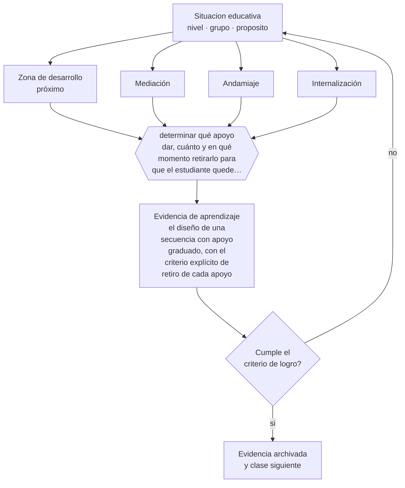

# Clase 016 — Socioconstructivismo y aprendizaje mediado

> **Parte 01 · Ciencias del aprendizaje** — clase 4 de 12

**Estado de evidencia:** `CONSISTENTE` · **Etapa:** 🟢 Etapa A — Fundamentos · **Población de referencia:** transversal: los mecanismos son generales, su aplicación no 
**Decisión que habilita:** determinar qué apoyo dar, cuánto y en qué momento retirarlo para que el estudiante quede autónomo 
**Evidencia de aprendizaje:** el diseño de una secuencia con apoyo graduado, con el criterio explícito de retiro de cada apoyo

## 🎯 Propósito

Incorporar la dimensión social del aprendizaje: el desarrollo se produce en la interacción con otros más competentes, y la enseñanza opera en la distancia entre lo que se logra con apoyo y lo que se logra sin él.

## 📚 Resultados de aprendizaje

Al finalizar esta clase podrás:

1. **Definir** con precisión los cuatro conceptos centrales de la clase y reconocerlos en una situación educativa real, no solo en su enunciado.
2. **Explicar** por qué lo que un estudiante logra hoy con ayuda es mejor predictor de su aprendizaje que lo que logra solo.
3. **Decidir** —qué apoyo dar, cuánto y en qué momento retirarlo para que el estudiante quede autónomo— y sostener la decisión con un fundamento escrito.
4. **Producir** la evidencia de la clase —el diseño de una secuencia con apoyo graduado, con el criterio explícito de retiro de cada apoyo— y contrastarla contra el criterio de logro.
5. **Distinguir** lo que la evidencia sostiene de lo que es práctica instalada, preferencia personal o costumbre de la institución.

## 🧩 Conceptos centrales

| Concepto | Comprensión verificable |
|---|---|
| **Zona de desarrollo próximo** | distancia entre lo que se logra de forma autónoma y lo que se logra con apoyo competente |
| **Mediación** | intervención de otra persona o de un instrumento cultural que hace posible un desempeño todavía no autónomo |
| **Andamiaje** | apoyo temporal, ajustado y retirado progresivamente a medida que aumenta el dominio |
| **Internalización** | proceso por el que una regulación externa se convierte en regulación propia del estudiante |

## 🗺️ Flujo de razonamiento

## 📖 Desarrollo

### 1. El fondo del asunto

La contribución socioconstructivista desplaza el foco desde la mente aislada hacia la interacción. Lo que un estudiante hace hoy acompañado, mañana lo hará solo: por eso el desempeño asistido informa más sobre su potencial de aprendizaje que el desempeño autónomo. El lenguaje cumple aquí un papel doble: es el medio de la interacción y el instrumento con el que después el estudiante se regula a sí mismo.

### 2. Cómo se traduce en decisiones de enseñanza

El andamiaje bien hecho tiene tres propiedades verificables: es ajustado al desempeño real —no al esperado—, es temporal y tiene criterio de retiro definido de antemano. Un apoyo permanente deja de ser andamiaje y se convierte en dependencia; un apoyo retirado antes de tiempo produce fracaso evitable. Escribir el criterio de retiro junto con el apoyo es lo que convierte una intuición en una decisión profesional.

### 3. Qué sostiene la evidencia y qué no

La zona de desarrollo próximo es un concepto potente y difícil de operacionalizar: no existe una medida estándar. Buena parte de su uso en documentos escolares es decorativo. Además, la interacción entre pares solo produce aprendizaje bajo condiciones específicas —tarea que exige interdependencia, roles, responsabilidad individual—; sin ellas, el trabajo en grupo reparte la tarea en vez de construir conocimiento.

> **Cómo leer el estado de evidencia `CONSISTENTE`.** La evidencia es amplia y coherente, pero proviene sobre todo de estudios correlacionales, de síntesis con heterogeneidad alta o de contextos distintos al tuyo. Sirve para orientar la decisión y exige que compruebes el efecto en tu propio grupo.

## 🧪 Taller guiado

Aplica la clase a **uno** de los contextos siguientes y repite después el ejercicio en un
contexto de exigencia distinta. Cambiar de contexto es parte del aprendizaje: lo que funciona
con un grupo no se traslada intacto a otro.

| Contexto | Rasgo que cambia la decisión |
|---|---|
| Contenido nuevo y difícil | la carga intrínseca es alta: el apoyo debe ser mayor |
| Contenido conocido en profundización | el andamiaje excesivo estorba en vez de ayudar |
| Grupo con conocimiento previo heterogéneo | lo que ayuda al novato perjudica al avanzado |
| Aprendizaje procedimental | la práctica y la corrección inmediata dominan la decisión |
| Aprendizaje conceptual | los ejemplos, contraejemplos y la comparación dominan |
| Estudio autónomo fuera del aula | sin autorregulación entrenada, la técnica no se sostiene |

**Secuencia de trabajo:**

1. Delimita el contexto: nivel, edad, tamaño del grupo, asignatura o experiencia y tiempo real disponible.
2. Declara qué saben ya los estudiantes y **cómo lo comprobaste**, no cómo lo supones.
3. Formula la decisión pedagógica que esta clase habilita y escribe su fundamento.
4. Anticipa qué observarías si la decisión funciona y qué observarías si no funciona.
5. Diseña de antemano la alternativa que aplicarás si la primera estrategia falla.
6. Ejecuta o simula, y registra lo observado con fecha, contexto y evidencia concreta.
7. Produce la evidencia de aprendizaje de la clase.
8. Contrástala contra el criterio de logro, corrige y recién entonces avanza.

### 📦 Evidencia de aprendizaje

El diseño de una secuencia con apoyo graduado, con el criterio explícito de retiro de cada apoyo.

Debe incluir contexto, decisión, fundamento, fuentes consultadas con su fecha, indicador de
logro observable, riesgos previstos y qué harías distinto en la siguiente iteración.

## 🏆 Reto verificable

Diseña la misma tarea con tres niveles de andamiaje y aplícala. Registra qué estudiantes pudieron avanzar un nivel en dos semanas y qué apoyo resultó imposible de retirar.

## ✅ Criterio de logro

- [ ] cada apoyo declara su criterio de retiro y el indicador que lo activa;
- [ ] la secuencia muestra al menos un momento de desempeño sin apoyo antes de evaluar;
- [ ] cada afirmación sobre «lo que funciona» está atribuida a una fuente identificable, con autor y fecha;
- [ ] la decisión es ejecutable con el tiempo, el espacio, el número de estudiantes y los recursos que realmente tienes;
- [ ] la evidencia queda archivada de forma reproducible: otra persona podría revisarla sin que tú se la expliques.

## ⚠️ Errores frecuentes

**Propios de esta clase:**

- Usar la expresión «zona de desarrollo próximo» sin poder decir qué apoyo concreto se ofrece ni cuándo se retira.
- Suponer que juntar estudiantes en grupos produce por sí solo aprendizaje mediado.

**Característicos de la parte 01:**

- Aplicar un hallazgo de laboratorio como receta de aula sin ajustarlo al contenido ni a la edad.
- Sostener neuromitos —estilos de aprendizaje, hemisferio dominante— por costumbre institucional.

## ♿ Diversidad, accesibilidad y ética

El apoyo graduado es el mecanismo central de la enseñanza inclusiva: permite exigir el mismo objetivo con vías de acceso distintas. La regla profesional es ajustar el andamio, no bajar la meta, y documentar el retiro para que el apoyo no se vuelva una etiqueta permanente.

Antes de aplicar cualquier decisión de esta clase con estudiantes reales, revisa el
[protocolo de práctica responsable](../../../docs/ETICA_Y_PRACTICA_RESPONSABLE.md):
consentimiento, resguardo de datos personales, proporcionalidad de la intervención y derecho
de cada estudiante a no ser objeto de un ensayo que no le reporta beneficio.

## ❓ Preguntas de comprobación

1. ¿Qué apoyo estás dando hoy que deberías haber retirado hace un mes?
2. ¿Cómo sabrías que un estudiante ya no necesita la ayuda que le das?
3. ¿Qué condición hace que un trabajo en grupo enseñe en vez de repartir tareas?

## 📕 Lecturas base

**Vygotsky, L. (1978). *Mind in Society*.**  
*Qué aporta a esta clase:* fuente directa de la zona de desarrollo próximo y de la mediación; conviene leer el original antes que sus resúmenes.

**Wood, D., Bruner, J. & Ross, G. (1976). *The Role of Tutoring in Problem Solving*.**  
*Qué aporta a esta clase:* el artículo que introduce el andamiaje con criterios observables de ajuste y retiro.

Catálogo completo: [bibliografía del programa](../../../docs/BIBLIOGRAFIA.md) ·
[glosario](../../../docs/GLOSARIO.md) ·
[fuentes oficiales y cómo leerlas](../../../docs/FUENTES.md).

## 🔗 Conexión con el resto del programa

Es la base teórica de la parte 10 (andamiaje y práctica guiada) y de la parte 08 (diversificación). Complementa la clase 015 al mostrar que la construcción es social además de individual.

> [!IMPORTANT]
> Material de formación profesional. No reemplaza un título de pedagogía, una habilitación
> legal para ejercer, ni el juicio de un equipo educativo que conoce a sus estudiantes.

---

| Anterior | Índice | Siguiente |
|---|---|---|
| [← 015 · Constructivismo](../class-03-constructivismo/README.md) | [Parte 01](../README.md) · [Programa](../../../README.md) | [017 · Memoria de trabajo y memoria de largo plazo →](../class-05-memoria-de-trabajo-y-memoria-de-largo-plazo/README.md) |
