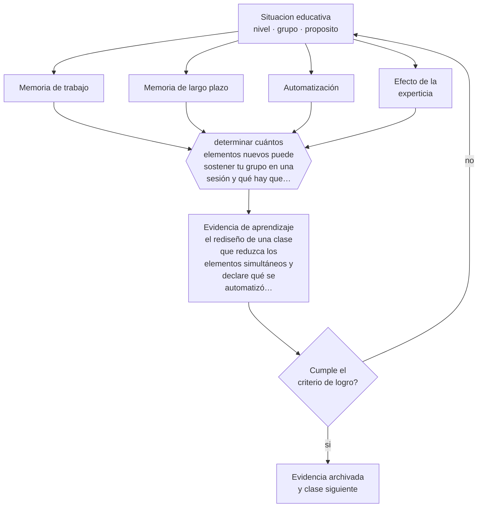

# Clase 017 — Memoria de trabajo y memoria de largo plazo

> **Parte 01 · Ciencias del aprendizaje** — clase 5 de 12

**Estado de evidencia:** `ROBUSTA` · **Etapa:** 🟢 Etapa A — Fundamentos · **Población de referencia:** transversal: los mecanismos son generales, su aplicación no 
**Decisión que habilita:** determinar cuántos elementos nuevos puede sostener tu grupo en una sesión y qué hay que automatizar antes 
**Evidencia de aprendizaje:** el rediseño de una clase que reduzca los elementos simultáneos y declare qué se automatizó previamente

## 🎯 Propósito

Usar la asimetría entre una memoria de trabajo muy limitada y una memoria de largo plazo prácticamente ilimitada como criterio de diseño: casi toda dificultad de aprendizaje se explica por saturación o por falta de conocimiento previo automatizado.

## 📚 Resultados de aprendizaje

Al finalizar esta clase podrás:

1. **Definir** con precisión los cuatro conceptos centrales de la clase y reconocerlos en una situación educativa real, no solo en su enunciado.
2. **Explicar** por qué la limitación de la memoria de trabajo es la restricción más importante que enfrenta cualquier clase.
3. **Decidir** —cuántos elementos nuevos puede sostener tu grupo en una sesión y qué hay que automatizar antes— y sostener la decisión con un fundamento escrito.
4. **Producir** la evidencia de la clase —el rediseño de una clase que reduzca los elementos simultáneos y declare qué se automatizó previamente— y contrastarla contra el criterio de logro.
5. **Distinguir** lo que la evidencia sostiene de lo que es práctica instalada, preferencia personal o costumbre de la institución.

## 🧩 Conceptos centrales

| Concepto | Comprensión verificable |
|---|---|
| **Memoria de trabajo** | sistema de capacidad muy limitada donde se procesa la información consciente en el momento |
| **Memoria de largo plazo** | almacén de capacidad prácticamente ilimitada; su contenido organizado libera memoria de trabajo |
| **Automatización** | estado en que un procedimiento se ejecuta sin consumir atención consciente |
| **Efecto de la experticia** | el mismo material satura al novato y resulta trivial para el experto por su organización en esquemas |

## 🗺️ Flujo de razonamiento

## 📖 Desarrollo

### 1. El fondo del asunto

La memoria de trabajo sostiene pocos elementos a la vez y por poco tiempo; la memoria de largo plazo no tiene ese límite. La consecuencia es contraintuitiva: la mejor forma de aumentar la capacidad de procesamiento de un estudiante no es entrenarle la memoria, sino aumentar su conocimiento previo organizado. Un lector fluido puede pensar en el argumento porque la decodificación ya no le cuesta nada; un lector que aún decodifica no tiene capacidad disponible para comprender.

### 2. Cómo se traduce en decisiones de enseñanza

Esto reordena la discusión sobre práctica y comprensión. Automatizar hechos básicos —correspondencias grafema-fonema, tablas, procedimientos frecuentes, vocabulario técnico— no es enseñanza mecánica: es lo que libera capacidad para razonar. Del mismo modo, una clase que introduce cinco conceptos nuevos, una notación nueva y una actividad nueva a la vez falla por diseño, aunque cada componente sea correcto.

### 3. Qué sostiene la evidencia y qué no

La capacidad no es un número fijo ni idéntico entre personas, y su medición depende del material. Tampoco todo lo que satura debe eliminarse: cierta dificultad es necesaria para aprender. La distinción operativa es entre carga que proviene del contenido —inevitable— y carga que proviene del diseño —evitable—, y se trabaja en la clase siguiente.

> **Cómo leer el estado de evidencia `ROBUSTA`.** Hay evidencia convergente de varios equipos, países y diseños de investigación, incluidos estudios experimentales o cuasiexperimentales, y el efecto se sostiene al replicarlo. Puedes apoyar una decisión profesional en ella, sin olvidar que ningún efecto promedio describe a un estudiante concreto.

## 🧪 Taller guiado

Aplica la clase a **uno** de los contextos siguientes y repite después el ejercicio en un
contexto de exigencia distinta. Cambiar de contexto es parte del aprendizaje: lo que funciona
con un grupo no se traslada intacto a otro.

| Contexto | Rasgo que cambia la decisión |
|---|---|
| Contenido nuevo y difícil | la carga intrínseca es alta: el apoyo debe ser mayor |
| Contenido conocido en profundización | el andamiaje excesivo estorba en vez de ayudar |
| Grupo con conocimiento previo heterogéneo | lo que ayuda al novato perjudica al avanzado |
| Aprendizaje procedimental | la práctica y la corrección inmediata dominan la decisión |
| Aprendizaje conceptual | los ejemplos, contraejemplos y la comparación dominan |
| Estudio autónomo fuera del aula | sin autorregulación entrenada, la técnica no se sostiene |

**Secuencia de trabajo:**

1. Delimita el contexto: nivel, edad, tamaño del grupo, asignatura o experiencia y tiempo real disponible.
2. Declara qué saben ya los estudiantes y **cómo lo comprobaste**, no cómo lo supones.
3. Formula la decisión pedagógica que esta clase habilita y escribe su fundamento.
4. Anticipa qué observarías si la decisión funciona y qué observarías si no funciona.
5. Diseña de antemano la alternativa que aplicarás si la primera estrategia falla.
6. Ejecuta o simula, y registra lo observado con fecha, contexto y evidencia concreta.
7. Produce la evidencia de aprendizaje de la clase.
8. Contrástala contra el criterio de logro, corrige y recién entonces avanza.

### 📦 Evidencia de aprendizaje

El rediseño de una clase que reduzca los elementos simultáneos y declare qué se automatizó previamente.

Debe incluir contexto, decisión, fundamento, fuentes consultadas con su fecha, indicador de
logro observable, riesgos previstos y qué harías distinto en la siguiente iteración.

## 🏆 Reto verificable

Cronometra una clase tuya e identifica el momento exacto en que la mayoría se pierde. Rediseña ese tramo reduciendo elementos simultáneos y comprueba si el punto de quiebre se desplaza.

## ✅ Criterio de logro

- [ ] el rediseño identifica y elimina al menos dos fuentes de carga evitable;
- [ ] declara qué debe estar automatizado antes de la clase y cómo se comprobará;
- [ ] cada afirmación sobre «lo que funciona» está atribuida a una fuente identificable, con autor y fecha;
- [ ] la decisión es ejecutable con el tiempo, el espacio, el número de estudiantes y los recursos que realmente tienes;
- [ ] la evidencia queda archivada de forma reproducible: otra persona podría revisarla sin que tú se la expliques.

## ⚠️ Errores frecuentes

**Propios de esta clase:**

- Introducir contenido, formato y herramienta nuevos en la misma sesión.
- Considerar la automatización de lo básico como enseñanza de baja calidad.

**Característicos de la parte 01:**

- Aplicar un hallazgo de laboratorio como receta de aula sin ajustarlo al contenido ni a la edad.
- Sostener neuromitos —estilos de aprendizaje, hemisferio dominante— por costumbre institucional.

## ♿ Diversidad, accesibilidad y ética

Los estudiantes con dificultades de memoria de trabajo —frecuentes en TDAH y en dificultades específicas del aprendizaje— se benefician de forma desproporcionada de reducir carga evitable: instrucciones escritas, un paso a la vez, apoyos visuales permanentes. Son medidas universales que no requieren diagnóstico previo.

Antes de aplicar cualquier decisión de esta clase con estudiantes reales, revisa el
[protocolo de práctica responsable](../../../docs/ETICA_Y_PRACTICA_RESPONSABLE.md):
consentimiento, resguardo de datos personales, proporcionalidad de la intervención y derecho
de cada estudiante a no ser objeto de un ensayo que no le reporta beneficio.

## ❓ Preguntas de comprobación

1. ¿Cuántos elementos nuevos tiene que sostener a la vez un estudiante en tu próxima clase?
2. ¿Qué automatismo faltante está consumiendo la capacidad que tu grupo necesita para comprender?
3. ¿Por qué a ti el material te parece simple y a ellos no?

## 📕 Lecturas base

**Miller, G. (1956). *The Magical Number Seven, Plus or Minus Two*.**  
*Qué aporta a esta clase:* el punto de partida histórico sobre límites de procesamiento; léelo por el concepto de agrupamiento en unidades.

**Sweller, J., Ayres, P. & Kalyuga, S. (2011). *Cognitive Load Theory*.**  
*Qué aporta a esta clase:* establece la asimetría entre memorias como principio de diseño instruccional y aporta la evidencia experimental.

Catálogo completo: [bibliografía del programa](../../../docs/BIBLIOGRAFIA.md) ·
[glosario](../../../docs/GLOSARIO.md) ·
[fuentes oficiales y cómo leerlas](../../../docs/FUENTES.md).

## 🔗 Conexión con el resto del programa

Sostiene directamente la clase 019 y la parte 10. Explica también por qué la parte 04 insiste en la fluidez lectora y de cálculo como condición de la comprensión.

> [!IMPORTANT]
> Material de formación profesional. No reemplaza un título de pedagogía, una habilitación
> legal para ejercer, ni el juicio de un equipo educativo que conoce a sus estudiantes.

---

| Anterior | Índice | Siguiente |
|---|---|---|
| [← 016 · Socioconstructivismo y aprendizaje mediado](../class-04-socioconstructivismo-y-aprendizaje-mediado/README.md) | [Parte 01](../README.md) · [Programa](../../../README.md) | [018 · Atención y control ejecutivo →](../class-06-atencion-y-control-ejecutivo/README.md) |
