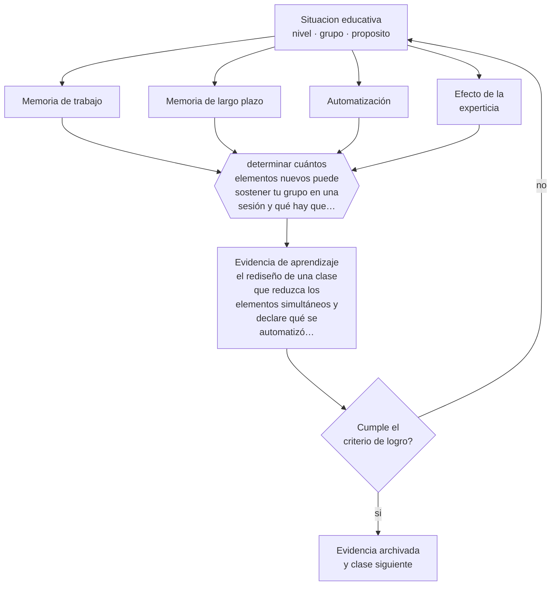

# Clase 017 — Memoria de trabajo y memoria de largo plazo

> **Parte 01 · Ciencias del aprendizaje** — clase 5 de 12

**Estado de evidencia:** `ROBUSTA` · **Etapa:** 🟢 Etapa A — Fundamentos · **Población de referencia:** transversal: los mecanismos son generales, su aplicación no 
**Decisión que habilita:** determinar cuántos elementos nuevos puede sostener tu grupo en una sesión y qué hay que automatizar antes 
**Evidencia de aprendizaje:** el rediseño de una clase que reduzca los elementos simultáneos y declare qué se automatizó previamente

## 🎯 Propósito

Usar la asimetría entre una memoria de trabajo muy limitada y una memoria de largo plazo prácticamente ilimitada como criterio de diseño: casi toda dificultad de aprendizaje se explica por saturación o por falta de conocimiento previo automatizado.

## 📚 Resultados de aprendizaje

Al finalizar esta clase podrás:

1. **Definir** con precisión los cuatro conceptos centrales de la clase y reconocerlos en una situación educativa real, no solo en su enunciado.
2. **Explicar** por qué la limitación de la memoria de trabajo es la restricción más importante que enfrenta cualquier clase.
3. **Decidir** —cuántos elementos nuevos puede sostener tu grupo en una sesión y qué hay que automatizar antes— y sostener la decisión con un fundamento escrito.
4. **Producir** la evidencia de la clase —el rediseño de una clase que reduzca los elementos simultáneos y declare qué se automatizó previamente— y contrastarla contra el criterio de logro.
5. **Distinguir** lo que la evidencia sostiene de lo que es práctica instalada, preferencia personal o costumbre de la institución.

## 🧭 Agenda sugerida (90 minutos)

| Minutos | Bloque | Qué ocurre |
|---:|---|---|
| 0–10 | Activación | Recuperar sin mirar la clase anterior y responder la pregunta de foco. |
| 10–25 | Conceptos | Definir los cuatro conceptos y reconocerlos en un caso real. |
| 25–45 | Modelo mental | Recorrer el método: delimitar el contexto y comprobar —no suponer— qué saben ya los estudiantes. |
| 45–70 | Ejemplo trabajado | Aplicar el método al caso de la parte, paso a paso y con evidencia. |
| 70–85 | Taller | Trasladar la decisión al contexto propio y anticipar su alternativa. |
| 85–90 | Cierre | Fijar responsable, plazo e indicador de la evidencia de aprendizaje. |

Fuera de la sesión, la clase exige aproximadamente **una hora y media** de práctica y de
producción de la evidencia. Si el tiempo se recorta, se recorta el ejemplo trabajado, nunca la
producción de evidencia: es la única parte que prueba el aprendizaje.

## 🧩 Conceptos centrales

| Concepto | Comprensión verificable |
|---|---|
| **Memoria de trabajo** | sistema de capacidad muy limitada donde se procesa la información consciente en el momento |
| **Memoria de largo plazo** | almacén de capacidad prácticamente ilimitada; su contenido organizado libera memoria de trabajo |
| **Automatización** | estado en que un procedimiento se ejecuta sin consumir atención consciente |
| **Efecto de la experticia** | el mismo material satura al novato y resulta trivial para el experto por su organización en esquemas |

## 🧠 Modelo mental

El método de esta clase, en cinco pasos que se ejecutan en orden:

1. Delimitar el contexto y comprobar —no suponer— qué saben ya los estudiantes.
2. Clasificar la situación distinguiendo **Memoria de trabajo** de **Memoria de largo plazo**.
3. Decidir con fundamento, usando **Automatización** como criterio y declarando la fuente.
4. Anticipar qué evidencia confirmaría la decisión y cuál la refutaría, con **Efecto de la experticia** a la vista.
5. Registrar lo ocurrido y contrastarlo contra el criterio de logro antes de avanzar.

Lo que hace profesional a este método no son los pasos sino la evidencia que exige en cada uno.
Estas son las señales observables con las que se comprueba, y que deben quedar definidas **antes**
de recogerlas:

| Señal observable | Cómo se recoge y qué significa |
|---|---|
| **Evidencia de partida** | qué sabían o podían hacer los estudiantes antes de la decisión, comprobado y no supuesto |
| **Evidencia de proceso** | qué se observó mientras la decisión se aplicaba, con fecha, contexto y responsable del registro |
| **Evidencia de logro** | qué muestra el rediseño de una clase que reduzca los elementos simultáneos y declare qué se automatizó previamente frente al criterio declarado de antemano |

**Frontera de aplicación.** El método vale mientras las condiciones que lo sostienen se cumplan.
La capacidad no es un número fijo ni idéntico entre personas, y su medición depende del material. Cuando esa condición falla, el paso siguiente no es forzar el método:
es declarar el límite y decidir con menos certeza, dejándolo por escrito.

## 🗺️ Flujo de razonamiento

## 📖 Desarrollo

### 1. El fondo del asunto

La memoria de trabajo sostiene pocos elementos a la vez y por poco tiempo; la memoria de largo plazo no tiene ese límite. La consecuencia es contraintuitiva: la mejor forma de aumentar la capacidad de procesamiento de un estudiante no es entrenarle la memoria, sino aumentar su conocimiento previo organizado. Un lector fluido puede pensar en el argumento porque la decodificación ya no le cuesta nada; un lector que aún decodifica no tiene capacidad disponible para comprender.

### 2. Frontera conceptual: qué es y qué no es

Los cuatro conceptos de esta clase se confunden entre sí con facilidad, y esa confusión no es
inocua: produce decisiones que atacan el problema equivocado. **Memoria de trabajo** no es lo
mismo que **Memoria de largo plazo** —almacén de capacidad prácticamente ilimitada; su contenido organizado libera memoria de trabajo—, y tratarlos como sinónimos hace
que la intervención se dirija al lugar incorrecto. Del mismo modo, **Automatización** y
**Efecto de la experticia** describen aspectos distintos de la misma situación: el primero
estado en que un procedimiento se ejecuta sin consumir atención consciente, mientras el segundo el mismo material satura al novato y resulta trivial para el experto por su organización en esquemas.

La prueba de que la distinción está entendida es operacional, no verbal: dos personas que
observan la misma clase deben poder clasificar el mismo episodio de la misma manera. Si no
coinciden, el problema está en la definición y no en el observador. El error de clasificación más
frecuente en esta materia es el primero de los que se listan más abajo, y conviene anticiparlo
antes de aplicar nada.

### 3. Cómo se observa y se mide

Nada de lo anterior sirve si no se puede observar. Estas son las señales que esta clase usa y
cómo se recogen:

- **Evidencia de partida.** Qué sabían o podían hacer los estudiantes antes de la decisión, comprobado y no supuesto. Se registra con fecha y contexto; sin eso, la señal no distingue una tendencia de una casualidad.
- **Evidencia de proceso.** Qué se observó mientras la decisión se aplicaba, con fecha, contexto y responsable del registro. Se registra con fecha y contexto; sin eso, la señal no distingue una tendencia de una casualidad.
- **Evidencia de logro.** Qué muestra el rediseño de una clase que reduzca los elementos simultáneos y declare qué se automatizó previamente frente al criterio declarado de antemano. Se registra con fecha y contexto; sin eso, la señal no distingue una tendencia de una casualidad.

Ninguna de estas señales es el aprendizaje: son indicios de él. Confundir el indicio con el
fenómeno es el error clásico de la medición educativa, y por eso cada señal se interpreta junto
con el contexto, el punto de partida del grupo y lo que el propio estudiante puede explicar sobre
su trabajo.

### 4. Cómo se traduce en decisiones de enseñanza

Esto reordena la discusión sobre práctica y comprensión. Automatizar hechos básicos —correspondencias grafema-fonema, tablas, procedimientos frecuentes, vocabulario técnico— no es enseñanza mecánica: es lo que libera capacidad para razonar. Del mismo modo, una clase que introduce cinco conceptos nuevos, una notación nueva y una actividad nueva a la vez falla por diseño, aunque cada componente sea correcto.

### 5. Qué sostiene la evidencia y qué no

La capacidad no es un número fijo ni idéntico entre personas, y su medición depende del material. Tampoco todo lo que satura debe eliminarse: cierta dificultad es necesaria para aprender. La distinción operativa es entre carga que proviene del contenido —inevitable— y carga que proviene del diseño —evitable—, y se trabaja en la clase siguiente.

> **Cómo leer el estado de evidencia `ROBUSTA`.** Hay evidencia convergente de varios equipos, países y diseños de investigación, incluidos estudios experimentales o cuasiexperimentales, y el efecto se sostiene al replicarlo. Puedes apoyar una decisión profesional en ella, sin olvidar que ningún efecto promedio describe a un estudiante concreto.

### 6. Integración: de los conceptos a una decisión defendible

Una decisión es defendible cuando puede explicarse a alguien que no estuvo presente. Esta clase
te deja en condiciones de cuántos elementos nuevos puede sostener tu grupo en una sesión y qué hay que automatizar antes, y esa decisión se sostiene solo si
declara cuatro cosas: la evidencia que la funda, el supuesto que asume, el indicador que la
comprobaría y la condición que la haría cambiar.

Ese es también el criterio con el que se evalúa la evidencia de aprendizaje de la clase. Un
análisis que podría copiarse a otra clase, a otro curso o a otro establecimiento sin cambiar una
palabra no es una decisión: es una declaración general, y el oficio empieza justo donde las
declaraciones generales terminan.

## 📚 Lectura comparada

Las obras no cumplen el mismo papel. Esta tabla indica qué lente aporta cada una;
después de leer, escribe una discrepancia real entre al menos dos fuentes.

| Fuente | Lente que aporta | Pregunta crítica |
|---|---|---|
| Miller, G. (1956). *The Magical Number Seven, Plus or Minus Two*. | el punto de partida histórico sobre límites de procesamiento; léelo por el concepto de agrupamiento en unidades. | ¿Qué supuesto de esta clase ayuda a poner a prueba? |
| Sweller, J., Ayres, P. & Kalyuga, S. (2011). *Cognitive Load Theory*. | establece la asimetría entre memorias como principio de diseño instruccional y aporta la evidencia experimental. | ¿Qué supuesto de esta clase ayuda a poner a prueba? |

La lectura se evalúa por **uso**, no por cantidad de páginas. Tu nota de lectura debe indicar qué
tesis modifica tu diagnóstico, qué evidencia del caso la tensiona y qué decisión concreta
cambiarías después del contraste. Una nota que solo resume el texto no cumple el criterio.

## 🧮 Ejemplo trabajado

**Situación.** En 6.º básico, dos tercios del curso responde bien en clase y falla en la prueba dos semanas después. La docente concluye que «no estudian en casa» y aumenta la cantidad de ejercicios, sin resultados.

**Paso 1 — Delimitar el contexto y comprobar —no suponer— qué saben ya los estudiantes.** El equipo escribe primero el supuesto asociado a **Memoria de trabajo** y se prohíbe tratarlo como hecho. Contrasta ese supuesto con **Evidencia de partida** y anota qué parte del dato todavía no existe. Del paso sale un registro fechado y una frase explícita: «cambiaríamos de decisión si…».

**Paso 2 — Clasificar la situación distinguiendo Memoria de trabajo de Memoria de largo plazo.** El trabajo aquí es separar lo observado de lo interpretado sobre **Memoria de largo plazo**. La evidencia que ordena la conversación es **Evidencia de proceso**; si su definición no está escrita, escribirla es parte del paso. Nada avanza mientras el equipo no acuerde qué contaría como refutación.

**Paso 3 — Decidir con fundamento, usando Automatización como criterio y declarando la fuente.** El riesgo de este paso es cerrar demasiado rápido alrededor de **Automatización**. Antes de concluir, se enumeran dos explicaciones alternativas del mismo patrón y se revisa si **Evidencia de logro** logra distinguirlas. Si no lo logra, hace falta otra evidencia y así debe quedar registrado.

**Paso 4 — Anticipar qué evidencia confirmaría la decisión y cuál la refutaría, con Efecto de la experticia a la vista.** Con **Efecto de la experticia** ya delimitado, la pregunta pasa a ser de consecuencia: qué cambia para los estudiantes, para el tiempo de clase y para la carga del equipo. **Evidencia de partida** entrega la lectura observable; el juicio profesional sigue siendo humano y debe quedar firmado por quien lo hace.

**Paso 5 — Registrar lo ocurrido y contrastarlo contra el criterio de logro antes de avanzar.** El cierre exige compromiso: responsable, fecha, indicador de logro y condición de detención. **Evidencia de proceso** se convierte en la señal de seguimiento, y se acuerda con qué frecuencia se revisa y quién puede declarar que no funcionó sin costo político.

**Síntesis.** La recomendación termina con responsable, fecha, evidencia de logro y señal de
detención. Omitir cualquiera de esas cuatro piezas convierte el análisis en una opinión que nadie
podrá auditar dentro de tres meses, y que por lo tanto nadie corregirá.

## 🔀 Comparación de caminos y límites

Ante la misma situación caben varios cursos de acción. La decisión profesional no es
elegir el «correcto», sino saber qué privilegia cada uno y qué arriesga.

| Camino | Qué privilegia | Cuándo elegirlo | Riesgo principal |
|---|---|---|---|
| Intervenir sobre **Memoria de trabajo** | Sistema de capacidad muy limitada donde se procesa la información consciente en el momento | Cuando **Evidencia de partida** es observable y accionable dentro del plazo de la decisión. | Sobrerreaccionar a una señal parcial. |
| Intervenir sobre **Memoria de largo plazo** | Almacén de capacidad prácticamente ilimitada; su contenido organizado libera memoria de trabajo | Cuando la primera explicación no distingue mecanismo ni responsable. | Convertir el concepto en etiqueta y no en intervención. |
| Observar antes de decidir | Reducir la incertidumbre antes de comprometer tiempo y credibilidad | Cuando la decisión es reversible y la evidencia disponible no distingue causas. | Observar indefinidamente y no decidir nunca. |
| Derivar o escalar | Poner la decisión donde están la competencia y la responsabilidad | Cuando hay normativa, resguardo de datos, salud o vulneración de derechos en juego. | Delegar hacia arriba lo que sí correspondía decidir en el aula. |

**Frontera de aplicación.** La capacidad no es un número fijo ni idéntico entre personas, y su medición depende del material. Fuera de esa frontera, la comparación
anterior deja de ser válida y la decisión debe tomarse con evidencia distinta.

## 🪜 El mismo tema según el rol

La misma materia cambia de forma según quién decida. Al subir de nivel aumentan las
personas, el tiempo y las consecuencias que quedan dentro de la decisión.

| Nivel | Responsabilidad sobre memoria de trabajo y memoria de largo plazo |
|---|---|
| **Docente de aula** | Aplica, observa y registra la evidencia; declara qué no puede resolver desde su rol. |
| **Equipo de apoyo o educación diferencial** | Verifica que la decisión no deje fuera a quien más barreras enfrenta y aporta los apoyos. |
| **Jefatura técnico-pedagógica** | Convierte la decisión en criterio compartido, tiempo protegido y acompañamiento. |
| **Dirección** | Decide si esto cambia condiciones institucionales, recursos o el plan de mejora. |
| **Formación e investigación** | Pregunta si la decisión es generalizable, con qué evidencia y qué haría falta para probarlo. |

Si trabajas en uno de esos niveles, la [guía de carrera de tu rol](../../../rutas/README.md)
indica en qué orden conviene recorrer el programa y qué artefactos acreditan tu competencia.

## 🧪 Taller guiado

Aplica la clase a **uno** de los contextos siguientes y repite después el ejercicio en un
contexto de exigencia distinta. Cambiar de contexto es parte del aprendizaje: lo que funciona
con un grupo no se traslada intacto a otro.

| Contexto | Rasgo que cambia la decisión |
|---|---|
| Contenido nuevo y difícil | la carga intrínseca es alta: el apoyo debe ser mayor |
| Contenido conocido en profundización | el andamiaje excesivo estorba en vez de ayudar |
| Grupo con conocimiento previo heterogéneo | lo que ayuda al novato perjudica al avanzado |
| Aprendizaje procedimental | la práctica y la corrección inmediata dominan la decisión |
| Aprendizaje conceptual | los ejemplos, contraejemplos y la comparación dominan |
| Estudio autónomo fuera del aula | sin autorregulación entrenada, la técnica no se sostiene |

**Secuencia de trabajo:**

1. Delimita el contexto: nivel, edad, tamaño del grupo, asignatura o experiencia y tiempo real disponible.
2. Declara qué saben ya los estudiantes y **cómo lo comprobaste**, no cómo lo supones.
3. Formula la decisión pedagógica que esta clase habilita y escribe su fundamento.
4. Anticipa qué observarías si la decisión funciona y qué observarías si no funciona.
5. Diseña de antemano la alternativa que aplicarás si la primera estrategia falla.
6. Ejecuta o simula, y registra lo observado con fecha, contexto y evidencia concreta.
7. Produce la evidencia de aprendizaje de la clase.
8. Contrástala contra el criterio de logro, corrige y recién entonces avanza.

## 🏫 Caso profesional

**Situación.** En 6.º básico, dos tercios del curso responde bien en clase y falla en la prueba dos semanas después. La docente concluye que «no estudian en casa» y aumenta la cantidad de ejercicios, sin resultados.

Entrega un **informe de decisión** de una página que contenga:

1. **Hechos y fuentes** — qué está documentado y con qué evidencia, separado de lo que se supone.
2. **Hipótesis** — la explicación más probable y una alternativa que también encajaría.
3. **Dos opciones defendibles** — no una recomendación y un espantapájaros.
4. **Efecto esperado** — sobre los estudiantes, el tiempo de clase, el equipo y los apoyos.
5. **Recomendación** — con su fundamento y la fuente que la respalda.
6. **Condición de revisión** — qué resultado te haría cambiar de decisión.
7. **Responsable y fecha** — quién ejecuta y cuándo se revisa.

Usa al menos **dos** fuentes de la lectura comparada para desafiar tu primera respuesta. Una
recomendación que ninguna fuente pone en duda casi siempre está poco examinada.

## 📥 Evidencia de aprendizaje

El rediseño de una clase que reduzca los elementos simultáneos y declare qué se automatizó previamente.

Guárdala en `evidence/P01-C017-memoria-de-trabajo-y-memoria-de-largo-plazo/` con estos archivos:

| Archivo | Qué contiene |
|---|---|
| `decision.md` | contexto, decisión, fundamento, fuentes con fecha, indicador de logro y riesgos |
| `senales.md` | definición operacional de las tres señales, cómo se recogieron y qué no distinguen |
| `nota-de-lectura.md` | dos fuentes contrastadas, con edición y páginas consultadas |
| `revision-critica.md` | la objeción más fuerte a tu decisión y qué evidencia la invalidaría |

Esta evidencia alimenta el artefacto de la parte: **unidad rediseñada con cada decisión atribuida a un mecanismo de aprendizaje y con su evidencia de comprobación**.

## 🏆 Reto verificable

Cronometra una clase tuya e identifica el momento exacto en que la mayoría se pierde. Rediseña ese tramo reduciendo elementos simultáneos y comprueba si el punto de quiebre se desplaza.

## ✅ Evaluación de la clase

| Criterio | Peso | Evidencia esperada |
|---|---:|---|
| Precisión conceptual | 25 % | Distinciones correctas y observables entre los cuatro conceptos, aplicadas a un caso real. |
| Diagnóstico y evidencia | 30 % | Conocimiento previo comprobado, evidencia recogida con fecha y contexto, y límites del dato declarados. |
| Decisión y alternativas | 30 % | Decisión fundada, alternativa prevista si falla, y condición explícita que la haría cambiar. |
| Responsabilidad y comunicación | 15 % | Diversidad y resguardos considerados, fuentes citadas y evidencia archivada de forma reproducible. |

**Aprobación:** 80 de 100 y ningún criterio bajo el 60 %. Una respuesta que podría copiarse sin
cambios a otra clase, a otro curso o a otro establecimiento se considera insuficiente, aunque
esté bien escrita.

**Criterio de logro de la evidencia:**

- [ ] el rediseño identifica y elimina al menos dos fuentes de carga evitable;
- [ ] declara qué debe estar automatizado antes de la clase y cómo se comprobará;
- [ ] cada afirmación sobre «lo que funciona» está atribuida a una fuente identificable, con autor y fecha;
- [ ] la decisión es ejecutable con el tiempo, el espacio, el número de estudiantes y los recursos que realmente tienes;
- [ ] la evidencia queda archivada de forma reproducible: otra persona podría revisarla sin que tú se la expliques.

## ⚠️ Errores frecuentes

**Propios de esta clase:**

- Introducir contenido, formato y herramienta nuevos en la misma sesión.
- Considerar la automatización de lo básico como enseñanza de baja calidad.

**Característicos de la parte 01:**

- Aplicar un hallazgo de laboratorio como receta de aula sin ajustarlo al contenido ni a la edad.
- Sostener neuromitos —estilos de aprendizaje, hemisferio dominante— por costumbre institucional.

Los cuatro comparten estructura: un síntoma visible, una causa que no se ve y una corrección que
casi siempre es de diseño y no de esfuerzo. Antes de atribuir el problema a los estudiantes o a
ti, comprueba cuál de ellos está operando y qué evidencia lo distinguiría de los otros tres.

## ♿ Diversidad, accesibilidad y ética

Los estudiantes con dificultades de memoria de trabajo —frecuentes en TDAH y en dificultades específicas del aprendizaje— se benefician de forma desproporcionada de reducir carga evitable: instrucciones escritas, un paso a la vez, apoyos visuales permanentes. Son medidas universales que no requieren diagnóstico previo.

Antes de aplicar cualquier decisión de esta clase con estudiantes reales, revisa el
[protocolo de práctica responsable](../../../docs/ETICA_Y_PRACTICA_RESPONSABLE.md):
consentimiento, resguardo de datos personales, proporcionalidad de la intervención y derecho
de cada estudiante a no ser objeto de un ensayo que no le reporta beneficio.

## 🇨🇱 Contexto chileno y cumplimiento

Riesgo característico de esta parte: **Aplicar un hallazgo de laboratorio como receta de aula sin ajustarlo al contenido ni a la edad.** Antes de aplicar
cualquier decisión de esta clase en un establecimiento real, verifica el marco vigente:

- Marco institucional y normativo: [`docs/MARCO_CHILE.md`](../../../docs/MARCO_CHILE.md).
- Inclusión y apoyos: [`docs/INCLUSION_Y_DUA.md`](../../../docs/INCLUSION_Y_DUA.md).
- Datos personales, IA y resguardos: [`docs/IA_EN_EDUCACION.md`](../../../docs/IA_EN_EDUCACION.md).
- Fuentes oficiales con cómo leerlas: [`docs/FUENTES.md`](../../../docs/FUENTES.md).

La regla del programa es simple: **la fuente oficial manda sobre el material pedagógico**. Si la
norma cambió después de la fecha de esta clase, gana la norma.

## ❓ Preguntas de comprobación

1. ¿Cuántos elementos nuevos tiene que sostener a la vez un estudiante en tu próxima clase?
2. ¿Qué automatismo faltante está consumiendo la capacidad que tu grupo necesita para comprender?
3. ¿Por qué a ti el material te parece simple y a ellos no?

## 📗 Fuentes y verificación

- Miller, G. (1956). *The Magical Number Seven, Plus or Minus Two*. **Uso en esta clase:** el punto de partida histórico sobre límites de procesamiento; léelo por el concepto de agrupamiento en unidades. Lectura selectiva: índice y capítulos pertinentes; registra edición y páginas consultadas. **Localizar:** [DOI 10.1037/h0043158](https://doi.org/10.1037/h0043158) · [ficha](../../../docs/REGISTRO_DE_FUENTES.md#miller-1956-the-magical-number-seven-plus-or)
- Sweller, J., Ayres, P. & Kalyuga, S. (2011). *Cognitive Load Theory*. **Uso en esta clase:** establece la asimetría entre memorias como principio de diseño instruccional y aporta la evidencia experimental. Lectura selectiva: índice y capítulos pertinentes; registra edición y páginas consultadas. **Localizar:** [ISBN 9781135065805](https://openlibrary.org/isbn/9781135065805) · [ficha](../../../docs/REGISTRO_DE_FUENTES.md#sweller-ayres-2011-cognitive-load-theory)

Catálogo completo: [registro de fuentes con localizador](../../../docs/REGISTRO_DE_FUENTES.md) ·
[bibliografía del programa](../../../docs/BIBLIOGRAFIA.md) ·
[glosario](../../../docs/GLOSARIO.md) ·
[fuentes oficiales y cómo leerlas](../../../docs/FUENTES.md).

> **Regla de fuentes.** Las obras anteriores estructuran las perspectivas de esta materia.
> Cualquier norma, decreto, orientación ministerial o política institucional mencionada debe
> comprobarse en su fuente primaria vigente antes de usarse con estudiantes reales. El desarrollo
> de esta clase es original y no reproduce capítulos protegidos por derechos de autor.

## 🔗 Conexión con el resto del programa

Sostiene directamente la clase 019 y la parte 10. Explica también por qué la parte 04 insiste en la fluidez lectora y de cálculo como condición de la comprensión.

> [!IMPORTANT]
> Material de formación profesional. No reemplaza un título de pedagogía, una habilitación
> legal para ejercer, ni el juicio de un equipo educativo que conoce a sus estudiantes.

---

| Anterior | Índice | Siguiente |
|---|---|---|
| [← 016 · Socioconstructivismo y aprendizaje mediado](../class-04-socioconstructivismo-y-aprendizaje-mediado/README.md) | [Parte 01](../README.md) · [Programa](../../../README.md) | [018 · Atención y control ejecutivo →](../class-06-atencion-y-control-ejecutivo/README.md) |
