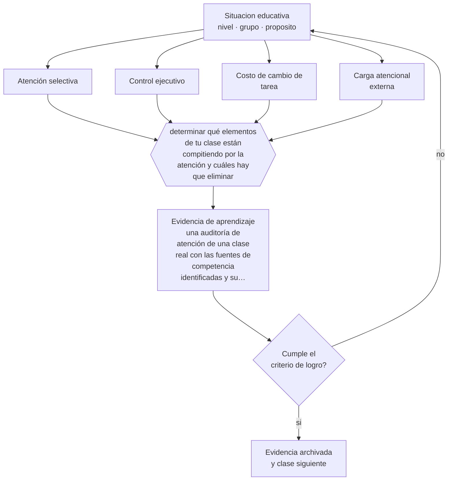

# Clase 018 — Atención y control ejecutivo

> **Parte 01 · Ciencias del aprendizaje** — clase 6 de 12

**Estado de evidencia:** `ROBUSTA` · **Etapa:** 🟢 Etapa A — Fundamentos · **Población de referencia:** transversal: los mecanismos son generales, su aplicación no 
**Decisión que habilita:** determinar qué elementos de tu clase están compitiendo por la atención y cuáles hay que eliminar 
**Evidencia de aprendizaje:** una auditoría de atención de una clase real con las fuentes de competencia identificadas y su corrección

## 🎯 Propósito

Tratar la atención como recurso escaso y selectivo, y el control ejecutivo como conjunto de funciones que se desarrollan con la edad y que la enseñanza puede apoyar o sobrecargar.

## 📚 Resultados de aprendizaje

Al finalizar esta clase podrás:

1. **Definir** con precisión los cuatro conceptos centrales de la clase y reconocerlos en una situación educativa real, no solo en su enunciado.
2. **Explicar** por qué la atención no es voluntad sino un recurso limitado que el diseño de la clase administra bien o mal.
3. **Decidir** —qué elementos de tu clase están compitiendo por la atención y cuáles hay que eliminar— y sostener la decisión con un fundamento escrito.
4. **Producir** la evidencia de la clase —una auditoría de atención de una clase real con las fuentes de competencia identificadas y su corrección— y contrastarla contra el criterio de logro.
5. **Distinguir** lo que la evidencia sostiene de lo que es práctica instalada, preferencia personal o costumbre de la institución.

## 🧩 Conceptos centrales

| Concepto | Comprensión verificable |
|---|---|
| **Atención selectiva** | capacidad de priorizar un estímulo relevante e inhibir los demás |
| **Control ejecutivo** | conjunto de funciones —inhibición, memoria de trabajo, flexibilidad— que regulan la conducta dirigida a metas |
| **Costo de cambio de tarea** | pérdida de rendimiento al alternar entre tareas; la atención dividida no es simultánea |
| **Carga atencional externa** | demanda impuesta por el entorno: ruido, notificaciones, material visual innecesario |

## 🗺️ Flujo de razonamiento

## 📖 Desarrollo

### 1. El fondo del asunto

La atención se comporta como un foco: se dirige a un objeto a costa de los demás. No se puede atender realmente a dos fuentes de información compleja a la vez; lo que ocurre es alternancia, y cada cambio tiene un costo. Esto explica por qué una diapositiva con texto que el docente lee en voz alta empeora la comprensión en vez de reforzarla, y por qué un aula con estímulos visuales abundantes puede dificultar el aprendizaje de quienes más apoyo necesitan.

### 2. Cómo se traduce en decisiones de enseñanza

La auditoría de atención es simple y muy productiva: listar todo lo que compite en un tramo de clase —el celular, el material de la pared, la instrucción hablada sobre el texto escrito, el compañero, la tarea anterior sin cerrar— y eliminar lo evitable. También implica decidir de forma deliberada dónde debe estar la atención en cada minuto, y hacerlo explícito para el grupo, en vez de suponer que coincidirá con lo que uno tiene en mente.

### 3. Qué sostiene la evidencia y qué no

El control ejecutivo madura durante toda la infancia y la adolescencia y varía mucho entre personas de la misma edad; exigir autorregulación que aún no está disponible produce frustración y sanciones injustas. Además, los programas comerciales de entrenamiento cognitivo muestran mejoras en la tarea entrenada y transferencia escasa a desempeños escolares: entrenar atención en abstracto no mejora el aprendizaje del contenido.

> **Cómo leer el estado de evidencia `ROBUSTA`.** Hay evidencia convergente de varios equipos, países y diseños de investigación, incluidos estudios experimentales o cuasiexperimentales, y el efecto se sostiene al replicarlo. Puedes apoyar una decisión profesional en ella, sin olvidar que ningún efecto promedio describe a un estudiante concreto.

## 🧪 Taller guiado

Aplica la clase a **uno** de los contextos siguientes y repite después el ejercicio en un
contexto de exigencia distinta. Cambiar de contexto es parte del aprendizaje: lo que funciona
con un grupo no se traslada intacto a otro.

| Contexto | Rasgo que cambia la decisión |
|---|---|
| Contenido nuevo y difícil | la carga intrínseca es alta: el apoyo debe ser mayor |
| Contenido conocido en profundización | el andamiaje excesivo estorba en vez de ayudar |
| Grupo con conocimiento previo heterogéneo | lo que ayuda al novato perjudica al avanzado |
| Aprendizaje procedimental | la práctica y la corrección inmediata dominan la decisión |
| Aprendizaje conceptual | los ejemplos, contraejemplos y la comparación dominan |
| Estudio autónomo fuera del aula | sin autorregulación entrenada, la técnica no se sostiene |

**Secuencia de trabajo:**

1. Delimita el contexto: nivel, edad, tamaño del grupo, asignatura o experiencia y tiempo real disponible.
2. Declara qué saben ya los estudiantes y **cómo lo comprobaste**, no cómo lo supones.
3. Formula la decisión pedagógica que esta clase habilita y escribe su fundamento.
4. Anticipa qué observarías si la decisión funciona y qué observarías si no funciona.
5. Diseña de antemano la alternativa que aplicarás si la primera estrategia falla.
6. Ejecuta o simula, y registra lo observado con fecha, contexto y evidencia concreta.
7. Produce la evidencia de aprendizaje de la clase.
8. Contrástala contra el criterio de logro, corrige y recién entonces avanza.

### 📦 Evidencia de aprendizaje

Una auditoría de atención de una clase real con las fuentes de competencia identificadas y su corrección.

Debe incluir contexto, decisión, fundamento, fuentes consultadas con su fecha, indicador de
logro observable, riesgos previstos y qué harías distinto en la siguiente iteración.

## 🏆 Reto verificable

Graba o registra diez minutos de tu clase y cuenta cuántas fuentes de información compiten simultáneamente. Elimina las evitables y compara la calidad de las respuestas del grupo.

## ✅ Criterio de logro

- [ ] la auditoría identifica al menos tres fuentes reales de competencia atencional;
- [ ] cada corrección propuesta es ejecutable sin recursos adicionales;
- [ ] cada afirmación sobre «lo que funciona» está atribuida a una fuente identificable, con autor y fecha;
- [ ] la decisión es ejecutable con el tiempo, el espacio, el número de estudiantes y los recursos que realmente tienes;
- [ ] la evidencia queda archivada de forma reproducible: otra persona podría revisarla sin que tú se la expliques.

## ⚠️ Errores frecuentes

**Propios de esta clase:**

- Leer en voz alta el mismo texto que los estudiantes están leyendo en pantalla.
- Interpretar como desinterés una dificultad de control ejecutivo propia de la edad o del perfil del estudiante.

**Característicos de la parte 01:**

- Aplicar un hallazgo de laboratorio como receta de aula sin ajustarlo al contenido ni a la edad.
- Sostener neuromitos —estilos de aprendizaje, hemisferio dominante— por costumbre institucional.

## ♿ Diversidad, accesibilidad y ética

Reducir competencia atencional beneficia a todo el curso y es imprescindible para estudiantes con TDAH, autismo o hipersensibilidad sensorial. Es un ejemplo claro de diseño universal: la medida que un estudiante necesita mejora las condiciones de todos.

Antes de aplicar cualquier decisión de esta clase con estudiantes reales, revisa el
[protocolo de práctica responsable](../../../docs/ETICA_Y_PRACTICA_RESPONSABLE.md):
consentimiento, resguardo de datos personales, proporcionalidad de la intervención y derecho
de cada estudiante a no ser objeto de un ensayo que no le reporta beneficio.

## ❓ Preguntas de comprobación

1. ¿Dónde quieres que esté la atención de tu grupo en el minuto 10 de tu clase, y cómo lo aseguras?
2. ¿Qué elemento de tu material compite con lo que quieres que aprendan?
3. ¿Qué conducta estás sancionando que en realidad es una limitación ejecutiva?

## 📕 Lecturas base

**Diamond, A. (2013). *Executive Functions*. Annual Review of Psychology, 64.**  
*Qué aporta a esta clase:* la revisión de referencia sobre funciones ejecutivas, su desarrollo y qué intervenciones tienen evidencia.

**Mayer, R. (2021). *Multimedia Learning*.**  
*Qué aporta a esta clase:* aporta los principios de redundancia y atención dividida, con experimentos que se replican en aula.

Catálogo completo: [bibliografía del programa](../../../docs/BIBLIOGRAFIA.md) ·
[glosario](../../../docs/GLOSARIO.md) ·
[fuentes oficiales y cómo leerlas](../../../docs/FUENTES.md).

## 🔗 Conexión con el resto del programa

Se enlaza con la clase 017 y con la parte 13, donde la tecnología multiplica las fuentes de competencia atencional. Es antecedente directo de la parte 12.

> [!IMPORTANT]
> Material de formación profesional. No reemplaza un título de pedagogía, una habilitación
> legal para ejercer, ni el juicio de un equipo educativo que conoce a sus estudiantes.

---

| Anterior | Índice | Siguiente |
|---|---|---|
| [← 017 · Memoria de trabajo y memoria de largo plazo](../class-05-memoria-de-trabajo-y-memoria-de-largo-plazo/README.md) | [Parte 01](../README.md) · [Programa](../../../README.md) | [019 · Carga cognitiva →](../class-07-carga-cognitiva/README.md) |
