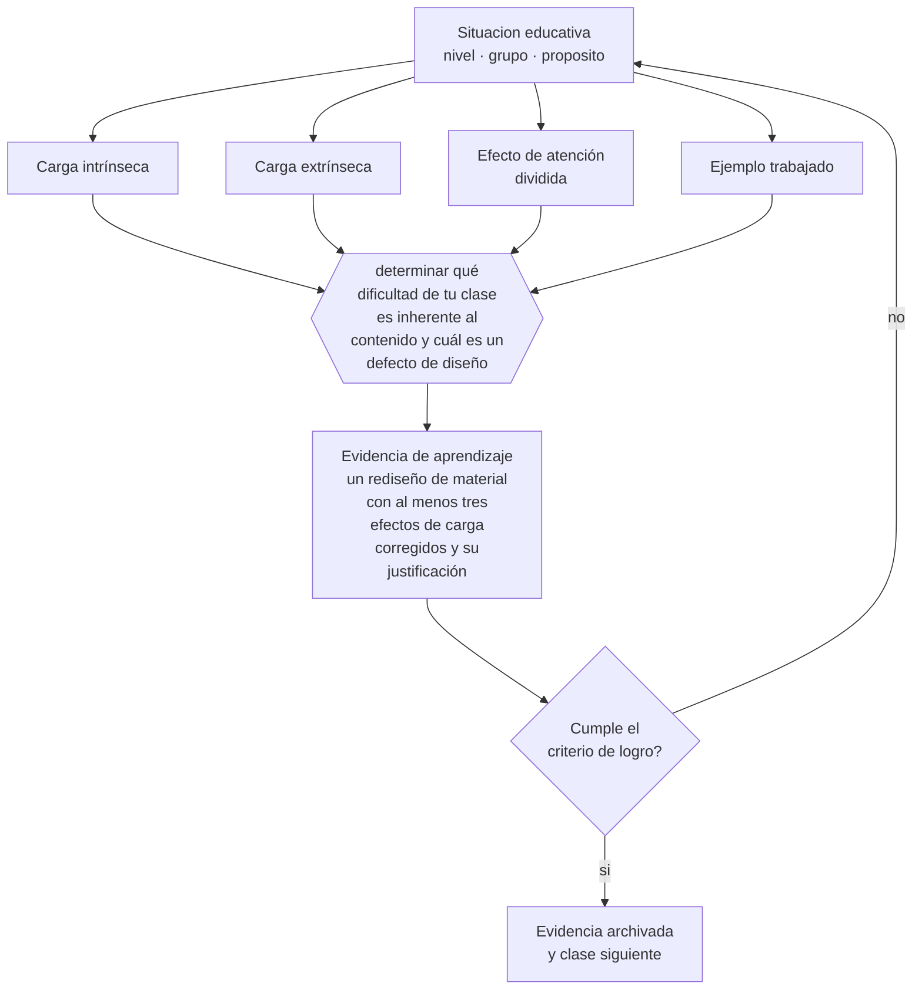

# Clase 019 — Carga cognitiva

> **Parte 01 · Ciencias del aprendizaje** — clase 7 de 12

**Estado de evidencia:** `ROBUSTA` · **Etapa:** 🟢 Etapa A — Fundamentos · **Población de referencia:** transversal: los mecanismos son generales, su aplicación no 
**Decisión que habilita:** determinar qué dificultad de tu clase es inherente al contenido y cuál es un defecto de diseño 
**Evidencia de aprendizaje:** un rediseño de material con al menos tres efectos de carga corregidos y su justificación

## 🎯 Propósito

Aplicar la teoría de la carga cognitiva para diseñar: reducir la carga que proviene del diseño, sostener la que proviene del contenido y aumentar la que se dedica a construir esquemas.

## 📚 Resultados de aprendizaje

Al finalizar esta clase podrás:

1. **Definir** con precisión los cuatro conceptos centrales de la clase y reconocerlos en una situación educativa real, no solo en su enunciado.
2. **Explicar** cómo distinguir la dificultad que enseña de la dificultad que solo estorba.
3. **Decidir** —qué dificultad de tu clase es inherente al contenido y cuál es un defecto de diseño— y sostener la decisión con un fundamento escrito.
4. **Producir** la evidencia de la clase —un rediseño de material con al menos tres efectos de carga corregidos y su justificación— y contrastarla contra el criterio de logro.
5. **Distinguir** lo que la evidencia sostiene de lo que es práctica instalada, preferencia personal o costumbre de la institución.

## 🧩 Conceptos centrales

| Concepto | Comprensión verificable |
|---|---|
| **Carga intrínseca** | demanda impuesta por la complejidad propia del contenido y por su número de elementos que interactúan |
| **Carga extrínseca** | demanda añadida por un diseño deficiente; es la que hay que eliminar |
| **Efecto de atención dividida** | pérdida por tener que integrar mentalmente fuentes que deberían estar integradas físicamente |
| **Ejemplo trabajado** | problema resuelto paso a paso que reduce la carga del novato frente a la resolución sin guía |

## 🗺️ Flujo de razonamiento

## 📖 Desarrollo

### 1. El fondo del asunto

La teoría distingue el origen de la dificultad. La carga intrínseca depende del contenido y del conocimiento previo: enseñar el concepto de derivada exige sostener varios elementos que interactúan, y eso no se puede simplificar sin cambiar el objetivo. La carga extrínseca proviene de decisiones evitables: un diagrama cuya leyenda está en otra página, una consigna ambigua, una animación decorativa. Toda capacidad gastada en carga extrínseca es capacidad que no se dedica a aprender.

### 2. Cómo se traduce en decisiones de enseñanza

El repertorio de correcciones está bien documentado: integrar texto e imagen en vez de separarlos, eliminar información redundante, usar ejemplos trabajados con novatos y retirarlos a medida que avanzan, segmentar secuencias largas y permitir control del ritmo. Cada corrección es verificable y produce diferencias medibles en tareas de transferencia, no solo en satisfacción del estudiante.

### 3. Qué sostiene la evidencia y qué no

La teoría tiene un matiz decisivo: lo que ayuda al novato perjudica al avanzado. Los ejemplos trabajados y el andamiaje detallado dejan de funcionar cuando el estudiante ya tiene esquemas, y pueden empeorar su rendimiento. Por eso no existe un material óptimo universal, sino un material óptimo para un nivel de conocimiento previo determinado, que hay que estimar y actualizar.

> **Cómo leer el estado de evidencia `ROBUSTA`.** Hay evidencia convergente de varios equipos, países y diseños de investigación, incluidos estudios experimentales o cuasiexperimentales, y el efecto se sostiene al replicarlo. Puedes apoyar una decisión profesional en ella, sin olvidar que ningún efecto promedio describe a un estudiante concreto.

## 🧪 Taller guiado

Aplica la clase a **uno** de los contextos siguientes y repite después el ejercicio en un
contexto de exigencia distinta. Cambiar de contexto es parte del aprendizaje: lo que funciona
con un grupo no se traslada intacto a otro.

| Contexto | Rasgo que cambia la decisión |
|---|---|
| Contenido nuevo y difícil | la carga intrínseca es alta: el apoyo debe ser mayor |
| Contenido conocido en profundización | el andamiaje excesivo estorba en vez de ayudar |
| Grupo con conocimiento previo heterogéneo | lo que ayuda al novato perjudica al avanzado |
| Aprendizaje procedimental | la práctica y la corrección inmediata dominan la decisión |
| Aprendizaje conceptual | los ejemplos, contraejemplos y la comparación dominan |
| Estudio autónomo fuera del aula | sin autorregulación entrenada, la técnica no se sostiene |

**Secuencia de trabajo:**

1. Delimita el contexto: nivel, edad, tamaño del grupo, asignatura o experiencia y tiempo real disponible.
2. Declara qué saben ya los estudiantes y **cómo lo comprobaste**, no cómo lo supones.
3. Formula la decisión pedagógica que esta clase habilita y escribe su fundamento.
4. Anticipa qué observarías si la decisión funciona y qué observarías si no funciona.
5. Diseña de antemano la alternativa que aplicarás si la primera estrategia falla.
6. Ejecuta o simula, y registra lo observado con fecha, contexto y evidencia concreta.
7. Produce la evidencia de aprendizaje de la clase.
8. Contrástala contra el criterio de logro, corrige y recién entonces avanza.

### 📦 Evidencia de aprendizaje

Un rediseño de material con al menos tres efectos de carga corregidos y su justificación.

Debe incluir contexto, decisión, fundamento, fuentes consultadas con su fecha, indicador de
logro observable, riesgos previstos y qué harías distinto en la siguiente iteración.

## 🏆 Reto verificable

Toma un material tuyo y produce dos versiones: una para novatos con ejemplos trabajados y otra para avanzados sin ellos. Aplícalas y compara resultados en una tarea de transferencia.

## ✅ Criterio de logro

- [ ] el rediseño nombra el efecto de carga que corrige en cada cambio;
- [ ] declara el nivel de conocimiento previo para el que el material está optimizado;
- [ ] cada afirmación sobre «lo que funciona» está atribuida a una fuente identificable, con autor y fecha;
- [ ] la decisión es ejecutable con el tiempo, el espacio, el número de estudiantes y los recursos que realmente tienes;
- [ ] la evidencia queda archivada de forma reproducible: otra persona podría revisarla sin que tú se la expliques.

## ⚠️ Errores frecuentes

**Propios de esta clase:**

- Simplificar el contenido cuando el problema estaba en el formato del material.
- Mantener andamiajes detallados con estudiantes que ya construyeron el esquema.

**Característicos de la parte 01:**

- Aplicar un hallazgo de laboratorio como receta de aula sin ajustarlo al contenido ni a la edad.
- Sostener neuromitos —estilos de aprendizaje, hemisferio dominante— por costumbre institucional.

## ♿ Diversidad, accesibilidad y ética

Reducir carga extrínseca es una de las medidas de accesibilidad más eficaces y más baratas: material limpio, consignas explícitas, un solo canal a la vez. Beneficia especialmente a estudiantes con dificultades lectoras, atencionales o que aprenden en una segunda lengua.

Antes de aplicar cualquier decisión de esta clase con estudiantes reales, revisa el
[protocolo de práctica responsable](../../../docs/ETICA_Y_PRACTICA_RESPONSABLE.md):
consentimiento, resguardo de datos personales, proporcionalidad de la intervención y derecho
de cada estudiante a no ser objeto de un ensayo que no le reporta beneficio.

## ❓ Preguntas de comprobación

1. ¿Qué parte de la dificultad de tu material desaparecería con un mejor diseño?
2. ¿Qué apoyo tuyo ya está estorbando a los estudiantes más avanzados?
3. ¿Cómo estimas el conocimiento previo antes de decidir el nivel de andamiaje?

## 📕 Lecturas base

**Sweller, J., van Merriënboer, J. & Paas, F. (2019). *Cognitive Architecture and Instructional Design: 20 Years Later*. Educational Psychology Review, 31.**  
*Qué aporta a esta clase:* actualiza la teoría, sus efectos y sus condiciones límite, incluido el efecto de reversión por experticia.

**Mayer, R. (2021). *Multimedia Learning*.**  
*Qué aporta a esta clase:* traduce los efectos de carga a reglas concretas de diseño de material visual y multimedia.

Catálogo completo: [bibliografía del programa](../../../docs/BIBLIOGRAFIA.md) ·
[glosario](../../../docs/GLOSARIO.md) ·
[fuentes oficiales y cómo leerlas](../../../docs/FUENTES.md).

## 🔗 Conexión con el resto del programa

Aplica directamente las clases 017 y 018, y es el fundamento técnico del diseño de recursos de la parte 13 y de la práctica guiada de la parte 10.

> [!IMPORTANT]
> Material de formación profesional. No reemplaza un título de pedagogía, una habilitación
> legal para ejercer, ni el juicio de un equipo educativo que conoce a sus estudiantes.

---

| Anterior | Índice | Siguiente |
|---|---|---|
| [← 018 · Atención y control ejecutivo](../class-06-atencion-y-control-ejecutivo/README.md) | [Parte 01](../README.md) · [Programa](../../../README.md) | [020 · Práctica de recuperación y espaciado →](../class-08-practica-de-recuperacion-y-espaciado/README.md) |
