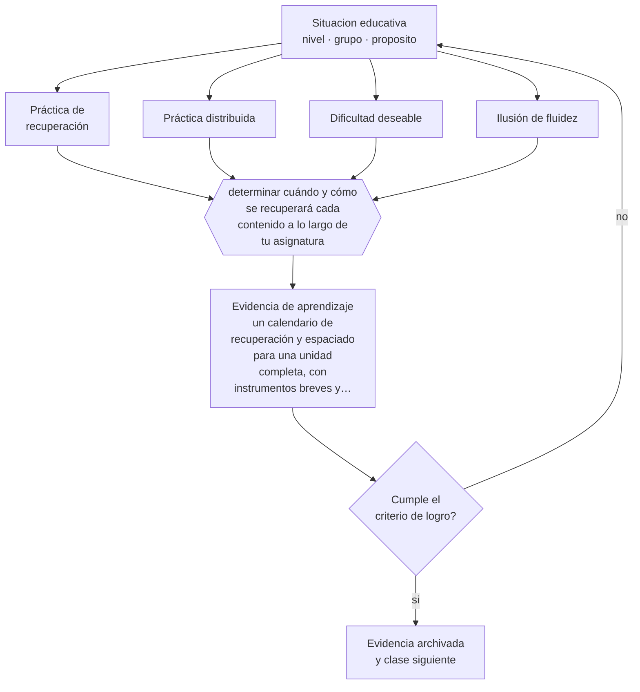

# Clase 020 — Práctica de recuperación y espaciado

> **Parte 01 · Ciencias del aprendizaje** — clase 8 de 12

**Estado de evidencia:** `ROBUSTA` · **Etapa:** 🟢 Etapa A — Fundamentos · **Población de referencia:** transversal: los mecanismos son generales, su aplicación no 
**Decisión que habilita:** determinar cuándo y cómo se recuperará cada contenido a lo largo de tu asignatura 
**Evidencia de aprendizaje:** un calendario de recuperación y espaciado para una unidad completa, con instrumentos breves y sin calificación de por medio

## 🎯 Propósito

Incorporar las dos técnicas con mejor evidencia acumulada —práctica de recuperación y práctica distribuida— al diseño habitual de una asignatura, y entender por qué producen la sensación subjetiva de aprender menos.

## 📚 Resultados de aprendizaje

Al finalizar esta clase podrás:

1. **Definir** con precisión los cuatro conceptos centrales de la clase y reconocerlos en una situación educativa real, no solo en su enunciado.
2. **Explicar** por qué recuperar lo aprendido enseña más que volver a leerlo, aunque se sienta al revés.
3. **Decidir** —cuándo y cómo se recuperará cada contenido a lo largo de tu asignatura— y sostener la decisión con un fundamento escrito.
4. **Producir** la evidencia de la clase —un calendario de recuperación y espaciado para una unidad completa, con instrumentos breves y sin calificación de por medio— y contrastarla contra el criterio de logro.
5. **Distinguir** lo que la evidencia sostiene de lo que es práctica instalada, preferencia personal o costumbre de la institución.

## 🧩 Conceptos centrales

| Concepto | Comprensión verificable |
|---|---|
| **Práctica de recuperación** | acto de traer a la memoria lo aprendido sin tenerlo a la vista; fortalece la retención más que releer |
| **Práctica distribuida** | distribución del estudio en el tiempo en vez de concentrarlo; produce retención más duradera |
| **Dificultad deseable** | condición que hace el aprendizaje más lento y más duradero |
| **Ilusión de fluidez** | sensación de dominio que produce releer material familiar y que no se corresponde con retención real |

## 🗺️ Flujo de razonamiento

## 📖 Desarrollo

### 1. El fondo del asunto

Recuperar información de la memoria la fortalece más que volver a exponerse a ella. El efecto está replicado con materiales, edades y contextos muy distintos, y es de los pocos hallazgos que se sostienen con la solidez suficiente para recomendarse sin reservas mayores. Distribuir la práctica en el tiempo tiene un efecto análogo. Ambas técnicas comparten un problema: hacen el estudio más difícil y menos gratificante en el momento, y por eso estudiantes y docentes tienden a abandonarlas por métodos que se sienten mejor y funcionan peor.

### 2. Cómo se traduce en decisiones de enseñanza

El diseño práctico es sencillo y exige constancia: preguntas de recuperación al inicio de cada clase sobre contenido de dos y de cuatro semanas atrás, sin nota; cuestionarios breves de baja consecuencia; y una planificación que vuelva sobre lo importante en intervalos crecientes en vez de tratarlo una vez y darlo por visto. La condición crítica es que la recuperación sea genuina —sin el material a la vista— y que exista retroalimentación posterior.

### 3. Qué sostiene la evidencia y qué no

La recuperación funciona mejor cuando el contenido fue comprendido inicialmente: no compensa una explicación fallida. Con material muy complejo o en estudiantes con alta ansiedad evaluativa, aplicarla en formato de prueba calificada puede perjudicar. Y su beneficio depende del intervalo: demasiado corto se parece a releer, demasiado largo pierde la huella. Ajustar esos intervalos exige criterio, no una fórmula.

> **Cómo leer el estado de evidencia `ROBUSTA`.** Hay evidencia convergente de varios equipos, países y diseños de investigación, incluidos estudios experimentales o cuasiexperimentales, y el efecto se sostiene al replicarlo. Puedes apoyar una decisión profesional en ella, sin olvidar que ningún efecto promedio describe a un estudiante concreto.

## 🧪 Taller guiado

Aplica la clase a **uno** de los contextos siguientes y repite después el ejercicio en un
contexto de exigencia distinta. Cambiar de contexto es parte del aprendizaje: lo que funciona
con un grupo no se traslada intacto a otro.

| Contexto | Rasgo que cambia la decisión |
|---|---|
| Contenido nuevo y difícil | la carga intrínseca es alta: el apoyo debe ser mayor |
| Contenido conocido en profundización | el andamiaje excesivo estorba en vez de ayudar |
| Grupo con conocimiento previo heterogéneo | lo que ayuda al novato perjudica al avanzado |
| Aprendizaje procedimental | la práctica y la corrección inmediata dominan la decisión |
| Aprendizaje conceptual | los ejemplos, contraejemplos y la comparación dominan |
| Estudio autónomo fuera del aula | sin autorregulación entrenada, la técnica no se sostiene |

**Secuencia de trabajo:**

1. Delimita el contexto: nivel, edad, tamaño del grupo, asignatura o experiencia y tiempo real disponible.
2. Declara qué saben ya los estudiantes y **cómo lo comprobaste**, no cómo lo supones.
3. Formula la decisión pedagógica que esta clase habilita y escribe su fundamento.
4. Anticipa qué observarías si la decisión funciona y qué observarías si no funciona.
5. Diseña de antemano la alternativa que aplicarás si la primera estrategia falla.
6. Ejecuta o simula, y registra lo observado con fecha, contexto y evidencia concreta.
7. Produce la evidencia de aprendizaje de la clase.
8. Contrástala contra el criterio de logro, corrige y recién entonces avanza.

### 📦 Evidencia de aprendizaje

Un calendario de recuperación y espaciado para una unidad completa, con instrumentos breves y sin calificación de por medio.

Debe incluir contexto, decisión, fundamento, fuentes consultadas con su fecha, indicador de
logro observable, riesgos previstos y qué harías distinto en la siguiente iteración.

## 🏆 Reto verificable

Aplica un calendario de recuperación durante seis semanas en un curso y compara la retención con la de una unidad enseñada sin él. Registra también qué opinaron los estudiantes al inicio y al final.

## ✅ Criterio de logro

- [ ] el calendario define intervalos crecientes y contenidos específicos, no «repasos generales»;
- [ ] los instrumentos son de baja consecuencia e incluyen retroalimentación posterior;
- [ ] cada afirmación sobre «lo que funciona» está atribuida a una fuente identificable, con autor y fecha;
- [ ] la decisión es ejecutable con el tiempo, el espacio, el número de estudiantes y los recursos que realmente tienes;
- [ ] la evidencia queda archivada de forma reproducible: otra persona podría revisarla sin que tú se la expliques.

## ⚠️ Errores frecuentes

**Propios de esta clase:**

- Convertir la práctica de recuperación en evaluaciones calificadas y aumentar la ansiedad sin ganar aprendizaje.
- Confundir revisar apuntes con recuperar: si el material está a la vista, el efecto desaparece.

**Característicos de la parte 01:**

- Aplicar un hallazgo de laboratorio como receta de aula sin ajustarlo al contenido ni a la edad.
- Sostener neuromitos —estilos de aprendizaje, hemisferio dominante— por costumbre institucional.

## ♿ Diversidad, accesibilidad y ética

Los estudiantes con menos apoyo fuera de la escuela son los que más se benefician de que la recuperación esté incorporada al tiempo de clase: no dependen de saber estudiar solos ni de tener quien les tome la lección en casa.

Antes de aplicar cualquier decisión de esta clase con estudiantes reales, revisa el
[protocolo de práctica responsable](../../../docs/ETICA_Y_PRACTICA_RESPONSABLE.md):
consentimiento, resguardo de datos personales, proporcionalidad de la intervención y derecho
de cada estudiante a no ser objeto de un ensayo que no le reporta beneficio.

## ❓ Preguntas de comprobación

1. ¿Cuándo volverán tus estudiantes a recuperar lo que aprendieron esta semana?
2. ¿Qué técnica de estudio recomiendas que en realidad produce ilusión de fluidez?
3. ¿Cómo evitarías que la recuperación se convierta en una fuente de ansiedad?

## 📕 Lecturas base

**Roediger, H. & Karpicke, J. (2006). *Test-Enhanced Learning*. Psychological Science, 17(3).**  
*Qué aporta a esta clase:* el experimento que instaló el efecto de recuperación y mostró la discrepancia entre sensación y retención.

**Dunlosky, J. et al. (2013). *Improving Students' Learning With Effective Learning Techniques*.**  
*Qué aporta a esta clase:* clasifica diez técnicas por evidencia; práctica distribuida y de recuperación quedan en el nivel más alto.

Catálogo completo: [bibliografía del programa](../../../docs/BIBLIOGRAFIA.md) ·
[glosario](../../../docs/GLOSARIO.md) ·
[fuentes oficiales y cómo leerlas](../../../docs/FUENTES.md).

## 🔗 Conexión con el resto del programa

Se apoya en las clases 014 y 017, y es la técnica que la parte 11 usa para separar evaluación formativa de calificación. Aparece de nuevo en la parte 07 como estrategia de transferencia.

> [!IMPORTANT]
> Material de formación profesional. No reemplaza un título de pedagogía, una habilitación
> legal para ejercer, ni el juicio de un equipo educativo que conoce a sus estudiantes.

---

| Anterior | Índice | Siguiente |
|---|---|---|
| [← 019 · Carga cognitiva](../class-07-carga-cognitiva/README.md) | [Parte 01](../README.md) · [Programa](../../../README.md) | [021 · Metacognición →](../class-09-metacognicion/README.md) |
