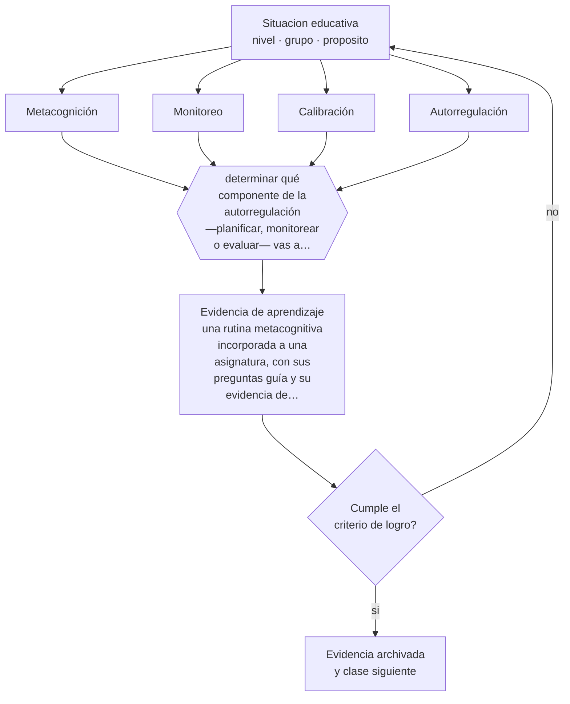

# Clase 021 — Metacognición

> **Parte 01 · Ciencias del aprendizaje** — clase 9 de 12

**Estado de evidencia:** `CONSISTENTE` · **Etapa:** 🟢 Etapa A — Fundamentos · **Población de referencia:** transversal: los mecanismos son generales, su aplicación no 
**Decisión que habilita:** determinar qué componente de la autorregulación —planificar, monitorear o evaluar— vas a enseñar de forma explícita 
**Evidencia de aprendizaje:** una rutina metacognitiva incorporada a una asignatura, con sus preguntas guía y su evidencia de uso

## 🎯 Propósito

Distinguir el conocimiento sobre el propio aprendizaje de la capacidad de regularlo en la práctica, y diseñar enseñanza que entrene lo segundo, que es lo que efectivamente falta.

## 📚 Resultados de aprendizaje

Al finalizar esta clase podrás:

1. **Definir** con precisión los cuatro conceptos centrales de la clase y reconocerlos en una situación educativa real, no solo en su enunciado.
2. **Explicar** por qué un estudiante puede saber una técnica de estudio y aun así no usarla cuando la necesita.
3. **Decidir** —qué componente de la autorregulación —planificar, monitorear o evaluar— vas a enseñar de forma explícita— y sostener la decisión con un fundamento escrito.
4. **Producir** la evidencia de la clase —una rutina metacognitiva incorporada a una asignatura, con sus preguntas guía y su evidencia de uso— y contrastarla contra el criterio de logro.
5. **Distinguir** lo que la evidencia sostiene de lo que es práctica instalada, preferencia personal o costumbre de la institución.

## 🧩 Conceptos centrales

| Concepto | Comprensión verificable |
|---|---|
| **Metacognición** | conocimiento y regulación de los propios procesos de pensamiento y aprendizaje |
| **Monitoreo** | juicio en curso sobre el propio nivel de comprensión mientras se estudia o se resuelve |
| **Calibración** | correspondencia entre la confianza declarada y el desempeño real |
| **Autorregulación** | ciclo de planificar, ejecutar, monitorear y ajustar el propio aprendizaje |

## 🗺️ Flujo de razonamiento

## 📖 Desarrollo

### 1. El fondo del asunto

Los estudiantes con bajo desempeño suelen mostrar mala calibración: creen haber comprendido cuando no es así, y por eso dejan de estudiar demasiado pronto. El problema no es principalmente de estrategias desconocidas sino de monitoreo defectuoso, alimentado por la ilusión de fluidez. Enseñar metacognición, por tanto, es sobre todo enseñar a comprobar la propia comprensión con evidencia externa en vez de con la sensación de familiaridad.

### 2. Cómo se traduce en decisiones de enseñanza

Las rutinas que funcionan son específicas del contenido y breves: antes de la tarea, predecir cuánto se resolverá bien; durante, detenerse a explicar sin mirar; después, comparar la predicción con el resultado y ajustar. Enseñada como asignatura aparte, la metacognición no transfiere; incorporada al contenido y repetida, sí. Y exige que el docente modele en voz alta su propio monitoreo, porque los estudiantes no ven ese proceso en nadie.

### 3. Qué sostiene la evidencia y qué no

La evidencia sobre programas de estrategias de aprendizaje es positiva pero heterogénea, y depende mucho de la implementación y de la edad: antes de los diez años, la regulación explícita es limitada. Además, muchas intervenciones muestran mejoras en el reporte del estudiante sin mejoras en desempeño. Por eso el criterio de éxito debe ser el cambio de conducta observable, no la declaración de que ahora planifica más.

> **Cómo leer el estado de evidencia `CONSISTENTE`.** La evidencia es amplia y coherente, pero proviene sobre todo de estudios correlacionales, de síntesis con heterogeneidad alta o de contextos distintos al tuyo. Sirve para orientar la decisión y exige que compruebes el efecto en tu propio grupo.

## 🧪 Taller guiado

Aplica la clase a **uno** de los contextos siguientes y repite después el ejercicio en un
contexto de exigencia distinta. Cambiar de contexto es parte del aprendizaje: lo que funciona
con un grupo no se traslada intacto a otro.

| Contexto | Rasgo que cambia la decisión |
|---|---|
| Contenido nuevo y difícil | la carga intrínseca es alta: el apoyo debe ser mayor |
| Contenido conocido en profundización | el andamiaje excesivo estorba en vez de ayudar |
| Grupo con conocimiento previo heterogéneo | lo que ayuda al novato perjudica al avanzado |
| Aprendizaje procedimental | la práctica y la corrección inmediata dominan la decisión |
| Aprendizaje conceptual | los ejemplos, contraejemplos y la comparación dominan |
| Estudio autónomo fuera del aula | sin autorregulación entrenada, la técnica no se sostiene |

**Secuencia de trabajo:**

1. Delimita el contexto: nivel, edad, tamaño del grupo, asignatura o experiencia y tiempo real disponible.
2. Declara qué saben ya los estudiantes y **cómo lo comprobaste**, no cómo lo supones.
3. Formula la decisión pedagógica que esta clase habilita y escribe su fundamento.
4. Anticipa qué observarías si la decisión funciona y qué observarías si no funciona.
5. Diseña de antemano la alternativa que aplicarás si la primera estrategia falla.
6. Ejecuta o simula, y registra lo observado con fecha, contexto y evidencia concreta.
7. Produce la evidencia de aprendizaje de la clase.
8. Contrástala contra el criterio de logro, corrige y recién entonces avanza.

### 📦 Evidencia de aprendizaje

Una rutina metacognitiva incorporada a una asignatura, con sus preguntas guía y su evidencia de uso.

Debe incluir contexto, decisión, fundamento, fuentes consultadas con su fecha, indicador de
logro observable, riesgos previstos y qué harías distinto en la siguiente iteración.

## 🏆 Reto verificable

Implementa la rutina de predicción y comprobación durante un mes. Compara la calibración inicial y final de tus estudiantes usando su confianza declarada frente a su desempeño real.

## ✅ Criterio de logro

- [ ] la rutina es específica del contenido y ocupa menos de cinco minutos por sesión;
- [ ] existe evidencia observable de uso, no solo autorreporte del estudiante;
- [ ] cada afirmación sobre «lo que funciona» está atribuida a una fuente identificable, con autor y fecha;
- [ ] la decisión es ejecutable con el tiempo, el espacio, el número de estudiantes y los recursos que realmente tienes;
- [ ] la evidencia queda archivada de forma reproducible: otra persona podría revisarla sin que tú se la expliques.

## ⚠️ Errores frecuentes

**Propios de esta clase:**

- Enseñar estrategias metacognitivas separadas del contenido y esperar transferencia.
- Aceptar como evidencia de metacognición lo que el estudiante declara en una encuesta.

**Característicos de la parte 01:**

- Aplicar un hallazgo de laboratorio como receta de aula sin ajustarlo al contenido ni a la edad.
- Sostener neuromitos —estilos de aprendizaje, hemisferio dominante— por costumbre institucional.

## ♿ Diversidad, accesibilidad y ética

La autorregulación se distribuye de forma desigual según el apoyo disponible en el hogar. Enseñarla dentro del aula reduce esa brecha; darla por supuesta la amplía, porque solo la ejerce quien la aprendió fuera.

Antes de aplicar cualquier decisión de esta clase con estudiantes reales, revisa el
[protocolo de práctica responsable](../../../docs/ETICA_Y_PRACTICA_RESPONSABLE.md):
consentimiento, resguardo de datos personales, proporcionalidad de la intervención y derecho
de cada estudiante a no ser objeto de un ensayo que no le reporta beneficio.

## ❓ Preguntas de comprobación

1. ¿Tus estudiantes saben cuándo no entendieron algo?
2. ¿Qué señal usan hoy para decidir que ya estudiaron suficiente?
3. ¿Dónde modelas en voz alta tu propio proceso de comprobación?

## 📕 Lecturas base

**Flavell, J. (1979). *Metacognition and Cognitive Monitoring*. American Psychologist, 34(10).**  
*Qué aporta a esta clase:* el artículo que define el campo y separa conocimiento metacognitivo de regulación.

**Education Endowment Foundation (2018). *Metacognition and Self-Regulated Learning: Guidance Report*.**  
*Qué aporta a esta clase:* síntesis aplicada con recomendaciones y tamaños de efecto declarados; buena base para decidir implementación.

Catálogo completo: [bibliografía del programa](../../../docs/BIBLIOGRAFIA.md) ·
[glosario](../../../docs/GLOSARIO.md) ·
[fuentes oficiales y cómo leerlas](../../../docs/FUENTES.md).

## 🔗 Conexión con el resto del programa

Complementa la clase 020 y sostiene la parte 07 (aprendizaje autodirigido) y la parte 14 (autonomía exigida en educación superior).

> [!IMPORTANT]
> Material de formación profesional. No reemplaza un título de pedagogía, una habilitación
> legal para ejercer, ni el juicio de un equipo educativo que conoce a sus estudiantes.

---

| Anterior | Índice | Siguiente |
|---|---|---|
| [← 020 · Práctica de recuperación y espaciado](../class-08-practica-de-recuperacion-y-espaciado/README.md) | [Parte 01](../README.md) · [Programa](../../../README.md) | [022 · Motivación y autodeterminación →](../class-10-motivacion-y-autodeterminacion/README.md) |
