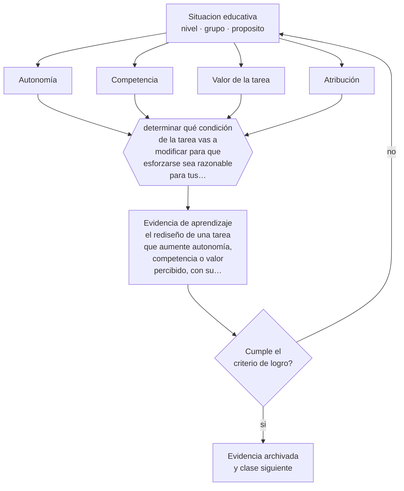

# Clase 022 — Motivación y autodeterminación

> **Parte 01 · Ciencias del aprendizaje** — clase 10 de 12

**Estado de evidencia:** `CONSISTENTE` · **Etapa:** 🟢 Etapa A — Fundamentos · **Población de referencia:** transversal: los mecanismos son generales, su aplicación no 
**Decisión que habilita:** determinar qué condición de la tarea vas a modificar para que esforzarse sea razonable para tus estudiantes 
**Evidencia de aprendizaje:** el rediseño de una tarea que aumente autonomía, competencia o valor percibido, con su fundamento explícito

## 🎯 Propósito

Analizar la motivación con marcos que permitan intervenir: autonomía, competencia y vínculo como necesidades psicológicas, y expectativa y valor como determinantes de la decisión de esforzarse.

## 📚 Resultados de aprendizaje

Al finalizar esta clase podrás:

1. **Definir** con precisión los cuatro conceptos centrales de la clase y reconocerlos en una situación educativa real, no solo en su enunciado.
2. **Explicar** por qué la motivación no es un rasgo del estudiante sino un resultado de las condiciones que la tarea ofrece.
3. **Decidir** —qué condición de la tarea vas a modificar para que esforzarse sea razonable para tus estudiantes— y sostener la decisión con un fundamento escrito.
4. **Producir** la evidencia de la clase —el rediseño de una tarea que aumente autonomía, competencia o valor percibido, con su fundamento explícito— y contrastarla contra el criterio de logro.
5. **Distinguir** lo que la evidencia sostiene de lo que es práctica instalada, preferencia personal o costumbre de la institución.

## 🧩 Conceptos centrales

| Concepto | Comprensión verificable |
|---|---|
| **Autonomía** | percepción de que la propia acción es elegida y no impuesta; no significa ausencia de estructura |
| **Competencia** | expectativa razonable de poder lograr la tarea con el esfuerzo disponible |
| **Valor de la tarea** | utilidad, interés o importancia que el estudiante atribuye a lo que se le pide |
| **Atribución** | explicación que la persona se da sobre las causas de su éxito o fracaso |

## 🗺️ Flujo de razonamiento

## 📖 Desarrollo

### 1. El fondo del asunto

Preguntar por qué un estudiante no está motivado suele ser la pregunta equivocada. La más productiva es qué condiciones de la tarea hacen que esforzarse resulte razonable. Dos determinantes explican mucho: si espera poder lograrlo y si le atribuye algún valor. Cuando cualquiera de los dos es cero, el esfuerzo no aparece, por buena que sea la explicación. Y ambos son modificables por el diseño de la tarea y por la historia de éxito que el estudiante acumuló en la asignatura.

### 2. Cómo se traduce en decisiones de enseñanza

Las intervenciones con mejor rendimiento son modestas y concretas: dar opciones reales aunque acotadas, garantizar una experiencia temprana de logro auténtico, explicitar la utilidad del contenido con ejemplos del mundo del estudiante, y retroalimentar de forma que el fracaso se atribuya a la estrategia y no a la capacidad. Esta última es la que más cambia trayectorias, y depende enteramente del lenguaje que usa el docente al corregir.

### 3. Qué sostiene la evidencia y qué no

Las intervenciones motivacionales breves que se popularizaron —mentalidad de crecimiento, propósito— muestran en replicaciones grandes efectos pequeños y concentrados en subgrupos específicos, sobre todo estudiantes de bajo rendimiento en contextos que sostienen el mensaje. No son inútiles, pero no sustituyen enseñanza de calidad ni condiciones materiales. Prometerlas como solución general es exagerar la evidencia.

> **Cómo leer el estado de evidencia `CONSISTENTE`.** La evidencia es amplia y coherente, pero proviene sobre todo de estudios correlacionales, de síntesis con heterogeneidad alta o de contextos distintos al tuyo. Sirve para orientar la decisión y exige que compruebes el efecto en tu propio grupo.

## 🧪 Taller guiado

Aplica la clase a **uno** de los contextos siguientes y repite después el ejercicio en un
contexto de exigencia distinta. Cambiar de contexto es parte del aprendizaje: lo que funciona
con un grupo no se traslada intacto a otro.

| Contexto | Rasgo que cambia la decisión |
|---|---|
| Contenido nuevo y difícil | la carga intrínseca es alta: el apoyo debe ser mayor |
| Contenido conocido en profundización | el andamiaje excesivo estorba en vez de ayudar |
| Grupo con conocimiento previo heterogéneo | lo que ayuda al novato perjudica al avanzado |
| Aprendizaje procedimental | la práctica y la corrección inmediata dominan la decisión |
| Aprendizaje conceptual | los ejemplos, contraejemplos y la comparación dominan |
| Estudio autónomo fuera del aula | sin autorregulación entrenada, la técnica no se sostiene |

**Secuencia de trabajo:**

1. Delimita el contexto: nivel, edad, tamaño del grupo, asignatura o experiencia y tiempo real disponible.
2. Declara qué saben ya los estudiantes y **cómo lo comprobaste**, no cómo lo supones.
3. Formula la decisión pedagógica que esta clase habilita y escribe su fundamento.
4. Anticipa qué observarías si la decisión funciona y qué observarías si no funciona.
5. Diseña de antemano la alternativa que aplicarás si la primera estrategia falla.
6. Ejecuta o simula, y registra lo observado con fecha, contexto y evidencia concreta.
7. Produce la evidencia de aprendizaje de la clase.
8. Contrástala contra el criterio de logro, corrige y recién entonces avanza.

### 📦 Evidencia de aprendizaje

El rediseño de una tarea que aumente autonomía, competencia o valor percibido, con su fundamento explícito.

Debe incluir contexto, decisión, fundamento, fuentes consultadas con su fecha, indicador de
logro observable, riesgos previstos y qué harías distinto en la siguiente iteración.

## 🏆 Reto verificable

Escoge al estudiante con menor participación de tu curso. Rediseña una tarea para que tenga una experiencia auténtica de logro en la primera semana y registra qué cambia en las cuatro siguientes.

## ✅ Criterio de logro

- [ ] el rediseño identifica cuál de las tres condiciones ataca y por qué esa y no otra;
- [ ] incluye una experiencia temprana de logro verificable para los estudiantes con menor expectativa;
- [ ] cada afirmación sobre «lo que funciona» está atribuida a una fuente identificable, con autor y fecha;
- [ ] la decisión es ejecutable con el tiempo, el espacio, el número de estudiantes y los recursos que realmente tienes;
- [ ] la evidencia queda archivada de forma reproducible: otra persona podría revisarla sin que tú se la expliques.

## ⚠️ Errores frecuentes

**Propios de esta clase:**

- Tratar la motivación como característica estable del estudiante y no como resultado de condiciones modificables.
- Elogiar la capacidad —«eres muy inteligente»— en vez del proceso y la estrategia.

**Característicos de la parte 01:**

- Aplicar un hallazgo de laboratorio como receta de aula sin ajustarlo al contenido ni a la edad.
- Sostener neuromitos —estilos de aprendizaje, hemisferio dominante— por costumbre institucional.

## ♿ Diversidad, accesibilidad y ética

La expectativa de éxito está fuertemente condicionada por la historia escolar previa y por los mensajes recibidos sobre el propio grupo. Estudiantes con trayectorias de fracaso o pertenecientes a grupos estereotipados necesitan evidencia concreta de logro antes que discursos de aliento.

Antes de aplicar cualquier decisión de esta clase con estudiantes reales, revisa el
[protocolo de práctica responsable](../../../docs/ETICA_Y_PRACTICA_RESPONSABLE.md):
consentimiento, resguardo de datos personales, proporcionalidad de la intervención y derecho
de cada estudiante a no ser objeto de un ensayo que no le reporta beneficio.

## ❓ Preguntas de comprobación

1. ¿Qué evidencia tienen tus estudiantes de que pueden lograr lo que les pides?
2. ¿Qué opción real tienen dentro de tu tarea, y es una opción que les importe?
3. ¿A qué atribuyen ellos sus fracasos en tu asignatura, y qué papel tuvo tu lenguaje en eso?

## 📕 Lecturas base

**Ryan, R. & Deci, E. (2000). *Self-Determination Theory and the Facilitation of Intrinsic Motivation*. American Psychologist, 55(1).**  
*Qué aporta a esta clase:* el marco de autonomía, competencia y vínculo, con su evidencia y sus condiciones.

**Wigfield, A. & Eccles, J. (2000). *Expectancy–Value Theory of Achievement Motivation*.**  
*Qué aporta a esta clase:* explica la decisión de esforzarse como producto de expectativa y valor; muy operativo para rediseñar tareas.

Catálogo completo: [bibliografía del programa](../../../docs/BIBLIOGRAFIA.md) ·
[glosario](../../../docs/GLOSARIO.md) ·
[fuentes oficiales y cómo leerlas](../../../docs/FUENTES.md).

## 🔗 Conexión con el resto del programa

Da profundidad a la clase 013 —los límites del reforzamiento externo— y sostiene la parte 05 (adolescencia) y la parte 07 (motivación en adultos).

> [!IMPORTANT]
> Material de formación profesional. No reemplaza un título de pedagogía, una habilitación
> legal para ejercer, ni el juicio de un equipo educativo que conoce a sus estudiantes.

---

| Anterior | Índice | Siguiente |
|---|---|---|
| [← 021 · Metacognición](../class-09-metacognicion/README.md) | [Parte 01](../README.md) · [Programa](../../../README.md) | [023 · Transferencia y aprendizaje profundo →](../class-11-transferencia-y-aprendizaje-profundo/README.md) |
