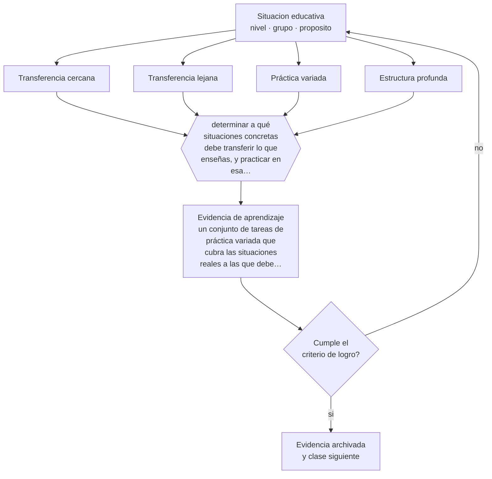

# Clase 023 — Transferencia y aprendizaje profundo

> **Parte 01 · Ciencias del aprendizaje** — clase 11 de 12

**Estado de evidencia:** `EN-DEBATE` · **Etapa:** 🟢 Etapa A — Fundamentos · **Población de referencia:** transversal: los mecanismos son generales, su aplicación no 
**Decisión que habilita:** determinar a qué situaciones concretas debe transferir lo que enseñas, y practicar en esa variedad desde el comienzo 
**Evidencia de aprendizaje:** un conjunto de tareas de práctica variada que cubra las situaciones reales a las que debe transferir el aprendizaje

## 🎯 Propósito

Enfrentar el problema central de toda enseñanza: que el aprendizaje transfiera. Distinguir transferencia cercana de lejana, entender por qué la segunda es rara, y diseñar para aumentar su probabilidad sin prometer lo que no se cumple.

## 📚 Resultados de aprendizaje

Al finalizar esta clase podrás:

1. **Definir** con precisión los cuatro conceptos centrales de la clase y reconocerlos en una situación educativa real, no solo en su enunciado.
2. **Explicar** por qué lo aprendido en un contexto rara vez aparece en otro, y qué condiciones aumentan las probabilidades de que aparezca.
3. **Decidir** —a qué situaciones concretas debe transferir lo que enseñas, y practicar en esa variedad desde el comienzo— y sostener la decisión con un fundamento escrito.
4. **Producir** la evidencia de la clase —un conjunto de tareas de práctica variada que cubra las situaciones reales a las que debe transferir el aprendizaje— y contrastarla contra el criterio de logro.
5. **Distinguir** lo que la evidencia sostiene de lo que es práctica instalada, preferencia personal o costumbre de la institución.

## 🧩 Conceptos centrales

| Concepto | Comprensión verificable |
|---|---|
| **Transferencia cercana** | aplicación de lo aprendido a situaciones muy similares a las de la práctica |
| **Transferencia lejana** | aplicación a contextos, formatos o dominios distintos; es infrecuente y difícil de producir |
| **Práctica variada** | entrenamiento con ejemplos que cambian en superficie manteniendo la estructura profunda |
| **Estructura profunda** | relación subyacente que hace que dos problemas distintos se resuelvan igual |

## 🗺️ Flujo de razonamiento

## 📖 Desarrollo

### 1. El fondo del asunto

La transferencia es el objetivo declarado de casi toda la educación y el resultado menos frecuente. Los estudiantes tienden a reconocer problemas por su superficie —los personajes, el contexto, la redacción— y no por su estructura, y por eso no aplican a un problema nuevo lo que resolvieron ayer. La evidencia sugiere que la transferencia mejora cuando se practica con variedad superficial y estructura constante, cuando se hacen explícitas las semejanzas profundas y cuando el conocimiento base es sólido.

### 2. Cómo se traduce en decisiones de enseñanza

El diseño consiste en decidir de antemano a qué situaciones debe transferir el aprendizaje y practicar en esa variedad desde el inicio, en vez de practicar en un solo formato y esperar generalización. También ayuda comparar explícitamente dos problemas que se ven distintos y se resuelven igual, y dos que se ven iguales y se resuelven distinto: la comparación es uno de los pocos procedimientos con evidencia de mejorar el reconocimiento estructural.

### 3. Qué sostiene la evidencia y qué no

Aquí hay desacuerdo real. Una tradición sostiene que la transferencia lejana prácticamente no existe y que la enseñanza debe apuntar a conocimiento específico abundante; otra sostiene que sí es posible bajo condiciones de enseñanza explícita de principios. Lo que ambas comparten es el rechazo a la idea de que enseñar «habilidades de pensamiento» genéricas, sin contenido, produzca transferencia. Esa promesa no tiene respaldo.

> **Cómo leer el estado de evidencia `EN-DEBATE`.** Hay desacuerdo activo y publicado entre especialistas competentes. La clase presenta las posiciones y sus argumentos; tu tarea no es escoger un bando, sino saber qué evidencia te haría cambiar de posición.

## 🧪 Taller guiado

Aplica la clase a **uno** de los contextos siguientes y repite después el ejercicio en un
contexto de exigencia distinta. Cambiar de contexto es parte del aprendizaje: lo que funciona
con un grupo no se traslada intacto a otro.

| Contexto | Rasgo que cambia la decisión |
|---|---|
| Contenido nuevo y difícil | la carga intrínseca es alta: el apoyo debe ser mayor |
| Contenido conocido en profundización | el andamiaje excesivo estorba en vez de ayudar |
| Grupo con conocimiento previo heterogéneo | lo que ayuda al novato perjudica al avanzado |
| Aprendizaje procedimental | la práctica y la corrección inmediata dominan la decisión |
| Aprendizaje conceptual | los ejemplos, contraejemplos y la comparación dominan |
| Estudio autónomo fuera del aula | sin autorregulación entrenada, la técnica no se sostiene |

**Secuencia de trabajo:**

1. Delimita el contexto: nivel, edad, tamaño del grupo, asignatura o experiencia y tiempo real disponible.
2. Declara qué saben ya los estudiantes y **cómo lo comprobaste**, no cómo lo supones.
3. Formula la decisión pedagógica que esta clase habilita y escribe su fundamento.
4. Anticipa qué observarías si la decisión funciona y qué observarías si no funciona.
5. Diseña de antemano la alternativa que aplicarás si la primera estrategia falla.
6. Ejecuta o simula, y registra lo observado con fecha, contexto y evidencia concreta.
7. Produce la evidencia de aprendizaje de la clase.
8. Contrástala contra el criterio de logro, corrige y recién entonces avanza.

### 📦 Evidencia de aprendizaje

Un conjunto de tareas de práctica variada que cubra las situaciones reales a las que debe transferir el aprendizaje.

Debe incluir contexto, decisión, fundamento, fuentes consultadas con su fecha, indicador de
logro observable, riesgos previstos y qué harías distinto en la siguiente iteración.

## 🏆 Reto verificable

Toma un contenido enseñado y construye tres problemas con la misma estructura y superficies muy distintas. Aplícalos y registra cuántos estudiantes reconocen que son el mismo problema.

## ✅ Criterio de logro

- [ ] las tareas mantienen la estructura profunda y varían la superficie de forma deliberada;
- [ ] existe al menos una actividad de comparación explícita entre casos estructuralmente distintos;
- [ ] cada afirmación sobre «lo que funciona» está atribuida a una fuente identificable, con autor y fecha;
- [ ] la decisión es ejecutable con el tiempo, el espacio, el número de estudiantes y los recursos que realmente tienes;
- [ ] la evidencia queda archivada de forma reproducible: otra persona podría revisarla sin que tú se la expliques.

## ⚠️ Errores frecuentes

**Propios de esta clase:**

- Practicar siempre con el mismo formato de problema y esperar que el estudiante generalice solo.
- Prometer desarrollo de pensamiento crítico general sin anclarlo a un dominio de conocimiento.

**Característicos de la parte 01:**

- Aplicar un hallazgo de laboratorio como receta de aula sin ajustarlo al contenido ni a la edad.
- Sostener neuromitos —estilos de aprendizaje, hemisferio dominante— por costumbre institucional.

## ♿ Diversidad, accesibilidad y ética

La transferencia depende de reconocer la estructura bajo contextos culturalmente familiares. Si todos los ejemplos provienen de un solo mundo social, parte del curso no reconocerá la estructura por falta de familiaridad con la superficie, no por falta de comprensión.

Antes de aplicar cualquier decisión de esta clase con estudiantes reales, revisa el
[protocolo de práctica responsable](../../../docs/ETICA_Y_PRACTICA_RESPONSABLE.md):
consentimiento, resguardo de datos personales, proporcionalidad de la intervención y derecho
de cada estudiante a no ser objeto de un ensayo que no le reporta beneficio.

## ❓ Preguntas de comprobación

1. ¿A qué situación real debería transferir lo que enseñaste esta semana?
2. ¿Tus estudiantes reconocen el problema por su estructura o por su envoltura?
3. ¿Qué prometes en tu programa que la evidencia sobre transferencia no respalda?

## 📕 Lecturas base

**Barnett, S. & Ceci, S. (2002). *When and Where Do We Apply What We Learn? A Taxonomy for Far Transfer*. Psychological Bulletin, 128(4).**  
*Qué aporta a esta clase:* ordena el debate con una taxonomía; útil para no discutir sobre transferencia sin decir cuál.

**Gick, M. & Holyoak, K. (1983). *Schema Induction and Analogical Transfer*.**  
*Qué aporta a esta clase:* los experimentos clásicos que muestran cuán poco transfiere una solución si no se hace explícita la analogía.

Catálogo completo: [bibliografía del programa](../../../docs/BIBLIOGRAFIA.md) ·
[glosario](../../../docs/GLOSARIO.md) ·
[fuentes oficiales y cómo leerlas](../../../docs/FUENTES.md).

## 🔗 Conexión con el resto del programa

Cierra el arco de la parte y prepara la parte 06 (aprendizaje situado) y la parte 09 (diseño para transferencia). Es el criterio de fondo de todos los proyectos integradores del programa.

> [!IMPORTANT]
> Material de formación profesional. No reemplaza un título de pedagogía, una habilitación
> legal para ejercer, ni el juicio de un equipo educativo que conoce a sus estudiantes.

---

| Anterior | Índice | Siguiente |
|---|---|---|
| [← 022 · Motivación y autodeterminación](../class-10-motivacion-y-autodeterminacion/README.md) | [Parte 01](../README.md) · [Programa](../../../README.md) | [024 · Proyecto integrador: diseño basado en evidencia →](../class-12-proyecto-integrador-diseno-basado-en-evidencia/README.md) |
