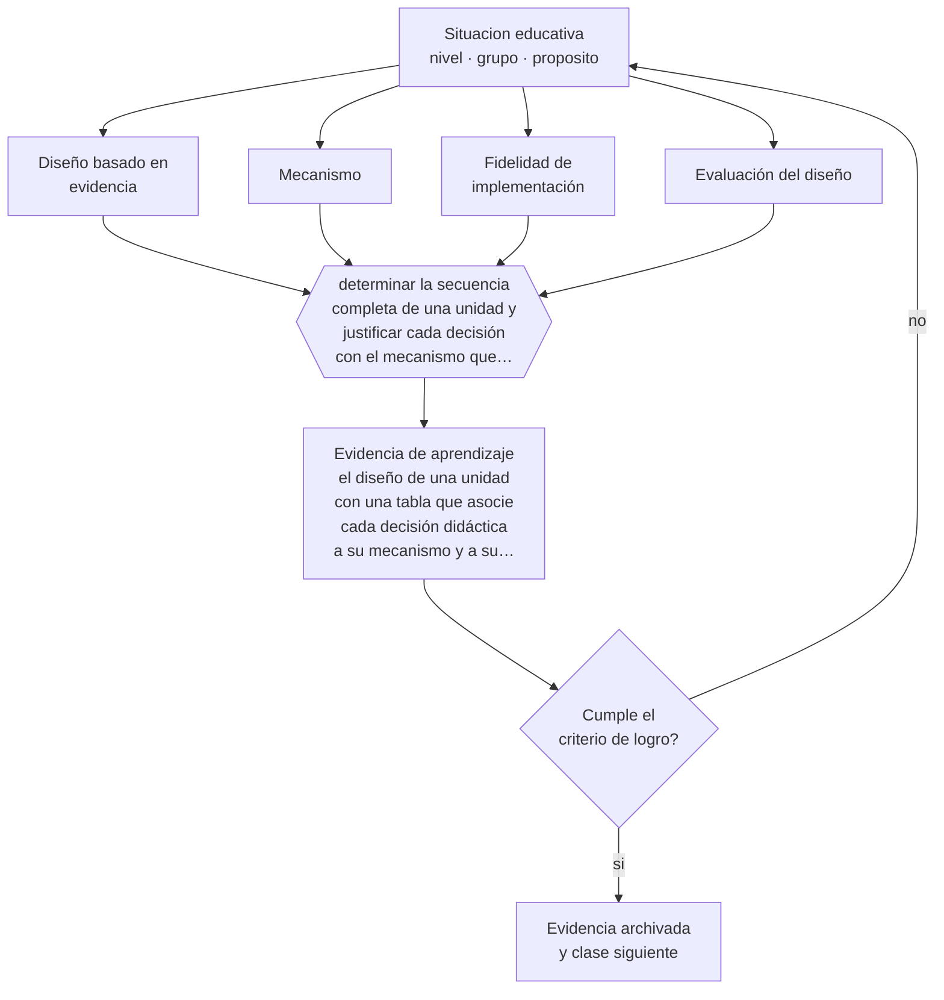

# Clase 024 — Proyecto integrador: diseño basado en evidencia

> **Parte 01 · Ciencias del aprendizaje** — clase 12 de 12

**Estado de evidencia:** `ROBUSTA` · **Etapa:** 🟢 Etapa A — Fundamentos · **Población de referencia:** transversal: los mecanismos son generales, su aplicación no 
**Decisión que habilita:** determinar la secuencia completa de una unidad y justificar cada decisión con el mecanismo que la sostiene 
**Evidencia de aprendizaje:** el diseño de una unidad con una tabla que asocie cada decisión didáctica a su mecanismo y a su fuente

## 🎯 Propósito

Integrar la parte en un diseño instruccional completo y fundamentado: cada decisión de la secuencia debe poder atribuirse a un mecanismo de aprendizaje y a la evidencia que lo respalda.

## 📚 Resultados de aprendizaje

Al finalizar esta clase podrás:

1. **Definir** con precisión los cuatro conceptos centrales de la clase y reconocerlos en una situación educativa real, no solo en su enunciado.
2. **Explicar** cómo pasar de conocer mecanismos de aprendizaje a tomar decisiones de diseño que se puedan defender con evidencia.
3. **Decidir** —la secuencia completa de una unidad y justificar cada decisión con el mecanismo que la sostiene— y sostener la decisión con un fundamento escrito.
4. **Producir** la evidencia de la clase —el diseño de una unidad con una tabla que asocie cada decisión didáctica a su mecanismo y a su fuente— y contrastarla contra el criterio de logro.
5. **Distinguir** lo que la evidencia sostiene de lo que es práctica instalada, preferencia personal o costumbre de la institución.

## 🧩 Conceptos centrales

| Concepto | Comprensión verificable |
|---|---|
| **Diseño basado en evidencia** | proceso de decidir la enseñanza a partir de mecanismos documentados y de evidencia disponible |
| **Mecanismo** | proceso cognitivo o social que explica por qué una intervención produce su efecto |
| **Fidelidad de implementación** | grado en que lo diseñado se ejecuta como fue concebido; explica muchos fracasos atribuidos al método |
| **Evaluación del diseño** | comprobación de si la unidad produjo el aprendizaje que declaraba perseguir |

## 🗺️ Flujo de razonamiento

## 📖 Desarrollo

### 1. El fondo del asunto

El proyecto integrador exige la operación que separa a un profesional de un aplicador de recetas: justificar. Una unidad bien diseñada puede explicar por qué la práctica está distribuida así, por qué el andamiaje se retira en ese punto, por qué la evaluación tiene ese formato y qué mecanismo respalda cada elección. Esa tabla de justificación es también la herramienta que permite corregir con precisión cuando algo no funciona: se revisa la decisión, no el método completo.

### 2. Cómo se traduce en decisiones de enseñanza

El procedimiento es directo: definir el aprendizaje buscado y su evidencia; listar las decisiones didácticas; asociar cada una a un mecanismo de las clases 013 a 023; y declarar cómo se comprobará el efecto. Después viene lo más importante y lo que casi nadie hace: ejecutar con fidelidad razonable y registrar qué ocurrió, incluidas las desviaciones. Un diseño sin registro de implementación no permite aprender de su propio resultado.

### 3. Qué sostiene la evidencia y qué no

Que una decisión esté respaldada por un mecanismo no garantiza que funcione en tu contexto: los efectos promedio no describen a tu curso y la implementación cambia el resultado. Esta unidad no prueba nada por sí sola; produce una hipótesis fundamentada y una forma de comprobarla. Presentarla como demostración de eficacia sería exactamente el error que el programa intenta evitar.

> **Cómo leer el estado de evidencia `ROBUSTA`.** Hay evidencia convergente de varios equipos, países y diseños de investigación, incluidos estudios experimentales o cuasiexperimentales, y el efecto se sostiene al replicarlo. Puedes apoyar una decisión profesional en ella, sin olvidar que ningún efecto promedio describe a un estudiante concreto.

## 🧪 Taller guiado

Aplica la clase a **uno** de los contextos siguientes y repite después el ejercicio en un
contexto de exigencia distinta. Cambiar de contexto es parte del aprendizaje: lo que funciona
con un grupo no se traslada intacto a otro.

| Contexto | Rasgo que cambia la decisión |
|---|---|
| Contenido nuevo y difícil | la carga intrínseca es alta: el apoyo debe ser mayor |
| Contenido conocido en profundización | el andamiaje excesivo estorba en vez de ayudar |
| Grupo con conocimiento previo heterogéneo | lo que ayuda al novato perjudica al avanzado |
| Aprendizaje procedimental | la práctica y la corrección inmediata dominan la decisión |
| Aprendizaje conceptual | los ejemplos, contraejemplos y la comparación dominan |
| Estudio autónomo fuera del aula | sin autorregulación entrenada, la técnica no se sostiene |

**Secuencia de trabajo:**

1. Delimita el contexto: nivel, edad, tamaño del grupo, asignatura o experiencia y tiempo real disponible.
2. Declara qué saben ya los estudiantes y **cómo lo comprobaste**, no cómo lo supones.
3. Formula la decisión pedagógica que esta clase habilita y escribe su fundamento.
4. Anticipa qué observarías si la decisión funciona y qué observarías si no funciona.
5. Diseña de antemano la alternativa que aplicarás si la primera estrategia falla.
6. Ejecuta o simula, y registra lo observado con fecha, contexto y evidencia concreta.
7. Produce la evidencia de aprendizaje de la clase.
8. Contrástala contra el criterio de logro, corrige y recién entonces avanza.

### 📦 Evidencia de aprendizaje

El diseño de una unidad con una tabla que asocie cada decisión didáctica a su mecanismo y a su fuente.

Debe incluir contexto, decisión, fundamento, fuentes consultadas con su fecha, indicador de
logro observable, riesgos previstos y qué harías distinto en la siguiente iteración.

## 🏆 Reto verificable

Ejecuta la unidad, registra su implementación y escribe un informe de una página con lo que funcionó, lo que no y qué decisión cambiarías. Compártelo con un colega para que audite tus justificaciones.

## ✅ Criterio de logro

- [ ] cada decisión didáctica está asociada a un mecanismo y a una fuente verificable;
- [ ] existe un registro de implementación con desviaciones documentadas;
- [ ] cada afirmación sobre «lo que funciona» está atribuida a una fuente identificable, con autor y fecha;
- [ ] la decisión es ejecutable con el tiempo, el espacio, el número de estudiantes y los recursos que realmente tienes;
- [ ] la evidencia queda archivada de forma reproducible: otra persona podría revisarla sin que tú se la expliques.

## ⚠️ Errores frecuentes

**Propios de esta clase:**

- Justificar decisiones citando autores sin explicitar el mecanismo que operaría en tu caso.
- Concluir que un diseño funcionó sin haber registrado cómo se implementó realmente.

**Característicos de la parte 01:**

- Aplicar un hallazgo de laboratorio como receta de aula sin ajustarlo al contenido ni a la edad.
- Sostener neuromitos —estilos de aprendizaje, hemisferio dominante— por costumbre institucional.

## ♿ Diversidad, accesibilidad y ética

Un diseño basado en evidencia debe declarar para quién funcionó la evidencia que cita. Muchos estudios se realizaron con poblaciones distintas de la tuya; explicitarlo es parte del rigor y evita aplicar con seguridad falsa lo que fue probado en otro contexto.

Antes de aplicar cualquier decisión de esta clase con estudiantes reales, revisa el
[protocolo de práctica responsable](../../../docs/ETICA_Y_PRACTICA_RESPONSABLE.md):
consentimiento, resguardo de datos personales, proporcionalidad de la intervención y derecho
de cada estudiante a no ser objeto de un ensayo que no le reporta beneficio.

## ❓ Preguntas de comprobación

1. ¿Qué decisión de tu unidad no puedes justificar con un mecanismo?
2. ¿Qué evidencia te haría concluir que el diseño no funcionó?
3. ¿Qué desviación de implementación es más probable en tu contexto y cómo la registrarías?

## 📕 Lecturas base

**Kirschner, P. & Hendrick, C. (2020). *How Learning Happens*.**  
*Qué aporta a esta clase:* modelo de cómo pasar de estudio a decisión de aula sin sobreinterpretar; útil como plantilla de justificación.

**Education Endowment Foundation. *Teaching and Learning Toolkit*.**  
*Qué aporta a esta clase:* síntesis de evidencia por intervención con costo, solidez y efecto declarados; obliga a citar magnitudes, no impresiones.

Catálogo completo: [bibliografía del programa](../../../docs/BIBLIOGRAFIA.md) ·
[glosario](../../../docs/GLOSARIO.md) ·
[fuentes oficiales y cómo leerlas](../../../docs/FUENTES.md).

## 🔗 Conexión con el resto del programa

Cierra la parte 01 integrando sus once clases anteriores. Es el antecedente directo de la parte 09 (diseño curricular) y de la parte 16 (investigación sobre la propia práctica).

> [!IMPORTANT]
> Material de formación profesional. No reemplaza un título de pedagogía, una habilitación
> legal para ejercer, ni el juicio de un equipo educativo que conoce a sus estudiantes.

---

| Anterior | Índice | Siguiente |
|---|---|---|
| [← 023 · Transferencia y aprendizaje profundo](../class-11-transferencia-y-aprendizaje-profundo/README.md) | [Parte 01](../README.md) · [Programa](../../../README.md) | [Programa completo →](../../../README.md) |
