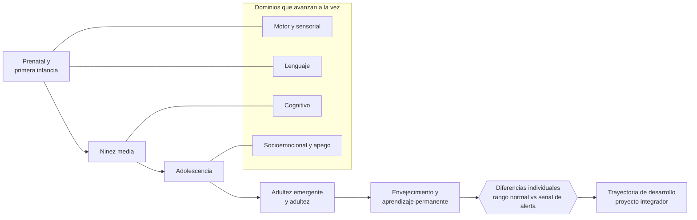

# Parte 02 — Desarrollo humano

> *La misma actividad no significa lo mismo a los tres, a los trece y a los treinta años*

🟢 **Etapa A — Fundamentos** · salida de la etapa: explicar cómo aprende una persona y qué hace la educación con ese hecho

**Clases:** 12 (025–036) · **Población de referencia:** trayectoria completa: primera infancia a adultez mayor · **Conceptos operacionales:** 48 · **Señales observables:** 36 
**Contenido central:** Desarrollo prenatal y temprano, motor, lenguaje, cognitivo, socioemocional, apego, niñez media, adolescencia, adultez, envejecimiento y diferencias individuales

## 🎯 De qué trata esta parte

El desarrollo no es una escalera de etapas que se suben en fecha fija. Es un proceso con regularidades fuertes —el orden de adquisición del lenguaje, la maduración del control ejecutivo, la reorganización social de la adolescencia— y con variabilidad individual enorme dentro de cada una. Enseñar bien exige sostener las dos cosas a la vez: conocer la regularidad para anticipar, y respetar la variación para no patologizar a quien va a otro ritmo.

La consecuencia práctica más importante es que la edad no es una variable menor de la planificación: es una restricción real. Una tarea de metacognición explícita que funciona en séptimo básico es inútil a los cuatro años, no porque el niño sea menos capaz, sino porque el sustrato que la tarea exige todavía se está construyendo. Del mismo modo, tratar a un adolescente con la lógica de control de la niñez media produce exactamente la reacción que se quería evitar.

Esta parte también entrena una forma de prudencia. La neurociencia del desarrollo se divulga mal: se cierran ventanas críticas que no son tan críticas, se afirman períodos irrecuperables que la evidencia no sostiene y se convierte una correlación en una sentencia. Aquí se enseña qué está bien establecido —la importancia de la interacción sensible temprana, la plasticidad prolongada— y qué se ha exagerado, para que ninguna decisión educativa se apoye en una versión caricaturizada del cerebro.

## 🏫 Caso de la parte

Las doce clases trabajan sobre la misma realidad, para que puedas ver cómo cambia tu diagnóstico
a medida que avanzas:

> Un estudiante de 7.º básico dejó de participar, baja sus resultados y responde con agresividad a las correcciones. En el consejo aparecen cuatro explicaciones distintas —familiar, cognitiva, conductual y motivacional— y ninguna con evidencia.

**Artefacto que produces al terminar:** trayectoria de desarrollo documentada con registros fechados, interpretación y decisiones por tramo.

## 📚 Resultados de la parte

Al terminar esta parte podrás:

1. **Describir la trayectoria típica de un dominio del desarrollo y sus rangos normales de variación**.
2. **Ajustar una misma decisión pedagógica a tres edades distintas y explicar qué cambia y por qué**.
3. **Distinguir una variación esperable de una señal que amerita derivación profesional**.
4. **Identificar afirmaciones sobre el cerebro en desarrollo que la evidencia no sostiene**.

## 🗺️ Mapa de la parte

## 🧠 Marco de referencia

- modelos clásicos del desarrollo cognitivo y sociocultural, con sus límites reconocidos
- teoría del apego y evidencia sobre interacción sensible temprana
- modelo bioecológico: el desarrollo ocurre en sistemas anidados que se influyen
- desarrollo a lo largo de la vida: cambio, estabilidad y plasticidad en la adultez

**Autoras y autores que conviene conocer:** Jean Piaget, Lev Vygotsky, Urie Bronfenbrenner, John Bowlby y Mary Ainsworth, Robert Siegler, Laurence Steinberg, Jack Shonkoff, Paul Baltes

## 📋 Las 12 clases

| # | Clase | Decisión que habilita | Evidencia |
|---:|---|---|---|
| 025 | [Desarrollo prenatal y primera infancia](class-01-desarrollo-prenatal-y-primera-infancia/README.md) | determinar qué condiciones del entorno educativo temprano vas a priorizar cuando no puedes intervenir en todas | `ROBUSTA` |
| 026 | [Desarrollo motor y sensorial](class-02-desarrollo-motor-y-sensorial/README.md) | determinar qué condiciones motoras y sensoriales debe cumplir el ambiente para que la actividad que diseñaste sea posible | `ROBUSTA` |
| 027 | [Desarrollo del lenguaje](class-03-desarrollo-del-lenguaje/README.md) | determinar cómo vas a aumentar deliberadamente la cantidad y la calidad del lenguaje dirigido a cada niño | `ROBUSTA` |
| 028 | [Desarrollo cognitivo](class-04-desarrollo-cognitivo/README.md) | determinar qué demanda cognitiva es razonable para la edad de tu grupo y qué apoyo la hace accesible | `CONSISTENTE` |
| 029 | [Desarrollo socioemocional](class-05-desarrollo-socioemocional/README.md) | determinar qué capacidad socioemocional específica vas a enseñar de forma explícita y cómo la evaluarás | `CONSISTENTE` |
| 030 | [Apego y vínculos](class-06-apego-y-vinculos/README.md) | determinar cómo responder a una conducta de vínculo sin reforzar la inseguridad ni negar la necesidad | `ROBUSTA` |
| 031 | [Niñez media](class-07-ninez-media/README.md) | determinar qué intervención de este período evitará que un autoconcepto académico negativo se consolide | `CONSISTENTE` |
| 032 | [Adolescencia](class-08-adolescencia/README.md) | determinar cómo ajustar la relación pedagógica para que el contenido no compita con la necesidad de autonomía y pertenencia | `ROBUSTA` |
| 033 | [Adultez emergente y adultez](class-09-adultez-emergente-y-adultez/README.md) | determinar qué supuestos de la enseñanza escolar debes abandonar al trabajar con estudiantes adultos | `CONSISTENTE` |
| 034 | [Envejecimiento y aprendizaje permanente](class-10-envejecimiento-y-aprendizaje-permanente/README.md) | determinar qué ajustes de ritmo, formato y apoyo hacen accesible tu formación a participantes mayores | `CONSISTENTE` |
| 035 | [Diferencias individuales](class-11-diferencias-individuales/README.md) | determinar qué diferencia individual de tu grupo justifica realmente un ajuste de enseñanza | `EN-DEBATE` |
| 036 | [Proyecto integrador: trayectoria de desarrollo](class-12-proyecto-integrador-trayectoria-de-desarrollo/README.md) | determinar qué decisiones educativas corresponden a cada tramo de una trayectoria concreta y por qué | `CONSISTENTE` |

## ⚠️ Riesgos característicos

- Usar la edad como diagnóstico y esperar el mismo desempeño de todo un curso.
- Patologizar variaciones que están dentro del rango esperable para la edad.
- Adoptar versiones divulgadas y exageradas de la neurociencia del desarrollo.
- Ignorar el contexto familiar, cultural y material que modula toda trayectoria.

## 📕 Lecturas de referencia de la parte

- **Shonkoff, J. & Phillips, D. (eds.) (2000). *From Neurons to Neighborhoods*. National Research Council.** — la síntesis de referencia sobre desarrollo temprano y su relación con las políticas de infancia.
- **Vygotsky, L. (1978). *Mind in Society*.** — origen de la zona de desarrollo próximo y de la idea de mediación; léelo antes de usar la expresión en una planificación.
- **Bronfenbrenner, U. (1979). *The Ecology of Human Development*.** — explica por qué una intervención escolar no puede evaluarse ignorando familia, barrio y política pública.
- **Steinberg, L. (2014). *Age of Opportunity: Lessons from the New Science of Adolescence*.** — reordena la adolescencia como período de plasticidad y oportunidad, no solo de riesgo.

## ✅ Evidencia mínima para dar la parte por cerrada

- [ ] una ficha de trayectoria por dominio con hitos, rangos y señales de alerta;
- [ ] una misma actividad adaptada a tres edades con su justificación;
- [ ] un protocolo escrito de derivación responsable con criterios y actores;
- [ ] la trayectoria de desarrollo del proyecto integrador, documentada con observación.

## 🧭 Práctica y evaluación de la parte

- [Rúbrica maestra e instrumentos de autoevaluación](../../assessments/README.md)
- [Casos profesionales para resolver con este marco](../../cases/README.md)
- [Laboratorios de decisión](../../labs/README.md)
- [Dónde se archiva la evidencia](../../evidence/README.md)

---

| Anterior | Índice | Siguiente |
|---|---|---|
| [← Parte 01 · Ciencias del aprendizaje](../part-01-ciencias-del-aprendizaje/README.md) | [Programa](../../README.md) · [Currículo](../../CURRICULUM.md) | [Parte 03 · Educación parvularia →](../part-03-educacion-parvularia/README.md) |
