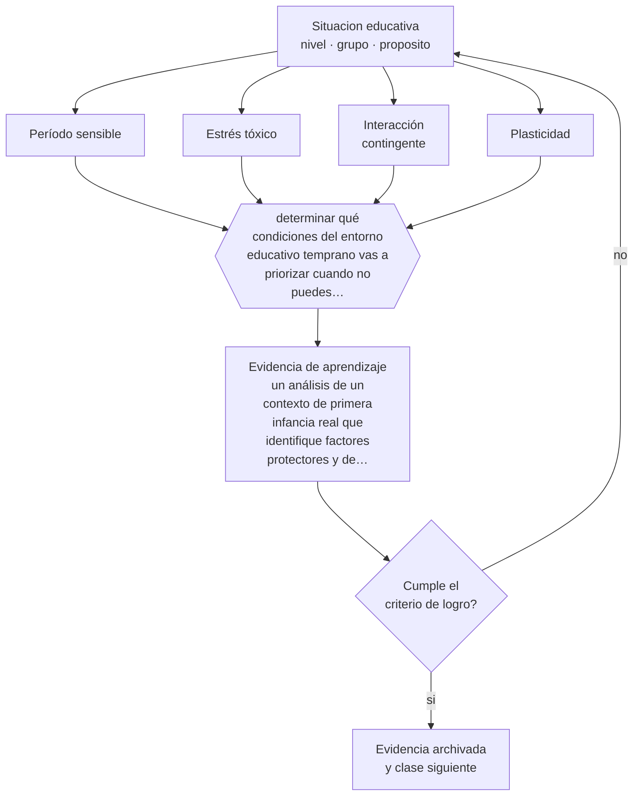

# Clase 025 — Desarrollo prenatal y primera infancia

> **Parte 02 · Desarrollo humano** — clase 1 de 12

**Estado de evidencia:** `ROBUSTA` · **Etapa:** 🟢 Etapa A — Fundamentos · **Población de referencia:** trayectoria completa: primera infancia a adultez mayor 
**Decisión que habilita:** determinar qué condiciones del entorno educativo temprano vas a priorizar cuando no puedes intervenir en todas 
**Evidencia de aprendizaje:** un análisis de un contexto de primera infancia real que identifique factores protectores y de riesgo, con acciones priorizadas

## 🎯 Propósito

Situar el desarrollo temprano como período de alta sensibilidad —no de determinación— y reconocer qué factores lo protegen o lo comprometen, con la precisión que la divulgación suele perder.

## 📚 Resultados de aprendizaje

Al finalizar esta clase podrás:

1. **Definir** con precisión los cuatro conceptos centrales de la clase y reconocerlos en una situación educativa real, no solo en su enunciado.
2. **Explicar** por qué las condiciones de los primeros años dejan huella y por qué eso no autoriza a hablar de destinos irreversibles.
3. **Decidir** —qué condiciones del entorno educativo temprano vas a priorizar cuando no puedes intervenir en todas— y sostener la decisión con un fundamento escrito.
4. **Producir** la evidencia de la clase —un análisis de un contexto de primera infancia real que identifique factores protectores y de riesgo, con acciones priorizadas— y contrastarla contra el criterio de logro.
5. **Distinguir** lo que la evidencia sostiene de lo que es práctica instalada, preferencia personal o costumbre de la institución.

## 🧩 Conceptos centrales

| Concepto | Comprensión verificable |
|---|---|
| **Período sensible** | ventana en que un sistema es especialmente receptivo a cierta experiencia; no equivale a ventana que se cierra |
| **Estrés tóxico** | activación intensa y prolongada del sistema de estrés sin apoyo adulto amortiguador |
| **Interacción contingente** | intercambio en que el adulto responde de forma ajustada y oportuna a la señal del niño |
| **Plasticidad** | capacidad del sistema nervioso de reorganizarse con la experiencia; disminuye pero no desaparece con la edad |

## 🗺️ Flujo de razonamiento

## 📖 Desarrollo

### 1. El fondo del asunto

La evidencia sobre desarrollo temprano converge en un punto: la calidad de la interacción con adultos sensibles y estables es el factor más consistente asociado a resultados posteriores, por encima de los materiales, la estimulación programada o los recursos tecnológicos. También está bien establecido que la adversidad severa y sostenida, sin adulto amortiguador, afecta el desarrollo. Ambos hallazgos tienen una implicación educativa directa: el recurso más importante de una sala cuna es el adulto disponible, no el equipamiento.

### 2. Cómo se traduce en decisiones de enseñanza

Para un equipo educativo esto significa proteger las condiciones que hacen posible la interacción sensible: proporción adulto-niño, estabilidad del personal, tiempo real de contacto individual, y rutinas de cuidado tratadas como oportunidades pedagógicas y no como trámites. Cuando hay que priorizar con recursos escasos, esas variables preceden a cualquier innovación curricular.

### 3. Qué sostiene la evidencia y qué no

La divulgación exagera este campo con frecuencia. No es cierto que existan ventanas que se cierran de forma irreversible a los tres años para la mayoría de las capacidades, ni que la estimulación intensiva temprana produzca ventajas duraderas por sí sola. La adversidad temprana aumenta el riesgo; no determina el resultado. Afirmar lo contrario ante una familia es incorrecto y además dañino.

> **Cómo leer el estado de evidencia `ROBUSTA`.** Hay evidencia convergente de varios equipos, países y diseños de investigación, incluidos estudios experimentales o cuasiexperimentales, y el efecto se sostiene al replicarlo. Puedes apoyar una decisión profesional en ella, sin olvidar que ningún efecto promedio describe a un estudiante concreto.

## 🧪 Taller guiado

Aplica la clase a **uno** de los contextos siguientes y repite después el ejercicio en un
contexto de exigencia distinta. Cambiar de contexto es parte del aprendizaje: lo que funciona
con un grupo no se traslada intacto a otro.

| Contexto | Rasgo que cambia la decisión |
|---|---|
| Primera infancia (0–3) | interacción, cuidado y lenguaje son el currículo |
| Preescolar (3–6) | el juego es el modo principal de aprender |
| Niñez media (6–11) | control ejecutivo creciente y comparación social |
| Adolescencia temprana (12–15) | reorganización social e identidad en juego |
| Adolescencia tardía y adultez emergente | proyección, autonomía y decisión vocacional |
| Adultez y adultez mayor | experiencia acumulada y aprendizaje con propósito |

**Secuencia de trabajo:**

1. Delimita el contexto: nivel, edad, tamaño del grupo, asignatura o experiencia y tiempo real disponible.
2. Declara qué saben ya los estudiantes y **cómo lo comprobaste**, no cómo lo supones.
3. Formula la decisión pedagógica que esta clase habilita y escribe su fundamento.
4. Anticipa qué observarías si la decisión funciona y qué observarías si no funciona.
5. Diseña de antemano la alternativa que aplicarás si la primera estrategia falla.
6. Ejecuta o simula, y registra lo observado con fecha, contexto y evidencia concreta.
7. Produce la evidencia de aprendizaje de la clase.
8. Contrástala contra el criterio de logro, corrige y recién entonces avanza.

### 📦 Evidencia de aprendizaje

Un análisis de un contexto de primera infancia real que identifique factores protectores y de riesgo, con acciones priorizadas.

Debe incluir contexto, decisión, fundamento, fuentes consultadas con su fecha, indicador de
logro observable, riesgos previstos y qué harías distinto en la siguiente iteración.

## 🏆 Reto verificable

Observa una jornada completa en un contexto de primera infancia y registra cuántas interacciones contingentes recibe un niño concreto. Propón una modificación de rutina que aumente ese número sin recursos adicionales.

## ✅ Criterio de logro

- [ ] el análisis identifica factores protectores y de riesgo con evidencia observada en el contexto;
- [ ] las acciones priorizadas atacan primero las condiciones de interacción y estabilidad;
- [ ] cada afirmación sobre «lo que funciona» está atribuida a una fuente identificable, con autor y fecha;
- [ ] la decisión es ejecutable con el tiempo, el espacio, el número de estudiantes y los recursos que realmente tienes;
- [ ] la evidencia queda archivada de forma reproducible: otra persona podría revisarla sin que tú se la expliques.

## ⚠️ Errores frecuentes

**Propios de esta clase:**

- Hablar de ventanas que se cierran y de daños irreversibles ante familias, sin respaldo.
- Priorizar equipamiento y programas de estimulación por sobre la proporción adulto-niño y la estabilidad del equipo.

**Característicos de la parte 02:**

- Usar la edad como diagnóstico y esperar el mismo desempeño de todo un curso.
- Patologizar variaciones que están dentro del rango esperable para la edad.

## ♿ Diversidad, accesibilidad y ética

Los factores de riesgo se concentran en las familias con menos apoyo, y las intervenciones mal diseñadas culpabilizan a los cuidadores en vez de sostenerlos. Toda acción debe evaluarse por si aumenta o disminuye la carga sobre quien ya está sobrecargado.

Antes de aplicar cualquier decisión de esta clase con estudiantes reales, revisa el
[protocolo de práctica responsable](../../../docs/ETICA_Y_PRACTICA_RESPONSABLE.md):
consentimiento, resguardo de datos personales, proporcionalidad de la intervención y derecho
de cada estudiante a no ser objeto de un ensayo que no le reporta beneficio.

## ❓ Preguntas de comprobación

1. ¿Cuánto tiempo de interacción individual recibe realmente cada niño en tu contexto?
2. ¿Qué afirmación sobre el cerebro infantil has escuchado que no resistiría una verificación?
3. ¿Qué harías primero si solo pudieras mejorar una condición del ambiente temprano?

## 📕 Lecturas base

**Shonkoff, J. & Phillips, D. (eds.) (2000). *From Neurons to Neighborhoods*.**  
*Qué aporta a esta clase:* la síntesis de referencia; distingue con cuidado lo establecido de lo sugerido.

**Center on the Developing Child, Harvard. *Working Papers* sobre estrés tóxico y funciones ejecutivas.**  
*Qué aporta a esta clase:* material técnico riguroso y accesible; útil para comunicar a equipos y familias sin exagerar.

Catálogo completo: [bibliografía del programa](../../../docs/BIBLIOGRAFIA.md) ·
[glosario](../../../docs/GLOSARIO.md) ·
[fuentes oficiales y cómo leerlas](../../../docs/FUENTES.md).

## 🔗 Conexión con el resto del programa

Es la base de la parte 03 y se conecta con la clase 030 sobre apego. Su tratamiento de la evidencia anticipa el criterio que la parte 16 exige a cualquier afirmación causal.

> [!IMPORTANT]
> Material de formación profesional. No reemplaza un título de pedagogía, una habilitación
> legal para ejercer, ni el juicio de un equipo educativo que conoce a sus estudiantes.

---

| Anterior | Índice | Siguiente |
|---|---|---|
| [← Parte 02](../README.md) | [Parte 02](../README.md) · [Programa](../../../README.md) | [026 · Desarrollo motor y sensorial →](../class-02-desarrollo-motor-y-sensorial/README.md) |
