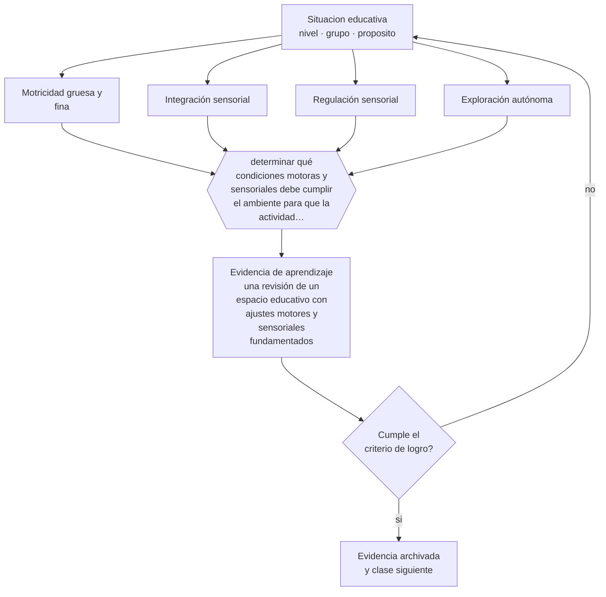

# Clase 026 — Desarrollo motor y sensorial

> **Parte 02 · Desarrollo humano** — clase 2 de 12

**Estado de evidencia:** `ROBUSTA` · **Etapa:** 🟢 Etapa A — Fundamentos · **Población de referencia:** trayectoria completa: primera infancia a adultez mayor 
**Decisión que habilita:** determinar qué condiciones motoras y sensoriales debe cumplir el ambiente para que la actividad que diseñaste sea posible 
**Evidencia de aprendizaje:** una revisión de un espacio educativo con ajustes motores y sensoriales fundamentados

## 🎯 Propósito

Comprender la trayectoria motora y sensorial y sus implicancias educativas: el cuerpo es el instrumento con el que se explora, se regula y se aprende durante los primeros años, y sigue importando después.

## 📚 Resultados de aprendizaje

Al finalizar esta clase podrás:

1. **Definir** con precisión los cuatro conceptos centrales de la clase y reconocerlos en una situación educativa real, no solo en su enunciado.
2. **Explicar** por qué el movimiento y la experiencia sensorial no son un complemento del aprendizaje temprano sino su vehículo.
3. **Decidir** —qué condiciones motoras y sensoriales debe cumplir el ambiente para que la actividad que diseñaste sea posible— y sostener la decisión con un fundamento escrito.
4. **Producir** la evidencia de la clase —una revisión de un espacio educativo con ajustes motores y sensoriales fundamentados— y contrastarla contra el criterio de logro.
5. **Distinguir** lo que la evidencia sostiene de lo que es práctica instalada, preferencia personal o costumbre de la institución.

## 🧩 Conceptos centrales

| Concepto | Comprensión verificable |
|---|---|
| **Motricidad gruesa y fina** | control de grandes grupos musculares y de movimientos precisos; siguen trayectorias distintas |
| **Integración sensorial** | procesamiento y organización de la información de los sentidos para responder al entorno |
| **Regulación sensorial** | capacidad de mantener un nivel de activación adecuado ante la estimulación del ambiente |
| **Exploración autónoma** | actividad iniciada por el propio niño; principal fuente de aprendizaje motor y espacial temprano |

## 🗺️ Flujo de razonamiento

## 📖 Desarrollo

### 1. El fondo del asunto

El desarrollo motor sigue regularidades robustas en su secuencia y amplia variabilidad en sus tiempos. Lo relevante para la educación es que el movimiento no es solo un logro a alcanzar: es el medio por el cual el niño accede a la información del mundo. Un niño que ya se desplaza recibe experiencias cualitativamente distintas de uno que aún no, y esa diferencia repercute en su desarrollo espacial, social y lingüístico.

### 2. Cómo se traduce en decisiones de enseñanza

El diseño del ambiente decide qué exploración es posible. Superficies, alturas, distancias, materiales, nivel de ruido y de estímulo visual determinan qué conductas aparecen. Un espacio saturado impide la regulación; uno pobre impide la exploración. La revisión sistemática del espacio, con criterios explícitos, produce más cambios en la conducta del grupo que la mayoría de las intervenciones directas sobre los niños.

### 3. Qué sostiene la evidencia y qué no

Los hitos motores tienen rangos amplios y su cumplimiento en fecha no predice desempeño posterior salvo en desviaciones marcadas. Conviene desconfiar de programas comerciales que prometen mejorar el aprendizaje mediante secuencias motoras específicas: la evidencia de transferencia a habilidades académicas es débil. Lo que sí está respaldado es el efecto general de la actividad física sobre salud, sueño y disponibilidad para aprender.

> **Cómo leer el estado de evidencia `ROBUSTA`.** Hay evidencia convergente de varios equipos, países y diseños de investigación, incluidos estudios experimentales o cuasiexperimentales, y el efecto se sostiene al replicarlo. Puedes apoyar una decisión profesional en ella, sin olvidar que ningún efecto promedio describe a un estudiante concreto.

## 🧪 Taller guiado

Aplica la clase a **uno** de los contextos siguientes y repite después el ejercicio en un
contexto de exigencia distinta. Cambiar de contexto es parte del aprendizaje: lo que funciona
con un grupo no se traslada intacto a otro.

| Contexto | Rasgo que cambia la decisión |
|---|---|
| Primera infancia (0–3) | interacción, cuidado y lenguaje son el currículo |
| Preescolar (3–6) | el juego es el modo principal de aprender |
| Niñez media (6–11) | control ejecutivo creciente y comparación social |
| Adolescencia temprana (12–15) | reorganización social e identidad en juego |
| Adolescencia tardía y adultez emergente | proyección, autonomía y decisión vocacional |
| Adultez y adultez mayor | experiencia acumulada y aprendizaje con propósito |

**Secuencia de trabajo:**

1. Delimita el contexto: nivel, edad, tamaño del grupo, asignatura o experiencia y tiempo real disponible.
2. Declara qué saben ya los estudiantes y **cómo lo comprobaste**, no cómo lo supones.
3. Formula la decisión pedagógica que esta clase habilita y escribe su fundamento.
4. Anticipa qué observarías si la decisión funciona y qué observarías si no funciona.
5. Diseña de antemano la alternativa que aplicarás si la primera estrategia falla.
6. Ejecuta o simula, y registra lo observado con fecha, contexto y evidencia concreta.
7. Produce la evidencia de aprendizaje de la clase.
8. Contrástala contra el criterio de logro, corrige y recién entonces avanza.

### 📦 Evidencia de aprendizaje

Una revisión de un espacio educativo con ajustes motores y sensoriales fundamentados.

Debe incluir contexto, decisión, fundamento, fuentes consultadas con su fecha, indicador de
logro observable, riesgos previstos y qué harías distinto en la siguiente iteración.

## 🏆 Reto verificable

Recorre un espacio educativo con la altura visual de un niño y registra tres barreras que no habías visto. Corrige una y observa qué conducta nueva aparece.

## ✅ Criterio de logro

- [ ] los ajustes propuestos se justifican por la conducta que habilitan y no por preferencia estética;
- [ ] se distingue el rango normal de variación de la señal que amerita derivación;
- [ ] cada afirmación sobre «lo que funciona» está atribuida a una fuente identificable, con autor y fecha;
- [ ] la decisión es ejecutable con el tiempo, el espacio, el número de estudiantes y los recursos que realmente tienes;
- [ ] la evidencia queda archivada de forma reproducible: otra persona podría revisarla sin que tú se la expliques.

## ⚠️ Errores frecuentes

**Propios de esta clase:**

- Interpretar una variación normal en el ritmo motor como señal de alerta.
- Adoptar programas que prometen mejorar la lectura mediante ejercicios motores específicos.

**Característicos de la parte 02:**

- Usar la edad como diagnóstico y esperar el mismo desempeño de todo un curso.
- Patologizar variaciones que están dentro del rango esperable para la edad.

## ♿ Diversidad, accesibilidad y ética

Las diferencias sensoriales y motoras son una de las principales fuentes de exclusión invisible: un ambiente que solo funciona para el perfil sensorial promedio deja fuera a niños que podrían participar plenamente con ajustes menores y de bajo costo.

Antes de aplicar cualquier decisión de esta clase con estudiantes reales, revisa el
[protocolo de práctica responsable](../../../docs/ETICA_Y_PRACTICA_RESPONSABLE.md):
consentimiento, resguardo de datos personales, proporcionalidad de la intervención y derecho
de cada estudiante a no ser objeto de un ensayo que no le reporta beneficio.

## ❓ Preguntas de comprobación

1. ¿Qué conducta de exploración impide hoy la organización de tu espacio?
2. ¿Qué nivel de estímulo sensorial tiene tu sala y a quién está dejando fuera?
3. ¿Qué signo motor te llevaría a derivar y con qué fundamento?

## 📕 Lecturas base

**Adolph, K. & Franchak, J. (2017). *The Development of Motor Behavior*.**  
*Qué aporta a esta clase:* revisión actual sobre variabilidad, aprendizaje motor y su relación con la exploración.

**Organización Mundial de la Salud (2019). *Directrices sobre actividad física, comportamientos sedentarios y sueño en menores de 5 años*.**  
*Qué aporta a esta clase:* recomendaciones respaldadas y verificables para el diseño de rutinas del nivel.

Catálogo completo: [bibliografía del programa](../../../docs/BIBLIOGRAFIA.md) ·
[glosario](../../../docs/GLOSARIO.md) ·
[fuentes oficiales y cómo leerlas](../../../docs/FUENTES.md).

## 🔗 Conexión con el resto del programa

Sostiene la parte 03 (ambientes y corporalidad) y la parte 08 (accesibilidad física y sensorial).

> [!IMPORTANT]
> Material de formación profesional. No reemplaza un título de pedagogía, una habilitación
> legal para ejercer, ni el juicio de un equipo educativo que conoce a sus estudiantes.

---

| Anterior | Índice | Siguiente |
|---|---|---|
| [← 025 · Desarrollo prenatal y primera infancia](../class-01-desarrollo-prenatal-y-primera-infancia/README.md) | [Parte 02](../README.md) · [Programa](../../../README.md) | [027 · Desarrollo del lenguaje →](../class-03-desarrollo-del-lenguaje/README.md) |
