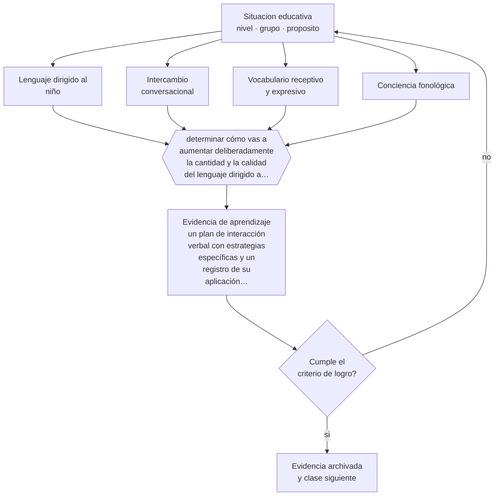

# Clase 027 — Desarrollo del lenguaje

> **Parte 02 · Desarrollo humano** — clase 3 de 12

**Estado de evidencia:** `ROBUSTA` · **Etapa:** 🟢 Etapa A — Fundamentos · **Población de referencia:** trayectoria completa: primera infancia a adultez mayor 
**Decisión que habilita:** determinar cómo vas a aumentar deliberadamente la cantidad y la calidad del lenguaje dirigido a cada niño 
**Evidencia de aprendizaje:** un plan de interacción verbal con estrategias específicas y un registro de su aplicación durante una semana

## 🎯 Propósito

Comprender la adquisición del lenguaje y su papel como predictor educativo, y convertir esa comprensión en prácticas concretas de interacción verbal dentro de la sala.

## 📚 Resultados de aprendizaje

Al finalizar esta clase podrás:

1. **Definir** con precisión los cuatro conceptos centrales de la clase y reconocerlos en una situación educativa real, no solo en su enunciado.
2. **Explicar** por qué la cantidad y la calidad del lenguaje que un niño escucha predicen su trayectoria escolar posterior.
3. **Decidir** —cómo vas a aumentar deliberadamente la cantidad y la calidad del lenguaje dirigido a cada niño— y sostener la decisión con un fundamento escrito.
4. **Producir** la evidencia de la clase —un plan de interacción verbal con estrategias específicas y un registro de su aplicación durante una semana— y contrastarla contra el criterio de logro.
5. **Distinguir** lo que la evidencia sostiene de lo que es práctica instalada, preferencia personal o costumbre de la institución.

## 🧩 Conceptos centrales

| Concepto | Comprensión verificable |
|---|---|
| **Lenguaje dirigido al niño** | habla que un adulto ajusta y dirige específicamente al niño; predice desarrollo mejor que el habla ambiental |
| **Intercambio conversacional** | turno completo de ida y vuelta entre adulto y niño; unidad con mayor valor predictivo |
| **Vocabulario receptivo y expresivo** | palabras que se comprenden y palabras que se producen; avanzan a ritmos distintos |
| **Conciencia fonológica** | capacidad de identificar y manipular los sonidos del habla; predictor directo de la lectura inicial |

## 🗺️ Flujo de razonamiento

## 📖 Desarrollo

### 1. El fondo del asunto

El lenguaje se adquiere en interacción, no por exposición pasiva: lo que predice el desarrollo no es la cantidad de palabras en el ambiente sino los intercambios conversacionales dirigidos al niño. La diferencia entre contextos en esta variable es grande y aparece temprano, y se asocia con el vocabulario posterior y con la comprensión lectora. Es, además, una de las pocas variables que un equipo educativo puede modificar directamente con formación y sin recursos adicionales.

### 2. Cómo se traduce en decisiones de enseñanza

Las estrategias con respaldo son concretas: nombrar lo que ocurre, ampliar el enunciado del niño en vez de corregirlo, hacer preguntas abiertas y esperar la respuesta, sostener turnos en vez de encadenar instrucciones. Registrar cuántos intercambios completos tiene cada niño en una jornada suele revelar que los más callados casi no reciben ninguno, y ese solo dato cambia la práctica de un equipo.

### 3. Qué sostiene la evidencia y qué no

La magnitud de la brecha léxica temprana ha sido revisada y los datos originales muy citados fueron cuestionados metodológicamente; la existencia de la diferencia se sostiene, su tamaño exacto no. Además, el bilingüismo no retrasa el desarrollo del lenguaje, aunque distribuya el vocabulario entre dos lenguas: evaluar solo en una lengua produce falsos diagnósticos de retraso.

> **Cómo leer el estado de evidencia `ROBUSTA`.** Hay evidencia convergente de varios equipos, países y diseños de investigación, incluidos estudios experimentales o cuasiexperimentales, y el efecto se sostiene al replicarlo. Puedes apoyar una decisión profesional en ella, sin olvidar que ningún efecto promedio describe a un estudiante concreto.

## 🧪 Taller guiado

Aplica la clase a **uno** de los contextos siguientes y repite después el ejercicio en un
contexto de exigencia distinta. Cambiar de contexto es parte del aprendizaje: lo que funciona
con un grupo no se traslada intacto a otro.

| Contexto | Rasgo que cambia la decisión |
|---|---|
| Primera infancia (0–3) | interacción, cuidado y lenguaje son el currículo |
| Preescolar (3–6) | el juego es el modo principal de aprender |
| Niñez media (6–11) | control ejecutivo creciente y comparación social |
| Adolescencia temprana (12–15) | reorganización social e identidad en juego |
| Adolescencia tardía y adultez emergente | proyección, autonomía y decisión vocacional |
| Adultez y adultez mayor | experiencia acumulada y aprendizaje con propósito |

**Secuencia de trabajo:**

1. Delimita el contexto: nivel, edad, tamaño del grupo, asignatura o experiencia y tiempo real disponible.
2. Declara qué saben ya los estudiantes y **cómo lo comprobaste**, no cómo lo supones.
3. Formula la decisión pedagógica que esta clase habilita y escribe su fundamento.
4. Anticipa qué observarías si la decisión funciona y qué observarías si no funciona.
5. Diseña de antemano la alternativa que aplicarás si la primera estrategia falla.
6. Ejecuta o simula, y registra lo observado con fecha, contexto y evidencia concreta.
7. Produce la evidencia de aprendizaje de la clase.
8. Contrástala contra el criterio de logro, corrige y recién entonces avanza.

### 📦 Evidencia de aprendizaje

Un plan de interacción verbal con estrategias específicas y un registro de su aplicación durante una semana.

Debe incluir contexto, decisión, fundamento, fuentes consultadas con su fecha, indicador de
logro observable, riesgos previstos y qué harías distinto en la siguiente iteración.

## 🏆 Reto verificable

Registra durante tres jornadas los intercambios de cinco niños distintos. Diseña una modificación de rutina que iguale esa distribución y verifica su efecto.

## ✅ Criterio de logro

- [ ] el plan define estrategias observables y no intenciones generales;
- [ ] el registro muestra distribución de intercambios por niño, no solo total del grupo;
- [ ] cada afirmación sobre «lo que funciona» está atribuida a una fuente identificable, con autor y fecha;
- [ ] la decisión es ejecutable con el tiempo, el espacio, el número de estudiantes y los recursos que realmente tienes;
- [ ] la evidencia queda archivada de forma reproducible: otra persona podría revisarla sin que tú se la expliques.

## ⚠️ Errores frecuentes

**Propios de esta clase:**

- Evaluar el lenguaje de un niño bilingüe considerando solo una de sus lenguas.
- Aumentar la cantidad de habla del adulto sin generar turnos reales del niño.

**Característicos de la parte 02:**

- Usar la edad como diagnóstico y esperar el mismo desempeño de todo un curso.
- Patologizar variaciones que están dentro del rango esperable para la edad.

## ♿ Diversidad, accesibilidad y ética

Los niños que menos hablan reciben menos lenguaje, y así se amplía la brecha. Un plan de interacción verbal debe garantizar de forma deliberada turnos para quienes no los reclaman, incluidos los niños con dificultades de comunicación y los que aprenden en una segunda lengua.

Antes de aplicar cualquier decisión de esta clase con estudiantes reales, revisa el
[protocolo de práctica responsable](../../../docs/ETICA_Y_PRACTICA_RESPONSABLE.md):
consentimiento, resguardo de datos personales, proporcionalidad de la intervención y derecho
de cada estudiante a no ser objeto de un ensayo que no le reporta beneficio.

## ❓ Preguntas de comprobación

1. ¿Cuántos intercambios conversacionales completos tuvo hoy el niño más callado de tu grupo?
2. ¿Cuánto de tu habla son instrucciones y cuánto son turnos de conversación?
3. ¿Cómo distinguirías un retraso del lenguaje de una distribución bilingüe del vocabulario?

## 📕 Lecturas base

**Romeo, R. et al. (2018). *Beyond the 30-Million-Word Gap: Children's Conversational Exposure*. Psychological Science, 29(5).**  
*Qué aporta a esta clase:* muestra que los turnos conversacionales, y no el número de palabras, explican la asociación con el desarrollo.

**Snow, C., Burns, S. & Griffin, P. (eds.) (1998). *Preventing Reading Difficulties in Young Children*.**  
*Qué aporta a esta clase:* conecta lenguaje oral temprano con lectura posterior; base de la prevención de dificultades lectoras.

Catálogo completo: [bibliografía del programa](../../../docs/BIBLIOGRAFIA.md) ·
[glosario](../../../docs/GLOSARIO.md) ·
[fuentes oficiales y cómo leerlas](../../../docs/FUENTES.md).

## 🔗 Conexión con el resto del programa

Es la base de la clase 040 (alfabetización emergente) y de la parte 04, donde el vocabulario oral explica buena parte de la comprensión lectora.

> [!IMPORTANT]
> Material de formación profesional. No reemplaza un título de pedagogía, una habilitación
> legal para ejercer, ni el juicio de un equipo educativo que conoce a sus estudiantes.

---

| Anterior | Índice | Siguiente |
|---|---|---|
| [← 026 · Desarrollo motor y sensorial](../class-02-desarrollo-motor-y-sensorial/README.md) | [Parte 02](../README.md) · [Programa](../../../README.md) | [028 · Desarrollo cognitivo →](../class-04-desarrollo-cognitivo/README.md) |
