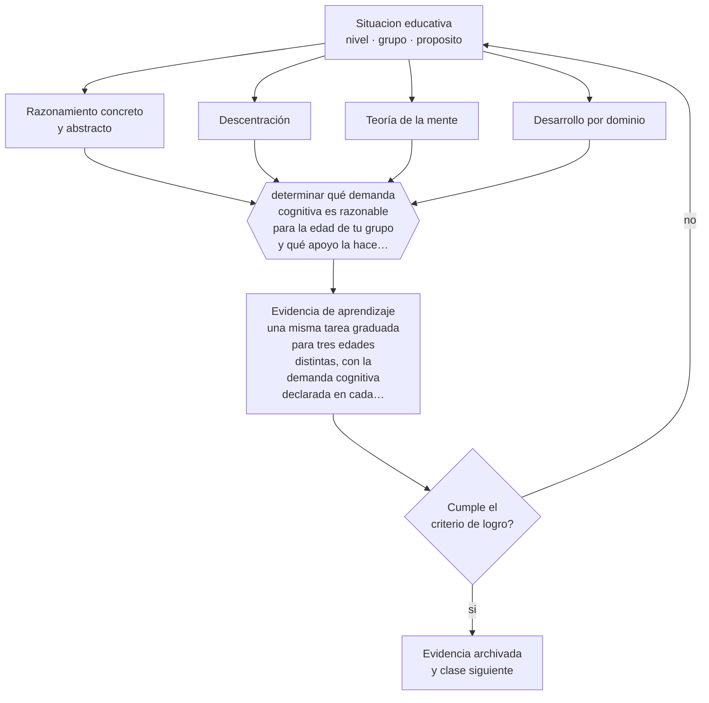

# Clase 028 — Desarrollo cognitivo

> **Parte 02 · Desarrollo humano** — clase 4 de 12

**Estado de evidencia:** `CONSISTENTE` · **Etapa:** 🟢 Etapa A — Fundamentos · **Población de referencia:** trayectoria completa: primera infancia a adultez mayor 
**Decisión que habilita:** determinar qué demanda cognitiva es razonable para la edad de tu grupo y qué apoyo la hace accesible 
**Evidencia de aprendizaje:** una misma tarea graduada para tres edades distintas, con la demanda cognitiva declarada en cada versión

## 🎯 Propósito

Usar el desarrollo cognitivo como marco de expectativas realistas sin caer en la aplicación rígida de etapas, que subestima lo que los niños pueden hacer con apoyo y sobreestima la homogeneidad por edad.

## 📚 Resultados de aprendizaje

Al finalizar esta clase podrás:

1. **Definir** con precisión los cuatro conceptos centrales de la clase y reconocerlos en una situación educativa real, no solo en su enunciado.
2. **Explicar** qué conserva y qué corrige la investigación actual respecto de las etapas clásicas del desarrollo cognitivo.
3. **Decidir** —qué demanda cognitiva es razonable para la edad de tu grupo y qué apoyo la hace accesible— y sostener la decisión con un fundamento escrito.
4. **Producir** la evidencia de la clase —una misma tarea graduada para tres edades distintas, con la demanda cognitiva declarada en cada versión— y contrastarla contra el criterio de logro.
5. **Distinguir** lo que la evidencia sostiene de lo que es práctica instalada, preferencia personal o costumbre de la institución.

## 🧩 Conceptos centrales

| Concepto | Comprensión verificable |
|---|---|
| **Razonamiento concreto y abstracto** | operar sobre objetos y situaciones presentes frente a operar sobre símbolos y posibilidades |
| **Descentración** | capacidad de considerar un punto de vista distinto del propio |
| **Teoría de la mente** | comprensión de que otros tienen creencias, deseos e intenciones distintos de los propios |
| **Desarrollo por dominio** | avance desigual: un mismo niño puede razonar de forma avanzada en un ámbito y elemental en otro |

## 🗺️ Flujo de razonamiento

## 📖 Desarrollo

### 1. El fondo del asunto

Las etapas clásicas describen bien una progresión general y mal la variabilidad real. La investigación posterior mostró que los niños pequeños son capaces de más de lo que las tareas piagetianas originales revelaban —el formato de la tarea escondía la competencia— y que el desarrollo no avanza en bloque sino por dominios, dependiendo del conocimiento previo específico. Un niño experto en un tema razona sobre él mejor que un adulto novato.

### 2. Cómo se traduce en decisiones de enseñanza

La consecuencia práctica es doble. Primero: no bajar la demanda por edad, sino ajustar el formato, el soporte y el contexto de la tarea. Segundo: no suponer homogeneidad por curso; dentro de un mismo grupo la distancia en razonamiento sobre un contenido específico depende más de lo que cada uno sabe del tema que de su fecha de nacimiento.

### 3. Qué sostiene la evidencia y qué no

Las etapas siguen siendo útiles como referencia gruesa y peligrosas como criterio de decisión individual. Usar la edad para concluir que algo «no corresponde» es uno de los errores más costosos del oficio, porque se autoconfirma: nunca se ofrece la tarea, luego nunca se observa la capacidad. La regla es ofrecer, observar y ajustar, en ese orden.

> **Cómo leer el estado de evidencia `CONSISTENTE`.** La evidencia es amplia y coherente, pero proviene sobre todo de estudios correlacionales, de síntesis con heterogeneidad alta o de contextos distintos al tuyo. Sirve para orientar la decisión y exige que compruebes el efecto en tu propio grupo.

## 🧪 Taller guiado

Aplica la clase a **uno** de los contextos siguientes y repite después el ejercicio en un
contexto de exigencia distinta. Cambiar de contexto es parte del aprendizaje: lo que funciona
con un grupo no se traslada intacto a otro.

| Contexto | Rasgo que cambia la decisión |
|---|---|
| Primera infancia (0–3) | interacción, cuidado y lenguaje son el currículo |
| Preescolar (3–6) | el juego es el modo principal de aprender |
| Niñez media (6–11) | control ejecutivo creciente y comparación social |
| Adolescencia temprana (12–15) | reorganización social e identidad en juego |
| Adolescencia tardía y adultez emergente | proyección, autonomía y decisión vocacional |
| Adultez y adultez mayor | experiencia acumulada y aprendizaje con propósito |

**Secuencia de trabajo:**

1. Delimita el contexto: nivel, edad, tamaño del grupo, asignatura o experiencia y tiempo real disponible.
2. Declara qué saben ya los estudiantes y **cómo lo comprobaste**, no cómo lo supones.
3. Formula la decisión pedagógica que esta clase habilita y escribe su fundamento.
4. Anticipa qué observarías si la decisión funciona y qué observarías si no funciona.
5. Diseña de antemano la alternativa que aplicarás si la primera estrategia falla.
6. Ejecuta o simula, y registra lo observado con fecha, contexto y evidencia concreta.
7. Produce la evidencia de aprendizaje de la clase.
8. Contrástala contra el criterio de logro, corrige y recién entonces avanza.

### 📦 Evidencia de aprendizaje

Una misma tarea graduada para tres edades distintas, con la demanda cognitiva declarada en cada versión.

Debe incluir contexto, decisión, fundamento, fuentes consultadas con su fecha, indicador de
logro observable, riesgos previstos y qué harías distinto en la siguiente iteración.

## 🏆 Reto verificable

Toma una tarea que consideres imposible para una edad menor. Rediséñala con otro formato, aplícala y documenta qué pudieron hacer realmente.

## ✅ Criterio de logro

- [ ] cada versión de la tarea declara qué demanda cognitiva mantiene y cuál modifica;
- [ ] el ajuste se hace en formato y soporte, no bajando el objetivo de aprendizaje;
- [ ] cada afirmación sobre «lo que funciona» está atribuida a una fuente identificable, con autor y fecha;
- [ ] la decisión es ejecutable con el tiempo, el espacio, el número de estudiantes y los recursos que realmente tienes;
- [ ] la evidencia queda archivada de forma reproducible: otra persona podría revisarla sin que tú se la expliques.

## ⚠️ Errores frecuentes

**Propios de esta clase:**

- Descartar una tarea por la edad sin haber probado un formato accesible.
- Suponer que un curso completo comparte el mismo nivel de razonamiento por tener la misma edad.

**Característicos de la parte 02:**

- Usar la edad como diagnóstico y esperar el mismo desempeño de todo un curso.
- Patologizar variaciones que están dentro del rango esperable para la edad.

## ♿ Diversidad, accesibilidad y ética

El criterio de edad se usa con frecuencia para justificar expectativas más bajas con estudiantes con discapacidad intelectual o trayectorias interrumpidas. La misma regla se aplica: ofrecer, observar y ajustar el soporte, nunca reducir de entrada la demanda por una categoría.

Antes de aplicar cualquier decisión de esta clase con estudiantes reales, revisa el
[protocolo de práctica responsable](../../../docs/ETICA_Y_PRACTICA_RESPONSABLE.md):
consentimiento, resguardo de datos personales, proporcionalidad de la intervención y derecho
de cada estudiante a no ser objeto de un ensayo que no le reporta beneficio.

## ❓ Preguntas de comprobación

1. ¿Qué tarea has descartado por edad sin haberla probado con otro formato?
2. ¿En qué dominio específico razona mejor que tú algún estudiante de tu curso?
3. ¿Qué evidencia usarías para ajustar la demanda en vez de la edad como criterio?

## 📕 Lecturas base

**Siegler, R. (1996). *Emerging Minds: The Process of Change in Children's Thinking*.**  
*Qué aporta a esta clase:* muestra el desarrollo como variabilidad y selección de estrategias, no como sucesión de etapas fijas.

**Gopnik, A. (2016). *The Gardener and the Carpenter*.**  
*Qué aporta a esta clase:* síntesis accesible de la investigación reciente sobre cognición infantil y sus implicancias para adultos que enseñan.

Catálogo completo: [bibliografía del programa](../../../docs/BIBLIOGRAFIA.md) ·
[glosario](../../../docs/GLOSARIO.md) ·
[fuentes oficiales y cómo leerlas](../../../docs/FUENTES.md).

## 🔗 Conexión con el resto del programa

Corrige el uso ingenuo de las etapas en las partes 03, 04 y 05, y se apoya en la clase 015 sobre concepciones previas.

> [!IMPORTANT]
> Material de formación profesional. No reemplaza un título de pedagogía, una habilitación
> legal para ejercer, ni el juicio de un equipo educativo que conoce a sus estudiantes.

---

| Anterior | Índice | Siguiente |
|---|---|---|
| [← 027 · Desarrollo del lenguaje](../class-03-desarrollo-del-lenguaje/README.md) | [Parte 02](../README.md) · [Programa](../../../README.md) | [029 · Desarrollo socioemocional →](../class-05-desarrollo-socioemocional/README.md) |
