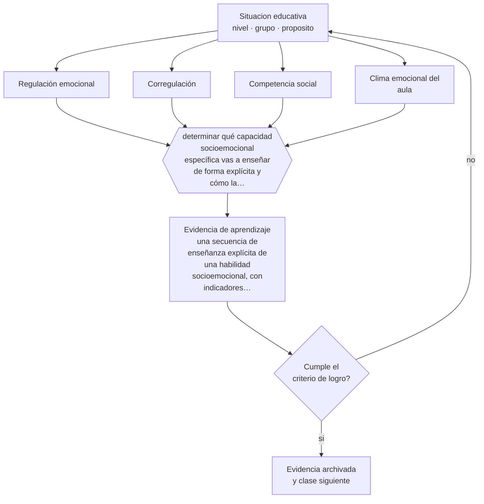

# Clase 029 — Desarrollo socioemocional

> **Parte 02 · Desarrollo humano** — clase 5 de 12

**Estado de evidencia:** `CONSISTENTE` · **Etapa:** 🟢 Etapa A — Fundamentos · **Población de referencia:** trayectoria completa: primera infancia a adultez mayor 
**Decisión que habilita:** determinar qué capacidad socioemocional específica vas a enseñar de forma explícita y cómo la evaluarás 
**Evidencia de aprendizaje:** una secuencia de enseñanza explícita de una habilidad socioemocional, con indicadores observables

## 🎯 Propósito

Comprender el desarrollo socioemocional como aprendizaje: reconocer, nombrar y regular emociones, y sostener relaciones, son capacidades que se construyen con mediación adulta.

## 📚 Resultados de aprendizaje

Al finalizar esta clase podrás:

1. **Definir** con precisión los cuatro conceptos centrales de la clase y reconocerlos en una situación educativa real, no solo en su enunciado.
2. **Explicar** por qué la regulación emocional es una capacidad que se enseña y no un rasgo de carácter que se exige.
3. **Decidir** —qué capacidad socioemocional específica vas a enseñar de forma explícita y cómo la evaluarás— y sostener la decisión con un fundamento escrito.
4. **Producir** la evidencia de la clase —una secuencia de enseñanza explícita de una habilidad socioemocional, con indicadores observables— y contrastarla contra el criterio de logro.
5. **Distinguir** lo que la evidencia sostiene de lo que es práctica instalada, preferencia personal o costumbre de la institución.

## 🧩 Conceptos centrales

| Concepto | Comprensión verificable |
|---|---|
| **Regulación emocional** | capacidad de modular la intensidad y la expresión de la propia emoción según el contexto |
| **Corregulación** | apoyo del adulto que permite al niño regularse antes de poder hacerlo solo |
| **Competencia social** | conjunto de habilidades para iniciar, sostener y reparar relaciones con pares |
| **Clima emocional del aula** | tono afectivo predominante en la interacción; condiciona la disposición a aprender |

## 🗺️ Flujo de razonamiento

## 📖 Desarrollo

### 1. El fondo del asunto

La regulación emocional se desarrolla primero como corregulación: el adulto presta su calma y su lenguaje hasta que el niño puede hacerlo solo. Exigir autorregulación a quien todavía depende de la corregulación produce escalada, no aprendizaje. La evidencia sobre programas de aprendizaje socioemocional muestra efectos positivos en conducta, clima y también en resultados académicos, aunque su magnitud depende fuertemente de la calidad de la implementación.

### 2. Cómo se traduce en decisiones de enseñanza

Enseñar una habilidad socioemocional sigue la misma lógica que enseñar cualquier contenido: definirla en conducta observable, modelarla, practicarla en situaciones reales, retroalimentar y sostenerla en el tiempo. «Pedir ayuda cuando no entiendo» o «esperar mi turno para hablar en una discusión» son objetivos enseñables; «ser respetuoso» no lo es hasta que se traduce en conductas concretas.

### 3. Qué sostiene la evidencia y qué no

Los programas socioemocionales adoptados como paquete y aplicados con baja fidelidad rinden poco, y su evaluación suele apoyarse en autorreportes. Además, tratar como déficit individual lo que responde a condiciones del ambiente —hacinamiento, violencia, inestabilidad— desplaza la responsabilidad hacia el niño. La habilidad se enseña y el contexto se corrige; hacer solo lo primero es insuficiente.

> **Cómo leer el estado de evidencia `CONSISTENTE`.** La evidencia es amplia y coherente, pero proviene sobre todo de estudios correlacionales, de síntesis con heterogeneidad alta o de contextos distintos al tuyo. Sirve para orientar la decisión y exige que compruebes el efecto en tu propio grupo.

## 🧪 Taller guiado

Aplica la clase a **uno** de los contextos siguientes y repite después el ejercicio en un
contexto de exigencia distinta. Cambiar de contexto es parte del aprendizaje: lo que funciona
con un grupo no se traslada intacto a otro.

| Contexto | Rasgo que cambia la decisión |
|---|---|
| Primera infancia (0–3) | interacción, cuidado y lenguaje son el currículo |
| Preescolar (3–6) | el juego es el modo principal de aprender |
| Niñez media (6–11) | control ejecutivo creciente y comparación social |
| Adolescencia temprana (12–15) | reorganización social e identidad en juego |
| Adolescencia tardía y adultez emergente | proyección, autonomía y decisión vocacional |
| Adultez y adultez mayor | experiencia acumulada y aprendizaje con propósito |

**Secuencia de trabajo:**

1. Delimita el contexto: nivel, edad, tamaño del grupo, asignatura o experiencia y tiempo real disponible.
2. Declara qué saben ya los estudiantes y **cómo lo comprobaste**, no cómo lo supones.
3. Formula la decisión pedagógica que esta clase habilita y escribe su fundamento.
4. Anticipa qué observarías si la decisión funciona y qué observarías si no funciona.
5. Diseña de antemano la alternativa que aplicarás si la primera estrategia falla.
6. Ejecuta o simula, y registra lo observado con fecha, contexto y evidencia concreta.
7. Produce la evidencia de aprendizaje de la clase.
8. Contrástala contra el criterio de logro, corrige y recién entonces avanza.

### 📦 Evidencia de aprendizaje

Una secuencia de enseñanza explícita de una habilidad socioemocional, con indicadores observables.

Debe incluir contexto, decisión, fundamento, fuentes consultadas con su fecha, indicador de
logro observable, riesgos previstos y qué harías distinto en la siguiente iteración.

## 🏆 Reto verificable

Escoge una conducta socioemocional que reclames a menudo. Conviértela en objetivo enseñable, enséñala durante tres semanas y mide su frecuencia antes y después.

## ✅ Criterio de logro

- [ ] la habilidad está definida como conducta observable y practicable;
- [ ] la secuencia incluye modelamiento, práctica y retroalimentación, no solo conversación;
- [ ] cada afirmación sobre «lo que funciona» está atribuida a una fuente identificable, con autor y fecha;
- [ ] la decisión es ejecutable con el tiempo, el espacio, el número de estudiantes y los recursos que realmente tienes;
- [ ] la evidencia queda archivada de forma reproducible: otra persona podría revisarla sin que tú se la expliques.

## ⚠️ Errores frecuentes

**Propios de esta clase:**

- Exigir autorregulación en edades o situaciones en que aún se requiere corregulación.
- Definir objetivos socioemocionales con etiquetas de valor en vez de conductas observables.

**Característicos de la parte 02:**

- Usar la edad como diagnóstico y esperar el mismo desempeño de todo un curso.
- Patologizar variaciones que están dentro del rango esperable para la edad.

## ♿ Diversidad, accesibilidad y ética

Las expectativas sobre expresión emocional están culturalmente situadas, y lo que una institución lee como desregulación puede ser una norma familiar distinta. Antes de intervenir conviene distinguir diferencia cultural, dificultad de regulación y respuesta razonable a un contexto adverso.

Antes de aplicar cualquier decisión de esta clase con estudiantes reales, revisa el
[protocolo de práctica responsable](../../../docs/ETICA_Y_PRACTICA_RESPONSABLE.md):
consentimiento, resguardo de datos personales, proporcionalidad de la intervención y derecho
de cada estudiante a no ser objeto de un ensayo que no le reporta beneficio.

## ❓ Preguntas de comprobación

1. ¿Qué conducta concreta esperas cuando pides «respeto» a tu grupo?
2. ¿Qué haces tú para corregular antes de exigir que se regulen solos?
3. ¿Qué condición del ambiente está produciendo la conducta que atribuyes al estudiante?

## 📕 Lecturas base

**Durlak, J. et al. (2011). *The Impact of Enhancing Students' Social and Emotional Learning*. Child Development, 82(1).**  
*Qué aporta a esta clase:* metaanálisis de referencia; declara efectos y también la dependencia de la implementación.

**Denham, S. (1998). *Emotional Development in Young Children*.**  
*Qué aporta a esta clase:* describe la secuencia del desarrollo emocional con criterios observables para el trabajo educativo.

Catálogo completo: [bibliografía del programa](../../../docs/BIBLIOGRAFIA.md) ·
[glosario](../../../docs/GLOSARIO.md) ·
[fuentes oficiales y cómo leerlas](../../../docs/FUENTES.md).

## 🔗 Conexión con el resto del programa

Sostiene la parte 12 (clima y convivencia) y se apoya en la clase 030. En la parte 03 aparece como núcleo del nivel parvulario.

> [!IMPORTANT]
> Material de formación profesional. No reemplaza un título de pedagogía, una habilitación
> legal para ejercer, ni el juicio de un equipo educativo que conoce a sus estudiantes.

---

| Anterior | Índice | Siguiente |
|---|---|---|
| [← 028 · Desarrollo cognitivo](../class-04-desarrollo-cognitivo/README.md) | [Parte 02](../README.md) · [Programa](../../../README.md) | [030 · Apego y vínculos →](../class-06-apego-y-vinculos/README.md) |
