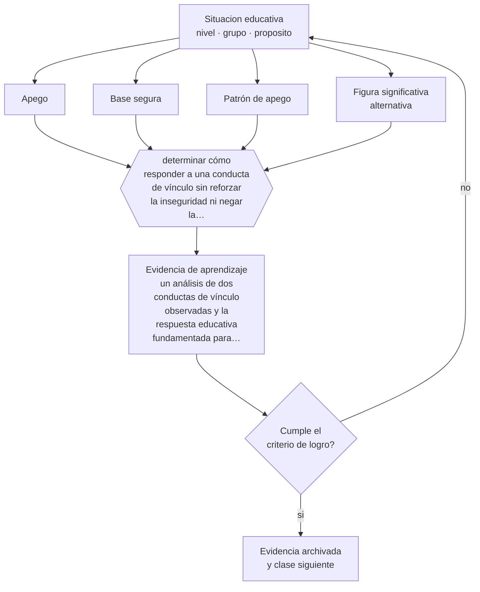

# Clase 030 — Apego y vínculos

> **Parte 02 · Desarrollo humano** — clase 6 de 12

**Estado de evidencia:** `ROBUSTA` · **Etapa:** 🟢 Etapa A — Fundamentos · **Población de referencia:** trayectoria completa: primera infancia a adultez mayor 
**Decisión que habilita:** determinar cómo responder a una conducta de vínculo sin reforzar la inseguridad ni negar la necesidad 
**Evidencia de aprendizaje:** un análisis de dos conductas de vínculo observadas y la respuesta educativa fundamentada para cada una

## 🎯 Propósito

Usar la teoría del apego para interpretar conductas de dependencia, evitación o desafío en contextos educativos, sin convertirla en diagnóstico ni en explicación universal.

## 📚 Resultados de aprendizaje

Al finalizar esta clase podrás:

1. **Definir** con precisión los cuatro conceptos centrales de la clase y reconocerlos en una situación educativa real, no solo en su enunciado.
2. **Explicar** qué explica el apego sobre la conducta escolar y qué se le atribuye sin fundamento.
3. **Decidir** —cómo responder a una conducta de vínculo sin reforzar la inseguridad ni negar la necesidad— y sostener la decisión con un fundamento escrito.
4. **Producir** la evidencia de la clase —un análisis de dos conductas de vínculo observadas y la respuesta educativa fundamentada para cada una— y contrastarla contra el criterio de logro.
5. **Distinguir** lo que la evidencia sostiene de lo que es práctica instalada, preferencia personal o costumbre de la institución.

## 🧩 Conceptos centrales

| Concepto | Comprensión verificable |
|---|---|
| **Apego** | vínculo afectivo con un cuidador que organiza la búsqueda de proximidad y seguridad |
| **Base segura** | función del adulto que permite al niño explorar sabiendo que hay retorno disponible |
| **Patrón de apego** | forma característica de responder ante la separación y el reencuentro; describe la relación, no al niño |
| **Figura significativa alternativa** | adulto no cuidador principal que puede cumplir funciones de sostén y ampliar la seguridad |

## 🗺️ Flujo de razonamiento

## 📖 Desarrollo

### 1. El fondo del asunto

La contribución central de la teoría es que la seguridad no compite con la exploración: la habilita. Un niño con una base segura explora más, no menos. En contextos educativos esto se traduce en que la disponibilidad predecible del adulto —no la permisividad— es lo que permite que un niño se arriesgue a intentar, equivocarse y pedir ayuda. La docente o el docente pueden funcionar como figura significativa alternativa, y para algunos estudiantes esa función es determinante.

### 2. Cómo se traduce en decisiones de enseñanza

La aplicación consiste en responder de forma predecible y no personalizada al conflicto: sostener el límite sin retirar el vínculo. Un estudiante que provoca rechazo suele estar comprobando si el adulto se irá; responder con distancia confirma su hipótesis. La consistencia a lo largo de semanas hace más que cualquier conversación aislada, y es también lo más difícil de sostener cuando la conducta es desafiante.

### 3. Qué sostiene la evidencia y qué no

El apego describe una relación específica, no un rasgo permanente del niño ni una explicación de todo su comportamiento. Los patrones pueden diferir entre cuidadores y cambiar con el tiempo. Ningún profesional educativo debe diagnosticar apego ni comunicar categorías a las familias: eso corresponde a evaluación clínica especializada, y su uso informal produce estigma sobre los cuidadores.

> **Cómo leer el estado de evidencia `ROBUSTA`.** Hay evidencia convergente de varios equipos, países y diseños de investigación, incluidos estudios experimentales o cuasiexperimentales, y el efecto se sostiene al replicarlo. Puedes apoyar una decisión profesional en ella, sin olvidar que ningún efecto promedio describe a un estudiante concreto.

## 🧪 Taller guiado

Aplica la clase a **uno** de los contextos siguientes y repite después el ejercicio en un
contexto de exigencia distinta. Cambiar de contexto es parte del aprendizaje: lo que funciona
con un grupo no se traslada intacto a otro.

| Contexto | Rasgo que cambia la decisión |
|---|---|
| Primera infancia (0–3) | interacción, cuidado y lenguaje son el currículo |
| Preescolar (3–6) | el juego es el modo principal de aprender |
| Niñez media (6–11) | control ejecutivo creciente y comparación social |
| Adolescencia temprana (12–15) | reorganización social e identidad en juego |
| Adolescencia tardía y adultez emergente | proyección, autonomía y decisión vocacional |
| Adultez y adultez mayor | experiencia acumulada y aprendizaje con propósito |

**Secuencia de trabajo:**

1. Delimita el contexto: nivel, edad, tamaño del grupo, asignatura o experiencia y tiempo real disponible.
2. Declara qué saben ya los estudiantes y **cómo lo comprobaste**, no cómo lo supones.
3. Formula la decisión pedagógica que esta clase habilita y escribe su fundamento.
4. Anticipa qué observarías si la decisión funciona y qué observarías si no funciona.
5. Diseña de antemano la alternativa que aplicarás si la primera estrategia falla.
6. Ejecuta o simula, y registra lo observado con fecha, contexto y evidencia concreta.
7. Produce la evidencia de aprendizaje de la clase.
8. Contrástala contra el criterio de logro, corrige y recién entonces avanza.

### 📦 Evidencia de aprendizaje

Un análisis de dos conductas de vínculo observadas y la respuesta educativa fundamentada para cada una.

Debe incluir contexto, decisión, fundamento, fuentes consultadas con su fecha, indicador de
logro observable, riesgos previstos y qué harías distinto en la siguiente iteración.

## 🏆 Reto verificable

Elige un estudiante con quien el vínculo esté tenso. Define tres conductas de disponibilidad predecible, sostenlas cuatro semanas sin excepción y registra qué cambia.

## ✅ Criterio de logro

- [ ] el análisis describe conductas observadas y no atribuye categorías clínicas;
- [ ] la respuesta propuesta sostiene el límite manteniendo la disponibilidad del adulto;
- [ ] cada afirmación sobre «lo que funciona» está atribuida a una fuente identificable, con autor y fecha;
- [ ] la decisión es ejecutable con el tiempo, el espacio, el número de estudiantes y los recursos que realmente tienes;
- [ ] la evidencia queda archivada de forma reproducible: otra persona podría revisarla sin que tú se la expliques.

## ⚠️ Errores frecuentes

**Propios de esta clase:**

- Usar categorías de apego como diagnóstico o comunicarlas a la familia.
- Retirar el vínculo como sanción ante una conducta desafiante.

**Característicos de la parte 02:**

- Usar la edad como diagnóstico y esperar el mismo desempeño de todo un curso.
- Patologizar variaciones que están dentro del rango esperable para la edad.

## ♿ Diversidad, accesibilidad y ética

Los estudiantes en cuidado alternativo, con familias en crisis o con historias de vulneración son quienes más dependen de la función de figura significativa alternativa. Sostener esa función con límites claros es una intervención educativa legítima; suplantar a la familia o emitir juicios sobre ella, no.

Antes de aplicar cualquier decisión de esta clase con estudiantes reales, revisa el
[protocolo de práctica responsable](../../../docs/ETICA_Y_PRACTICA_RESPONSABLE.md):
consentimiento, resguardo de datos personales, proporcionalidad de la intervención y derecho
de cada estudiante a no ser objeto de un ensayo que no le reporta beneficio.

## ❓ Preguntas de comprobación

1. ¿Qué haces cuando un estudiante parece buscar tu rechazo?
2. ¿Qué señales de disponibilidad predecible ofrece tu práctica cotidiana?
3. ¿Dónde está el límite entre interpretar una conducta y diagnosticar a una familia?

## 📕 Lecturas base

**Bowlby, J. (1988). *A Secure Base*.**  
*Qué aporta a esta clase:* la formulación clínica de la base segura y su relación con la exploración; muy aplicable al aula.

**Sroufe, A. et al. (2005). *The Development of the Person*.**  
*Qué aporta a esta clase:* estudio longitudinal de treinta años; documenta continuidad y cambio, y desmiente el determinismo.

Catálogo completo: [bibliografía del programa](../../../docs/BIBLIOGRAFIA.md) ·
[glosario](../../../docs/GLOSARIO.md) ·
[fuentes oficiales y cómo leerlas](../../../docs/FUENTES.md).

## 🔗 Conexión con el resto del programa

Complementa las clases 025 y 029 y sostiene la parte 12, donde la reparación del vínculo es parte del manejo de conflictos.

> [!IMPORTANT]
> Material de formación profesional. No reemplaza un título de pedagogía, una habilitación
> legal para ejercer, ni el juicio de un equipo educativo que conoce a sus estudiantes.

---

| Anterior | Índice | Siguiente |
|---|---|---|
| [← 029 · Desarrollo socioemocional](../class-05-desarrollo-socioemocional/README.md) | [Parte 02](../README.md) · [Programa](../../../README.md) | [031 · Niñez media →](../class-07-ninez-media/README.md) |
