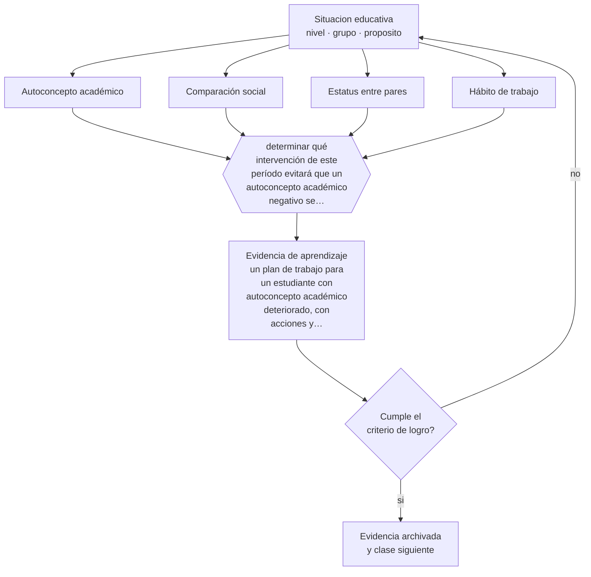

# Clase 031 — Niñez media

> **Parte 02 · Desarrollo humano** — clase 7 de 12

**Estado de evidencia:** `CONSISTENTE` · **Etapa:** 🟢 Etapa A — Fundamentos · **Población de referencia:** trayectoria completa: primera infancia a adultez mayor 
**Decisión que habilita:** determinar qué intervención de este período evitará que un autoconcepto académico negativo se consolide 
**Evidencia de aprendizaje:** un plan de trabajo para un estudiante con autoconcepto académico deteriorado, con acciones y evidencia de seguimiento

## 🎯 Propósito

Comprender la niñez media como período en que se consolidan hábitos de trabajo, autoconcepto académico y posición en el grupo, y actuar sobre esas tres cosas antes de que se estabilicen.

## 📚 Resultados de aprendizaje

Al finalizar esta clase podrás:

1. **Definir** con precisión los cuatro conceptos centrales de la clase y reconocerlos en una situación educativa real, no solo en su enunciado.
2. **Explicar** por qué entre los 6 y los 12 años la comparación con los pares se vuelve el principal organizador de la autoimagen escolar.
3. **Decidir** —qué intervención de este período evitará que un autoconcepto académico negativo se consolide— y sostener la decisión con un fundamento escrito.
4. **Producir** la evidencia de la clase —un plan de trabajo para un estudiante con autoconcepto académico deteriorado, con acciones y evidencia de seguimiento— y contrastarla contra el criterio de logro.
5. **Distinguir** lo que la evidencia sostiene de lo que es práctica instalada, preferencia personal o costumbre de la institución.

## 🧩 Conceptos centrales

| Concepto | Comprensión verificable |
|---|---|
| **Autoconcepto académico** | idea que el estudiante tiene sobre su propia capacidad en un dominio escolar |
| **Comparación social** | proceso de evaluar la propia capacidad en referencia al desempeño de los pares |
| **Estatus entre pares** | posición del estudiante en la estructura social del curso; predice bienestar y participación |
| **Hábito de trabajo** | conjunto de rutinas de estudio y organización que se consolidan en este período |

## 🗺️ Flujo de razonamiento

## 📖 Desarrollo

### 1. El fondo del asunto

En la niñez media el estudiante empieza a evaluarse comparándose, y esa comparación se vuelve estable. Un niño que durante dos años recibe evidencia de que es «el que no entiende matemática» construye un autoconcepto que después resiste incluso al éxito posterior. La consecuencia práctica es que este período es la última oportunidad barata para intervenir: más tarde, corregir el autoconcepto exige mucho más que corregir el aprendizaje.

### 2. Cómo se traduce en decisiones de enseñanza

Tres decisiones tienen alto rendimiento: hacer visible el progreso individual en vez del ranking, garantizar experiencias de competencia auténtica a quienes tienen menos, y cuidar la asignación pública de roles en el aula, que consolida estatus. También importa lo que no se hace: agrupar de forma fija y visible por nivel produce efectos sobre el autoconcepto que suelen superar las ganancias de la homogeneidad.

### 3. Qué sostiene la evidencia y qué no

La relación entre autoconcepto y rendimiento es recíproca y su dirección causal se discute; intervenir solo sobre la autoestima sin mejorar el desempeño no produce efectos duraderos. Lo que sí está razonablemente respaldado es que la experiencia repetida de logro auténtico modifica el autoconcepto, y no al revés.

> **Cómo leer el estado de evidencia `CONSISTENTE`.** La evidencia es amplia y coherente, pero proviene sobre todo de estudios correlacionales, de síntesis con heterogeneidad alta o de contextos distintos al tuyo. Sirve para orientar la decisión y exige que compruebes el efecto en tu propio grupo.

## 🧪 Taller guiado

Aplica la clase a **uno** de los contextos siguientes y repite después el ejercicio en un
contexto de exigencia distinta. Cambiar de contexto es parte del aprendizaje: lo que funciona
con un grupo no se traslada intacto a otro.

| Contexto | Rasgo que cambia la decisión |
|---|---|
| Primera infancia (0–3) | interacción, cuidado y lenguaje son el currículo |
| Preescolar (3–6) | el juego es el modo principal de aprender |
| Niñez media (6–11) | control ejecutivo creciente y comparación social |
| Adolescencia temprana (12–15) | reorganización social e identidad en juego |
| Adolescencia tardía y adultez emergente | proyección, autonomía y decisión vocacional |
| Adultez y adultez mayor | experiencia acumulada y aprendizaje con propósito |

**Secuencia de trabajo:**

1. Delimita el contexto: nivel, edad, tamaño del grupo, asignatura o experiencia y tiempo real disponible.
2. Declara qué saben ya los estudiantes y **cómo lo comprobaste**, no cómo lo supones.
3. Formula la decisión pedagógica que esta clase habilita y escribe su fundamento.
4. Anticipa qué observarías si la decisión funciona y qué observarías si no funciona.
5. Diseña de antemano la alternativa que aplicarás si la primera estrategia falla.
6. Ejecuta o simula, y registra lo observado con fecha, contexto y evidencia concreta.
7. Produce la evidencia de aprendizaje de la clase.
8. Contrástala contra el criterio de logro, corrige y recién entonces avanza.

### 📦 Evidencia de aprendizaje

Un plan de trabajo para un estudiante con autoconcepto académico deteriorado, con acciones y evidencia de seguimiento.

Debe incluir contexto, decisión, fundamento, fuentes consultadas con su fecha, indicador de
logro observable, riesgos previstos y qué harías distinto en la siguiente iteración.

## 🏆 Reto verificable

Identifica un estudiante con autoconcepto deteriorado y diseña cuatro semanas de logros auténticos crecientes. Registra qué dice de sí mismo al inicio y al final.

## ✅ Criterio de logro

- [ ] el plan produce evidencia de logro auténtico y no solo mensajes de aliento;
- [ ] el seguimiento registra cambios en desempeño y en participación, no solo en actitud percibida;
- [ ] cada afirmación sobre «lo que funciona» está atribuida a una fuente identificable, con autor y fecha;
- [ ] la decisión es ejecutable con el tiempo, el espacio, el número de estudiantes y los recursos que realmente tienes;
- [ ] la evidencia queda archivada de forma reproducible: otra persona podría revisarla sin que tú se la expliques.

## ⚠️ Errores frecuentes

**Propios de esta clase:**

- Reforzar la autoestima con elogio no justificado por el desempeño real.
- Mantener agrupamientos fijos y visibles por nivel sin evaluar su efecto sobre el autoconcepto.

**Característicos de la parte 02:**

- Usar la edad como diagnóstico y esperar el mismo desempeño de todo un curso.
- Patologizar variaciones que están dentro del rango esperable para la edad.

## ♿ Diversidad, accesibilidad y ética

Los estudiantes que reciben apoyos visibles corren riesgo de que ese apoyo se convierta en marca de estatus. Diseñar los apoyos como opciones disponibles para todo el curso protege el autoconcepto sin reducir el soporte.

Antes de aplicar cualquier decisión de esta clase con estudiantes reales, revisa el
[protocolo de práctica responsable](../../../docs/ETICA_Y_PRACTICA_RESPONSABLE.md):
consentimiento, resguardo de datos personales, proporcionalidad de la intervención y derecho
de cada estudiante a no ser objeto de un ensayo que no le reporta beneficio.

## ❓ Preguntas de comprobación

1. ¿Qué estudiante de tu curso ya se describe a sí mismo como incapaz en tu asignatura?
2. ¿Qué prácticas tuyas hacen pública la comparación entre estudiantes?
3. ¿Qué evidencia de logro real puede obtener esta semana quien menos avanza?

## 📕 Lecturas base

**Eccles, J. (1999). *The Development of Children Ages 6 to 14*. The Future of Children, 9(2).**  
*Qué aporta a esta clase:* síntesis del período con foco en escuela, motivación y autoconcepto.

**Marsh, H. & Craven, R. (2006). *Reciprocal Effects of Self-Concept and Performance*.**  
*Qué aporta a esta clase:* documenta la relación recíproca y desmonta la idea de intervenir la autoestima por sí sola.

Catálogo completo: [bibliografía del programa](../../../docs/BIBLIOGRAFIA.md) ·
[glosario](../../../docs/GLOSARIO.md) ·
[fuentes oficiales y cómo leerlas](../../../docs/FUENTES.md).

## 🔗 Conexión con el resto del programa

Prepara la parte 04 y anticipa la clase 032. Se apoya en la clase 022 sobre expectativa de éxito.

> [!IMPORTANT]
> Material de formación profesional. No reemplaza un título de pedagogía, una habilitación
> legal para ejercer, ni el juicio de un equipo educativo que conoce a sus estudiantes.

---

| Anterior | Índice | Siguiente |
|---|---|---|
| [← 030 · Apego y vínculos](../class-06-apego-y-vinculos/README.md) | [Parte 02](../README.md) · [Programa](../../../README.md) | [032 · Adolescencia →](../class-08-adolescencia/README.md) |
