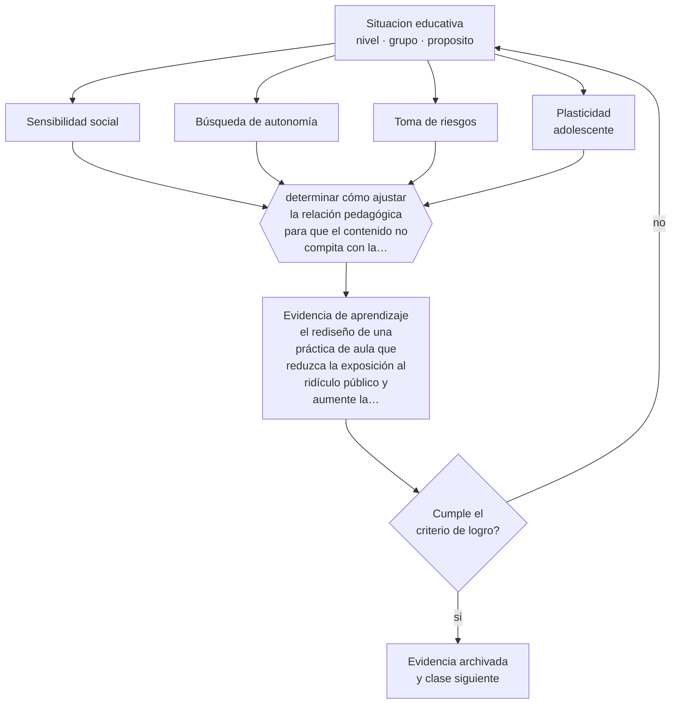

# Clase 032 — Adolescencia

> **Parte 02 · Desarrollo humano** — clase 8 de 12

**Estado de evidencia:** `ROBUSTA` · **Etapa:** 🟢 Etapa A — Fundamentos · **Población de referencia:** trayectoria completa: primera infancia a adultez mayor 
**Decisión que habilita:** determinar cómo ajustar la relación pedagógica para que el contenido no compita con la necesidad de autonomía y pertenencia 
**Evidencia de aprendizaje:** el rediseño de una práctica de aula que reduzca la exposición al ridículo público y aumente la autonomía real

## 🎯 Propósito

Sustituir la caricatura de la adolescencia como etapa de déficit por una comprensión de su reorganización real: mayor sensibilidad a pares y a estatus, mayor búsqueda de autonomía y un período de plasticidad significativa.

## 📚 Resultados de aprendizaje

Al finalizar esta clase podrás:

1. **Definir** con precisión los cuatro conceptos centrales de la clase y reconocerlos en una situación educativa real, no solo en su enunciado.
2. **Explicar** por qué la adolescencia combina alta capacidad de aprendizaje con alta sensibilidad social, y qué implica eso para enseñar.
3. **Decidir** —cómo ajustar la relación pedagógica para que el contenido no compita con la necesidad de autonomía y pertenencia— y sostener la decisión con un fundamento escrito.
4. **Producir** la evidencia de la clase —el rediseño de una práctica de aula que reduzca la exposición al ridículo público y aumente la autonomía real— y contrastarla contra el criterio de logro.
5. **Distinguir** lo que la evidencia sostiene de lo que es práctica instalada, preferencia personal o costumbre de la institución.

## 🧩 Conceptos centrales

| Concepto | Comprensión verificable |
|---|---|
| **Sensibilidad social** | mayor reactividad a la evaluación de los pares y al estatus dentro del grupo |
| **Búsqueda de autonomía** | necesidad creciente de decidir por sí mismo; se opone al control percibido como arbitrario |
| **Toma de riesgos** | conducta más frecuente en presencia de pares que en solitario; no equivale a mala evaluación del riesgo |
| **Plasticidad adolescente** | período de reorganización que hace al aprendizaje y a la intervención especialmente efectivos |

## 🗺️ Flujo de razonamiento

## 📖 Desarrollo

### 1. El fondo del asunto

La investigación reciente reordenó la comprensión de la adolescencia: no es un período de irracionalidad, sino de recalibración de prioridades. La presencia de pares aumenta la toma de riesgos, la evaluación pública tiene un costo emocional mucho mayor que en otras edades, y el control percibido como arbitrario produce resistencia. Al mismo tiempo, es un período de alta plasticidad, en el que intervenciones bien diseñadas producen efectos duraderos.

### 2. Cómo se traduce en decisiones de enseñanza

Tres ajustes tienen alto rendimiento: eliminar situaciones de exposición al ridículo frente al grupo, ofrecer autonomía real en aspectos que importan —cómo demostrar lo aprendido, en qué orden, con quién trabajar— y explicar las razones de las reglas en vez de imponerlas. Ninguno implica bajar la exigencia; de hecho, permiten subirla, porque la resistencia disminuye cuando la relación no está en disputa.

### 3. Qué sostiene la evidencia y qué no

La divulgación sobre el «cerebro adolescente inmaduro» se usa con frecuencia para justificar tanto la sobreprotección como el castigo. La evidencia no sostiene que los adolescentes no comprendan el riesgo: lo comprenden y valoran distinto sus recompensas sociales. Tampoco existe una edad exacta de madurez cerebral que autorice conclusiones categóricas sobre responsabilidad.

> **Cómo leer el estado de evidencia `ROBUSTA`.** Hay evidencia convergente de varios equipos, países y diseños de investigación, incluidos estudios experimentales o cuasiexperimentales, y el efecto se sostiene al replicarlo. Puedes apoyar una decisión profesional en ella, sin olvidar que ningún efecto promedio describe a un estudiante concreto.

## 🧪 Taller guiado

Aplica la clase a **uno** de los contextos siguientes y repite después el ejercicio en un
contexto de exigencia distinta. Cambiar de contexto es parte del aprendizaje: lo que funciona
con un grupo no se traslada intacto a otro.

| Contexto | Rasgo que cambia la decisión |
|---|---|
| Primera infancia (0–3) | interacción, cuidado y lenguaje son el currículo |
| Preescolar (3–6) | el juego es el modo principal de aprender |
| Niñez media (6–11) | control ejecutivo creciente y comparación social |
| Adolescencia temprana (12–15) | reorganización social e identidad en juego |
| Adolescencia tardía y adultez emergente | proyección, autonomía y decisión vocacional |
| Adultez y adultez mayor | experiencia acumulada y aprendizaje con propósito |

**Secuencia de trabajo:**

1. Delimita el contexto: nivel, edad, tamaño del grupo, asignatura o experiencia y tiempo real disponible.
2. Declara qué saben ya los estudiantes y **cómo lo comprobaste**, no cómo lo supones.
3. Formula la decisión pedagógica que esta clase habilita y escribe su fundamento.
4. Anticipa qué observarías si la decisión funciona y qué observarías si no funciona.
5. Diseña de antemano la alternativa que aplicarás si la primera estrategia falla.
6. Ejecuta o simula, y registra lo observado con fecha, contexto y evidencia concreta.
7. Produce la evidencia de aprendizaje de la clase.
8. Contrástala contra el criterio de logro, corrige y recién entonces avanza.

### 📦 Evidencia de aprendizaje

El rediseño de una práctica de aula que reduzca la exposición al ridículo público y aumente la autonomía real.

Debe incluir contexto, decisión, fundamento, fuentes consultadas con su fecha, indicador de
logro observable, riesgos previstos y qué harías distinto en la siguiente iteración.

## 🏆 Reto verificable

Registra durante una semana cada situación en que un estudiante quedó expuesto ante el grupo. Rediseña las evitables y observa el efecto sobre la participación.

## ✅ Criterio de logro

- [ ] el rediseño elimina al menos una situación de exposición pública innecesaria;
- [ ] la autonomía ofrecida es real y recae sobre algo que el estudiante valora;
- [ ] cada afirmación sobre «lo que funciona» está atribuida a una fuente identificable, con autor y fecha;
- [ ] la decisión es ejecutable con el tiempo, el espacio, el número de estudiantes y los recursos que realmente tienes;
- [ ] la evidencia queda archivada de forma reproducible: otra persona podría revisarla sin que tú se la expliques.

## ⚠️ Errores frecuentes

**Propios de esta clase:**

- Usar la exposición pública como método de control en un grupo adolescente.
- Explicar toda conducta adolescente por inmadurez cerebral y descartar el análisis de la situación.

**Característicos de la parte 02:**

- Usar la edad como diagnóstico y esperar el mismo desempeño de todo un curso.
- Patologizar variaciones que están dentro del rango esperable para la edad.

## ♿ Diversidad, accesibilidad y ética

La sensibilidad al estatus hace especialmente costosa la exposición de quienes ya están en posición vulnerable: estudiantes con apoyos visibles, con identidades minorizadas o con trayectorias irregulares. El rediseño de prácticas públicas es, en este nivel, una medida de inclusión de primer orden.

Antes de aplicar cualquier decisión de esta clase con estudiantes reales, revisa el
[protocolo de práctica responsable](../../../docs/ETICA_Y_PRACTICA_RESPONSABLE.md):
consentimiento, resguardo de datos personales, proporcionalidad de la intervención y derecho
de cada estudiante a no ser objeto de un ensayo que no le reporta beneficio.

## ❓ Preguntas de comprobación

1. ¿Qué práctica tuya expone a un estudiante frente al grupo sin necesidad pedagógica?
2. ¿Qué decisión real puedes ceder sin perder el objetivo de aprendizaje?
3. ¿Qué regla tuya no has explicado nunca y solo has impuesto?

## 📕 Lecturas base

**Steinberg, L. (2014). *Age of Opportunity*.**  
*Qué aporta a esta clase:* reinterpreta la adolescencia como período de oportunidad y plasticidad, con la evidencia que lo respalda.

**Blakemore, S.-J. (2018). *Inventing Ourselves: The Secret Life of the Teenage Brain*.**  
*Qué aporta a esta clase:* síntesis rigurosa y prudente sobre desarrollo cerebral adolescente y conducta social.

Catálogo completo: [bibliografía del programa](../../../docs/BIBLIOGRAFIA.md) ·
[glosario](../../../docs/GLOSARIO.md) ·
[fuentes oficiales y cómo leerlas](../../../docs/FUENTES.md).

## 🔗 Conexión con el resto del programa

Es el fundamento psicológico de toda la parte 05 y se conecta con la parte 12 en el manejo del conflicto sin escalada.

> [!IMPORTANT]
> Material de formación profesional. No reemplaza un título de pedagogía, una habilitación
> legal para ejercer, ni el juicio de un equipo educativo que conoce a sus estudiantes.

---

| Anterior | Índice | Siguiente |
|---|---|---|
| [← 031 · Niñez media](../class-07-ninez-media/README.md) | [Parte 02](../README.md) · [Programa](../../../README.md) | [033 · Adultez emergente y adultez →](../class-09-adultez-emergente-y-adultez/README.md) |
