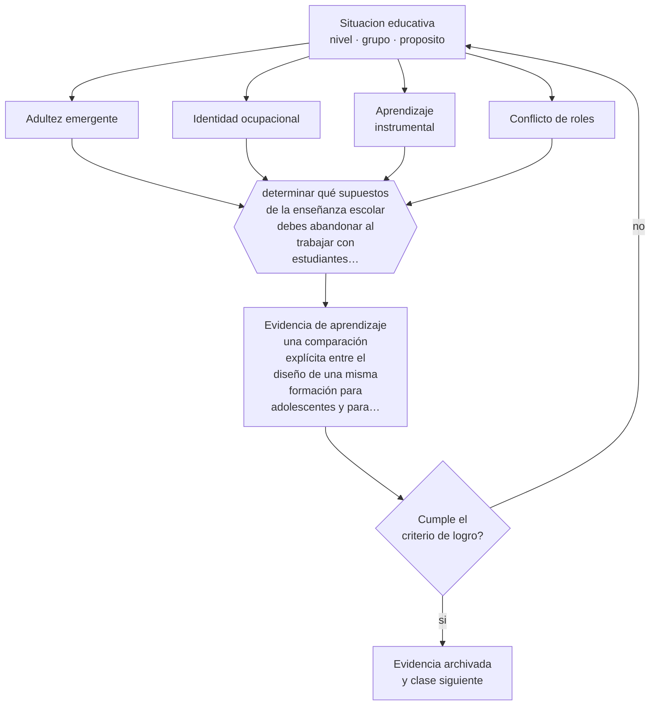

# Clase 033 — Adultez emergente y adultez

> **Parte 02 · Desarrollo humano** — clase 9 de 12

**Estado de evidencia:** `CONSISTENTE` · **Etapa:** 🟢 Etapa A — Fundamentos · **Población de referencia:** trayectoria completa: primera infancia a adultez mayor 
**Decisión que habilita:** determinar qué supuestos de la enseñanza escolar debes abandonar al trabajar con estudiantes adultos 
**Evidencia de aprendizaje:** una comparación explícita entre el diseño de una misma formación para adolescentes y para adultos, con las decisiones que cambian

## 🎯 Propósito

Comprender la adultez emergente y la adultez como períodos con lógicas propias de aprendizaje: motivación instrumental, experiencia previa abundante, identidad ocupacional en construcción y condiciones de vida que compiten con el estudio.

## 📚 Resultados de aprendizaje

Al finalizar esta clase podrás:

1. **Definir** con precisión los cuatro conceptos centrales de la clase y reconocerlos en una situación educativa real, no solo en su enunciado.
2. **Explicar** qué cambia en el aprendizaje cuando la persona ya tiene responsabilidades, experiencia laboral y tiempo escaso.
3. **Decidir** —qué supuestos de la enseñanza escolar debes abandonar al trabajar con estudiantes adultos— y sostener la decisión con un fundamento escrito.
4. **Producir** la evidencia de la clase —una comparación explícita entre el diseño de una misma formación para adolescentes y para adultos, con las decisiones que cambian— y contrastarla contra el criterio de logro.
5. **Distinguir** lo que la evidencia sostiene de lo que es práctica instalada, preferencia personal o costumbre de la institución.

## 🧩 Conceptos centrales

| Concepto | Comprensión verificable |
|---|---|
| **Adultez emergente** | período entre los 18 y los 25 años, con exploración de identidad y trayectorias no lineales |
| **Identidad ocupacional** | construcción de sí mismo en relación con el trabajo; organiza la motivación adulta por aprender |
| **Aprendizaje instrumental** | orientado a resolver un problema concreto y evaluado por su utilidad inmediata |
| **Conflicto de roles** | competencia entre estudio, trabajo y responsabilidades familiares por el mismo tiempo |

## 🗺️ Flujo de razonamiento

## 📖 Desarrollo

### 1. El fondo del asunto

El adulto que estudia no es un adolescente con más años: negocia su tiempo con obligaciones no negociables, evalúa lo que aprende por su utilidad, y trae experiencia que a veces sostiene el aprendizaje y a veces lo obstaculiza. La adultez emergente, además, se caracteriza por trayectorias no lineales: interrupciones, cambios de rumbo y retorno a los estudios son la norma y no la excepción.

### 2. Cómo se traduce en decisiones de enseñanza

Diseñar para adultos implica decisiones concretas: partir del problema y no del temario, respetar el tiempo declarado sin encargos encubiertos, permitir aplicar de inmediato lo aprendido, y reconocer explícitamente la experiencia previa como recurso. También implica un cambio en la relación: el adulto acepta ser dirigido en el método pero no ser tratado como si no supiera nada de su propio campo.

### 3. Qué sostiene la evidencia y qué no

La categoría «adulto» agrupa realidades muy distintas: quien capacita por obligación, quien retoma estudios interrumpidos y quien se perfecciona por interés no comparten motivación ni condiciones. Las prescripciones andragógicas generales fallan al aplicarse sin distinguirlos, y la evidencia empírica que las respalda es más débil de lo que su difusión sugiere.

> **Cómo leer el estado de evidencia `CONSISTENTE`.** La evidencia es amplia y coherente, pero proviene sobre todo de estudios correlacionales, de síntesis con heterogeneidad alta o de contextos distintos al tuyo. Sirve para orientar la decisión y exige que compruebes el efecto en tu propio grupo.

## 🧪 Taller guiado

Aplica la clase a **uno** de los contextos siguientes y repite después el ejercicio en un
contexto de exigencia distinta. Cambiar de contexto es parte del aprendizaje: lo que funciona
con un grupo no se traslada intacto a otro.

| Contexto | Rasgo que cambia la decisión |
|---|---|
| Primera infancia (0–3) | interacción, cuidado y lenguaje son el currículo |
| Preescolar (3–6) | el juego es el modo principal de aprender |
| Niñez media (6–11) | control ejecutivo creciente y comparación social |
| Adolescencia temprana (12–15) | reorganización social e identidad en juego |
| Adolescencia tardía y adultez emergente | proyección, autonomía y decisión vocacional |
| Adultez y adultez mayor | experiencia acumulada y aprendizaje con propósito |

**Secuencia de trabajo:**

1. Delimita el contexto: nivel, edad, tamaño del grupo, asignatura o experiencia y tiempo real disponible.
2. Declara qué saben ya los estudiantes y **cómo lo comprobaste**, no cómo lo supones.
3. Formula la decisión pedagógica que esta clase habilita y escribe su fundamento.
4. Anticipa qué observarías si la decisión funciona y qué observarías si no funciona.
5. Diseña de antemano la alternativa que aplicarás si la primera estrategia falla.
6. Ejecuta o simula, y registra lo observado con fecha, contexto y evidencia concreta.
7. Produce la evidencia de aprendizaje de la clase.
8. Contrástala contra el criterio de logro, corrige y recién entonces avanza.

### 📦 Evidencia de aprendizaje

Una comparación explícita entre el diseño de una misma formación para adolescentes y para adultos, con las decisiones que cambian.

Debe incluir contexto, decisión, fundamento, fuentes consultadas con su fecha, indicador de
logro observable, riesgos previstos y qué harías distinto en la siguiente iteración.

## 🏆 Reto verificable

Toma un programa que impartes y calcula el tiempo real que exige fuera de sesión. Rediseña para que quepa en el tiempo declarado y observa el efecto en asistencia y entrega.

## ✅ Criterio de logro

- [ ] la comparación identifica al menos cuatro decisiones de diseño que cambian y por qué;
- [ ] el diseño para adultos declara cómo respeta el tiempo real disponible;
- [ ] cada afirmación sobre «lo que funciona» está atribuida a una fuente identificable, con autor y fecha;
- [ ] la decisión es ejecutable con el tiempo, el espacio, el número de estudiantes y los recursos que realmente tienes;
- [ ] la evidencia queda archivada de forma reproducible: otra persona podría revisarla sin que tú se la expliques.

## ⚠️ Errores frecuentes

**Propios de esta clase:**

- Trasladar formatos escolares —tareas para la casa, control de asistencia como sanción— a formación de adultos.
- Tratar como homogéneo a un grupo adulto con motivaciones y condiciones muy distintas.

**Característicos de la parte 02:**

- Usar la edad como diagnóstico y esperar el mismo desempeño de todo un curso.
- Patologizar variaciones que están dentro del rango esperable para la edad.

## ♿ Diversidad, accesibilidad y ética

Los adultos que retoman estudios suelen cargar una historia escolar de fracaso y vergüenza. Diseñar la primera sesión para producir una experiencia temprana de competencia, y evitar cualquier práctica que reproduzca la humillación escolar previa, es determinante para la permanencia.

Antes de aplicar cualquier decisión de esta clase con estudiantes reales, revisa el
[protocolo de práctica responsable](../../../docs/ETICA_Y_PRACTICA_RESPONSABLE.md):
consentimiento, resguardo de datos personales, proporcionalidad de la intervención y derecho
de cada estudiante a no ser objeto de un ensayo que no le reporta beneficio.

## ❓ Preguntas de comprobación

1. ¿Qué parte de tu diseño supone un tiempo que tus estudiantes adultos no tienen?
2. ¿Qué experiencia previa de tu grupo estás desaprovechando?
3. ¿Qué diferencia hay entre los adultos obligados y los voluntarios de tu curso?

## 📕 Lecturas base

**Arnett, J. (2000). *Emerging Adulthood*. American Psychologist, 55(5).**  
*Qué aporta a esta clase:* define el período y sus rasgos; explica trayectorias educativas no lineales.

**Merriam, S. & Bierema, L. (2013). *Adult Learning: Linking Theory and Practice*.**  
*Qué aporta a esta clase:* revisa críticamente el campo y separa lo respaldado de lo asumido.

Catálogo completo: [bibliografía del programa](../../../docs/BIBLIOGRAFIA.md) ·
[glosario](../../../docs/GLOSARIO.md) ·
[fuentes oficiales y cómo leerlas](../../../docs/FUENTES.md).

## 🔗 Conexión con el resto del programa

Es el antecedente directo de toda la parte 07 y de la parte 14 en programas de postgrado profesional.

> [!IMPORTANT]
> Material de formación profesional. No reemplaza un título de pedagogía, una habilitación
> legal para ejercer, ni el juicio de un equipo educativo que conoce a sus estudiantes.

---

| Anterior | Índice | Siguiente |
|---|---|---|
| [← 032 · Adolescencia](../class-08-adolescencia/README.md) | [Parte 02](../README.md) · [Programa](../../../README.md) | [034 · Envejecimiento y aprendizaje permanente →](../class-10-envejecimiento-y-aprendizaje-permanente/README.md) |
