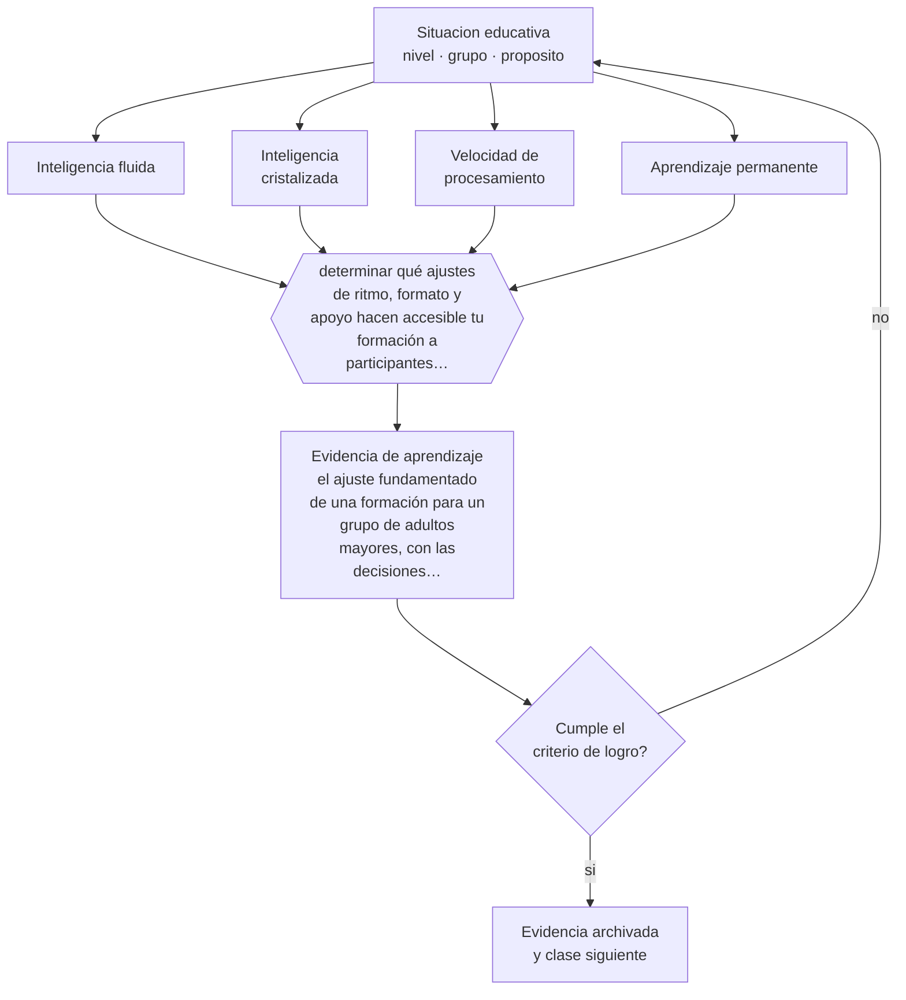

# Clase 034 — Envejecimiento y aprendizaje permanente

> **Parte 02 · Desarrollo humano** — clase 10 de 12

**Estado de evidencia:** `CONSISTENTE` · **Etapa:** 🟢 Etapa A — Fundamentos · **Población de referencia:** trayectoria completa: primera infancia a adultez mayor 
**Decisión que habilita:** determinar qué ajustes de ritmo, formato y apoyo hacen accesible tu formación a participantes mayores 
**Evidencia de aprendizaje:** el ajuste fundamentado de una formación para un grupo de adultos mayores, con las decisiones documentadas

## 🎯 Propósito

Distinguir los cambios cognitivos reales del envejecimiento de los estereotipos que impiden diseñar formación para personas mayores, y aprovechar lo que efectivamente mejora con la edad.

## 📚 Resultados de aprendizaje

Al finalizar esta clase podrás:

1. **Definir** con precisión los cuatro conceptos centrales de la clase y reconocerlos en una situación educativa real, no solo en su enunciado.
2. **Explicar** qué se conserva, qué declina y qué mejora en la capacidad de aprender a lo largo de la vida adulta.
3. **Decidir** —qué ajustes de ritmo, formato y apoyo hacen accesible tu formación a participantes mayores— y sostener la decisión con un fundamento escrito.
4. **Producir** la evidencia de la clase —el ajuste fundamentado de una formación para un grupo de adultos mayores, con las decisiones documentadas— y contrastarla contra el criterio de logro.
5. **Distinguir** lo que la evidencia sostiene de lo que es práctica instalada, preferencia personal o costumbre de la institución.

## 🧩 Conceptos centrales

| Concepto | Comprensión verificable |
|---|---|
| **Inteligencia fluida** | capacidad de razonar con material nuevo; declina gradualmente con la edad |
| **Inteligencia cristalizada** | conocimiento y vocabulario acumulados; se mantiene o aumenta hasta edades avanzadas |
| **Velocidad de procesamiento** | rapidez de operación cognitiva; su descenso explica buena parte del cambio observado |
| **Aprendizaje permanente** | participación en formación a lo largo de toda la vida, con propósitos que cambian con la etapa |

## 🗺️ Flujo de razonamiento

## 📖 Desarrollo

### 1. El fondo del asunto

El envejecimiento cognitivo normal no es un deterioro general. Disminuyen la velocidad de procesamiento y algunos aspectos de la memoria de trabajo; se mantienen o mejoran el vocabulario, el conocimiento acumulado y la capacidad de juicio en dominios familiares. Un participante mayor puede aprender lo mismo que uno joven si el diseño le concede tiempo, reduce demandas de velocidad y se apoya en su conocimiento previo.

### 2. Cómo se traduce en decisiones de enseñanza

Los ajustes útiles son de diseño, no de contenido: dar más tiempo sin señalarlo como concesión, reducir la carga de material nuevo por sesión, apoyarse explícitamente en la experiencia acumulada, cuidar condiciones sensoriales —tamaño de letra, contraste, audio— y evitar formatos que penalicen la rapidez. Ninguno implica simplificar el objetivo.

### 3. Qué sostiene la evidencia y qué no

La variabilidad entre personas mayores es mayor que en cualquier otro grupo etario, de modo que los promedios describen poco. Los estudios transversales confunden envejecimiento con diferencias entre generaciones —escolaridad, salud, familiaridad tecnológica—, y los programas comerciales de entrenamiento cerebral no muestran transferencia significativa a la vida cotidiana.

> **Cómo leer el estado de evidencia `CONSISTENTE`.** La evidencia es amplia y coherente, pero proviene sobre todo de estudios correlacionales, de síntesis con heterogeneidad alta o de contextos distintos al tuyo. Sirve para orientar la decisión y exige que compruebes el efecto en tu propio grupo.

## 🧪 Taller guiado

Aplica la clase a **uno** de los contextos siguientes y repite después el ejercicio en un
contexto de exigencia distinta. Cambiar de contexto es parte del aprendizaje: lo que funciona
con un grupo no se traslada intacto a otro.

| Contexto | Rasgo que cambia la decisión |
|---|---|
| Primera infancia (0–3) | interacción, cuidado y lenguaje son el currículo |
| Preescolar (3–6) | el juego es el modo principal de aprender |
| Niñez media (6–11) | control ejecutivo creciente y comparación social |
| Adolescencia temprana (12–15) | reorganización social e identidad en juego |
| Adolescencia tardía y adultez emergente | proyección, autonomía y decisión vocacional |
| Adultez y adultez mayor | experiencia acumulada y aprendizaje con propósito |

**Secuencia de trabajo:**

1. Delimita el contexto: nivel, edad, tamaño del grupo, asignatura o experiencia y tiempo real disponible.
2. Declara qué saben ya los estudiantes y **cómo lo comprobaste**, no cómo lo supones.
3. Formula la decisión pedagógica que esta clase habilita y escribe su fundamento.
4. Anticipa qué observarías si la decisión funciona y qué observarías si no funciona.
5. Diseña de antemano la alternativa que aplicarás si la primera estrategia falla.
6. Ejecuta o simula, y registra lo observado con fecha, contexto y evidencia concreta.
7. Produce la evidencia de aprendizaje de la clase.
8. Contrástala contra el criterio de logro, corrige y recién entonces avanza.

### 📦 Evidencia de aprendizaje

El ajuste fundamentado de una formación para un grupo de adultos mayores, con las decisiones documentadas.

Debe incluir contexto, decisión, fundamento, fuentes consultadas con su fecha, indicador de
logro observable, riesgos previstos y qué harías distinto en la siguiente iteración.

## 🏆 Reto verificable

Adapta una sesión tuya para un grupo de adultos mayores y aplícala. Registra qué ajustes resultaron indispensables y cuáles beneficiaron también a los participantes más jóvenes.

## ✅ Criterio de logro

- [ ] los ajustes modifican tiempo, formato y apoyo sin reducir el objetivo;
- [ ] las condiciones sensoriales del material y del espacio están explícitamente revisadas;
- [ ] cada afirmación sobre «lo que funciona» está atribuida a una fuente identificable, con autor y fecha;
- [ ] la decisión es ejecutable con el tiempo, el espacio, el número de estudiantes y los recursos que realmente tienes;
- [ ] la evidencia queda archivada de forma reproducible: otra persona podría revisarla sin que tú se la expliques.

## ⚠️ Errores frecuentes

**Propios de esta clase:**

- Simplificar el contenido en vez de ajustar el ritmo y el formato.
- Atribuir a la edad dificultades que provienen de la falta de familiaridad con una herramienta específica.

**Característicos de la parte 02:**

- Usar la edad como diagnóstico y esperar el mismo desempeño de todo un curso.
- Patologizar variaciones que están dentro del rango esperable para la edad.

## ♿ Diversidad, accesibilidad y ética

La exclusión digital afecta de forma desproporcionada a personas mayores y se confunde con incapacidad de aprender. Separar la barrera de acceso del proceso de aprendizaje evita conclusiones equivocadas y diseños que se abandonan por frustración inicial.

Antes de aplicar cualquier decisión de esta clase con estudiantes reales, revisa el
[protocolo de práctica responsable](../../../docs/ETICA_Y_PRACTICA_RESPONSABLE.md):
consentimiento, resguardo de datos personales, proporcionalidad de la intervención y derecho
de cada estudiante a no ser objeto de un ensayo que no le reporta beneficio.

## ❓ Preguntas de comprobación

1. ¿Qué parte de tu formación penaliza la lentitud sin necesidad?
2. ¿Qué conocimiento acumulado de tus participantes podrías usar como andamio?
3. ¿Qué dificultad estás atribuyendo a la edad y en realidad es falta de práctica con la herramienta?

## 📕 Lecturas base

**Baltes, P. & Baltes, M. (1990). *Successful Aging: Perspectives from the Behavioral Sciences*.**  
*Qué aporta a esta clase:* modelo de selección, optimización y compensación; muy útil para diseñar formación.

**Salthouse, T. (2010). *Major Issues in Cognitive Aging*.**  
*Qué aporta a esta clase:* distingue con rigor qué declina, qué se conserva y qué artefactos introducen los diseños transversales.

Catálogo completo: [bibliografía del programa](../../../docs/BIBLIOGRAFIA.md) ·
[glosario](../../../docs/GLOSARIO.md) ·
[fuentes oficiales y cómo leerlas](../../../docs/FUENTES.md).

## 🔗 Conexión con el resto del programa

Completa la trayectoria de la parte y se aplica en la parte 07, especialmente en programas de reconversión y de formación continua.

> [!IMPORTANT]
> Material de formación profesional. No reemplaza un título de pedagogía, una habilitación
> legal para ejercer, ni el juicio de un equipo educativo que conoce a sus estudiantes.

---

| Anterior | Índice | Siguiente |
|---|---|---|
| [← 033 · Adultez emergente y adultez](../class-09-adultez-emergente-y-adultez/README.md) | [Parte 02](../README.md) · [Programa](../../../README.md) | [035 · Diferencias individuales →](../class-11-diferencias-individuales/README.md) |
