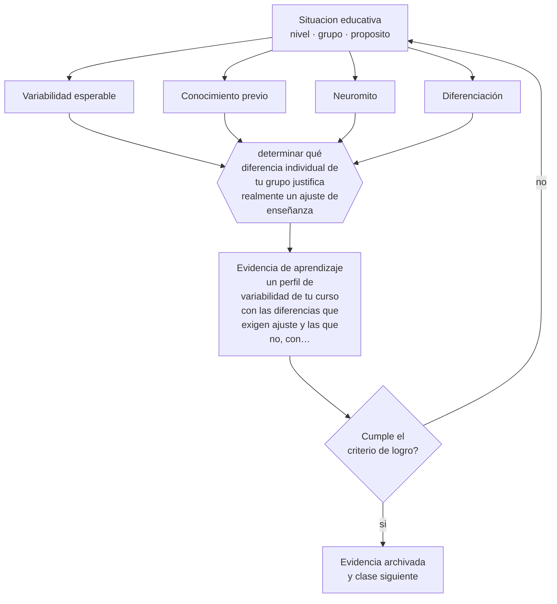

# Clase 035 — Diferencias individuales

> **Parte 02 · Desarrollo humano** — clase 11 de 12

**Estado de evidencia:** `EN-DEBATE` · **Etapa:** 🟢 Etapa A — Fundamentos · **Población de referencia:** trayectoria completa: primera infancia a adultez mayor 
**Decisión que habilita:** determinar qué diferencia individual de tu grupo justifica realmente un ajuste de enseñanza 
**Evidencia de aprendizaje:** un perfil de variabilidad de tu curso con las diferencias que exigen ajuste y las que no, con su justificación

## 🎯 Propósito

Analizar las diferencias individuales que sí tienen consecuencias educativas —conocimiento previo, lenguaje, autorregulación, condiciones de vida— y descartar las que la evidencia no respalda, empezando por los estilos de aprendizaje.

## 📚 Resultados de aprendizaje

Al finalizar esta clase podrás:

1. **Definir** con precisión los cuatro conceptos centrales de la clase y reconocerlos en una situación educativa real, no solo en su enunciado.
2. **Explicar** cómo trabajar con la variabilidad real del aula sin caer en categorías que explican poco y etiquetan mucho.
3. **Decidir** —qué diferencia individual de tu grupo justifica realmente un ajuste de enseñanza— y sostener la decisión con un fundamento escrito.
4. **Producir** la evidencia de la clase —un perfil de variabilidad de tu curso con las diferencias que exigen ajuste y las que no, con su justificación— y contrastarla contra el criterio de logro.
5. **Distinguir** lo que la evidencia sostiene de lo que es práctica instalada, preferencia personal o costumbre de la institución.

## 🧩 Conceptos centrales

| Concepto | Comprensión verificable |
|---|---|
| **Variabilidad esperable** | dispersión normal de desempeños dentro de cualquier grupo; es el punto de partida del diseño |
| **Conocimiento previo** | la diferencia individual con mayor poder explicativo sobre el aprendizaje nuevo |
| **Neuromito** | creencia sobre el cerebro ampliamente difundida y refutada por la evidencia |
| **Diferenciación** | ajuste de la enseñanza a la variabilidad, sin modificar el objetivo de aprendizaje |

## 🗺️ Flujo de razonamiento

## 📖 Desarrollo

### 1. El fondo del asunto

De todas las diferencias individuales, la que más explica el aprendizaje nuevo es el conocimiento previo específico sobre el contenido; después vienen lenguaje, autorregulación y condiciones materiales de estudio. Los estilos de aprendizaje, en cambio, han sido puestos a prueba repetidamente: enseñar en la modalidad preferida por el estudiante no mejora su aprendizaje. Sigue siendo la creencia más extendida entre docentes de todo el mundo, y su costo es real, porque desvía tiempo y atención de diferencias que sí importan.

### 2. Cómo se traduce en decisiones de enseñanza

El trabajo profesional consiste en levantar el perfil de variabilidad que sí opera: quién domina los prerrequisitos, quién aprende en una segunda lengua, quién puede sostener trabajo autónomo, quién tiene condiciones de estudio en casa. Ese perfil se traduce en decisiones de agrupamiento, andamiaje y ritmo. La diferenciación útil ajusta el camino y mantiene la meta; la diferenciación mal entendida rebaja objetivos y consolida la brecha.

### 3. Qué sostiene la evidencia y qué no

Hay debate legítimo sobre cuánta diferenciación es sostenible: la evidencia muestra que estrategias muy individualizadas son difíciles de implementar con fidelidad y pueden reducir el tiempo de instrucción efectiva. La posición defendible es priorizar unas pocas diferencias con alto poder explicativo y atenderlas bien, en vez de intentar personalizar todo y lograrlo con nadie.

> **Cómo leer el estado de evidencia `EN-DEBATE`.** Hay desacuerdo activo y publicado entre especialistas competentes. La clase presenta las posiciones y sus argumentos; tu tarea no es escoger un bando, sino saber qué evidencia te haría cambiar de posición.

## 🧪 Taller guiado

Aplica la clase a **uno** de los contextos siguientes y repite después el ejercicio en un
contexto de exigencia distinta. Cambiar de contexto es parte del aprendizaje: lo que funciona
con un grupo no se traslada intacto a otro.

| Contexto | Rasgo que cambia la decisión |
|---|---|
| Primera infancia (0–3) | interacción, cuidado y lenguaje son el currículo |
| Preescolar (3–6) | el juego es el modo principal de aprender |
| Niñez media (6–11) | control ejecutivo creciente y comparación social |
| Adolescencia temprana (12–15) | reorganización social e identidad en juego |
| Adolescencia tardía y adultez emergente | proyección, autonomía y decisión vocacional |
| Adultez y adultez mayor | experiencia acumulada y aprendizaje con propósito |

**Secuencia de trabajo:**

1. Delimita el contexto: nivel, edad, tamaño del grupo, asignatura o experiencia y tiempo real disponible.
2. Declara qué saben ya los estudiantes y **cómo lo comprobaste**, no cómo lo supones.
3. Formula la decisión pedagógica que esta clase habilita y escribe su fundamento.
4. Anticipa qué observarías si la decisión funciona y qué observarías si no funciona.
5. Diseña de antemano la alternativa que aplicarás si la primera estrategia falla.
6. Ejecuta o simula, y registra lo observado con fecha, contexto y evidencia concreta.
7. Produce la evidencia de aprendizaje de la clase.
8. Contrástala contra el criterio de logro, corrige y recién entonces avanza.

### 📦 Evidencia de aprendizaje

Un perfil de variabilidad de tu curso con las diferencias que exigen ajuste y las que no, con su justificación.

Debe incluir contexto, decisión, fundamento, fuentes consultadas con su fecha, indicador de
logro observable, riesgos previstos y qué harías distinto en la siguiente iteración.

## 🏆 Reto verificable

Levanta el perfil de variabilidad de un curso real con datos y no con impresiones. Escoge las dos diferencias más determinantes y diseña un ajuste sostenible para cada una.

## ✅ Criterio de logro

- [ ] el perfil prioriza diferencias con poder explicativo demostrado;
- [ ] se declara al menos una diferencia frecuentemente usada que se descarta y por qué;
- [ ] cada afirmación sobre «lo que funciona» está atribuida a una fuente identificable, con autor y fecha;
- [ ] la decisión es ejecutable con el tiempo, el espacio, el número de estudiantes y los recursos que realmente tienes;
- [ ] la evidencia queda archivada de forma reproducible: otra persona podría revisarla sin que tú se la expliques.

## ⚠️ Errores frecuentes

**Propios de esta clase:**

- Diseñar actividades según estilos de aprendizaje visuales, auditivos o kinestésicos.
- Diferenciar bajando el objetivo en vez de cambiar el soporte y la vía de acceso.

**Característicos de la parte 02:**

- Usar la edad como diagnóstico y esperar el mismo desempeño de todo un curso.
- Patologizar variaciones que están dentro del rango esperable para la edad.

## ♿ Diversidad, accesibilidad y ética

Descartar los estilos de aprendizaje no significa negar la variabilidad: significa dirigir el esfuerzo hacia ajustes con efecto real —accesibilidad, vías alternativas de demostración, andamiaje— que son precisamente los del Diseño Universal para el Aprendizaje.

Antes de aplicar cualquier decisión de esta clase con estudiantes reales, revisa el
[protocolo de práctica responsable](../../../docs/ETICA_Y_PRACTICA_RESPONSABLE.md):
consentimiento, resguardo de datos personales, proporcionalidad de la intervención y derecho
de cada estudiante a no ser objeto de un ensayo que no le reporta beneficio.

## ❓ Preguntas de comprobación

1. ¿Qué diferencia de tu curso explica realmente los resultados que observas?
2. ¿Qué práctica tuya se apoya en un neuromito?
3. ¿Cuánta diferenciación puedes sostener con fidelidad en tu carga real de trabajo?

## 📕 Lecturas base

**Pashler, H. et al. (2008). *Learning Styles: Concepts and Evidence*. Psychological Science in the Public Interest, 9(3).**  
*Qué aporta a esta clase:* la revisión que muestra la ausencia de evidencia para la hipótesis de emparejamiento; lectura obligada.

**Tomlinson, C. (2014). *The Differentiated Classroom*.**  
*Qué aporta a esta clase:* propuesta operativa de diferenciación; léela junto con la evidencia sobre su implementación real.

Catálogo completo: [bibliografía del programa](../../../docs/BIBLIOGRAFIA.md) ·
[glosario](../../../docs/GLOSARIO.md) ·
[fuentes oficiales y cómo leerlas](../../../docs/FUENTES.md).

## 🔗 Conexión con el resto del programa

Prepara toda la parte 08 y se apoya en la clase 019, que explica por qué el conocimiento previo modifica la carga cognitiva.

> [!IMPORTANT]
> Material de formación profesional. No reemplaza un título de pedagogía, una habilitación
> legal para ejercer, ni el juicio de un equipo educativo que conoce a sus estudiantes.

---

| Anterior | Índice | Siguiente |
|---|---|---|
| [← 034 · Envejecimiento y aprendizaje permanente](../class-10-envejecimiento-y-aprendizaje-permanente/README.md) | [Parte 02](../README.md) · [Programa](../../../README.md) | [036 · Proyecto integrador: trayectoria de desarrollo →](../class-12-proyecto-integrador-trayectoria-de-desarrollo/README.md) |
