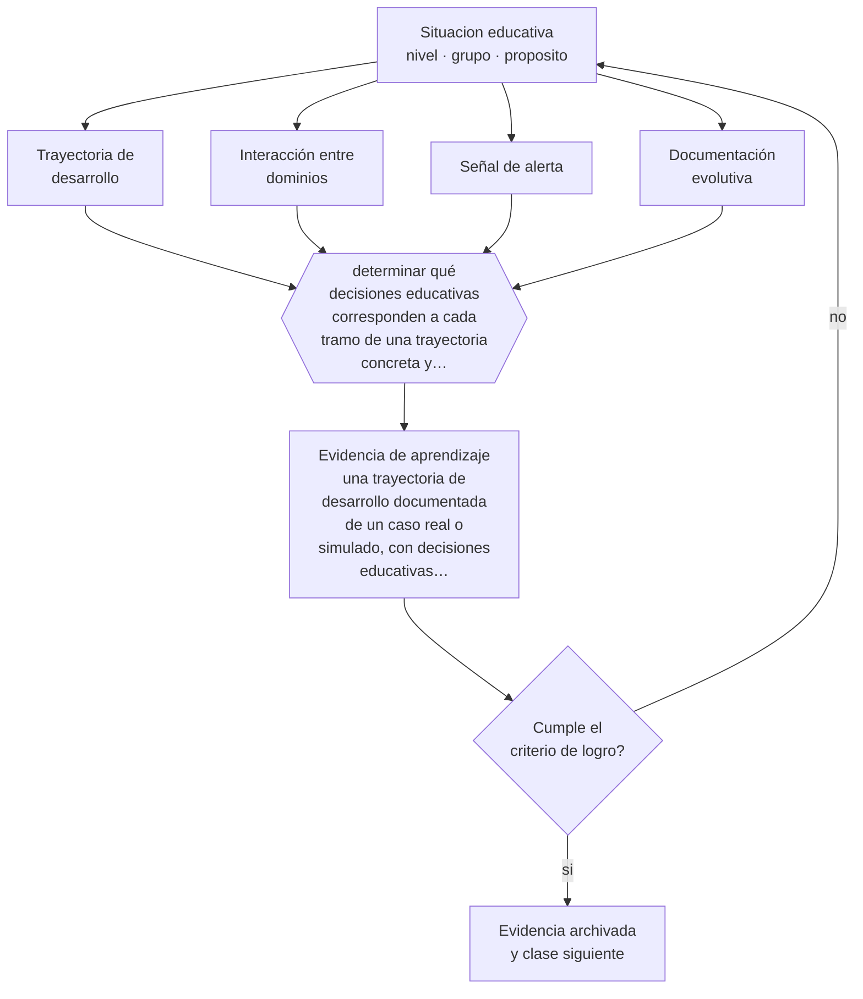

# Clase 036 — Proyecto integrador: trayectoria de desarrollo

> **Parte 02 · Desarrollo humano** — clase 12 de 12

**Estado de evidencia:** `CONSISTENTE` · **Etapa:** 🟢 Etapa A — Fundamentos · **Población de referencia:** trayectoria completa: primera infancia a adultez mayor 
**Decisión que habilita:** determinar qué decisiones educativas corresponden a cada tramo de una trayectoria concreta y por qué 
**Evidencia de aprendizaje:** una trayectoria de desarrollo documentada de un caso real o simulado, con decisiones educativas fundamentadas por tramo

## 🎯 Propósito

Integrar la parte construyendo una trayectoria de desarrollo documentada: qué ocurre en cada dominio, cómo interactúan y qué decisiones educativas se derivan en cada momento.

## 📚 Resultados de aprendizaje

Al finalizar esta clase podrás:

1. **Definir** con precisión los cuatro conceptos centrales de la clase y reconocerlos en una situación educativa real, no solo en su enunciado.
2. **Explicar** cómo se integran los dominios del desarrollo en la trayectoria de una persona concreta y no de un promedio.
3. **Decidir** —qué decisiones educativas corresponden a cada tramo de una trayectoria concreta y por qué— y sostener la decisión con un fundamento escrito.
4. **Producir** la evidencia de la clase —una trayectoria de desarrollo documentada de un caso real o simulado, con decisiones educativas fundamentadas por tramo— y contrastarla contra el criterio de logro.
5. **Distinguir** lo que la evidencia sostiene de lo que es práctica instalada, preferencia personal o costumbre de la institución.

## 🧩 Conceptos centrales

| Concepto | Comprensión verificable |
|---|---|
| **Trayectoria de desarrollo** | recorrido individual a lo largo del tiempo en varios dominios que interactúan |
| **Interacción entre dominios** | efecto de un dominio sobre otro; el lenguaje afecta lo social, lo motor afecta lo cognitivo |
| **Señal de alerta** | desviación que amerita observación sistemática o derivación, distinta de la variación esperable |
| **Documentación evolutiva** | registro sistemático y fechado de observaciones que permite ver cambio en el tiempo |

## 🗺️ Flujo de razonamiento

## 📖 Desarrollo

### 1. El fondo del asunto

El proyecto integrador obliga a hacer lo que ninguna clase por separado exige: mirar a una persona completa. Los dominios se presentan por separado por comodidad expositiva, pero interactúan permanentemente: una dificultad de lenguaje no atendida produce efectos sociales, que producen efectos en el autoconcepto y terminan leyéndose como problema de conducta. Reconstruir esa cadena es la competencia profesional que esta parte entrena.

### 2. Cómo se traduce en decisiones de enseñanza

La trayectoria se construye con registros fechados, no con recuerdos: observaciones breves y sistemáticas, evidencia de desempeño, información de la familia y de otros profesionales cuando corresponde. Cada tramo debe cerrar con una decisión educativa concreta y su fundamento. La prueba de calidad es que otra persona pueda leer la trayectoria y entender por qué se decidió lo que se decidió.

### 3. Qué sostiene la evidencia y qué no

Una trayectoria es una reconstrucción interpretativa, no un diagnóstico ni una predicción. Documentar bien reduce el error, no lo elimina: el sesgo de confirmación opera con fuerza cuando ya se tiene una hipótesis sobre un estudiante. Por eso conviene registrar también la evidencia que contradice la propia interpretación, y revisar la trayectoria con otra persona.

> **Cómo leer el estado de evidencia `CONSISTENTE`.** La evidencia es amplia y coherente, pero proviene sobre todo de estudios correlacionales, de síntesis con heterogeneidad alta o de contextos distintos al tuyo. Sirve para orientar la decisión y exige que compruebes el efecto en tu propio grupo.

## 🧪 Taller guiado

Aplica la clase a **uno** de los contextos siguientes y repite después el ejercicio en un
contexto de exigencia distinta. Cambiar de contexto es parte del aprendizaje: lo que funciona
con un grupo no se traslada intacto a otro.

| Contexto | Rasgo que cambia la decisión |
|---|---|
| Primera infancia (0–3) | interacción, cuidado y lenguaje son el currículo |
| Preescolar (3–6) | el juego es el modo principal de aprender |
| Niñez media (6–11) | control ejecutivo creciente y comparación social |
| Adolescencia temprana (12–15) | reorganización social e identidad en juego |
| Adolescencia tardía y adultez emergente | proyección, autonomía y decisión vocacional |
| Adultez y adultez mayor | experiencia acumulada y aprendizaje con propósito |

**Secuencia de trabajo:**

1. Delimita el contexto: nivel, edad, tamaño del grupo, asignatura o experiencia y tiempo real disponible.
2. Declara qué saben ya los estudiantes y **cómo lo comprobaste**, no cómo lo supones.
3. Formula la decisión pedagógica que esta clase habilita y escribe su fundamento.
4. Anticipa qué observarías si la decisión funciona y qué observarías si no funciona.
5. Diseña de antemano la alternativa que aplicarás si la primera estrategia falla.
6. Ejecuta o simula, y registra lo observado con fecha, contexto y evidencia concreta.
7. Produce la evidencia de aprendizaje de la clase.
8. Contrástala contra el criterio de logro, corrige y recién entonces avanza.

### 📦 Evidencia de aprendizaje

Una trayectoria de desarrollo documentada de un caso real o simulado, con decisiones educativas fundamentadas por tramo.

Debe incluir contexto, decisión, fundamento, fuentes consultadas con su fecha, indicador de
logro observable, riesgos previstos y qué harías distinto en la siguiente iteración.

## 🏆 Reto verificable

Documenta durante un mes la trayectoria de un estudiante real, con al menos ocho registros fechados. Preséntala a un colega y pídele que identifique dónde tu interpretación excede a la evidencia.

## ✅ Criterio de logro

- [ ] cada tramo tiene registro fechado, interpretación y decisión educativa distinguibles entre sí;
- [ ] se incluye al menos una evidencia que contradice la interpretación inicial;
- [ ] cada afirmación sobre «lo que funciona» está atribuida a una fuente identificable, con autor y fecha;
- [ ] la decisión es ejecutable con el tiempo, el espacio, el número de estudiantes y los recursos que realmente tienes;
- [ ] la evidencia queda archivada de forma reproducible: otra persona podría revisarla sin que tú se la expliques.

## ⚠️ Errores frecuentes

**Propios de esta clase:**

- Construir la trayectoria desde el recuerdo y no desde registros fechados.
- Convertir una interpretación en un diagnóstico o en un pronóstico sobre la persona.

**Característicos de la parte 02:**

- Usar la edad como diagnóstico y esperar el mismo desempeño de todo un curso.
- Patologizar variaciones que están dentro del rango esperable para la edad.

## ♿ Diversidad, accesibilidad y ética

Las trayectorias de estudiantes con discapacidad o con historias de vulneración suelen documentarse solo por sus déficits. Una trayectoria completa registra también capacidades, intereses y condiciones que funcionaron, porque son la base sobre la que se construye cualquier apoyo.

Antes de aplicar cualquier decisión de esta clase con estudiantes reales, revisa el
[protocolo de práctica responsable](../../../docs/ETICA_Y_PRACTICA_RESPONSABLE.md):
consentimiento, resguardo de datos personales, proporcionalidad de la intervención y derecho
de cada estudiante a no ser objeto de un ensayo que no le reporta beneficio.

## ❓ Preguntas de comprobación

1. ¿Qué cadena entre dominios explica mejor la situación de tu caso?
2. ¿Qué evidencia registraste que contradice tu hipótesis?
3. ¿Qué decisión tomarías distinto si la trayectoria empezara seis meses antes?

## 📕 Lecturas base

**Bronfenbrenner, U. (1979). *The Ecology of Human Development*.**  
*Qué aporta a esta clase:* marco para integrar dominios y contextos en una sola trayectoria interpretable.

**Sroufe, A. et al. (2005). *The Development of the Person*.**  
*Qué aporta a esta clase:* muestra cómo se documenta y se interpreta una trayectoria longitudinal sin caer en determinismo.

Catálogo completo: [bibliografía del programa](../../../docs/BIBLIOGRAFIA.md) ·
[glosario](../../../docs/GLOSARIO.md) ·
[fuentes oficiales y cómo leerlas](../../../docs/FUENTES.md).

## 🔗 Conexión con el resto del programa

Cierra la parte 02 y alimenta la parte 08 (planes de apoyo) y la parte 16 (estudio de caso como diseño de investigación).

> [!IMPORTANT]
> Material de formación profesional. No reemplaza un título de pedagogía, una habilitación
> legal para ejercer, ni el juicio de un equipo educativo que conoce a sus estudiantes.

---

| Anterior | Índice | Siguiente |
|---|---|---|
| [← 035 · Diferencias individuales](../class-11-diferencias-individuales/README.md) | [Parte 02](../README.md) · [Programa](../../../README.md) | [Programa completo →](../../../README.md) |
