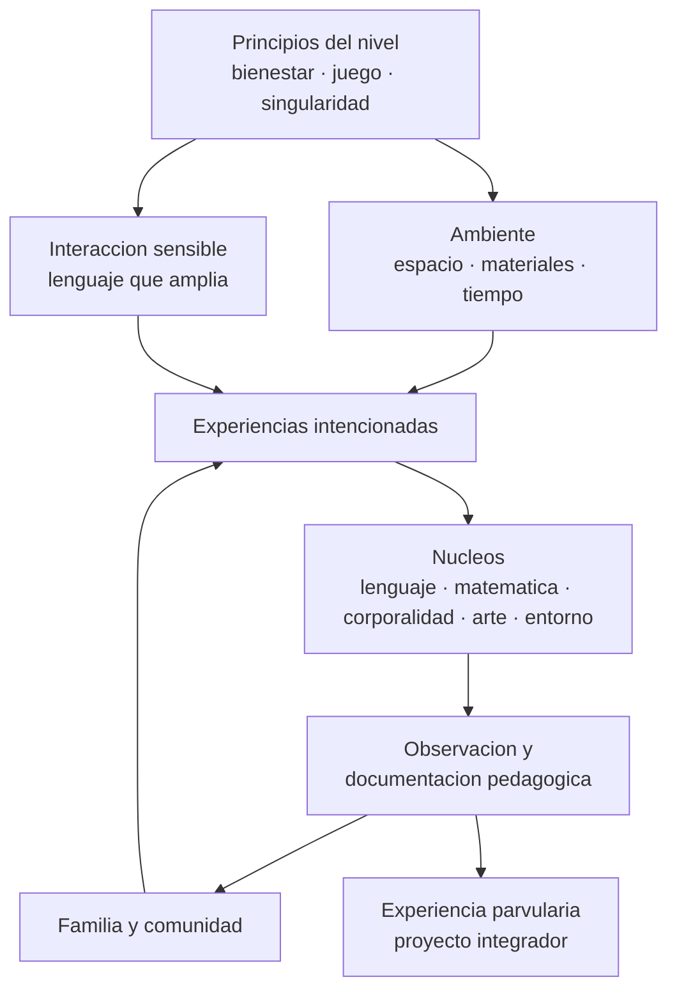

# Parte 03 — Educación parvularia

> *En los primeros años el ambiente y el vínculo son el método*

🔵 **Etapa B — Enseñanza por ciclo vital** · salida de la etapa: enseñar a una población concreta con decisiones ajustadas a su desarrollo

**Clases:** 12 (037–048) · **Población de referencia:** sala cuna, niveles medios y transición (0 a 6 años) · **Conceptos con definición operacional:** 48 
**Contenido central:** Principios de la educación parvularia, juego, ambientes, lenguaje y alfabetización emergente, pensamiento matemático temprano, corporalidad, arte, exploración, socioemocional, observación y familia

## 🎯 De qué trata esta parte

La educación parvularia es el nivel donde peor funciona la intuición de quien viene de otros niveles. La tentación es escolarizarla: adelantar la lectoescritura formal, sentar a los niños en filas, medir con pruebas. La evidencia disponible sostiene lo contrario: en estos años, la calidad del programa se juega en la interacción adulto-niño, en la riqueza del lenguaje que circula y en un ambiente que invita a explorar con seguridad.

Eso no significa que aquí no se enseñe. Significa que se enseña de otro modo: mediante experiencias intencionadas, juego con propósito, preguntas que amplían, vocabulario que se ofrece de manera deliberada y una organización del espacio que hace posibles conductas que no aparecerían por sí solas. La diferencia entre una sala con intención pedagógica y una sala entretenida es visible en la documentación: la primera puede explicar qué aprendizaje persigue cada rincón.

El nivel tiene además un marco normativo propio en Chile —Bases Curriculares de la Educación Parvularia, estándares de sala cuna y jardín, rol de la Subsecretaría y de la Intendencia de Educación Parvularia— y una historia de evidencia sobre efectos de largo plazo que conviene leer con cuidado. Los estudios longitudinales muestran efectos reales, pero condicionados a la calidad del programa: la asistencia a un jardín de baja calidad no produce los resultados que se le atribuyen al nivel.

## 📚 Resultados de la parte

Al terminar esta parte podrás:

1. **Diseñar experiencias de aprendizaje con intención pedagógica explícita y sin escolarizar el nivel**.
2. **Organizar un ambiente que sostenga exploración, seguridad y autonomía progresiva**.
3. **Documentar aprendizaje mediante observación sistemática en vez de pruebas**.
4. **Construir alianza con la familia como parte del diseño y no como comunicación posterior**.

## 🗺️ Mapa de la parte

## 🧠 Marco de referencia

- Bases Curriculares de la Educación Parvularia (Mineduc, Chile) y sus ámbitos y núcleos
- prácticas apropiadas al desarrollo y evidencia sobre calidad de programas iniciales
- documentación pedagógica y observación como sistema de evaluación del nivel
- evidencia longitudinal sobre efectos de la educación inicial de calidad

**Autoras y autores que conviene conocer:** Friedrich Fröbel, María Montessori, Loris Malaguzzi, Kathy Sylva, Robert Pianta, James Heckman, Ana María Aron y equipos chilenos de convivencia temprana

## 📋 Las 12 clases

| # | Clase | Decisión que habilita | Evidencia |
|---:|---|---|---|
| 037 | [Principios de educación parvularia](class-01-principios-de-educacion-parvularia/README.md) | determinar si una práctica propuesta para el nivel respeta sus principios o lo escolariza | `MARCO-NORMATIVO` |
| 038 | [Juego y aprendizaje](class-02-juego-y-aprendizaje/README.md) | determinar qué grado de intervención adulta requiere un juego para sostener el aprendizaje sin apropiárselo | `CONSISTENTE` |
| 039 | [Ambientes de aprendizaje](class-03-ambientes-de-aprendizaje/README.md) | determinar qué modificación del ambiente hará posible el aprendizaje que hoy no aparece | `CONSISTENTE` |
| 040 | [Lenguaje y alfabetización emergente](class-04-lenguaje-y-alfabetizacion-emergente/README.md) | determinar qué precursor de la lectura vas a trabajar de forma sistemática y con qué evidencia lo verificarás | `ROBUSTA` |
| 041 | [Pensamiento matemático temprano](class-05-pensamiento-matematico-temprano/README.md) | determinar qué noción matemática temprana necesita tu grupo antes de avanzar al conteo formal | `ROBUSTA` |
| 042 | [Corporalidad y movimiento](class-06-corporalidad-y-movimiento/README.md) | determinar qué objetivos corporales específicos vas a trabajar y cómo distinguirás avance de simple actividad física | `CONSISTENTE` |
| 043 | [Arte, música y creatividad](class-07-arte-musica-y-creatividad/README.md) | determinar si una actividad artística persigue la expresión del niño o la producción de un objeto para el adulto | `EMERGENTE` |
| 044 | [Exploración del entorno](class-08-exploracion-del-entorno/README.md) | determinar qué pregunta investigable puede sostener una indagación real con niños pequeños | `CONSISTENTE` |
| 045 | [Desarrollo socioemocional](class-09-desarrollo-socioemocional/README.md) | determinar cómo intervenir en un conflicto entre niños de modo que ambos aprendan algo | `CONSISTENTE` |
| 046 | [Observación y documentación pedagógica](class-10-observacion-y-documentacion-pedagogica/README.md) | determinar qué evidencia vas a recoger, con qué frecuencia y qué decisión tomarás con ella | `PRACTICA-PROFESIONAL` |
| 047 | [Familia y comunidad](class-11-familia-y-comunidad/README.md) | determinar qué participación familiar vas a promover y cómo comprobarás que mejoró algo | `CONSISTENTE` |
| 048 | [Proyecto integrador: experiencia parvularia](class-12-proyecto-integrador-experiencia-parvularia/README.md) | determinar el conjunto completo de decisiones de una experiencia y justificar cada una con los principios del nivel | `MARCO-NORMATIVO` |

## ⚠️ Riesgos característicos

- Escolarizar el nivel adelantando formatos de enseñanza propios de la básica.
- Confundir actividad entretenida con experiencia de aprendizaje intencionada.
- Evaluar con instrumentos que el nivel no admite y rotular a partir de ellos.
- Delegar en la familia lo que corresponde al diseño pedagógico del equipo.

## 📕 Lecturas de referencia de la parte

- **Mineduc (2018). *Bases Curriculares de la Educación Parvularia*.** — marco vigente en Chile: ámbitos, núcleos y objetivos de aprendizaje del nivel; es la referencia que rige tu planificación.
- **Sylva, K. et al. (2004). *The Effective Provision of Pre-School Education (EPPE) Project*.** — estudio longitudinal británico que vincula calidad del programa con efectos posteriores; enseña a leer el matiz «calidad» antes de «cobertura».
- **Copple, C. & Bredekamp, S. (eds.) (2009). *Developmentally Appropriate Practice in Early Childhood Programs*. NAEYC.** — marco práctico sobre qué es apropiado a cada edad y por qué; útil para argumentar frente a la presión escolarizante.
- **Rinaldi, C. (2006). *In Dialogue with Reggio Emilia*.** — fundamenta la documentación pedagógica como forma de evaluación y de investigación del equipo.

## ✅ Evidencia mínima para dar la parte por cerrada

- [ ] una planificación de experiencia con intención, ambiente y mediación explícitos;
- [ ] un registro de observación con evidencia de aprendizaje de al menos tres niños;
- [ ] una propuesta de organización del espacio justificada por objetivo;
- [ ] un plan de trabajo con familias con acciones, responsables y periodicidad.

---

| Anterior | Índice | Siguiente |
|---|---|---|
| [← Parte 02 · Desarrollo humano](../part-02-desarrollo-humano/README.md) | [Programa](../../README.md) · [Currículo](../../CURRICULUM.md) | [Parte 04 · Educación básica →](../part-04-educacion-basica/README.md) |
