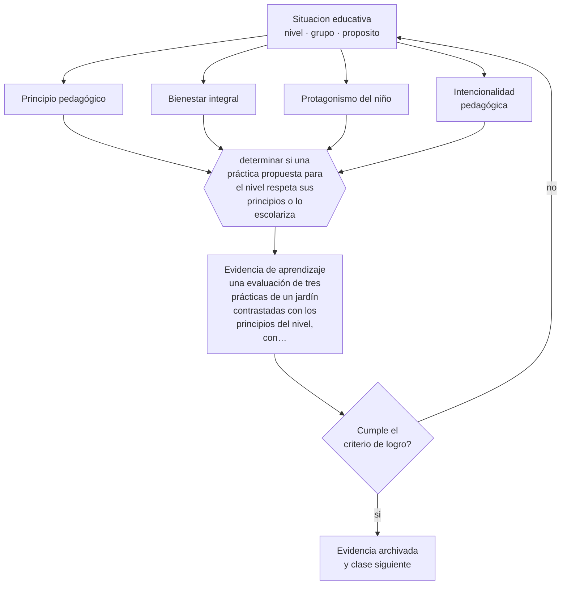

# Clase 037 — Principios de educación parvularia

> **Parte 03 · Educación parvularia** — clase 1 de 12

**Estado de evidencia:** `MARCO-NORMATIVO` · **Etapa:** 🔵 Etapa B — Enseñanza por ciclo vital · **Población de referencia:** sala cuna, niveles medios y transición (0 a 6 años) 
**Decisión que habilita:** determinar si una práctica propuesta para el nivel respeta sus principios o lo escolariza 
**Evidencia de aprendizaje:** una evaluación de tres prácticas de un jardín contrastadas con los principios del nivel, con veredicto y fundamento

## 🎯 Propósito

Establecer los principios que rigen el nivel —bienestar, actividad, singularidad, juego, significado, relación— y usarlos como criterio para aceptar o rechazar una práctica propuesta.

## 📚 Resultados de aprendizaje

Al finalizar esta clase podrás:

1. **Definir** con precisión los cuatro conceptos centrales de la clase y reconocerlos en una situación educativa real, no solo en su enunciado.
2. **Explicar** qué distingue a la educación parvularia de una versión anticipada de la escuela básica.
3. **Decidir** —si una práctica propuesta para el nivel respeta sus principios o lo escolariza— y sostener la decisión con un fundamento escrito.
4. **Producir** la evidencia de la clase —una evaluación de tres prácticas de un jardín contrastadas con los principios del nivel, con veredicto y fundamento— y contrastarla contra el criterio de logro.
5. **Distinguir** lo que la evidencia sostiene de lo que es práctica instalada, preferencia personal o costumbre de la institución.

## 🧩 Conceptos centrales

| Concepto | Comprensión verificable |
|---|---|
| **Principio pedagógico** | criterio rector que orienta toda decisión del nivel y permite juzgar una práctica concreta |
| **Bienestar integral** | condición de seguridad, salud y afecto sin la cual el aprendizaje del nivel no ocurre |
| **Protagonismo del niño** | reconocimiento del niño como sujeto activo que inicia, decide y construye su experiencia |
| **Intencionalidad pedagógica** | propósito de aprendizaje explícito detrás de una experiencia que puede parecer libre |

## 🗺️ Flujo de razonamiento

## 📖 Desarrollo

### 1. El fondo del asunto

La educación parvularia no es preparación para la básica: es un nivel con finalidad propia y con principios que la ordenan. En Chile, las Bases Curriculares de la Educación Parvularia declaran esos principios y organizan el currículo en ámbitos y núcleos. La consecuencia práctica es que una actividad se juzga por su coherencia con los principios, no por su parecido con una clase escolar. Una experiencia sin intención pedagógica explícita no cumple; una experiencia con formato escolar tampoco.

### 2. Cómo se traduce en decisiones de enseñanza

El criterio operativo para evaluar cualquier propuesta del nivel combina dos preguntas: qué aprendizaje persigue y si la vía es coherente con la forma en que aprende un niño de esa edad. Una ficha de trazos repetidos falla en la segunda; una actividad entretenida sin objetivo falla en la primera. Sostener ambas exigencias a la vez es lo que distingue a un equipo profesional de uno que improvisa o que copia formatos ajenos.

### 3. Qué sostiene la evidencia y qué no

Los principios se declaran con facilidad y se aplican con dificultad. La presión de familias e instituciones por resultados visibles —niños que escriben, que leen, que llenan cuadernos— empuja a la escolarización, y el argumento profesional debe sostenerse con evidencia y con comunicación, no solo con referencias normativas. Además, los principios no resuelven casos concretos por sí solos: exigen juicio.

> **Cómo leer el estado de evidencia `MARCO-NORMATIVO`.** El contenido no se decide por evidencia empírica sino por norma, política pública o marco institucional vigente. Verifica siempre la versión vigente a la fecha en que vas a aplicarlo: la norma cambia y la clase no se actualiza sola.

## 🧪 Taller guiado

Aplica la clase a **uno** de los contextos siguientes y repite después el ejercicio en un
contexto de exigencia distinta. Cambiar de contexto es parte del aprendizaje: lo que funciona
con un grupo no se traslada intacto a otro.

| Contexto | Rasgo que cambia la decisión |
|---|---|
| Sala cuna (0–2) | cuidado, vínculo y lenguaje son la intervención pedagógica |
| Nivel medio (2–4) | juego simbólico y regulación emocional en construcción |
| Transición (4–6) | alfabetización y matemática emergentes, sin formato escolar |
| Jardín rural o de baja matrícula | grupos multiedad y recursos acotados |
| Modalidad no convencional o comunitaria | la familia participa en la ejecución |
| Contexto de alta vulnerabilidad | el jardín cumple funciones de protección y salud |

**Secuencia de trabajo:**

1. Delimita el contexto: nivel, edad, tamaño del grupo, asignatura o experiencia y tiempo real disponible.
2. Declara qué saben ya los estudiantes y **cómo lo comprobaste**, no cómo lo supones.
3. Formula la decisión pedagógica que esta clase habilita y escribe su fundamento.
4. Anticipa qué observarías si la decisión funciona y qué observarías si no funciona.
5. Diseña de antemano la alternativa que aplicarás si la primera estrategia falla.
6. Ejecuta o simula, y registra lo observado con fecha, contexto y evidencia concreta.
7. Produce la evidencia de aprendizaje de la clase.
8. Contrástala contra el criterio de logro, corrige y recién entonces avanza.

### 📦 Evidencia de aprendizaje

Una evaluación de tres prácticas de un jardín contrastadas con los principios del nivel, con veredicto y fundamento.

Debe incluir contexto, decisión, fundamento, fuentes consultadas con su fecha, indicador de
logro observable, riesgos previstos y qué harías distinto en la siguiente iteración.

## 🏆 Reto verificable

Evalúa tres prácticas reales de un jardín con los principios del nivel. Presenta el resultado al equipo y registra qué argumentos aparecen para defender las prácticas cuestionadas.

## ✅ Criterio de logro

- [ ] cada veredicto cita el principio que la práctica respeta o vulnera;
- [ ] se propone una alternativa concreta para cada práctica rechazada;
- [ ] cada afirmación sobre «lo que funciona» está atribuida a una fuente identificable, con autor y fecha;
- [ ] la decisión es ejecutable con el tiempo, el espacio, el número de estudiantes y los recursos que realmente tienes;
- [ ] la evidencia queda archivada de forma reproducible: otra persona podría revisarla sin que tú se la expliques.

## ⚠️ Errores frecuentes

**Propios de esta clase:**

- Adoptar formatos de educación básica por presión de familias o de la propia institución.
- Confundir juego libre sin intención con respeto al protagonismo del niño.

**Característicos de la parte 03:**

- Escolarizar el nivel adelantando formatos de enseñanza propios de la básica.
- Confundir actividad entretenida con experiencia de aprendizaje intencionada.

## ♿ Diversidad, accesibilidad y ética

Los principios del nivel son inclusivos por diseño: singularidad, bienestar y protagonismo obligan a ajustar la experiencia a cada niño. Su aplicación real se comprueba observando qué ocurre con el niño que menos participa, no con el grupo en promedio.

Antes de aplicar cualquier decisión de esta clase con estudiantes reales, revisa el
[protocolo de práctica responsable](../../../docs/ETICA_Y_PRACTICA_RESPONSABLE.md):
consentimiento, resguardo de datos personales, proporcionalidad de la intervención y derecho
de cada estudiante a no ser objeto de un ensayo que no le reporta beneficio.

## ❓ Preguntas de comprobación

1. ¿Qué práctica de tu contexto no resistiría el contraste con los principios del nivel?
2. ¿Cómo explicarías a una familia por qué no se enseña a escribir con fichas a los cuatro años?
3. ¿Qué intención pedagógica tiene la experiencia que planificaste para mañana?

## 📕 Lecturas base

**Mineduc (2018). *Bases Curriculares de la Educación Parvularia*.**  
*Qué aporta a esta clase:* marco vigente: principios, ámbitos, núcleos y objetivos de aprendizaje del nivel en Chile.

**Copple, C. & Bredekamp, S. (eds.) (2009). *Developmentally Appropriate Practice*. NAEYC.**  
*Qué aporta a esta clase:* argumenta con evidencia por qué la escolarización temprana no mejora resultados y qué sí lo hace.

Catálogo completo: [bibliografía del programa](../../../docs/BIBLIOGRAFIA.md) ·
[glosario](../../../docs/GLOSARIO.md) ·
[fuentes oficiales y cómo leerlas](../../../docs/FUENTES.md).

## 🔗 Conexión con el resto del programa

Abre la parte 03 y se apoya en las clases 025 a 030. Su criterio de intencionalidad reaparece en la parte 09 (alineamiento) y en la clase 046 (documentación).

> [!IMPORTANT]
> Material de formación profesional. No reemplaza un título de pedagogía, una habilitación
> legal para ejercer, ni el juicio de un equipo educativo que conoce a sus estudiantes.

---

| Anterior | Índice | Siguiente |
|---|---|---|
| [← Parte 03](../README.md) | [Parte 03](../README.md) · [Programa](../../../README.md) | [038 · Juego y aprendizaje →](../class-02-juego-y-aprendizaje/README.md) |
