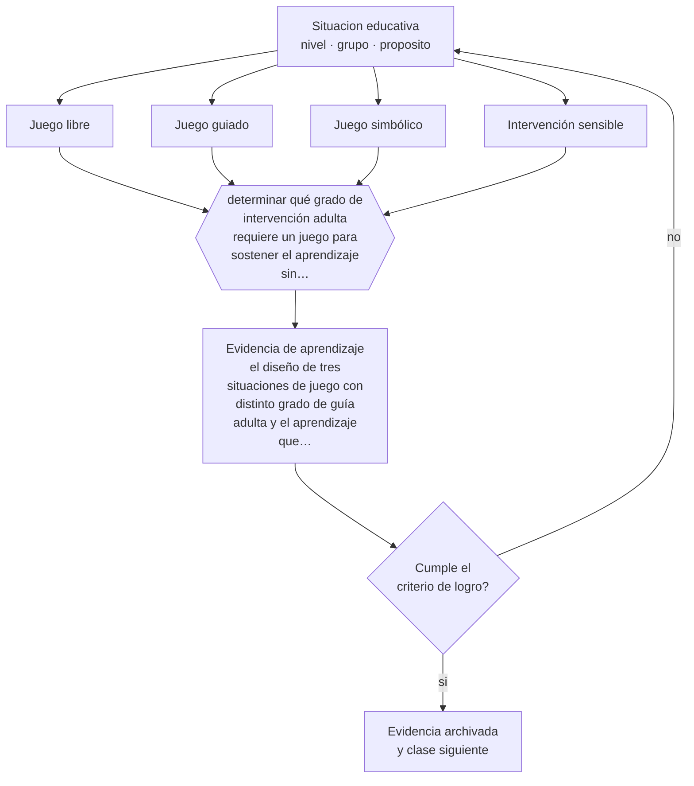

# Clase 038 — Juego y aprendizaje

> **Parte 03 · Educación parvularia** — clase 2 de 12

**Estado de evidencia:** `CONSISTENTE` · **Etapa:** 🔵 Etapa B — Enseñanza por ciclo vital · **Población de referencia:** sala cuna, niveles medios y transición (0 a 6 años) 
**Decisión que habilita:** determinar qué grado de intervención adulta requiere un juego para sostener el aprendizaje sin apropiárselo 
**Evidencia de aprendizaje:** el diseño de tres situaciones de juego con distinto grado de guía adulta y el aprendizaje que cada una persigue

## 🎯 Propósito

Comprender el juego como vía principal de aprendizaje en la primera infancia y aprender a diseñar juego con intención sin destruir lo que lo hace juego.

## 📚 Resultados de aprendizaje

Al finalizar esta clase podrás:

1. **Definir** con precisión los cuatro conceptos centrales de la clase y reconocerlos en una situación educativa real, no solo en su enunciado.
2. **Explicar** por qué el juego enseña, y qué condiciones distinguen el juego que enseña del que solo entretiene.
3. **Decidir** —qué grado de intervención adulta requiere un juego para sostener el aprendizaje sin apropiárselo— y sostener la decisión con un fundamento escrito.
4. **Producir** la evidencia de la clase —el diseño de tres situaciones de juego con distinto grado de guía adulta y el aprendizaje que cada una persigue— y contrastarla contra el criterio de logro.
5. **Distinguir** lo que la evidencia sostiene de lo que es práctica instalada, preferencia personal o costumbre de la institución.

## 🧩 Conceptos centrales

| Concepto | Comprensión verificable |
|---|---|
| **Juego libre** | actividad elegida y dirigida por el niño, sin objetivo impuesto por el adulto |
| **Juego guiado** | situación diseñada por el adulto que conserva la iniciativa del niño dentro de un propósito |
| **Juego simbólico** | representación de roles y situaciones; sostiene lenguaje, regulación y descentración |
| **Intervención sensible** | participación del adulto que amplía el juego sin dirigirlo ni interrumpirlo |

## 🗺️ Flujo de razonamiento

## 📖 Desarrollo

### 1. El fondo del asunto

La evidencia disponible sugiere que el juego guiado —diseñado por el adulto pero dirigido por el niño— produce mejores aprendizajes en dominios específicos que tanto el juego libre puro como la instrucción directa en estas edades. El juego simbólico, en particular, se asocia con desarrollo del lenguaje, de la autorregulación y de la capacidad de considerar otras perspectivas. La condición que cambia el resultado es la calidad de la participación adulta, no la cantidad de materiales.

### 2. Cómo se traduce en decisiones de enseñanza

Diseñar juego guiado consiste en preparar el escenario —materiales, espacio, roles disponibles— y después participar de forma sensible: comentar, ampliar, ofrecer vocabulario, plantear un problema dentro del juego sin convertirlo en tarea. El error típico es apropiarse del juego para enseñar el contenido previsto, con lo cual el niño deja de decidir y el juego termina.

### 3. Qué sostiene la evidencia y qué no

La investigación sobre juego tiene limitaciones conocidas: definiciones heterogéneas, dificultad para asignar aleatoriamente y medidas de resultado variables. La afirmación fuerte de que el juego libre por sí solo produce todos los aprendizajes del nivel no está bien respaldada; la afirmación sostenible es que el juego con participación adulta sensible es una vía eficaz para muchos objetivos, no para todos.

> **Cómo leer el estado de evidencia `CONSISTENTE`.** La evidencia es amplia y coherente, pero proviene sobre todo de estudios correlacionales, de síntesis con heterogeneidad alta o de contextos distintos al tuyo. Sirve para orientar la decisión y exige que compruebes el efecto en tu propio grupo.

## 🧪 Taller guiado

Aplica la clase a **uno** de los contextos siguientes y repite después el ejercicio en un
contexto de exigencia distinta. Cambiar de contexto es parte del aprendizaje: lo que funciona
con un grupo no se traslada intacto a otro.

| Contexto | Rasgo que cambia la decisión |
|---|---|
| Sala cuna (0–2) | cuidado, vínculo y lenguaje son la intervención pedagógica |
| Nivel medio (2–4) | juego simbólico y regulación emocional en construcción |
| Transición (4–6) | alfabetización y matemática emergentes, sin formato escolar |
| Jardín rural o de baja matrícula | grupos multiedad y recursos acotados |
| Modalidad no convencional o comunitaria | la familia participa en la ejecución |
| Contexto de alta vulnerabilidad | el jardín cumple funciones de protección y salud |

**Secuencia de trabajo:**

1. Delimita el contexto: nivel, edad, tamaño del grupo, asignatura o experiencia y tiempo real disponible.
2. Declara qué saben ya los estudiantes y **cómo lo comprobaste**, no cómo lo supones.
3. Formula la decisión pedagógica que esta clase habilita y escribe su fundamento.
4. Anticipa qué observarías si la decisión funciona y qué observarías si no funciona.
5. Diseña de antemano la alternativa que aplicarás si la primera estrategia falla.
6. Ejecuta o simula, y registra lo observado con fecha, contexto y evidencia concreta.
7. Produce la evidencia de aprendizaje de la clase.
8. Contrástala contra el criterio de logro, corrige y recién entonces avanza.

### 📦 Evidencia de aprendizaje

El diseño de tres situaciones de juego con distinto grado de guía adulta y el aprendizaje que cada una persigue.

Debe incluir contexto, decisión, fundamento, fuentes consultadas con su fecha, indicador de
logro observable, riesgos previstos y qué harías distinto en la siguiente iteración.

## 🏆 Reto verificable

Observa un juego libre y registra qué aprendizaje ocurre sin intervención. Después diseña la misma situación como juego guiado y compara lo que aparece.

## ✅ Criterio de logro

- [ ] cada situación declara su objetivo de aprendizaje y su grado de guía adulta;
- [ ] la intervención prevista amplía el juego sin sustituir la decisión del niño;
- [ ] cada afirmación sobre «lo que funciona» está atribuida a una fuente identificable, con autor y fecha;
- [ ] la decisión es ejecutable con el tiempo, el espacio, el número de estudiantes y los recursos que realmente tienes;
- [ ] la evidencia queda archivada de forma reproducible: otra persona podría revisarla sin que tú se la expliques.

## ⚠️ Errores frecuentes

**Propios de esta clase:**

- Convertir el juego en una tarea encubierta y perder la iniciativa del niño.
- Dejar el juego enteramente libre y suponer que cualquier aprendizaje ocurrirá por sí solo.

**Característicos de la parte 03:**

- Escolarizar el nivel adelantando formatos de enseñanza propios de la básica.
- Confundir actividad entretenida con experiencia de aprendizaje intencionada.

## ♿ Diversidad, accesibilidad y ética

No todos los niños entran al juego con la misma facilidad: dificultades de comunicación, diferencias sensoriales o experiencias previas restringidas pueden dejar a un niño fuera. La mediación adulta debe garantizar acceso al juego, no solo su disponibilidad.

Antes de aplicar cualquier decisión de esta clase con estudiantes reales, revisa el
[protocolo de práctica responsable](../../../docs/ETICA_Y_PRACTICA_RESPONSABLE.md):
consentimiento, resguardo de datos personales, proporcionalidad de la intervención y derecho
de cada estudiante a no ser objeto de un ensayo que no le reporta beneficio.

## ❓ Preguntas de comprobación

1. ¿En qué momento tu intervención dejó de ampliar el juego y pasó a dirigirlo?
2. ¿Qué aprendizaje persigue el rincón que instalaste esta semana?
3. ¿Qué niño no entra nunca al juego simbólico y qué harías al respecto?

## 📕 Lecturas base

**Weisberg, D., Hirsh-Pasek, K. & Golinkoff, R. (2013). *Guided Play: Where Curricular Goals Meet a Playful Pedagogy*.**  
*Qué aporta a esta clase:* define el juego guiado y sintetiza la evidencia que lo distingue del juego libre y de la instrucción.

**Vygotsky, L. (1978). *Mind in Society*, cap. sobre el juego.**  
*Qué aporta a esta clase:* explica por qué el juego simbólico opera como zona de desarrollo próximo del propio niño.

Catálogo completo: [bibliografía del programa](../../../docs/BIBLIOGRAFIA.md) ·
[glosario](../../../docs/GLOSARIO.md) ·
[fuentes oficiales y cómo leerlas](../../../docs/FUENTES.md).

## 🔗 Conexión con el resto del programa

Se apoya en la clase 037 y sostiene las clases 040 a 045, donde el juego es la vía de los distintos núcleos de aprendizaje.

> [!IMPORTANT]
> Material de formación profesional. No reemplaza un título de pedagogía, una habilitación
> legal para ejercer, ni el juicio de un equipo educativo que conoce a sus estudiantes.

---

| Anterior | Índice | Siguiente |
|---|---|---|
| [← 037 · Principios de educación parvularia](../class-01-principios-de-educacion-parvularia/README.md) | [Parte 03](../README.md) · [Programa](../../../README.md) | [039 · Ambientes de aprendizaje →](../class-03-ambientes-de-aprendizaje/README.md) |
