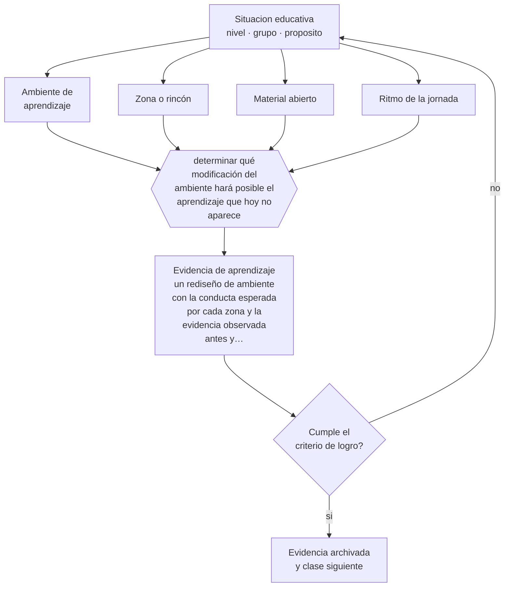

# Clase 039 — Ambientes de aprendizaje

> **Parte 03 · Educación parvularia** — clase 3 de 12

**Estado de evidencia:** `CONSISTENTE` · **Etapa:** 🔵 Etapa B — Enseñanza por ciclo vital · **Población de referencia:** sala cuna, niveles medios y transición (0 a 6 años) 
**Decisión que habilita:** determinar qué modificación del ambiente hará posible el aprendizaje que hoy no aparece 
**Evidencia de aprendizaje:** un rediseño de ambiente con la conducta esperada por cada zona y la evidencia observada antes y después

## 🎯 Propósito

Tratar el ambiente —espacio, materiales, tiempo y organización del grupo— como una decisión pedagógica: determina qué conductas son posibles y cuáles no llegan a aparecer.

## 📚 Resultados de aprendizaje

Al finalizar esta clase podrás:

1. **Definir** con precisión los cuatro conceptos centrales de la clase y reconocerlos en una situación educativa real, no solo en su enunciado.
2. **Explicar** por qué el espacio y el tiempo del nivel enseñan tanto como el adulto que los organiza.
3. **Decidir** —qué modificación del ambiente hará posible el aprendizaje que hoy no aparece— y sostener la decisión con un fundamento escrito.
4. **Producir** la evidencia de la clase —un rediseño de ambiente con la conducta esperada por cada zona y la evidencia observada antes y después— y contrastarla contra el criterio de logro.
5. **Distinguir** lo que la evidencia sostiene de lo que es práctica instalada, preferencia personal o costumbre de la institución.

## 🧩 Conceptos centrales

| Concepto | Comprensión verificable |
|---|---|
| **Ambiente de aprendizaje** | conjunto de espacio, materiales, tiempo y organización que condiciona la actividad posible |
| **Zona o rincón** | sector organizado con intención pedagógica, materiales seleccionados y conducta esperada |
| **Material abierto** | recurso sin uso único que admite múltiples acciones y niveles de complejidad |
| **Ritmo de la jornada** | secuencia y duración de los momentos; determina la calidad de la experiencia más que su cantidad |

## 🗺️ Flujo de razonamiento

## 📖 Desarrollo

### 1. El fondo del asunto

El ambiente no es el escenario donde ocurre la pedagogía: es parte de ella. La disposición del espacio determina si los niños pueden trabajar en pequeños grupos, si pueden acceder al material sin pedirlo, si hay lugar para el movimiento y para la calma. El tiempo funciona igual: jornadas fragmentadas en muchos momentos cortos impiden la concentración sostenida, que es justamente lo que se busca desarrollar.

### 2. Cómo se traduce en decisiones de enseñanza

El procedimiento profesional es explicitar, por cada zona, qué conducta se espera que aparezca y comprobar con observación si aparece. Cuando no aparece, la primera hipótesis es de diseño: material inaccesible, espacio insuficiente, tiempo demasiado corto, ubicación que interfiere. Modificar el ambiente suele ser más eficaz y menos costoso que intervenir la conducta de los niños uno por uno.

### 3. Qué sostiene la evidencia y qué no

No hay una configuración óptima universal: depende del grupo, del espacio disponible y del proyecto del establecimiento. Los estudios que asocian calidad de ambiente con resultados usan instrumentos que miden sobre todo interacción, no mobiliario. El riesgo es invertir en equipamiento vistoso y descuidar la variable con mayor evidencia, que es la calidad de la interacción adulta.

> **Cómo leer el estado de evidencia `CONSISTENTE`.** La evidencia es amplia y coherente, pero proviene sobre todo de estudios correlacionales, de síntesis con heterogeneidad alta o de contextos distintos al tuyo. Sirve para orientar la decisión y exige que compruebes el efecto en tu propio grupo.

## 🧪 Taller guiado

Aplica la clase a **uno** de los contextos siguientes y repite después el ejercicio en un
contexto de exigencia distinta. Cambiar de contexto es parte del aprendizaje: lo que funciona
con un grupo no se traslada intacto a otro.

| Contexto | Rasgo que cambia la decisión |
|---|---|
| Sala cuna (0–2) | cuidado, vínculo y lenguaje son la intervención pedagógica |
| Nivel medio (2–4) | juego simbólico y regulación emocional en construcción |
| Transición (4–6) | alfabetización y matemática emergentes, sin formato escolar |
| Jardín rural o de baja matrícula | grupos multiedad y recursos acotados |
| Modalidad no convencional o comunitaria | la familia participa en la ejecución |
| Contexto de alta vulnerabilidad | el jardín cumple funciones de protección y salud |

**Secuencia de trabajo:**

1. Delimita el contexto: nivel, edad, tamaño del grupo, asignatura o experiencia y tiempo real disponible.
2. Declara qué saben ya los estudiantes y **cómo lo comprobaste**, no cómo lo supones.
3. Formula la decisión pedagógica que esta clase habilita y escribe su fundamento.
4. Anticipa qué observarías si la decisión funciona y qué observarías si no funciona.
5. Diseña de antemano la alternativa que aplicarás si la primera estrategia falla.
6. Ejecuta o simula, y registra lo observado con fecha, contexto y evidencia concreta.
7. Produce la evidencia de aprendizaje de la clase.
8. Contrástala contra el criterio de logro, corrige y recién entonces avanza.

### 📦 Evidencia de aprendizaje

Un rediseño de ambiente con la conducta esperada por cada zona y la evidencia observada antes y después.

Debe incluir contexto, decisión, fundamento, fuentes consultadas con su fecha, indicador de
logro observable, riesgos previstos y qué harías distinto en la siguiente iteración.

## 🏆 Reto verificable

Escoge una conducta que no aparece en tu sala. Modifica una sola variable del ambiente, sostenla dos semanas y registra si la conducta emerge.

## ✅ Criterio de logro

- [ ] cada zona declara la conducta esperada y su evidencia de aparición;
- [ ] el rediseño se evalúa con observación antes y después, no con impresión general;
- [ ] cada afirmación sobre «lo que funciona» está atribuida a una fuente identificable, con autor y fecha;
- [ ] la decisión es ejecutable con el tiempo, el espacio, el número de estudiantes y los recursos que realmente tienes;
- [ ] la evidencia queda archivada de forma reproducible: otra persona podría revisarla sin que tú se la expliques.

## ⚠️ Errores frecuentes

**Propios de esta clase:**

- Rediseñar el espacio por estética sin declarar qué conducta debería habilitar.
- Fragmentar la jornada en tantos momentos que ninguno permita concentración sostenida.

**Característicos de la parte 03:**

- Escolarizar el nivel adelantando formatos de enseñanza propios de la básica.
- Confundir actividad entretenida con experiencia de aprendizaje intencionada.

## ♿ Diversidad, accesibilidad y ética

Un ambiente accesible resuelve por diseño buena parte de las barreras: alturas alcanzables, señalización visual, zonas de baja estimulación para regularse, rutas libres. Estas medidas benefician a todo el grupo y no requieren diagnóstico previo de ningún niño.

Antes de aplicar cualquier decisión de esta clase con estudiantes reales, revisa el
[protocolo de práctica responsable](../../../docs/ETICA_Y_PRACTICA_RESPONSABLE.md):
consentimiento, resguardo de datos personales, proporcionalidad de la intervención y derecho
de cada estudiante a no ser objeto de un ensayo que no le reporta beneficio.

## ❓ Preguntas de comprobación

1. ¿Qué conducta querrías ver y hoy el espacio impide?
2. ¿Cuánto dura el momento más largo de tu jornada y alcanza para concentrarse?
3. ¿Qué material está fuera del alcance de los niños y por qué razón real?

## 📕 Lecturas base

**Malaguzzi, L. y experiencia de Reggio Emilia. *El ambiente como tercer educador*.**  
*Qué aporta a esta clase:* fundamenta el espacio como agente pedagógico, con ejemplos de organización y documentación.

**Harms, T., Clifford, R. & Cryer, D. *Early Childhood Environment Rating Scale (ECERS)*.**  
*Qué aporta a esta clase:* instrumento estandarizado de evaluación de ambientes; útil como lista de verificación crítica.

Catálogo completo: [bibliografía del programa](../../../docs/BIBLIOGRAFIA.md) ·
[glosario](../../../docs/GLOSARIO.md) ·
[fuentes oficiales y cómo leerlas](../../../docs/FUENTES.md).

## 🔗 Conexión con el resto del programa

Aplica la clase 026 y sostiene la clase 038. Su lógica —diseñar condiciones en vez de corregir conductas— reaparece en la parte 12.

> [!IMPORTANT]
> Material de formación profesional. No reemplaza un título de pedagogía, una habilitación
> legal para ejercer, ni el juicio de un equipo educativo que conoce a sus estudiantes.

---

| Anterior | Índice | Siguiente |
|---|---|---|
| [← 038 · Juego y aprendizaje](../class-02-juego-y-aprendizaje/README.md) | [Parte 03](../README.md) · [Programa](../../../README.md) | [040 · Lenguaje y alfabetización emergente →](../class-04-lenguaje-y-alfabetizacion-emergente/README.md) |
