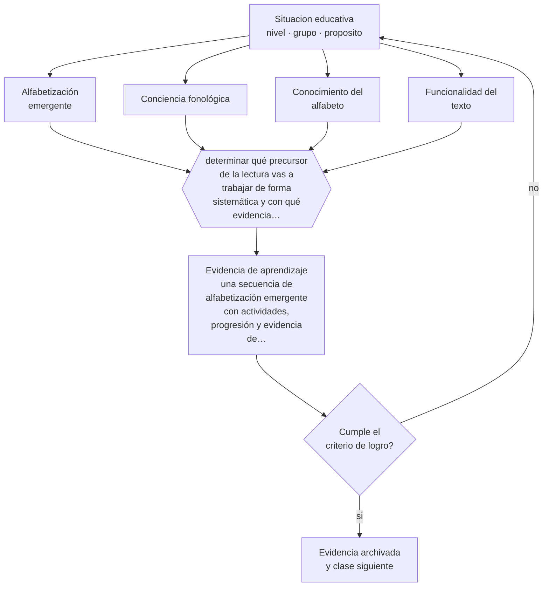

# Clase 040 — Lenguaje y alfabetización emergente

> **Parte 03 · Educación parvularia** — clase 4 de 12

**Estado de evidencia:** `ROBUSTA` · **Etapa:** 🔵 Etapa B — Enseñanza por ciclo vital · **Población de referencia:** sala cuna, niveles medios y transición (0 a 6 años) 
**Decisión que habilita:** determinar qué precursor de la lectura vas a trabajar de forma sistemática y con qué evidencia lo verificarás 
**Evidencia de aprendizaje:** una secuencia de alfabetización emergente con actividades, progresión y evidencia de aprendizaje observable

## 🎯 Propósito

Desarrollar los precursores de la lectura y la escritura —lenguaje oral rico, conciencia fonológica, conocimiento de letras, funcionalidad del texto— sin adelantar formatos escolares que el nivel no requiere.

## 📚 Resultados de aprendizaje

Al finalizar esta clase podrás:

1. **Definir** con precisión los cuatro conceptos centrales de la clase y reconocerlos en una situación educativa real, no solo en su enunciado.
2. **Explicar** qué se puede y qué conviene enseñar sobre lenguaje escrito antes de que empiece la enseñanza formal de la lectura.
3. **Decidir** —qué precursor de la lectura vas a trabajar de forma sistemática y con qué evidencia lo verificarás— y sostener la decisión con un fundamento escrito.
4. **Producir** la evidencia de la clase —una secuencia de alfabetización emergente con actividades, progresión y evidencia de aprendizaje observable— y contrastarla contra el criterio de logro.
5. **Distinguir** lo que la evidencia sostiene de lo que es práctica instalada, preferencia personal o costumbre de la institución.

## 🧩 Conceptos centrales

| Concepto | Comprensión verificable |
|---|---|
| **Alfabetización emergente** | conjunto de conocimientos sobre el lenguaje escrito que se construyen antes de leer convencionalmente |
| **Conciencia fonológica** | capacidad de identificar y manipular unidades sonoras del habla; predice el aprendizaje lector |
| **Conocimiento del alfabeto** | identificación de letras y de sus sonidos; junto con lo fonológico, el mejor predictor temprano |
| **Funcionalidad del texto** | comprensión de para qué sirve lo escrito y cómo se usa en la vida cotidiana |

## 🗺️ Flujo de razonamiento

## 📖 Desarrollo

### 1. El fondo del asunto

Dos predictores destacan de forma consistente en la investigación sobre lectura inicial: la conciencia fonológica y el conocimiento de letras y sus sonidos. Ambos se pueden desarrollar en educación parvularia con actividades lúdicas y orales, sin necesidad de fichas ni de escritura formal. A eso se suman el vocabulario oral y la comprensión de para qué sirve el texto, que sostienen la comprensión lectora posterior más que la decodificación.

### 2. Cómo se traduce en decisiones de enseñanza

El trabajo sistemático se hace con juegos de sonidos —rimas, sílabas, sonido inicial—, con lectura compartida de textos ricos, con vocabulario ofrecido deliberadamente y con escritura emergente aceptada tal como aparece. Sistemático no significa escolar: significa planificado, progresivo y verificado. La evidencia de aprendizaje se recoge observando qué puede hacer el niño con los sonidos y con el texto, no cuántas fichas completó.

### 3. Qué sostiene la evidencia y qué no

Hay un límite claro: entrenar conciencia fonológica sin conectarla con letras produce efectos menores que hacerlo junto con el conocimiento del alfabeto. Y adelantar la enseñanza formal de la lectura al nivel parvulario no muestra ventajas sostenidas en el tiempo, mientras que sí muestra costos en motivación y en oportunidades de juego. La distinción entre precursores y enseñanza formal es, por tanto, técnica y no ideológica.

> **Cómo leer el estado de evidencia `ROBUSTA`.** Hay evidencia convergente de varios equipos, países y diseños de investigación, incluidos estudios experimentales o cuasiexperimentales, y el efecto se sostiene al replicarlo. Puedes apoyar una decisión profesional en ella, sin olvidar que ningún efecto promedio describe a un estudiante concreto.

## 🧪 Taller guiado

Aplica la clase a **uno** de los contextos siguientes y repite después el ejercicio en un
contexto de exigencia distinta. Cambiar de contexto es parte del aprendizaje: lo que funciona
con un grupo no se traslada intacto a otro.

| Contexto | Rasgo que cambia la decisión |
|---|---|
| Sala cuna (0–2) | cuidado, vínculo y lenguaje son la intervención pedagógica |
| Nivel medio (2–4) | juego simbólico y regulación emocional en construcción |
| Transición (4–6) | alfabetización y matemática emergentes, sin formato escolar |
| Jardín rural o de baja matrícula | grupos multiedad y recursos acotados |
| Modalidad no convencional o comunitaria | la familia participa en la ejecución |
| Contexto de alta vulnerabilidad | el jardín cumple funciones de protección y salud |

**Secuencia de trabajo:**

1. Delimita el contexto: nivel, edad, tamaño del grupo, asignatura o experiencia y tiempo real disponible.
2. Declara qué saben ya los estudiantes y **cómo lo comprobaste**, no cómo lo supones.
3. Formula la decisión pedagógica que esta clase habilita y escribe su fundamento.
4. Anticipa qué observarías si la decisión funciona y qué observarías si no funciona.
5. Diseña de antemano la alternativa que aplicarás si la primera estrategia falla.
6. Ejecuta o simula, y registra lo observado con fecha, contexto y evidencia concreta.
7. Produce la evidencia de aprendizaje de la clase.
8. Contrástala contra el criterio de logro, corrige y recién entonces avanza.

### 📦 Evidencia de aprendizaje

Una secuencia de alfabetización emergente con actividades, progresión y evidencia de aprendizaje observable.

Debe incluir contexto, decisión, fundamento, fuentes consultadas con su fecha, indicador de
logro observable, riesgos previstos y qué harías distinto en la siguiente iteración.

## 🏆 Reto verificable

Aplica una evaluación breve de conciencia fonológica y conocimiento de letras a tu grupo. Diseña una secuencia de ocho semanas para los que están más abajo y mide el cambio.

## ✅ Criterio de logro

- [ ] la secuencia trabaja al menos dos precursores con progresión declarada;
- [ ] la evidencia de aprendizaje es un desempeño observable del niño, no un producto en papel;
- [ ] cada afirmación sobre «lo que funciona» está atribuida a una fuente identificable, con autor y fecha;
- [ ] la decisión es ejecutable con el tiempo, el espacio, el número de estudiantes y los recursos que realmente tienes;
- [ ] la evidencia queda archivada de forma reproducible: otra persona podría revisarla sin que tú se la expliques.

## ⚠️ Errores frecuentes

**Propios de esta clase:**

- Trabajar conciencia fonológica desconectada del conocimiento de letras.
- Adelantar la enseñanza formal de la lectura al nivel parvulario por presión externa.

**Característicos de la parte 03:**

- Escolarizar el nivel adelantando formatos de enseñanza propios de la básica.
- Confundir actividad entretenida con experiencia de aprendizaje intencionada.

## ♿ Diversidad, accesibilidad y ética

El desarrollo de precursores es la intervención preventiva más eficaz para reducir dificultades lectoras posteriores, y beneficia especialmente a niños con menor exposición al lenguaje escrito en el hogar. Detectar tempranamente a quienes no avanzan evita años de intervención remedial.

Antes de aplicar cualquier decisión de esta clase con estudiantes reales, revisa el
[protocolo de práctica responsable](../../../docs/ETICA_Y_PRACTICA_RESPONSABLE.md):
consentimiento, resguardo de datos personales, proporcionalidad de la intervención y derecho
de cada estudiante a no ser objeto de un ensayo que no le reporta beneficio.

## ❓ Preguntas de comprobación

1. ¿Qué puede hacer hoy tu grupo con los sonidos de las palabras?
2. ¿Cómo verificas el conocimiento de letras sin recurrir a una prueba escrita?
3. ¿Qué presión externa te empuja a escolarizar y con qué argumento la enfrentas?

## 📕 Lecturas base

**National Early Literacy Panel (2008). *Developing Early Literacy*.**  
*Qué aporta a esta clase:* identifica y jerarquiza los predictores tempranos de la lectura con síntesis cuantitativa.

**Castles, A., Rastle, K. & Nation, K. (2018). *Ending the Reading Wars*.**  
*Qué aporta a esta clase:* conecta los precursores con la enseñanza posterior y aclara qué está resuelto en el debate.

Catálogo completo: [bibliografía del programa](../../../docs/BIBLIOGRAFIA.md) ·
[glosario](../../../docs/GLOSARIO.md) ·
[fuentes oficiales y cómo leerlas](../../../docs/FUENTES.md).

## 🔗 Conexión con el resto del programa

Se apoya en la clase 027 y es el antecedente directo de las clases 049 y 050 en educación básica.

> [!IMPORTANT]
> Material de formación profesional. No reemplaza un título de pedagogía, una habilitación
> legal para ejercer, ni el juicio de un equipo educativo que conoce a sus estudiantes.

---

| Anterior | Índice | Siguiente |
|---|---|---|
| [← 039 · Ambientes de aprendizaje](../class-03-ambientes-de-aprendizaje/README.md) | [Parte 03](../README.md) · [Programa](../../../README.md) | [041 · Pensamiento matemático temprano →](../class-05-pensamiento-matematico-temprano/README.md) |
