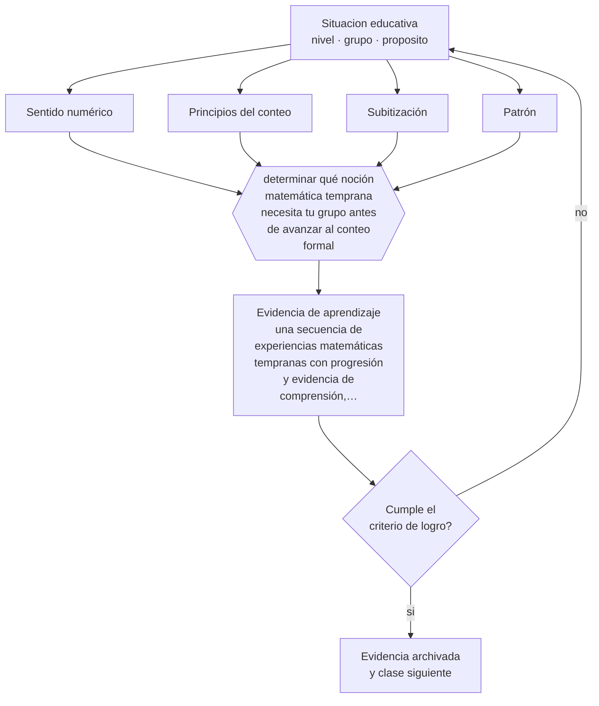

# Clase 041 — Pensamiento matemático temprano

> **Parte 03 · Educación parvularia** — clase 5 de 12

**Estado de evidencia:** `ROBUSTA` · **Etapa:** 🔵 Etapa B — Enseñanza por ciclo vital · **Población de referencia:** sala cuna, niveles medios y transición (0 a 6 años) 
**Decisión que habilita:** determinar qué noción matemática temprana necesita tu grupo antes de avanzar al conteo formal 
**Evidencia de aprendizaje:** una secuencia de experiencias matemáticas tempranas con progresión y evidencia de comprensión, no de repetición

## 🎯 Propósito

Desarrollar el pensamiento matemático temprano —cantidad, conteo con sentido, comparación, patrones, espacio y forma— con experiencias concretas que preparan la matemática escolar sin anticiparla.

## 📚 Resultados de aprendizaje

Al finalizar esta clase podrás:

1. **Definir** con precisión los cuatro conceptos centrales de la clase y reconocerlos en una situación educativa real, no solo en su enunciado.
2. **Explicar** qué construye el sentido numérico antes de que exista el cálculo escrito.
3. **Decidir** —qué noción matemática temprana necesita tu grupo antes de avanzar al conteo formal— y sostener la decisión con un fundamento escrito.
4. **Producir** la evidencia de la clase —una secuencia de experiencias matemáticas tempranas con progresión y evidencia de comprensión, no de repetición— y contrastarla contra el criterio de logro.
5. **Distinguir** lo que la evidencia sostiene de lo que es práctica instalada, preferencia personal o costumbre de la institución.

## 🧩 Conceptos centrales

| Concepto | Comprensión verificable |
|---|---|
| **Sentido numérico** | comprensión intuitiva de cantidad, magnitud y relaciones entre números |
| **Principios del conteo** | reglas que hacen que contar signifique algo: correspondencia uno a uno, orden estable y cardinalidad |
| **Subitización** | reconocimiento inmediato de cantidades pequeñas sin contar |
| **Patrón** | regularidad que se puede reconocer, continuar y describir; base del razonamiento algebraico posterior |

## 🗺️ Flujo de razonamiento

## 📖 Desarrollo

### 1. El fondo del asunto

Recitar la serie numérica no es contar. Un niño cuenta cuando asigna una palabra a cada objeto, respeta el orden y comprende que la última palabra indica cuántos hay. Esa comprensión —la cardinalidad— es el hito que separa la repetición del conteo con sentido, y es un predictor del desempeño matemático posterior más potente que la cantidad de números que el niño puede recitar.

### 2. Cómo se traduce en decisiones de enseñanza

Las experiencias eficaces son cotidianas y con materiales concretos: repartir, comparar colecciones, ordenar por tamaño, continuar patrones, describir posiciones en el espacio, jugar juegos de mesa con recorrido numérico —que tienen evidencia específica de mejorar el sentido de magnitud—. La observación del docente reemplaza a la prueba: se registra qué hace el niño ante una tarea de cantidad, no cuántos ejercicios completó.

### 3. Qué sostiene la evidencia y qué no

El adelantamiento de operaciones escritas en el nivel no muestra ventajas y consume tiempo que rinde más en sentido numérico. Además, buena parte del material comercial etiquetado como matemático trabaja identificación de símbolos y no comprensión de cantidad; distinguirlo requiere criterio, porque su apariencia es convincente.

> **Cómo leer el estado de evidencia `ROBUSTA`.** Hay evidencia convergente de varios equipos, países y diseños de investigación, incluidos estudios experimentales o cuasiexperimentales, y el efecto se sostiene al replicarlo. Puedes apoyar una decisión profesional en ella, sin olvidar que ningún efecto promedio describe a un estudiante concreto.

## 🧪 Taller guiado

Aplica la clase a **uno** de los contextos siguientes y repite después el ejercicio en un
contexto de exigencia distinta. Cambiar de contexto es parte del aprendizaje: lo que funciona
con un grupo no se traslada intacto a otro.

| Contexto | Rasgo que cambia la decisión |
|---|---|
| Sala cuna (0–2) | cuidado, vínculo y lenguaje son la intervención pedagógica |
| Nivel medio (2–4) | juego simbólico y regulación emocional en construcción |
| Transición (4–6) | alfabetización y matemática emergentes, sin formato escolar |
| Jardín rural o de baja matrícula | grupos multiedad y recursos acotados |
| Modalidad no convencional o comunitaria | la familia participa en la ejecución |
| Contexto de alta vulnerabilidad | el jardín cumple funciones de protección y salud |

**Secuencia de trabajo:**

1. Delimita el contexto: nivel, edad, tamaño del grupo, asignatura o experiencia y tiempo real disponible.
2. Declara qué saben ya los estudiantes y **cómo lo comprobaste**, no cómo lo supones.
3. Formula la decisión pedagógica que esta clase habilita y escribe su fundamento.
4. Anticipa qué observarías si la decisión funciona y qué observarías si no funciona.
5. Diseña de antemano la alternativa que aplicarás si la primera estrategia falla.
6. Ejecuta o simula, y registra lo observado con fecha, contexto y evidencia concreta.
7. Produce la evidencia de aprendizaje de la clase.
8. Contrástala contra el criterio de logro, corrige y recién entonces avanza.

### 📦 Evidencia de aprendizaje

Una secuencia de experiencias matemáticas tempranas con progresión y evidencia de comprensión, no de repetición.

Debe incluir contexto, decisión, fundamento, fuentes consultadas con su fecha, indicador de
logro observable, riesgos previstos y qué harías distinto en la siguiente iteración.

## 🏆 Reto verificable

Evalúa la comprensión de cardinalidad de cinco niños de tu grupo con una tarea de conteo real. Diseña una intervención de juego para quienes no la dominan y mide el cambio en un mes.

## ✅ Criterio de logro

- [ ] la secuencia evidencia comprensión de cardinalidad y comparación, no solo recitación;
- [ ] las experiencias usan materiales y situaciones reales antes que representaciones simbólicas;
- [ ] cada afirmación sobre «lo que funciona» está atribuida a una fuente identificable, con autor y fecha;
- [ ] la decisión es ejecutable con el tiempo, el espacio, el número de estudiantes y los recursos que realmente tienes;
- [ ] la evidencia queda archivada de forma reproducible: otra persona podría revisarla sin que tú se la expliques.

## ⚠️ Errores frecuentes

**Propios de esta clase:**

- Confundir recitar la serie numérica con comprender la cardinalidad.
- Introducir símbolos y operaciones escritas antes de que exista comprensión de cantidad.

**Característicos de la parte 03:**

- Escolarizar el nivel adelantando formatos de enseñanza propios de la básica.
- Confundir actividad entretenida con experiencia de aprendizaje intencionada.

## ♿ Diversidad, accesibilidad y ética

Las diferencias en experiencias matemáticas informales entre hogares aparecen antes del ingreso a la escuela. El trabajo sistemático en el nivel es una de las pocas oportunidades de reducir esa brecha antes de que se traduzca en una trayectoria de fracaso en matemática.

Antes de aplicar cualquier decisión de esta clase con estudiantes reales, revisa el
[protocolo de práctica responsable](../../../docs/ETICA_Y_PRACTICA_RESPONSABLE.md):
consentimiento, resguardo de datos personales, proporcionalidad de la intervención y derecho
de cada estudiante a no ser objeto de un ensayo que no le reporta beneficio.

## ❓ Preguntas de comprobación

1. ¿Tus niños cuentan o recitan?
2. ¿Qué situación cotidiana de tu jornada exige comparar cantidades de verdad?
3. ¿Qué material de tu sala trabaja símbolos y no cantidad?

## 📕 Lecturas base

**Clements, D. & Sarama, J. (2014). *Learning and Teaching Early Math: The Learning Trajectories Approach*.**  
*Qué aporta a esta clase:* describe trayectorias de aprendizaje matemático temprano con niveles y actividades verificables.

**Siegler, R. & Ramani, G. (2008). *Playing Linear Number Board Games Promotes Low-Income Children's Numerical Development*.**  
*Qué aporta a esta clase:* experimento breve y replicado; muestra un efecto concreto con una intervención de bajo costo.

Catálogo completo: [bibliografía del programa](../../../docs/BIBLIOGRAFIA.md) ·
[glosario](../../../docs/GLOSARIO.md) ·
[fuentes oficiales y cómo leerlas](../../../docs/FUENTES.md).

## 🔗 Conexión con el resto del programa

Es el antecedente directo de la clase 051 y se apoya en la clase 038, porque la vía de estos aprendizajes es el juego.

> [!IMPORTANT]
> Material de formación profesional. No reemplaza un título de pedagogía, una habilitación
> legal para ejercer, ni el juicio de un equipo educativo que conoce a sus estudiantes.

---

| Anterior | Índice | Siguiente |
|---|---|---|
| [← 040 · Lenguaje y alfabetización emergente](../class-04-lenguaje-y-alfabetizacion-emergente/README.md) | [Parte 03](../README.md) · [Programa](../../../README.md) | [042 · Corporalidad y movimiento →](../class-06-corporalidad-y-movimiento/README.md) |
